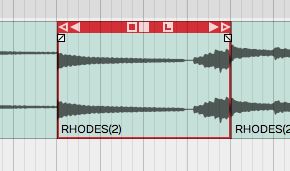
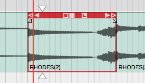
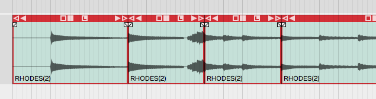
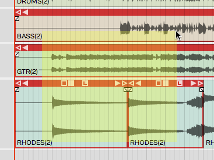
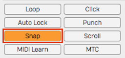
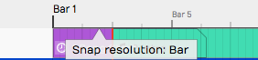
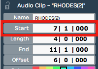
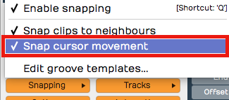
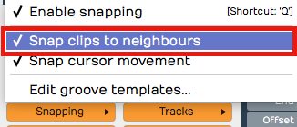
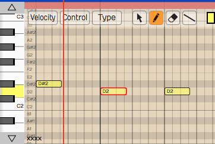

# Selecting and Snapping

In this chapter, we start working with clips. The examples focus on
Audio Clips and MIDI Clips. Keep in mind that most of these techniques
also apply to Step clips, Edit clips, and markers.

First, you'll learn how to select clips and groups of clips. Then, you
will learn about the snap-to-grid functions. Snap-to-grid makes it easy
to align clips to the bars and beats of your song. Let's get started
with selecting clips.

## Selecting a Clip

To select a clip, simply click on the clip. The clip is highlighted and
its properties appear in the Actions panel.

*A Selected Clip*

## Auditioning a Clip

To audition a clip, double-click and you will hear it play back,
starting at the spot where you have double-clicked. Click within the
clip to jump to a new spot as playback continues. Click anywhere outside
the clip and the auditioning will stop. Moving pointers above and below
the clip indicate the playback position.

*Audio Clip Being Auditioned*

Auditioning essentially solos the clip; everything else within the Edit
is muted in this mode.

## Selecting Multiple Clips

To select more than one clip, hold down Cmd / Ctrl then click on each
clip that you want to add to the selection.

*Multiple Clips Selection*

Once you have multiple clips selected, you can perform operations on
them as a group, such as moving them by dragging, duplicating, or
deleting them. We'll cover more about clip editing operations in
[Basic Audio Editing](audio-clips-and-editing-audio.md). To clear a multiple
selection, simply press the Esc key.

Another way to make a multiple selection is to use the lasso tool.
Here's how that works:

*Multiple Selection with Lasso*

1.  Hold down Opt / Alt until you see a **plus** cursor.
2.  Now as you drag, the cursor draws a yellow box.
3.  Anything the yellow box touches gets selected.

> 💡 **Tip:** You can further customize a multiple selection by holding down
Cmd / Ctrl then click any clip you want to de-select.

## Shift Selecting Clips

Waveform also supports Shift-select. This is a quick way to select a
contiguous range of clips. Here's how:

1.  Select the first clip.
2.  Hold down Shift and select the last clip. This will select the first
    clip, the last clip, and all the clips in between.

Shift-select works for clips on a single track, and even across multiple
tracks.

> 💡 **Tip:** Shift-select also works for many other kinds of Waveform
objects including Browser lists and tracks.

## Deselecting Clips

You can always press Esc to deselect everything.

> 💡 **Tip:** Pressing Esc also works to clear selections of other objects in
Waveform like plugins and tracks.

## Using Snap-to-Grid

Snap-to-grid makes aligning clips and notes to musical time accurate and
efficient. Working with this powerful feature is crucial to using
Waveform for editing audio and MIDI.

## Enable/Disable Snap-to-Grid

To toggle snap-to-grid on or off, click on the *Snap* button (Q) in the
transport bar. When snap-to-grid is enabled the *Snap* button appears
highlighted.

*Snap button in the transport bar*

Pressing Q also toggles *Snap* on and off. You can also control the
snapping state from the menu section - *Snapping > Enable snapping.*

> 💡 **Tip:** Remember the keyboard shortcut Q is short for quantize.
Snap-to-grid is a form of quantizing. If you don't like that shortcut,
you can always remap it to another key.

## About Snap Resolution

The snap resolution is dependent on the zoom level. If you're zoomed way
out, the snap resolution might be one bar. The more you zoom in, the
snap resolution gets finer and finer.

*Hover Over Timeline to See Snap Resolution*

> 💡 **Tip:** You can always see what your current snap resolution is by
hovering the mouse pointer over the Timeline. A tooltip appears showing,
*Snap resolution bar*, *Snap resolution beat*, or *Half beat* for
example.

## Snapping Clips to the Grid

As you drag a clip, it snaps to the grid increments. If you want to see
exactly where it's snapping, look at the *Start* parameter in
properties. Snap-to-grid makes it easy to align a clip to a bar or beat
of the music.

*Clip properties *Start**

> 📝 **Note:** Snap-to-grid is an alignment of the beginning of a clip to a
grid line. Notice that snapping also applies to editing functions like
trimming.

## Snapping the Cursor to the Grid

Snapping may affect how the cursor is positioned depending on another
setting. Turn on *Snapping > Snap cursor movement* and the cursor
position will snap to the grid. Remember that the snap resolution is
determined by the zoom level.

*caption*

To test this, zoom out so that the snap resolution is "Beat." Now move
the cursor around and it will obviously snap to the nearest beat.

> 💡 **Tip:** To get clear indication of exactly where the cursor is, look at
the time display in the transport bar.

## Snapping Clips to Other Clips

Another snap behavior is to *Snap clips to neighbors.* With *Snap clips
to neighbors* off, clips snap to the grid normally. However, with
*Snapping > Snap clips to neighbors* turned on, clips snap to other
clips. It seems as if they are magnetically attracted to each other.
This is useful for any editing where you want to arrange clips
end-to-end, for example when editing voiceover tracks.

*Snap Clips to Neighbours Option*

> 💡 **Tip:** A problem with *Snap clips to neighbors* is that you need to
have snapping enabled for it work. To snap clips to other clips with
with snap-to-grid disabled, just hold down Opt / Alt as you drag. This
is really the best way to arrange clips end to end!

## Overriding Snap-to-Grid

Temporarily override snap-to-grid by holding down Cmd / Ctrl. Using this
modifier, you can freely position clips without first turning off
*Snap*.

## Nudging Clips

To move clips using the keyboard, select a clip then press *Shift +
Right Arrow* or *Shift + Left Arrow.* The nudge action moves the clip by
one grid increment. You can also move clips track to track using nudge.
To nudge clips track to track, use *Shift + Up Arrow* and *Shift + Down
Arrow.*

You can use nudging when moving large selections of clips over, to add a
song section or make room for an intro.

> 📝 **Note:** Nudging works the same whether snapping is on or off. The
nudge move is by the grid increment.

## Nudging Notes

Snapping is useful when working with Audio clips, but even more so when
working with MIDI notes. We cover MIDI editing in [MIDI editing](midi-editing.md) However, here is a preview while we are on the topic of
nudging.

*The Waveform MIDI Editor*

Double-click on the header of a MIDI clip. It goes into the large view
so you can see the MIDI editor. MIDI notes work much like clips, in that
they respect the snap resolution. You can drag a note to snap by the
current grid increment: bar, for example. You can nudge notes forward or
backward in time by the grid increment as well. To do so, hold Shift
while pressing the Left Arrow or Right Arrow.

> 💡 **Tip:** Remember the keyboard shortcut Q to toggle *Snap* on and off.

## Moving On

Now that you've learned how to get around in Waveform, it's time to
start having fun manipulating audio. We'll jump into that in the next
chapter.

