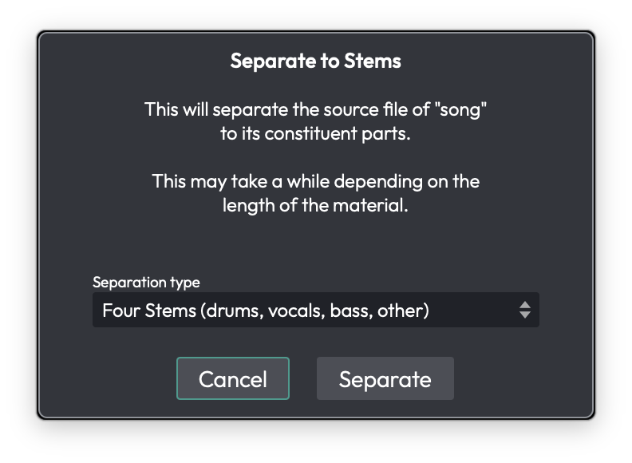
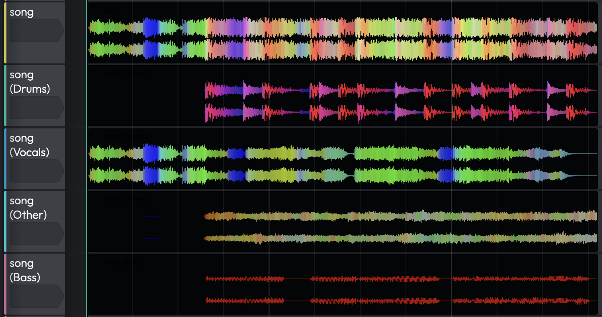

# Stem Separation

Stem separation splits a mixed audio clip into its constituent parts —
**drums**, **vocals**, **bass**, and **other** — using an on-device
neural model. Reach for it when you want to isolate a vocal for a remix,
pull out a drum loop, or turn a finished mix into an instrumental, all
without the original multitrack.

The separation is powered by **Demucs**, Meta's open-source music source
separation model. It runs **entirely on your own machine** as a bundled
background process — nothing is uploaded and no internet connection is
needed once the model is installed. <!-- code: AboutBox.h:213; AudioSeparation.cpp:171-211 -->

*The Separate to Stems dialog*

## What You Need

Stem separation has three requirements, and all three must be in place
before the feature will run:

1. **Waveform Pro.** The feature is gated behind `Feature::stemSeparation`
   and isn't available in the Free or OEM editions.
   <!-- code: ContextMenus.cpp:370-371 -->
2. **The DJ Mix Tools Expansion**, unlocked on your account. Unlocking it
   is what switches the feature on. <!-- code: Expansions.cpp:190 -->
3. **The "Stem Separation" feature pack** — the downloaded Demucs model
   and its executable — installed in your Extensions folder. The model is
   large, so it ships as a separate download rather than inside the app.

If the **DJ Mix Tools Expansion** is unlocked but the feature pack hasn't
been downloaded, the **Split to stems** menu item is still present, but
choosing it shows the message *"Unable to find the required feature
pack — Please ensure this has been installed via the Downloads page or
Download Manager and try again."* <!-- code: AudioSeparation.cpp:497-499 -->

### Getting the feature pack

Feature packs are fetched through **Settings > Downloads** (the Download
Manager). To check where they live or install one by hand, open
**Settings > File Locations** and look at the **Feature Extensions**
section: it shows the Extensions folder, lists the packs already
installed, and offers a **Content pack** button for installing a
`.content` or `.zip` file manually. See the *Reference: Settings > File
Locations* and *Reference: Settings > Downloads* chapters for details.
<!-- code: LocationsSettingsPanel.h:134-149 -->

## Separating a Clip

1. Right-click a wave audio clip and choose **Split to stems**.
2. The **Separate to Stems** dialog opens, warning that it *"will separate
   the source file of "<clip>" to its constituent parts"* and that *"This
   may take a while depending on the length of the material."*
3. Pick a **Separation type** from the dropdown:
   - **Four Stems (drums, vocals, bass, other)** — the default; produces
     all four stems.
   - **Two Stems (extract drums)** / **(extract bass)** / **(extract
     vocals)** / **(extract other)** — produces just the chosen stem plus
     its residual, e.g. *Vocals* and *No Vocals*.
4. Click **Separate**.
   <!-- code: AudioSeparation.cpp:79-83,495-513 -->

If the clip's source isn't already a WAV, Waveform first converts it to a
temporary WAV (*"Preparing for Stem Separation"*). It then runs the
separation itself (*"Separating Stems — Extracting stems from: <clip>"*),
showing a progress bar and a **Cancel** button throughout. The job auto-
scales across your CPU cores. <!-- code: AudioSeparation.cpp:165-166,429-484 -->

When it finishes, Waveform inserts **one new audio track per stem**
directly after the original track, named after the clip with the stem in
parentheses — `<clip> (Drums)`, `<clip> (Vocals)`, and so on. Each new
track holds a copy of the original clip remapped to its stem file, so the
stems stay lined up with the original. The stem WAVs are written into the
project's rendered-media folder.
<!-- code: AudioSeparation.cpp:264-309 -->

*Stem tracks inserted beneath the original clip*

The **original clip and track are left untouched** — the stems are added
alongside them. Mute or delete the original yourself once you're happy
with the result.

## Things to Watch Out For

> ⚠️ **Warning:** Separation runs on the clip's **whole source file, not
> the trimmed clip region**. If you separate a short clip taken from a long
> recording, Demucs still processes the entire underlying file. Trim or
> consolidate the clip down first if you only want part of it.
> <!-- code: AudioSeparation.cpp:467 -->

> 📝 **Note:** If you've selected several clips, only the **first** one is
> separated. Run the command again for each clip you want to split.
> <!-- code: ContextMenus.cpp:371 -->

> 📝 **Note:** Processing time scales with the length of the material — a
> full song can take a while. The progress dialog is cancellable at any
> point.

> 📝 **Note:** The stems are lossless WAVs, so they take up roughly the
> size of the original source file multiplied by the number of stems.

## Moving On

Once you have your stems on their own tracks, they behave like any other
audio — see *Audio Clips and Editing Audio* for trimming and editing, and
*Mixing Down* for bouncing an isolated stem or instrumental back out to a
file.
