# Step Clips

On the surface, a Step clip is a simple MIDI step sequencer, allowing
you to turn notes on and off with a simple click. That is correct but
Step clips go much deeper.

In this chapter, you'll learn all about Step clips and how to use them
to create drumbeats, synth lines, or bass lines.

This tutorial is an excellent introduction to working with Step clips:

[Video: Explaining Step Clips](https://youtu.be/pB1GfjwHAgQ)

## Step Clips Overview

Step clips act like a special type of MIDI clip. However, the notes are
represented on a grid where each column is a 'step' indicating a musical
increment. By default, there are 16 steps similar to common drum
machines and step sequencers. That means in 4/4 timing, there are four
steps per beat. You can change this to other values, but this is usually
a good starting point.

Here is a breakdown of the key concepts you need to work with Step
clips:

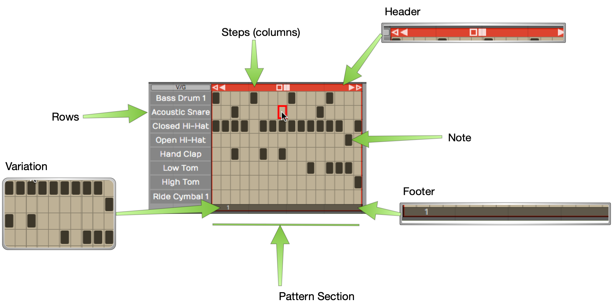

*Parts of a Step Clip*

Step Clip
- Step clips are similar to MIDI clips. You can add, delete, and copy
    them. They are always in loop mode so you can drag the right trim
    handle to roll out repetitions. Step clips need a synth plugin in
    order to make sound, just like MIDI clips.

Header
- Click the Step clip header to select it. With the clip selected, you
    have access to a wide variety of settings in the Actions panel.
    Drag the Step clip by the header to move it forward or backward in
    time, or track-to-track. Right-click the Step clip header for a
    context menu of the most used options.

Footer
- Click the Step clip footer for access to a drop down menu and
    additional options in the Actions panel. These options are
    related to working with variations and patterns sections.

Variation
- A variation is a table of rows and columns (steps). It looks like a
    mini spreadsheet - click a cell to trigger a note at that step.
    Click and active cell again to turn it off. A Step clip can hold any
    number of variations.

Step
- A variation is defined by how many steps it has, and what each step
    represents musically. By default a new variation has 16 steps with a
    step length of 1/4 beat. A step is one column of the grid that makes
    up a variation.

Row
- Each row is assigned to a single MIDI note. Rows are defined for the
    entire Step clip. Row assignments are the same for all variations
    within the clip. It is possible to assign rows within one Step clip
    to different MIDI channels or virtual instruments. More on that
    later.

Note
- A note is the cell formed at the intersection of steps and rows. You
    program by clicking notes to toggle them on or off.

Section
- By default, a Step clip has a single pattern section which holds one
    variation. You can create longer Step clips by adding more pattern
    sections. Each pattern section is assigned a variation.

Variation Number
- Variations are numbered within each Step clip. The variation number
    appears on the footer for each pattern section.

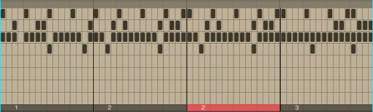

*A Step Clip with Four Pattern Sections*

> 💡 **Tip:** You can think about Step clips as follows: Step clips are a
sequence of pattern sections. Each pattern section is assigned to a
variation. You can assign the same variation to more than one pattern
section if you so desire.

> 📝 **Note:** Variations can exist in a Step clip that are not assigned to
any pattern section.

## Inserting a Step Clip Into the Edit

There are several ways to insert a Step clip onto a track:

Insert Using the Clip Object
- Like all the other kinds of clips, you can drag the Clip object to a
    track and then choose *Insert Step Clip* from the menu.

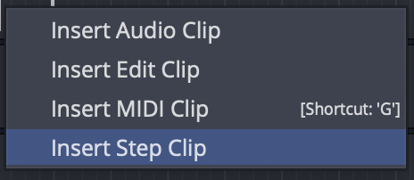

*Insert by Dragging the Clip Object*

Insert with Right-click Menu
- Right-click at the point on a track where you want to put it and
    choose Insert Step Clip from the context menu.

Insert from the Track Header
- Another way is to select the track where you'd like the Step clip to
    go, position the cursor where you'd like it to start, then
    right-click on the track header and select "Insert Step Clip".

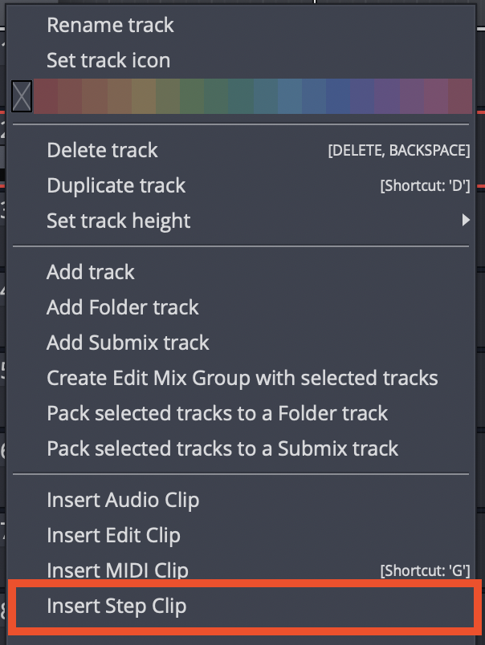

*Right-click Track Header*

Insert from Track Actions
- Select a track by clicking on the track name. In Actions, click
    "Insert New Clip > Insert New Step Clip."

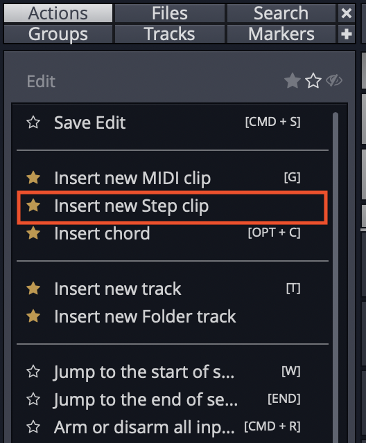

*Insert from Track Actions*

Inserting a Step Clip Preset
- Since you can save Step clip setups as presets, a great way to get a
    starting point is to drag in a preset. You can find any existing
    Step clip presets in the Browser Presets tab. Filter or search by
    "Step clip".

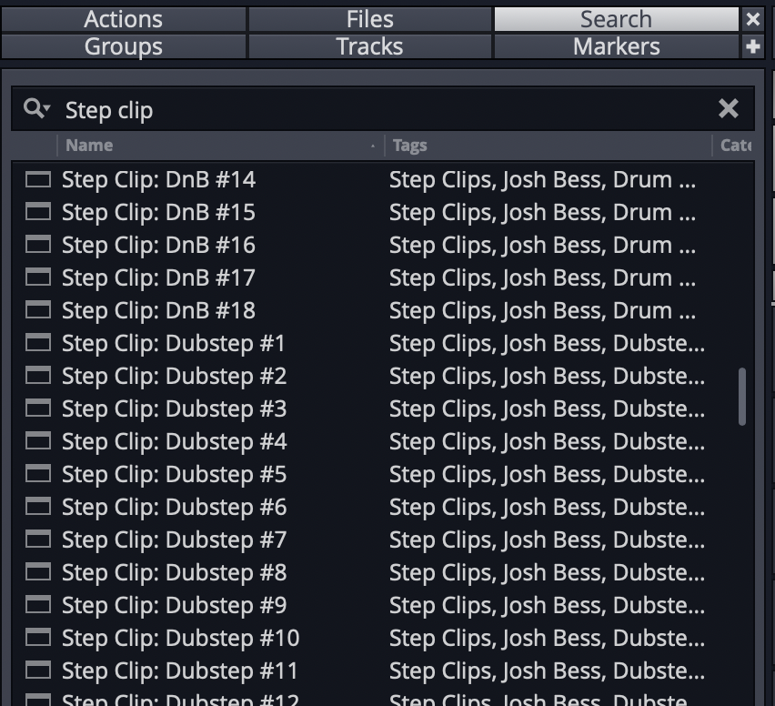

*Use a Step Clip Preset from the Browser*

Waveform includes a wide variety of Step clip presets to get you
started.

## Programming a Drum Beat with a Step Clip

Once you insert a new Step clip, notice that the rows are pre-assigned
to General MIDI drum notes. This makes it really fast to get started
programming beats.

> 💡 **Tip:** Use one of the Waveform drum instruments - Micro Drum Sampler,
Drum Sampler, or Multi Sampler. Add the instrument first and load a
preset drum kit. Next, insert a blank Step clip. The row names will
match the pad names of the preset!

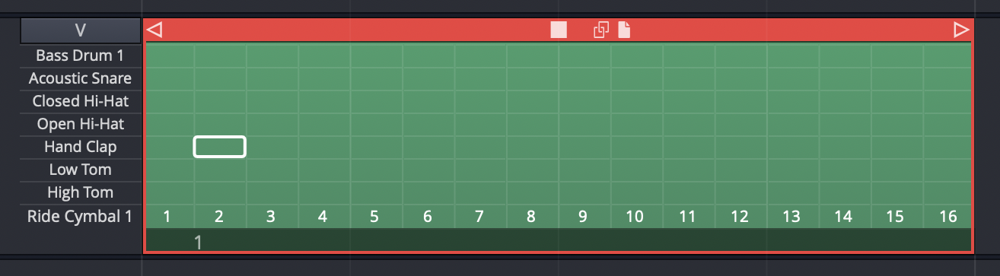

*Default Step Clip*

Here are the basic steps to programming a drum beat using a Step clip:

1.  Insert a drum instrument onto a track and select a preset.
2.  Insert a Step clip on the track.
3.  Set Loop in and Loop out over the Step clip and turn *Loop* on.
4.  Start playback, and turn notes on and off by clicking on the
    individual note cells.

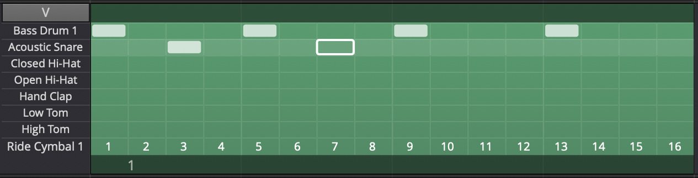

*Programming a Step Clip*

As you toggle notes you will hear the result. You are are now
programming a variation!

**Video Clip:** This video overview is a great way to get a better
understanding of how all this works. While the video was created using
Tracktion version 6, the workflow is almost identical in Waveform
version 8.

[Step Clips Overview](https://w-edstrom.wistia.com/medias/pjf2cdmm4t)

## Step Clip Actions

A Step clip has a header that is similar to that of MIDI clips and Audio
clips. Click the header to reveal all the actions and settings in
Actions. The following things are the most important when working with
Step clips:

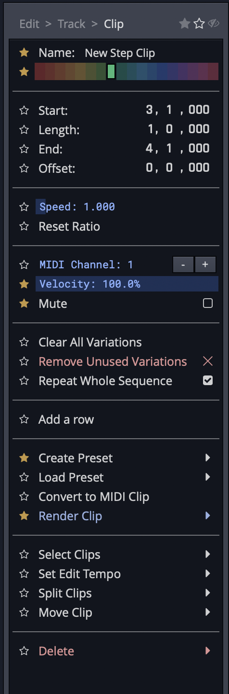

*Click the Header for Step Clip Actions*

Name
- Give your Step clip a descriptive *Name*. This will be particularly
    helpful when you go to save a Step clip as a preset. The Step clip
    name is used as the basis for presets.

Color
- Use the color selection to give your Step clip a unique color.

Clear All Variations
- *Clear All Variations* clears all the notes from all variations for
    this Step clip.

> ⚠️ **Warning:** *Clear All Variations* clears all variations whether you
can see them or not. Fortunately, you can click *Undo* (Cmd + Z / Ctrl +
Z) if you change your mind right after zeroing out all your variations!

Delete All Unused Variations
- With Step clips, you can string together a series of pattern
    sections - each one assigned to a variation. *Delete All Unused
    Variations* remove any variation that is not in use.

Add Row
- *Add Row* inserts a row as you might expect. You can also insert a
    row using the context menu for the Step clip header or Step clip row
    header.

Render Clip
- Use any of the *Render Clip* options to convert a Step clip to an
    Audio clip.

> 📝 **Note:** In the *Render* dialogue box, make sure you have *Pass Through
Plugins* selected. If you don't, the resulting audio clip will be
silent.

Standard Clip Operations
- Step clip properties also includes *Select Clip*, *Set Edit Tempo*,
    *Split Clips*, and *Move Clip*. These are standard operations shared
    by all the other kinds of clips.

Convert to MIDI Clip
- *Convert to MIDI Clip* is an important feature of Step clips. This
    will convert any selected Step clips to a MIDI clip. This allows you
    to continue editing in the MIDI editor, using the piano roll view.

Create Preset
- *Create Preset* gives you tools to create presets from Step clips.
    Presets are searchable from the Browser.

Delete
- *Delete* allows you to delete the selected Step clip. Alternatively,
    just select the Step clip, press Delete, Backspace, or Cmd + X /
    Ctrl + X. Any of these will delete a clip.

>💡 **Tip:** Just like any other clip, Step clips can be copied (Cmd + C /
Ctrl + C), pasted (Cmd + V / Ctrl + V), or duplicated (D).

Step Clip Header Context Menu
- Right-click the Step clip header and the most essential actions are
    available from the context menu.

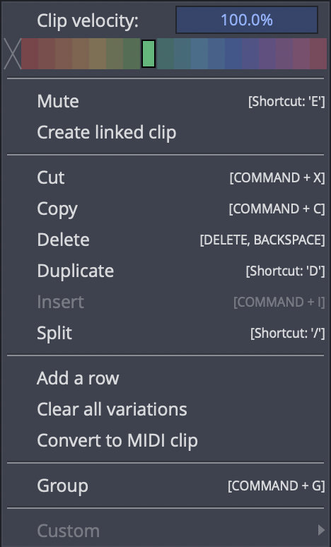

*Step-click Context Menu (Right-click)*

## The Step Clip Footer

When you click on the Step clip footer, you select the pattern section
and its variation. The active variation number is indicated on the
footer. Click the footer to see the most important actions in a popup
context menu.

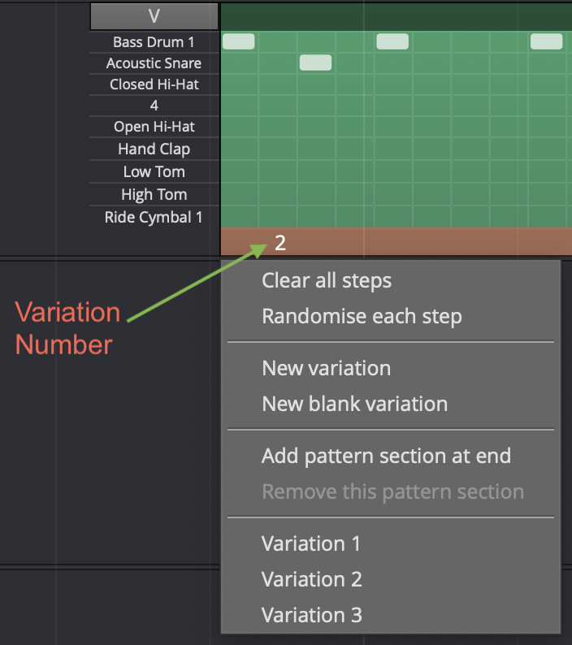

*Section Footer Context Menu*

If you have more than one pattern section in a Step clip, you select a
specific section by clicking its footer. Right-click a footer (or click
the footer if the clip's already selected) to pop up the context menu.
All of the actions also appear in the Actions panel.

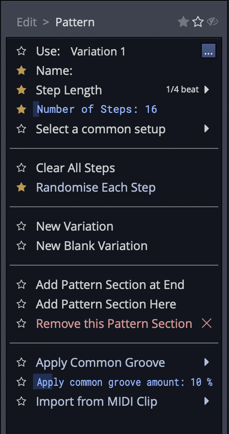

*Step Clip Footer Shows Variation & Pattern Section Options*

> 📝 **Note:** The pattern section and variation numbers are shown in the
title line of the Actions panel when a footer is selected. For example,
"Section 1 (Pattern 8)."

## Variation Options

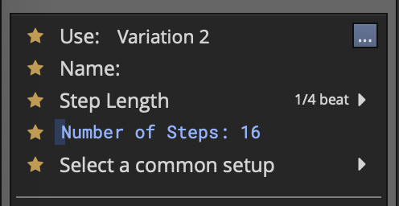

*Variation Options in Actions*

Use (Set Active Pattern)
- "Use" sets which variation to use for this pattern section. You can
    also set this from the footer context menu.

Name
- Give your clip a meaningful name if you want.

Step Length
- By default, step length is one-quarter beat. This means each beat is
    divided into four steps. This creates a 16 step sequencer. If you
    change this to some other value, it will change it for this
    variation but not for the entire Step clip.

Number of Steps
- *Number of Steps* is the number of steps in the variation. By
    default, this is 16. With a step length of one-quarter beat and the
    *Number of Steps* set to 16, each beat in 4/4 timing is divided into
    four steps. This is the most common setup for a step sequencer. This
    also gives you one bar of music.

Select a Common Setup
- "Select a common setup" gives you preset combinations of *Step
    Length* and *Number of Steps* to create one or two bar variations.

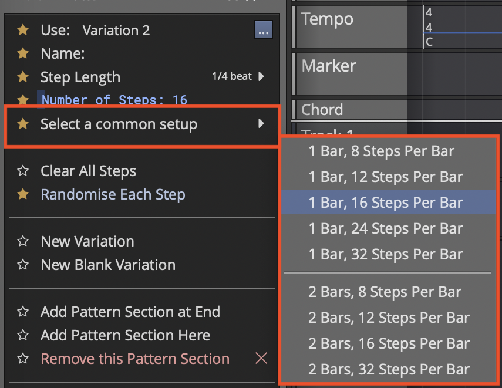

**Select a Common Setup* in Actions*

## Step Clip Variation Actions

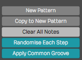

*Variation Actions*

Clear All Steps
- *Clear All Steps* clears all steps of any notes that have been
    turned on. This is a simple way to erase the variation and start
    over with some new programming.

Randomize Each Step
- Randomly turns on and off notes at each step of the variation. This
    might give you some quick creative inspiration.

New Variation
- Duplicates what you have to a new variation. The variation number is
    automatically assigned.

New Blank Variation
- Creates a new blank variation and makes it active. The variation
    number is automatically assigned.

**Video Clip:** [Step Clips *Randomize Each
Step*](https://w-edstrom.wistia.com/medias/ztgsqpw2y5)

> 📝 **Note:** You can also randomize a row of notes. We'll get to that
shortly.

Apply Common Groove
- *Apply Common Groove* is usually used to impart a swing feel. Here
    you selected a template. The most common settings are for basic
    swing. This setting applies groove to all rows in the Step clip.
    There is a way to apply groove to separate rows - we'll cover that a
    bit later.

Apply Common Groove Amount
- With groove amount set to minimum the groove template selected in
    the previous option has no effect. Increase it for more and more
    impact.

## Step Clip Pattern Section Actions

These options are available from the Actions for Step clip footers. Some
are available directly from the footer context menu as well.

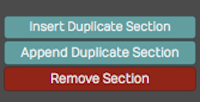

*Step Clip Section Actions*

Add Pattern Section Here
- Puts in a new pattern section along with a copy of the variation and
    pushes any existing pattern sections to the right.

Add Pattern Section at End
- Creates a new pattern section at the end along with a copy of the
    variation.

> 💡 **Tip:** Keep in mind that you choose which variation to sue for each
pattern section. Click the footer and select a variation.

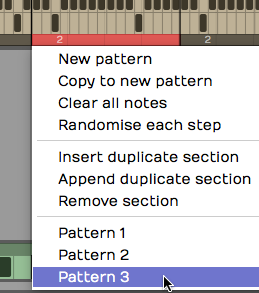

*Choosing a Variation for a Pattern Section*

Remove this Pattern Section
- Select a pattern section by clicking its footer. Choose "Remove the
    pattern section" from the menu or Actions. This doesn't remove any
    variations; they're still there and can be assigned to other pattern
    sections.

## Step Clip Row properties

Each row of a Step clip has a name, and a variety of actions you can use
to manipulate the notes on that row across all the pattern sections.
Individual rows can be set to separate MIDI channels or even routed to
different virtual instruments using the "Set Destination" option. We'll
be covering that shortly.

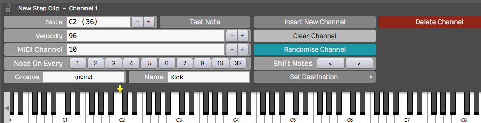

*Step Clip Row properties*

Here are the things you can do with Step clip rows:

Assign a Note Value
- If you know the MIDI note value, then you can set it with the *Note*
    property. Alternatively, drag the yellow arrow along the virtual
    keyboard in the Actions panel and set it to the desired note
    there. As you drag the arrow, you'll hear the notes play.

Velocity
- *Velocity* sets maximum MIDI velocity for the row. Using the Step
    clip V/G editor (more on that shortly), you can set each note to a
    percentage of this value. The default *Velocity* value is 96.

MIDI Channel
- *MIDI Channel* sets the output MIDI channel number. If you're
    playing into a multi-timbral virtual instrument, then this would set
    which instrument is being played from this Step clip row.

Note On Every
- The *Note On Every* parameter is followed by a series of buttons.
    Those buttons complete the sentence "Note on every (blank) steps."
    For example, click *2* to mean "Note on every 2 steps."

Groove
- Earlier, I explained how you can set the groove for an entire Step
    clip and choosing *Apply Common Groove*. You can set the groove for
    an individual row using *Groove*. Also, if groove has been applied
    to the Step clip, that groove setting will show up here. In reality,
    groove is set at the row level. When you apply common groove it sets
    all rows to the same groove template.

> 📝 **Note:** Typically groove is used to apply swing. Chose "Basic 8th
Swing" or "Basic 16th Swing" to get started.

**Video Clip:** [Step Clip
Groove](https://w-edstrom.wistia.com/medias/ad5zrq9oux)

Name
- *Name* is the Step clip row name. As you hover the mouse pointer
    over a Step clip, row names appear along the left. If you want to
    set a unique name for a channel, then select the channel and update
    *Name* in the Actions panel. These are often set to drum sounds
    like "Kick" or "Snare". You can also right-click any row now and
    choose "Rename row".

## Step Clip Row Actions

These actions are available from the Actions panel when a Step clip
row is selected. Key actions are also available from the row header
context menu.

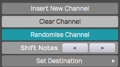

*Step Clip Row Actions*

Insert Row
- Select a row and click *Insert Row*. This inserts a new row right
    after whichever channel you started from. Rows are always numbered
    from the top down, so if you insert a row all of the following rows
    get renumbered.

Clear Row
- *Clear Row* simply erases any notes that have been programmed in to
    that channel.

Randomized Row
- *Randomize Row* randomly selects an on or off state for each step
    that row. This applies to variations across all the pattern
    sections.

Shift Notes
- The left and right arrow buttons following *Shift Notes* do exactly
    that - hey shift the series of notes in each step one increment left
    or one increment right per click.

Set Destination
- *Set Destination* opens up one of the coolest hidden features of
    Step clips. It allows you to choose which, of many, virtual
    instruments you assign that particular row. For example, you could
    have your bass drum being played by EZdrummer while your high hat is
    played by Drum Sampler. Then, you can set up a hand clap being
    played by some other virtual instrument.

> 📝 **Note:** For this feature to function, Waveform automatically wraps the
virtual instruments in a plugin rack. For the most part, Waveform
handles the details automatically when you apply *Set Destination*.

**Video Clip:** [Route Step Clips to Different Synths
Video](https://w-edstrom.wistia.com/medias/vncjr2ilh9)

## Deleting a Row

Select any row in your Step clip, click *Delete Row* to remove that
entire row. All the following row numbers are then re-sequenced to keep
them in numerical order.

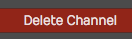

*Delete row in the Actions panel*

> 💡 **Tip:** When programming Step clips, there's really no reason to have
all eight default rows taking up space on your screen if you are not
using that many. Use *Delete Row* to simplify your Step clips. It's easy
to add another row at any time using *Insert Row*.

## Velocity Gate Editor

Take your Step clip programming to the next level using the Velocity
Gate editor. When you click *V/G* in the upper left corner of any Step
clip, the V/G view appears below the patterns. This give you a quick
graphical view of the velocity per note for the selected row.

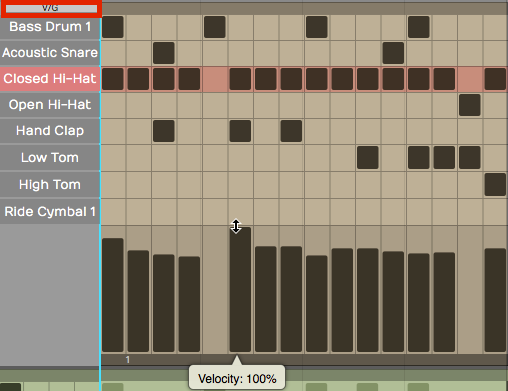

*Step Clip Velocity Gate Editor*

Here is how to use it:

1.  Click *V/G* at the upper corner of the Step clip to toggle the V/G
    view. If you don't see it, expand the vertical height of the track a
    bit until it appears.
2.  Select one the rows in your Step clip by clicking its name. The V/G
    editor shows the velocity of each note in a bar graph format. Click
    or drag within one of the velocity bars to adjust its percentage.

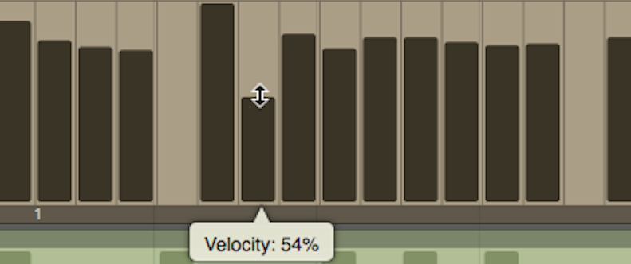

*Adjusting a Velocity Bar in the V/G Editor*

> 📝 **Note:** The V/G setting is a percentage of the velocity value set in
the Actions panel for the row. By default it starts at 100%. If you
want the notes to hit harder, then increase the row *Velocity* and
adjust the V/G percentage to taste.

1.  To adjust the velocity for a series of notes, hold down Shift and
    drag across the bars. This allows you to paint in velocities for an
    entire sequence of notes. This is really useful for rows with lots
    of notes like high-hats or snares.

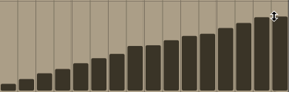

*Adjusting a Series of Velocities with Shift Drag*

1.  You can also gate the length of notes by dragging the right side of
    any velocity bar to narrow it. This gives you freedom to get gated,
    glitchy notes if you want, or just to tighten up the hits.

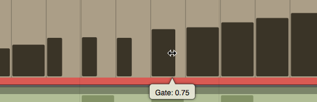

*Adjusting Note Gating in the V/G Editor*

**Video Clip:** [Step Clip
Velocity/Gate](https://w-edstrom.wistia.com/medias/mz2dg3v98s)

## Looping Step Clips

Step clips are always in loop mode. Grab right trim handle at any time
to loop it over part or all over you song. By contrast, MIDI Clips and
Audio clips have a loop mode that allows you to roll out repetitions by
dragging the right trim handle.

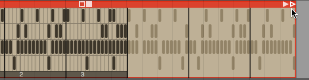

*Looping a Step Clip*

If your Step clip loops only the last pattern section, enable *Repeat
Whole Sequence* in the Actions panel.

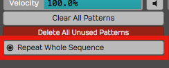

*Enable *Repeat Whole Sequence**

## Render a Step Clip to MIDI

When you get to a point where you want to do more detailed ending on
your Step clip sequence, convert it to a MIDI clip and use the MIDI
editor. To do this, right-click the Step clip header and choose *Convert
to MIDI clip*. A MIDI clip is created, replacing the Step clip.

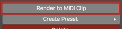

*Convert a Step Clip to a MIDI Clip*

## Step Clip Presets

Waveform includes the ability to save presets of your Step clips. This
is very useful for creating a library of sequences for use in future
productions. You may want to create presets and use them as templates,
holding your preferred starting points for Step clip channel assignments
and names.

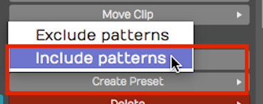

*Always use *Create Preset > Include patterns**

To save a preset, select the Step clip by clicking the header. Then
click *Create Preset > Include patterns* in Actions. You can name and
tag your preset. To find it later choose Load Preset. Alternatively use
the Browser Presets tab and filter by *Step Clips*.

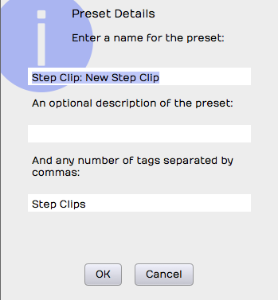

*Preset Details Dialog Box for a Step Clip*

> 💡 **Tip:** I suggest you always use *Create Preset > Include patterns.*
*Create Preset > Exclude Patterns* is also available, but that will
always have the default 16 step blank pattern since the save function
doesn't include any patterns. If you use this option, you may be
disappointed to see that presets don't appear to save correctly. If you
want a blank preset, clear all the notes, then save it using *Create
Preset > Include patterns*.

## Moving On

Step clips are incredibly powerful and a fun way to work with MIDI data
and virtual instruments. They are also unique to Waveform. Use this tool
as a secret weapon for creating cool and expressive beats!

**Video Clips:** Check out this tutorial series to learn more about Step
clips:

[Step Clips Overview](https://w-edstrom.wistia.com/medias/pjf2cdmm4t)

[Step Clips
Velocity/Gate](https://w-edstrom.wistia.com/medias/mz2dg3v98s)

[Step Clips Randomize Each
Step](https://w-edstrom.wistia.com/medias/ztgsqpw2y5)

[Step Clips Groove](https://w-edstrom.wistia.com/medias/mz2dg3v98s)

[Step Clips Route Channels to Different
Synths](https://w-edstrom.wistia.com/medias/vncjr2ilh9)

