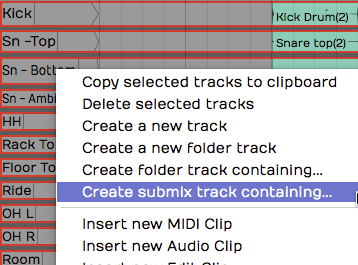
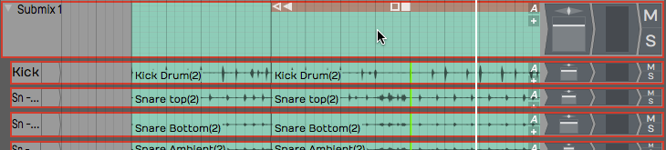
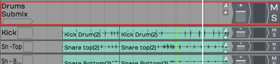
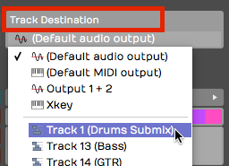
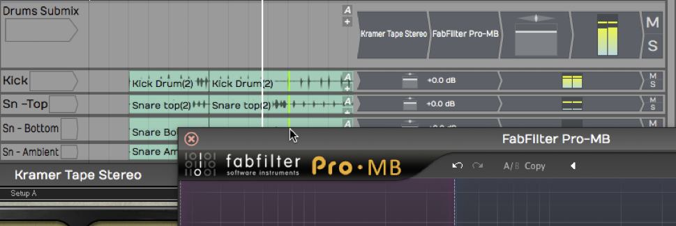

# Submix Tracks

In professional mixing, it is common to submix drums to a stereo bus to
add compression, EQ, and limiting before mixing it with other other
tracks. Actually, it is common to submix other things like vocals,
guitars, or instruments. Starting with T6, awe added a Submix Tracks
feature that resembles Folder Tracks but with a twist: you can process a
submix with plugins.

Like earlier versions, you still have the option to use any track as a
submix. This still works and has certain advantages. We will show you
how to configure that later in the chapter.

## Creating a Submix Track

Creating a Submix Track in Waveform is super easy:

1.  First, select all the tracks you want to include.

*Creating a Submix Track*

1.  Right-click any of the tracks and choose *Create submix track
    containing*. The same action is also available in properties as
    *Create Submix Containing.*

*A Submix Track*

The result looks very similar to a Folder Track. It differs in that the
audio actually passes through the Submix Track. You can use the *Volume
& Pan* plug and add any additional plugins you want.

## Working with Submix Tracks

Adding Tracks
- To add a track to a Submix, just drag and drop it on the Submix
    folder. You also drag tracks up or down within the Submix Track to
    re-order them. This works exactly like it does for Folder Tracks.

Removing Tracks
- To remove a track from a Submix, simple grab it by the track name
    and drag it back out.

> 💡 **Tip:** When dragging tracks, grab them by the track name.

Open/Close a Submix
- A Submix works just a like Track Folder in that you can open and
    close it with triangular control at the far left of the header.

Adding Effects
- You can add any built-in or third-party effect you want (accept for
    the Waveform *Freeze Point*) to Submix Tracks. Just drag them to the
    mixer like any other track.

Muting
- *Mute* works like you would expect, muting everything within the
    Submix Track.

Soloing
- soloing works a little differently than you might expect. When you
    click Solo on the Submix, it mutes all other tracks, including the
    ones contained within the Submix Track.

## Creating an Old School Submix Track

In older versions of Waveform, The way to setup a submix was to use a
track. We will review how this is done, since you may encounter older
Projects that used this method.

1.  Create a track in the normal way.

*Creating an Old School Submix Track*

1.  Name the track appropriately. In this example, we have named it
    *Drums Submix*.
2.  Select all the tracks you want to route to the submix.
3.  In the properties, click *Track Destination.* Select your the *Drums
    Submix* track. This effectively routes the output of each selected
    track through to the drum submix track.

*Set the Track Destination on the Source Tracks*

Now, you can use the *Volume & Pan* control on your *Drum Submix* track
to control the volume of all the tracks that you have just routed to it.
You can also add any plugins you want to the new Submix Track. In this
example, we have inserted a tape simulator and a third party bus
compressor.

*Submix Using Third Party Plugins*

Of course, you can use any processing that you like. That depends
largely on which kind of tracks and the style of music.

