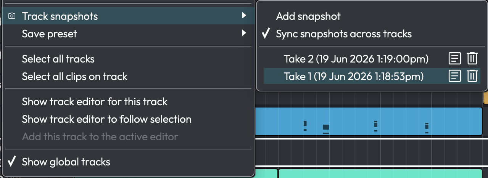

# Track Snapshots

> 📝 **Note:** Track Snapshots are a **Waveform Pro** feature. They are not available in Waveform Free
> or OEM editions, where the menu item appears greyed out as *"Feature unavailable"*.

A **Track Snapshot** saves the current arrangement of clips on a single audio track so you can try out
a different arrangement and instantly recall the saved one. It is an A/B tool for *arrangement* work:
lay down a verse one way, snapshot it, rearrange the clips, and flip back and forth between the
versions until you are happy.

> 📝 **Note:** A snapshot captures the track's **clips only** — their positions, lengths, and clip-level
> settings. It does **not** store plugins, fader, pan, mute/solo, sends, or automation. Recalling a
> snapshot changes which clips sit on the track; it leaves the channel strip and plugins untouched.

*The Track snapshots menu*

## Opening the Snapshots Menu

Track Snapshots are available on **audio tracks** only — you will not see them on folder, submix,
tempo, or chord tracks. There are two ways in:

- **Right-click the track** and choose **Track snapshots** (camera icon) to open the submenu.
- Open the **track inspector** and click the **Track Snapshots** button.

You can also bind the commands **"Show track snapshots menu"** and **"Add track snapshot"** to keyboard
shortcuts from *Settings > Keyboard Shortcuts*; neither has a default shortcut.

## Taking a Snapshot

Choose **Add snapshot** from the menu. A dialog titled *"New Snapshot Name"* appears with a default
name; type a name and confirm to add the snapshot to the top of the list. Each snapshot is stamped with
the real-world date and time it was taken, shown in brackets beside its name so you can tell versions
apart at a glance.

There is no limit on the number of snapshots a track can hold, and they are saved inside the project, so
they travel with the edit.

## Recalling, Renaming, and Deleting

The menu lists every snapshot on the track, newest first. If there are none, it shows a greyed
*"No snapshots created"* line.

| Action | How |
|---|---|
| **Recall** a snapshot | Click its row in the list. The track's current clips are removed and the stored clips are reinstated. |
| **Rename** a snapshot | Click the **pencil** icon on the row (*"Rename snapshot"*). |
| **Delete** a snapshot | Click the **trash** icon on the row (*"Delete snapshot"*). |

> ⚠️ **Warning:** Recalling a snapshot **replaces all clips currently on the track**. There is no
> confirmation prompt, so anything you have not snapshotted will be swapped out. The action is undoable
> through the edit's normal Undo (Ctrl/⌘+Z) if you change your mind.

> 📝 **Note:** Deleting a snapshot is immediate and is not confirmed.

## Syncing Snapshots Across Tracks

At the top of the menu is **Sync snapshots across tracks**, a toggle that is **on by default**. This is a
global preference — it carries between projects, not just the current edit.

- **On** — adding, recalling, renaming, or deleting a snapshot acts on **every track that shares that
  snapshot's timestamp**, and on any tracks linked through an enabled **Edit Mix Group**. This lets you
  snapshot and recall a whole arrangement — several tracks at once — as a single operation.
- **Off** — every snapshot operation affects only the one track you clicked on.

> 💡 **Tip:** Use *Sync snapshots across tracks* when you want to A/B a multi-track section (for example
> all of your drum tracks together). Turn it off when you want to experiment with a single track in
> isolation without disturbing the others.

For more on grouping tracks so that operations apply across them, see the
[Edit Mix Groups](edit-mix-groups.md) chapter.
