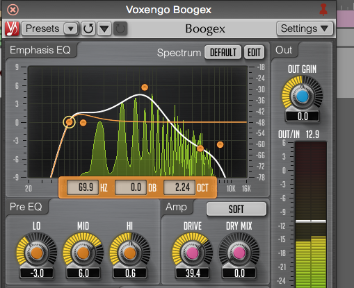
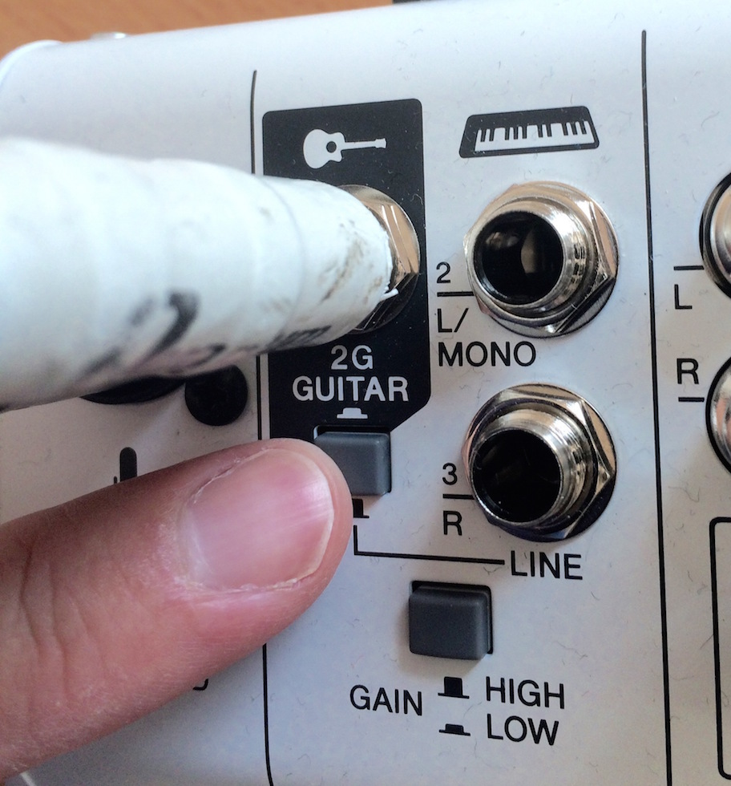
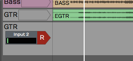
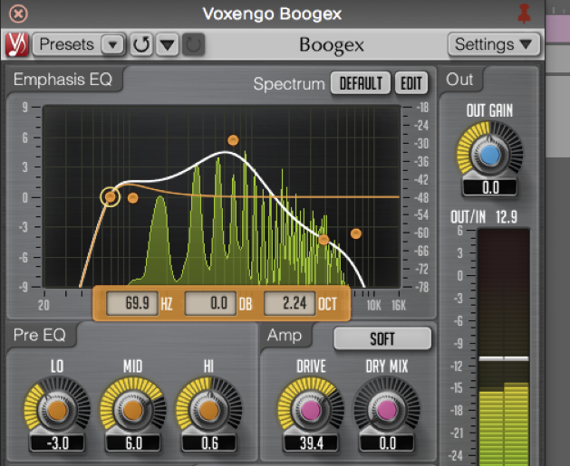
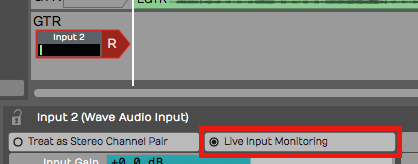
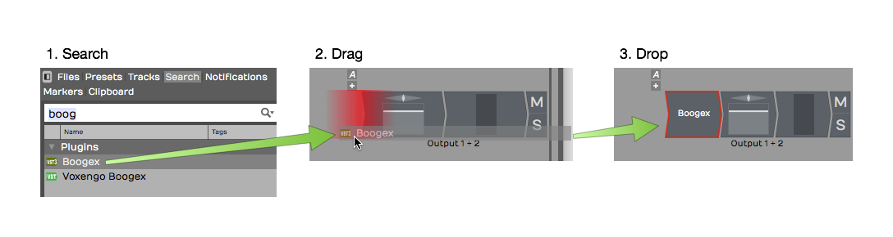
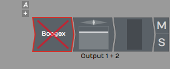
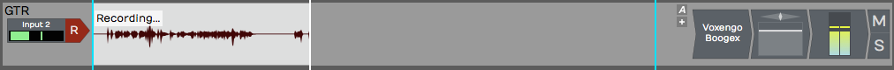
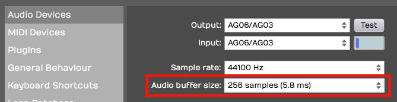
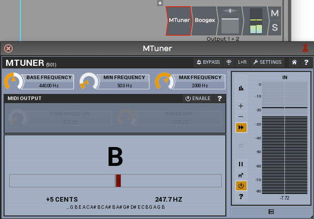

# Using an Amp Simulator Plugin

In this chapter, you will learn how to use an amp simulator plugin while
recording direct with an electric guitar in Waveform. Out of the box,
Waveform doesn't include an amp simulator plugin. However, most of the
third party amp simulator plugins will work. If you don't have any of
these, there is a great sounding free amp sim plugin from Voxengo called
Boogex, used as an example for this chapter. You can download it from
[Voxengo.com](http://www.voxengo.com/product/boogex/).

*Free Boogex Amp Simulator from Voxengo*

## Setting Up the Track

Here is the setup:

1.  Connect your guitar to the high impedance input on your audio
    interface as described in [Audio Device Setup](audio-device-setup.md). If your interface
    doesn't have a guitar input then use a suitable preamp.

*Connect Your Guitar to your Interface*

2.  Create a new track, select the input, and arm it for recording.

*Select the Input and Arm It*

3.  Make sure that direct monitoring of your signal though the audio
    interface is turned all the way down or disabled. To make this work
    you need to monitor 100% of your guitar signal through Waveform.

*Turn off Any Input Monitoring on Your Interface*

4.  Select the input and turn on *Live Input Monitoring*. At this point
    you should be able to hear your dry unprocessed guitar signal.

*Enable *Live Input Monitoring**

5.  Open the Browser and go to the Search tab, and type in a few
    characters of the name of your amp simulator plugin. Drag the plugin
    to the mixer section.

*Drag the Amp Sim Plugin to the Mixer*

6.  If the UI window for the plugin didn't open, double click it. If you
    have *Live Input Monitoring* enabled you should hear sound through
    the plugin when you play. Select a preset and it should sound like
    you are playing through a guitar amp, maybe even amps, effects,
    cabinets, whatever your plugin simulates.

> 💡 **Tip:** To bypass the plugin just click on the plugin to select it and
press F. You can also enable or disable it using the *Enabled* control
in properties. The shortcut F will enable or disable any selected
plugins.

*Amp Sim Plugin Shown Disabled*

## Recording with the Amp Sim

At this point, recording works the same as before.

1.  Record-enable the track, make sure the cursor is at the beginning.
2.  Click *Record* in the Transport. If you want to do loop recording
    then have *Loop* on and then you can record several takes in a quick
    succession.
3.  Once you have actually recorded the part, you can still tweak the
    sound.

*Recording with the Amp Sim*

A big advantage of recording this way is the ability to tweak the sound
after the fact. You can also record using an endless variety of guitar
rigs that you don't own. Plus, you can do this without disturbing the
neighbors!

An important but subtle advantage is when you go to edit your guitar
tracks. Edits that occur before the amp and distortion sounds more
natural and are way less apparent when you edit a fully processed guitar
part.

## Guitar & Impedance

Guitars connect to your audio interface through a quarter-inch,
unbalanced connection. This is a high impedance connection. It might not
be super important to understand what that means electrically. You will
get a better tone and feel if connect to a proper high impedance input.
It's just the nature of guitar pickups. Going into a standard input
loads them down and you lose articulation and punch. On most audio
interfaces, the first one or two channels of the interface have guitar
inputs. Many times there is a switch or button to enable high impedance
on those channels, meaning that it will accept high impedance pickup
like a guitar or bass. So while your guitar might actually work through
a normal low impedance input, it is going to give you better picking
dynamics and tone if you go through the high impedance input and have
the high impedance mode engaged.

## Managing Latency

When working with guitar amp simulators, latency can be a factor. If you
have the *Audio buffer size* set too high, you get a big delay between
when you play and when you hear a note. If you set it too low the you
might get pops and clicks if the computer doesn't have adequate CPU
power to handle the low latency you have chosen. The challenge is to
find a good setting the feels responsive, but still has perfect sound
quality.

Latency is determined by *Audio Buffer Size* parameter. Here is how to
set that:

1.  Navigate to the Settings tab, Audio Devices page.
2.  Locate the *Audio buffer size* setting. The value shows a number of
    samples followed by a calculated latency delay.
3. Enter an *Audio Buffer Size* value. Values around 256 or lower tend to work pretty well depending on what else is going on in the Edit.

## Speed of Sound Through Air

Here is some background on the impact of the buffer size. In this
example, a buffer setting of 256 samples offers 5.8 ms of latency.

What this means is that when you play a note on your guitar, you are
going to hear the sound about 5.8 ms later. Now the speed sound through
air is about 1 ms per foot (1ms per .3 meters). A 5 ms delay would be
similar to playing your guitar amp if it were 5.8 feet (1.8 meters) away
from your ears. You would need to add in the actual distance from your
monitor speakers as well. If your speakers are two or three feet away,
it might be like having your amplifier nine feet away. Most guitar
players can deal with latency delay in that range. It's similar to the
distance you would be standing from your guitar amp on stage. If it
starts getting much longer than that, then you are going to hear a
noticeable lag and that will affect the feel and potential impact your
playing.

As another example, if you have your *Audio buffer size* set to 1024
samples, that gives you 23 ms of delay, That is going to give you the
feeling of playing with your amplifier 23 feet (7 meters) from your
ears. That is going to be really hard to work with.

Why not just set the buffer size as low as it will possibly go? That
could affect the performance of the computer. If you set the buffer size
too low, especially if you have a lot of other plugins and other virtual
instruments going, the playback might halt or it might not sound clean.

> 📝 **Note:** It's always a balancing act between setting the buffer size as
low as possible to get the latency down while keeping it high enough to
have clean, solid playback. When mixing, you can increase latency to
approximately 1024, mostly because that is required for Melodyne ARA.

## Dialing in the Guitar Tone

You can dial in your ideal guitar tone using the controls on the amp
simulator. Flip through the presets or start with a preset and tweak the
controls until you get what you like. Keep in mind, one of the powerful
things about recording guitar this way is you don't really have to
commit to the sound at this point. Just dial in something that's
inspiring so that you can get a good performance. You can always come
back and tweak the amp settings later.

## Using a Tuner Plugin

If you are recording direct with a guitar or bass, you might want to add
a tuner plugin before the amp sim. Waveform does not include a native
tuner, but if you have a tuner plug-in, you can just drop it into the
effects section of the mixer for the track. That will give you a quick
and easy way to tune up.

> 💡 **Tip:** If you don't have a tuner plugin, consider downloading one as
part the the MFreeEffectsBundle from [Melda
Production](http://www.meldaproduction.com/plugins/product.php?id=MFreeEffectsBundle).

*Tuning with the MTuner Plugin*

Assuming you have a tuner plugin available, here is how to get it going:

1.  Open the Browser, go to the Search tab. Make sure *Plugins* is
    selected from the search options drop down menu. Type in a few
    characters of the name of your tuner plugin. The plug-in will show
    up in the search list.
2.  Drag the tuner and drop it in the plug-ins area of the track.
    Normally, as soon as you drop it, the user interface window will pop
    open. If not double click the plugin to open the UI.
3.  Play a note on your guitar. If the tuner does not respond make sure
    to arm the track for recording and enable *Live Input Monitoring.*
    This is necessary for the signal to flow through the track to the
    mixer section and to the tuner plugin.

> 💡 **Tip:** To keep the plugin open, click the pin icon in the upper right
corner.

When you are finished with tuning, click the red X in the upper left
corner of the tuner to hide its user interface.

> 📝 **Note:** In earlier versions of Waveform, *Live Input Monitoring* was
called "End to end monitoring." It has been renamed to reduce confusion
about this feature.

## Moving On

You can always record in the traditional way by miking your guitar
amplifier. It's also interesting to split your guitar signal and record
the direct signal along with your miked guitar amp. That way you can
blend the sound of the amp sim with the real amp when mixing.

