# Using Markers

In this chapter, You will learn about using markers in Waveform. There
are four different kinds of markers:

In-marker and Out-marker
- Together these define the "marked region", that is the region for
    looped playback and loop recording.

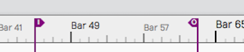

*In-marker and Out-marker*

Bars & Beats markers (B&B Markers)
- Bars & Beats markers can be used to identify song sections, give you
    a visual guide to the song, and provide quick navigation to
    different parts of your song. They are arranged as clips on the
    Marker track. Bars & Beats markers appear with a musical note icon
    on the Marker track. They also appear as narrow pointers on the
    Timeline when the Marker track is closed.

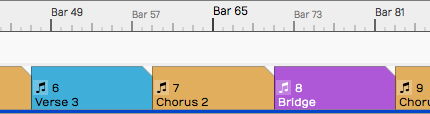

*Bars & Beats Markers on the Marker Track*

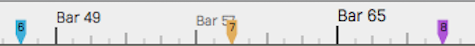

*Bars & Beats Markers on the Timeline (with Marker track closed)*

Timecode Markers (TC Markers)
- Timecode markers mark a specific time offset into the Edit, and are
    not dependent on tempo changes. They can can aid with navigation,
    especially when working with video. TC markers appear as clips with
    a clock icon on the Marker track. They appear as rounded pointers on
    the Timeline if the Marker track is closed.

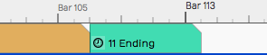

*Timecode Marker on the Marker Track*

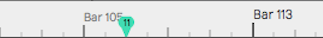

*Timecode Marker on the Timeline (with Marker track closed)*

> 📝 **Note:** In Waveform, the term 'marked region' means the range of an
edit that occurs between the In-marker and the Out-marker.

Wave File Markers
- You can add yellow arrows directly to Wave files that then appear on
    Audio clips. These are the least useful type of markers. More about
    them near the end of this chapter.

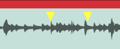

*Wave File Markers*

## In-marker & Out-marker

Position the In-marker and Out-marker by dragging the I and O flags
along the Timeline. The In-marker and Out-marker together define the
range over which playback will loop when the *Loop* button in engaged in
the transport bar. They also define what is called the "marked region"
used for numerous editing actions.

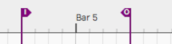

*The In-marker & Out-marker*

Pressing I will locate the In-marker to the cursor position. Pressing O
locates the the Out-marker to the cursor position.

You can alternatively "draw" in the range between the In-marker and
Out-marker. Double-click on the Timeline and start dragging right.
Double-click positions the In-marker at the starting point. As you drag
right, the Out-marker comes along to set the out point when you lift the
mouse button.

> 💡 **Tip:** To set the marked region over a selection of clips and press A.
This also works for Marker clips making it a great way to set the
In-marker and Out-marker over a song section.

## Navigate Using the In-marker & Out-marker

You can quickly navigate to the In-marker or Out-marker using the square
bracket keys. Press `[` to locate the cursor to the In-marker; Press `]`
to locate the cursor to the Out-marker.

## Zooming to the In-marker/Out-marker

When you have a marked region set between the In-marker and Out-marker
you can quickly zoom in to that region. To do that, right-click the
Timeline and select *Zoom to show the marked region* or simply to press
F7.

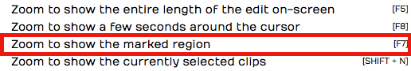

*Right-click the Timeline, Zoom to In-marker/Out-marker*

## Looping Playback Over the Marked Region

To continuously repeat playback over a section of your tune, set the
In-marker and Out-marker to define the loop range. Turn on looped
playback by engaging the *Loop* button (L). Playback will repeat that
section over and over until you stop playback.

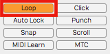

*Enabling Loop Playback*

> 📝 **Note:** When *Loop* is enabled, playback will only play within the
marked region. If the cursor is located earlier than the In-marker or
after the Out-marker when you press *Play*, it will jump to the
In-marker and play from there.

## Auto Punch and the Marked Region

To use Auto Punch, first set the In-marker and Out-marker over the range
where you want to punch in. Enable the *Punch* button (P) in the Master
section. Make sure *Loop* is turned off. Now enable a track for
recording, position the cursor before the In-marker and press *Record*
on the Transport. Even though the track is armed for recording, no
recording will happen until the cursor gets to the In-marker.

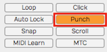

*Enabling Auto Punch Recording*

> 💡 **Tip:** Auto punch recording means that recording is only allowed
between the In-marker and Out-marker. Also, punch recording only works
when *Loop* is off.

## The Marker Track

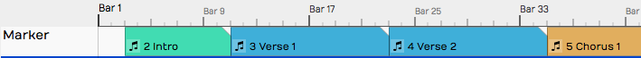

*Marker Track*

Let's take a closer look at the Marker track. You can open and close the
Marker track with the Marker track show/hide button.

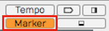

*Marker Track Show/Hide Button*

The Marker track can contain either Bars & Beats markers or Timecode
markers. If you don't like to see the types mixed together on the same
track, there is an additional split mode that shows each type on
separate lanes.

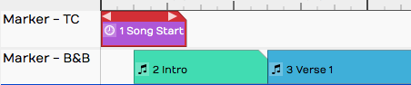

*Marker Track Split Mode*

To access that mode, select the Marker track by clicking the header.
Then in properties, de-select *Use a single track for all types of
marker.* In this mode, the Marker track has two lanes. The top lane
shows Timecode Markers and the bottom lane shows Bars & Beats Markers.

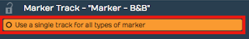

*Marker Track properties Setup for Split Mode*

> 📝 **Note:** F10 is my assignment for the keyboard action *Toggle the
marker view mode*. Pressing F10 cycles through the three marker track
states - hidden, normal, and split mode.

> 💡 **Tip:** You can click on any blank space in the Marker track to
instantly position the cursor.

## Adding Markers

Here are the various ways to add markers to the Marker track:

Drag the Clip Object
- Drag the Clip object to the Marker track and choose which type of
    Marker to create. This creates a Marker clip you can drag and
    resize. It has left and right trim handles to adjust the length. You
    can also drag a marker by its header and move it around. If the
    Marker track is in split mode, the type of Marker (B&B or TC) is
    determined by which lane you drop the Clip object on.

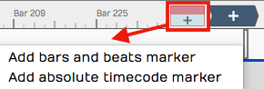

*Adding a Marker by Dragging the Clip Object*

Press Return
- The Return key (Enter on PCs) has several functions related to
    Marker navigation during playback. At the most basic level, pressing
    Return adds a new Marker at the cursor position. The type of Marker
    clip matches the most recently added Marker. If a Marker clip is
    selected, it adds one of that type. Markers added with Return, use
    the next available sequential Marker number.

Right-click the Marker Track Header
- Right-click the Marker track header and choose which type of marker
    to add at the cursor position.

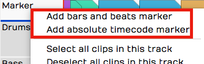

*Add a Marker from the Marker Track Right-click Menu*

Marker Track properties Buttons
- Click the Marker track header to select it, then look in properties.
    There you will find the buttons *New Bars & Beats Marker* and *New
    Absolute TC Marker.*

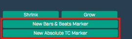

*Add a Marker from Marker Track properties*

Browser Markers Tab *Add* Button
- You can add either kind of Marker Clip using the selections on the
    Browser, Markers tab.

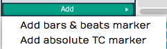

*Add a Marker from the Browser, Markers Tab*

## Marker Clip properties

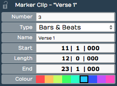

*Marker Clip properties*

Marker clips behave like other clips in several ways. You can adjust the
length using the trim handles, you can split them, drag them, duplicate
them, or nudge them. They also contain several properties, described
below:

Number
- Marker numbers are issued sequentially as you add Marker clips. You
    can edit the *Number* property if you want. If you change *Number*
    to one that is already in use, then the other clip will be assigned
    the next available number. Marker numbers can be used for quick
    navigation during playback.

> 💡 **Tip:** If you feel compelled to renumber all your Markers to get them
into a nice sequential order, you might want to skip some numbers, in
order to make it easier to insert new Markers. For example, if you have
a lot of markers in the song, you could re-number them by 5s.

Type
- *Type* allows you choose which type of Marker clip you want: *Bars &
    Beats* or *Absolute.* Bars & Beats markers adjust to the tempo
    changes in the song. Timecode markers are fixed to a specific time
    offset into the Edit and are not affected by tempo changes.

> 📝 **Note:** Timecode markers are also called "absolute markers", "TC
markers", or "absolute timecode markers" within Waveform. All those
terms refer to the same thing. For this book, I usually call them
Timecode markers.

Name
- The *Name* property sets the name shown on the Marker clip. By
    default it will be "New Marker." Most users rename it based on song
    section. For example: Intro, Verse, Chorus, Bridge, or Outro.

Start
- The *Start* property shows the bar, beat and tick start time for B&B
    markers. For Timecode markers it shows
    Hours/Minutes/Seconds/Milliseconds. For either type, you can edit
    *Start* directly to move the marker to a different location.

Length
- Similarly, *Length* shows B&B marker length in Bars/Beats/Ticks
    format. For Timecode markers, it shows length as
    Hours/Minutes/Seconds/Milliseconds. Edit the *Length* property and
    the Marker clip length will change to match.

End
- *End* values are in the same format as the *Start* property. Edit it
    to change the ending time. When you change the *End* value, *Length*
    gets adjusted to match. *Start* always remains the same. If you edit
    *End* to fall before *Start*, it will be set to match the *Start*
    time. In that case, *Length* gets set to zero.

Colour
- Choose from one of the nice colors. This sets all selected Marker
    clips to the color you choose.

> 💡 **Tip:** You can change a Marker clip from Bars & Beats to Timecode
using nudge. Press F10 until the Marker track split mode is showing.
Select the marker clip to convert and press Shift-up or Shift-down to
nudge the clip to the other lane.

## Navigating by Markers

Once you have Markers set up, you can quickly navigate using the Marker
number and the Return key. Just type in a Marker number like '5' or '11'
and hit Return ('Enter' on PCs). As you type the number you will see it
appear in green in the upper right of the Waveform window. When you see
the number, you have about two seconds hit Return before the number
disappears.

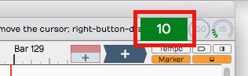

*Marker Number As It Appears Momentarily*

If you enter a number that doesn't have a matching Marker, then Waveform
will insert a marker with that number at the cursor. Also, if you just
press Return, a Marker clips is inserted at the cursor position.

Undo (Cmd + Z / Ctrl + Z) removes a marker if you didn't intend to
insert it.

> 💡 **Tip:** The Number + Return approach to navigation works during
playback but also works when Waveform is idle. If it doesn't seem to be
working when playback is idle, click the header of the Marker track or
select any marker and try again.

## The Browser Markers Tab

Use the Browser Markers tab to add Bars & Beats or Timecode markers to
the Marker track. You can also use it navigate to any marker by
double-clicking on the marker name in the list. You can also quickly
delete the selected marker or change its name in properties.

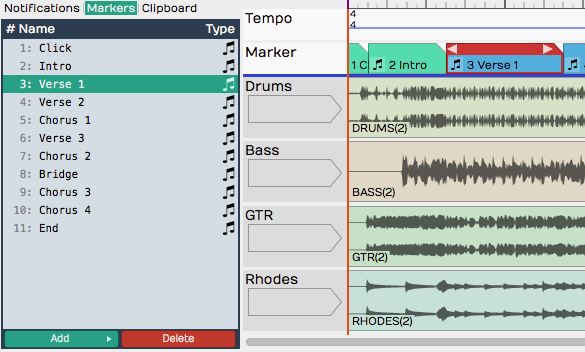

*Browser, Markers Tab*

Select marker clips
- Single-click a marker in the list to select it.

Navigate to a marker clip
- Double-click on a marker in the list to jump to that position. This
    works during playback too.

Rename a marker
- Click a marker to select it. Then, edit the Name property in
    properties.

Add a Marker
- Click *Add* at the bottom of the Markers tab. Select from the two
    types: *Absolute timecode marker* and *Bars & Beats Marker*.

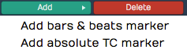

*Adding a Marker from the Markers Tab*

Delete a Marker
- Select a marker in the list and click *Delete* or just press Delete
    on your keyboard. Undo (Cmd + Z / Ctrl + Z) restores a deleted
    marker.

Change a Marker from one Type to the Other
- Select the Marker and edit the Type property in properties. Or drag
    it from the TC Marker track to the B & B Marker track or vice-versa.

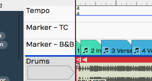

*Absolute Timecode Marker Track - *Marker - TC**

## Renumbering Markers

It is sometimes too easy to get your marker numbers out of order, but
there is an easy trick to renumber them: Open the Markers tab in the
Browser. Select all of the markers and edit the *Number* property. For
example if it shows "1" with all the markers selected change it to "2."
The markers instantly renumber starting from "2." If you really want
them numbered starting from one, simply do it again, changing the
*Number* property back to one.

## Adjust Markers (Wave File Markers)

There is another type of marker in Waveform, also called "markers." They
appear to mark spots in a clip, but actually are stored in the
underlying Wave files. You work with these markers from the *Adjust
Markers* actions in Audio clip properties. You also add and remove them
by dragging the marker object in Audio clip properties *View Source
Info.*

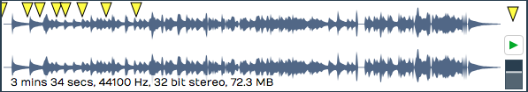

*Wave File Markers in View Source Info*

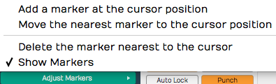

*Adjust Markers Options in Audio Clip properties*

## Moving On

Markers can be extremely useful in the context of recording and editing.
Not only do they keep your project organized, they also provide easy
navigation into important locations within the Edit.

