# Using Plugins

In this chapter, we will show you how to apply effects plugins using the
In-line mixer or the separate mixer window.

> 📝 **Note:** Scanning plugins and setting up a favorites plugin list are
done on the Settings tab, Plugins page. Check the reference section
[Reference: Settings > Plugins](reference-settings.md#plugins) to learn more about that.

## The In-line Mixer

The In-line mixer section resides along the right side of the Edit, and
completes the left-to-right signal flow on each track. You can open and
close the Mixer using the open/close icon at the upper right, or also
using keyboard shortcut M.

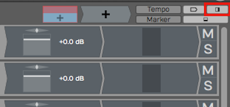

*Button to Open Close the In-line mixer (M)*

Whenever you create a new track, it will automatically have a *Volume &
Pan* plugin and a *Level Meter* plugin inserted. These behave just like
any other plugin. You can change the order, remove them, or even add
additional instances of them on the same track.

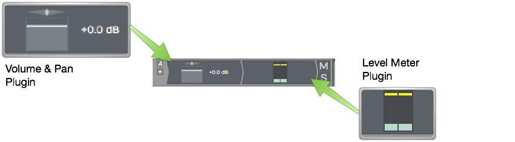

*Default Plugins *Volume & Pan* and *Level Meter**

For example, you might want a level meter before and after a compressor.
Of course, you can add other plugins, both built-in and third party to
the Mixer section.

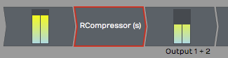

*Level Meter Before and After a 3rd Party Compressor*

> 💡 **Tip:** Each Mixer channel is stereo. If the track contains mono clips,
you will still typically want to choose stereo versions of plugins for
the Mixer, as mono plugins will only effect the left side of the signal.

## Adjusting the Size of the In-line Mixer Section

Try moving the mouse pointer from the arrangement slowly to the Mixer
section. As your pointer crosses over from the arrangement to the Mixer,
notice the vertical highlight line.

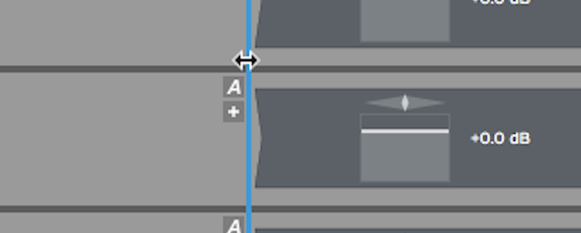

*Resizing the Mixer*

Drag the highlight line to the left to expand the Mixer section. If you
drag it right, then you can make the Mixer section smaller. All of the
plugins on the Mixer are dynamically resized.

> 💡 **Tip:** If you accidentally delete, change, or move a plugin, or simply
change your mind, click *Undo* on the Menu (Ctrl + Z / Cmd + Z) to
restore it.

## Working with Plugins

You can fully customize the mixer for each track by inserting a chain of
plugins. This is one of the most compelling features of Waveform, as
there is no need to switch between a horizontal track view and a
vertical console view.

Here are the essentials for working with plugins in the Mixer:

Inserting Plugins
- To insert additional Waveform plugins or third-party plugins, drag
    the Plugin Object to a track and then select the plugin that you
    would like from the list.

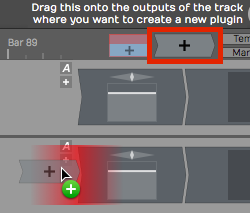

*Drag the Plugin Object to Insert a Plugin*

For third-party plugins, the UI window will pop up. Apart from the core
built-in plugins, each has its own graphical user interface.

Right-click to Insert
- Right-click on any existing plugin and select *Add new plugin.* This
    pulls up the plugin selector menu and you may pick any plugin to
    add. It will be added to the left of plugin you started from.

> 📝 **Note:** If you don't see some of your plugins, review the previous
chapter that details how to scan your system for all available plugins.

Plugin properties
- To select a plugin, click on it. When selected, its properties show a
    wide variety of settings and actions related to that plugin. Most of
    the built-in plugins have the entire user interface in properties.

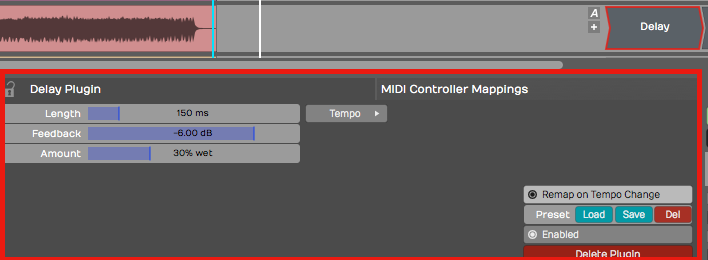

*Select a Plugin to See its properties*

Duplicating Plugins
- To duplicate a plugin, select it and press D. This gives you a new
    instance of the plugin to drag to a different position or to another
    track.

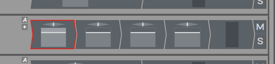

*Duplicate Plugins by Pressing D*

Deleting Plugins
- To delete a plugin, simply select the plugin and hit Delete or
    Backspace. You may alternatively click the red *Delete Plugin*
    button in properties.

Moving Plugins
- To move a plugin from one track to another track, simply grab the
    plugin and drag it wherever you would like to put it, even to a
    different track. As you drag, a red insert illumination will appear
    showing where the plugin will be after you drop it.

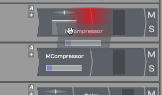

*Moving a Plugin*

Copying Plugins
- To copy a plugin, hold down Opt / Alt and drag it to where you want
    the copy. Alternatively, press D to duplicated it then drag the
    duplicate to the target location.

Bypassing a Plugin
- To bypass a plugin, select the plugin then turn off *Enabled* in
    properties. Or, simply select the plugin and press the keyboard
    shortcut F. A bypassed plugin appears with a red X through it on the
    Mixer.

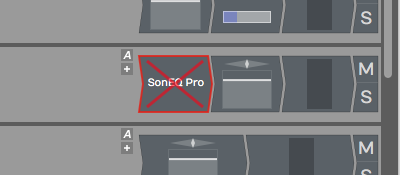

*A Bypassed Plugin*

> 💡 **Tip:** You can bypass several plugins at once, by first selecting them
and then pressing F.

## Assigning a Quick Control Parameter

You can assign a quick control parameter to any instance of a plugin.
This allows you immediate access to tweak one parameter without mousing
back to properties or opening the UI for the plugin. For example, I
often set the mix control for delay plugins as quick control.

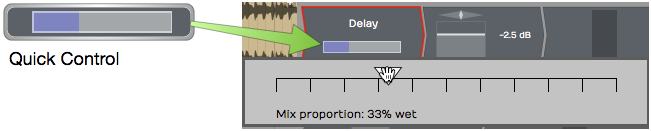

*Delay Mix Set as a Quick Control Parameter*

To set up a quick control parameter, right-click the plugin and choose
*Select quick control parameter.* Next, choose which parameter to use.

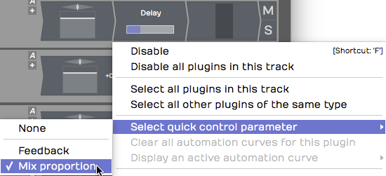

*Right-click to Set the Quick Control Parameter*

Waveform Delay has only two parameters, but many third-party have many
more to to choose from.

## Third-Party Plugins

Third-party plugins are inserted in the same way as built-in plugins.
One difference is that the UI (user interface) does not appear in
properties. Each plugin has its own UI window.

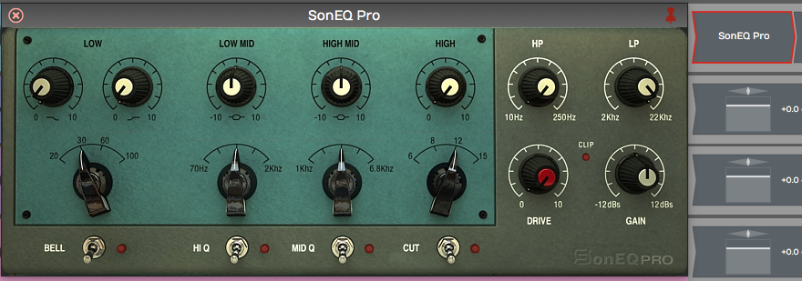

*Sonimus SonEQ, an Example 3rd Party Plugin*

To open the UI for a third-party plugin, double-click the plugin in the
Mixer.

> 📝 **Note:** You can change to a single-click to open plugin windows the
Settings Tab, Plugins page. The parameter is *Opening Plugin Windows.*

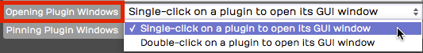

*Setting to Open Plugins with a Single-click*

## Cmajor Patches

Waveform can host *Cmajor* patches — audio effects and instruments written in
the Cmajor language and distributed as `.cmajorpatch` bundles. Patches are
compiled on the fly when they load, so they run as native plugins inside your
Edit and insert exactly like any other plugin.

To use them, first tell Waveform where to find your patches: open *Settings >
File Locations* and add a folder under *Directories to search for Cmajor
patches*. Scan for plugins, and the patches will then appear in the plugin
selector under the *Cmajor* format. If a patch contains an error, the message
is shown on the plugin slot so you can fix it. A built-in *Pro54* example synth
is installed automatically the first time you run Waveform.

> 📝 **Note:** Cmajor support is available on Apple Silicon macOS and Windows. It
is not available on Linux or on Intel-only Macs. There is no edition restriction.

## Searching for Plugins

The Waveform Browser includes a Search tab. This allows you to search
for plugins. When you find one you want to use, drag it to your Edit.
Here are the steps:

1.  Open the Browser and click the Search tab
2.  Type in a few characters of the name of the plugin
3.  From the search results, drag the plugin from the Browser to the
    Mixer.

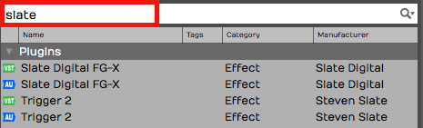

*Searching for Plugins Using the Browser, Search tab*

The search uses an index that includes plugin names, tags, and
manufacturer. We covered how to set tags in the previous chapter.

> 💡 **Tip:** It often helps to disable the options for *Loops* and *Presets*
when searching for a specific plugin. This gives you more targeted
results.

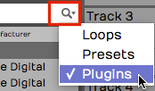

*Limiting Search Filters to Plugins*

## Using Master Plugins

To apply processing to the full stereo mix, add plugins to the master
track or the mixer's master channel. The drop target says *Drop Master
Plugins Here.*

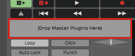

*Master plugins area*

Typically, you may put a bus compressor, a limiter, and maybe an EQ on
the master. Another great option is Waveform's own Final Mix plugin,
which combines all of those functions in to one package expressly
designed for use on a full mix.

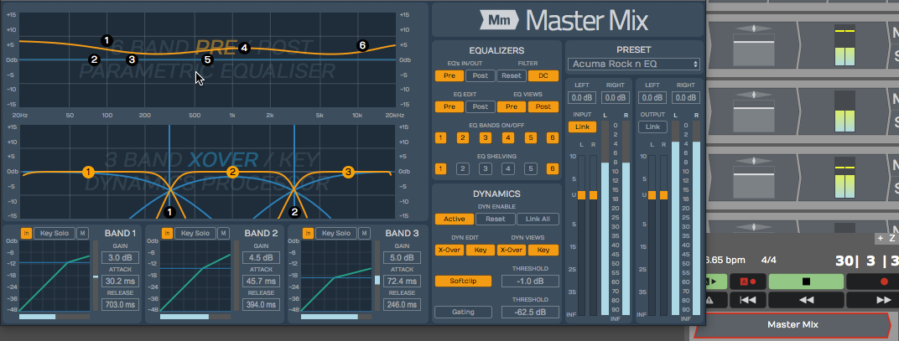

*Master Mix inserted on the master*

> 💡 **Tip:** You can right click the *Drop Master Plugins Here* area then
choose *Add new plugin* to open the plugin selector menu. You may find
this a bit faster than dragging the plugin object down there!

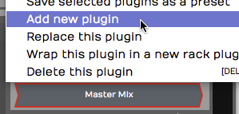

*Right-click to *Add new plugin**

## Plugin Sidechains

Plugins that support a sidechain input have a sidechain assignment list
at the upper left in the plugin header. Simply pick which track you want
to route to the sidechain.

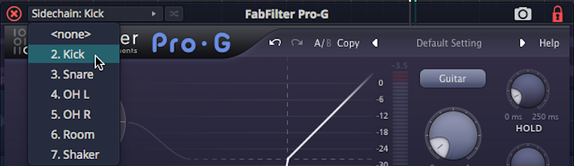

*Selecting a Sidechain Input*

In the above example, we have routed the kick track to the sidechain
input of a gate on the bass track. It's a common trick to lock the bass
to the kick.

**Video Clip:** Here is a [video tutorial](https://youtu.be/PEan2nhPCOA)
demonstrating how to use the plugin sidechain feature.

