# Visual Plugin Selector

Waveform's Plugin object has useful option when working with plugins:
Right-click it to open the Visual Plugin selector. This chapter walks
through a full explanation on how to use the Visual Plugin selector.

## Using the Visual Plugin Selector

To open the window into the Visual Plugin selector, right-click on the
Plugin object. You will see all your plugins represented by thumbnail
images along with the name.

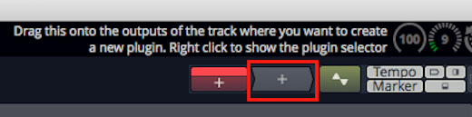

*Right-click to Open the Visual Plugin Selector*

> 📝 **Note:** If all you see are a lot of question marks, then read on; we
will explain how to scan your plugins to capture thumbnails in a bit.

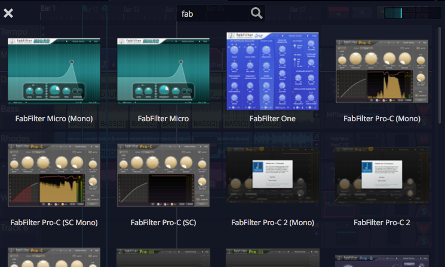

*Visual Plugin Selector*

From here you can scroll through all your plugins. When you find one you
want to use, drag it and the window will close but continue dragging.
Now drop it on a track in the normal way.

The Visual Plugin selector window offers just few controls to make
finding the right plugin more simple.

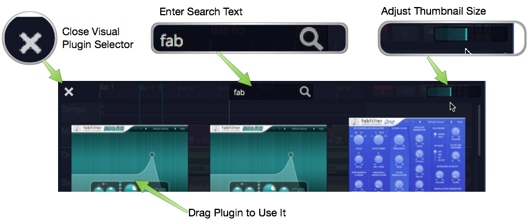

*Visual Plugin Selector Controls*

1.  After opening the Visual Plugin selector, start typing in search
    characters to filter the list.
2.  Adjust the size of the thumbnail images using the slider at the
    right.
3.  If you decide not to pick a plugin, click the *X* at the upper left
    or press *ESC* to close the window.
4.  As you drag a plugin, the window will close and you'll be dragging a
    transparent image of the plugin which you can drop wherever you want
    to use it.

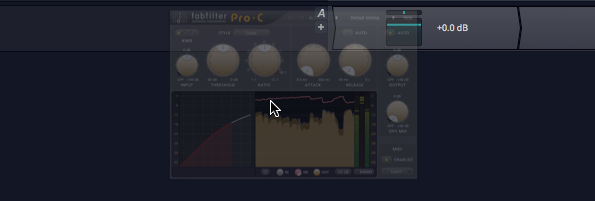

*Dragging a Plugin*

## Determining Plugin Technology

As you over the mouse pointer over a thumbnail, an icon will appear in
the upper left corner. This indicates which interface technology is used
by that plugin: AU, VST, or VST3. This helps you pick from plugin
thumbnails that otherwise look the same.

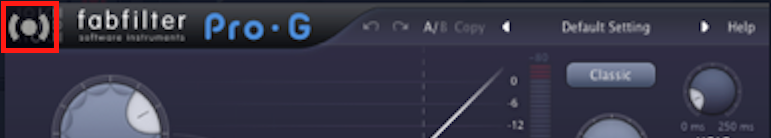

*Audio Units Icon*

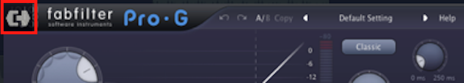

*VST Icon*

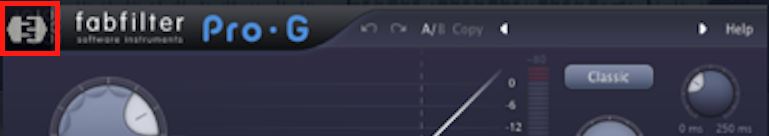

*VST3 Icon*

These are the same icons are used in the Browser Search tab to
differentiate the plugin technology.

## Customizing the Thumbnail Image

Open any plugin in Waveform and notice the new camera icon in the upper
right corner. Click that camera to take a snapshot of the plugin window
and update the thumbnail image. If you want more interesting thumbnails,
use this to capture the plugin in action with the meters moving or with
an interesting EQ curve.

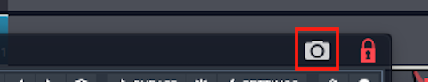

*Customize a Plugin Thumbnail*

## Scanning to Capture Thumbnails

When you first start using Waveform, the Visual Plugin selector
thumbnails appear as blank question marks. When you open a plugin for
the first time, Waveform grabs the thumbnail image. Over time, the
thumbnails will begin to fill in.

If you are you want all of them populated with images right away, you
can! Locate the *Scan for plugin thumbnails* options on the *Settings
tab, Plugins page*.

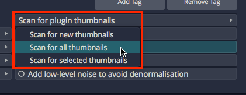

*Capture Thumbnails Options*

There are three options: You can *scan all plugins*, *scan for new
plugins* (those without thumbnails), or *scan from a selection* in the
list of installed plugins. When you first start with a new Waveform
installation you probably want to use *Scan for all plugins*.

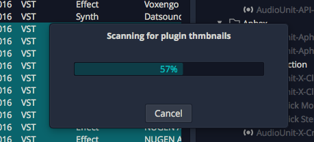

*Thumbnail Scan Progress*

## Opening Visual Plugin Selector with a Shortcut

There is a new macro action to open the Visual Plugin selector. To use
it create a new macro then right-click on the script editor on the
Settings tab, Keyboard Shortcuts page. Navigate to *Advanced Actions >
Plugins > Show or hide the plugin selector page*.

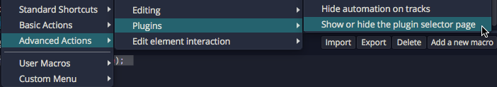

*Action to Open the Selector*

That adds the necessary code to the macro.

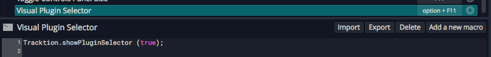

*The Completed Macro*

Assign a keyboard combination that makes sense. In this example, we have
used Option + F11 / Alt + F11.

