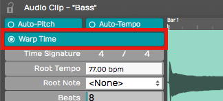
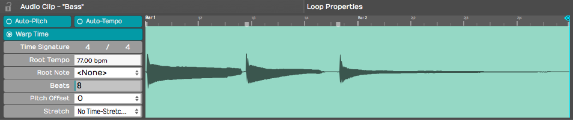
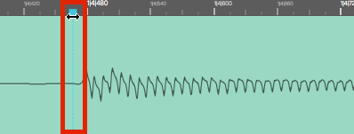
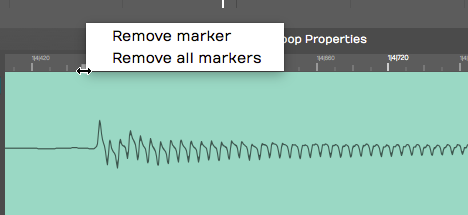
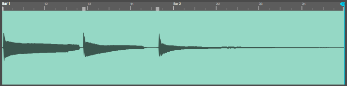
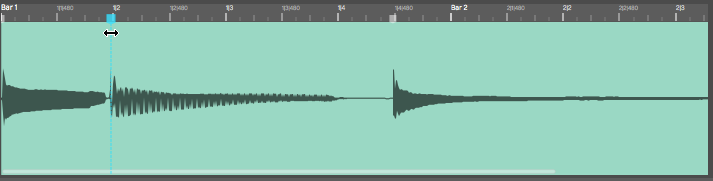
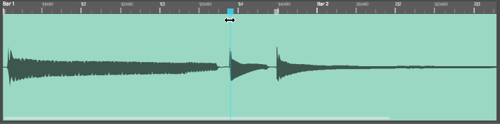
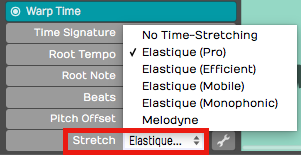
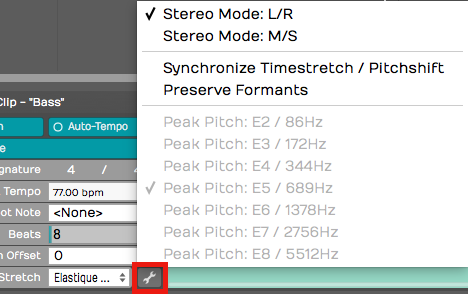

# Warp Time

Warp Time is an audio editing option that was introduced in T6. Rather
than needing to split out notes to move them, as discussed in the
previous chapter, you can drag Warp points to bend and stretch audio
into time. Apart from simply correcting timing problems, you an apply it
creatively to compositions and loops to alter the feel of recorded
audio.

The implementation is actually very simple. You can get up and running
with Warp Time very quickly.

> 💡 **Tip:** Since T7, Warp time is also available as one of the Clip Layer
Layer effects, as described in [Clip Layer Effects](clip-layer-effects.md)

## Warp Time Mode

Here is how to switch into the Warp Time mode:

1.  Select an audio clip
2.  In the Actions panel (or the [Detail editor](detail-editor.md), Clip
    tab), enable the *Warp Time* option

*Enable Warp Time Mode*

The Detail editor's waveform view switches to the zoomable Warp Time
editor.

## The Warp Time Editor

*Warp Time Editor in the Detail editor*

The Warp Time Editor is working on the underlying audio in the clip so
there might be much more audio shown than you see on the Audio clip.
This will usually be the case if you have trimmed the Audio clip before
hand.

> 💡 **Tip:** If you want the Warp Time editor view to exactly match the
waveform on the selected Audio clip, render the clip using *Render Clip
> Flatten the selected clip*. This will create a new underlying file.
After that, what you see and hear in the Warp Time editor will match
what you see and hear in the Audio clip.

Zooming In & Out
- To zoom the waveform, use the mouse scroll wheel. On many laptops
    you can use a two finger up/down gesture in place of a scroll wheel.
    On Mac laptops you can also use a two finger left or right gesture
    to slide the waveform left and right.

Warp Points
- Click on the timeline to add a Warp point. When you drag a Warp
    point left or right, time is stretched or compressed between that
    point and next surrounding Warp points.

> 💡 **Tip:** You can add a Warp point and drag in a single action. Just
click on the timeline, hold and start dragging. The waveform will
stretch until you stop dragging.

*Warp Point*

**Removing Warp Points:**
Shift-click any existing Warp Point to remove it. Right-click any existing Warp point for options to rename it or remove all Warp points.

*Warp Point Right Click Menu*

## Working with Warp Points

By default, the Warp Time editor will always have starting and ending
Warp points. If you add a Warp point and move it, the audio will be
stretched between the beginning and ending of the wave.

*Before Warping*

*Dragging a Warp Point to the Left*

*Dragging a Warp Point to the Right*

To correct audio timing over a constrained area, you can think about a
three point technique. You typically want to add Warp points just before
the beginning of notes or percussive hits. That would be just before a
transient. If you do that then stretching occurs over the note not in
the middle of it.

With the three point technique, you insert Warp points before and after
the note you want to alter to lock down the timing. Then add a Warp
point right at the transient you want to change and drag it into to
time.

## Warp Points and Snapping

As you drag Warp points, you will notice they snap to the grid. The snap
grid for Warp points is based on the zoom level of the Warp Time editor,
not the zoom level of the Edit.

To override snapping when adjusting Warp points, hold down Cmd / Ctrl as
you drag the points.

## Limitations of Warp Time editing

Warp Time editing works best for single track parts. If you use it on
multitrack drum parts, you will find it seriously affects the phase
alignment of multi-miked drum kits. This is the same for other
instruments that are recorded with multiple mics.

You can use Warp Time on stereo tracks. If you have two mono tracks,
first render them to a stereo track before using Warp Time.

## Time Stretch Algorithm

By default Warp Time uses Elastique Pro but you can switch it use any of
the other modes as well. There is little benefit in selecting other
modes, since Waveform does the actual stretching offline.

*Stretch Property Options*

Most of the time, Elastique Pro will give you the best results. If you
have specialized needs, you can experiment with the other Elastique
options under the spanner icon.

*Elastique Options*

> 📝 **Note:** If the *Stretch* property is set to "Melodyne" or "No
Time-Stretching," Waveform still uses the Elastique Pro algorithm for
Warp Time.

## Moving On

Here is a video demo of Warp Time that you might find interesting:

[Warp Time Video Demo](https://w-edstrom.wistia.com/medias/8klw4ees4u)

Warp Time, the standard editing tools, and Melodyne give you amazing
potential to manipulate the timing of your Audio clips.

