© 2020 - 2021 Bill Edstrom

© 2024 Tracktion Corporation

- [About This Book](#about-this-book)
  - [Tracktion Waveform User Guide - A Work In Process](#tracktion-waveform-user-guide---a-work-in-process)
  - [Suggestion: Don't Print](#suggestion-dont-print)
- [Introduction](#introduction)
  - [What's in the Book?](#whats-in-the-book)
  - [Video Resources](#video-resources)
  - [Setting Tracktion Keyboard Shortcuts](#setting-tracktion-keyboard-shortcuts)
  - [Modifier Keys Conventions](#modifier-keys-conventions)
  - [Moving On](#moving-on)
- [Installing the Demo Projects](#installing-the-demo-projects)
  - [Establish a Waveform Projects Folder](#establish-a-waveform-projects-folder)
  - [Project Tab: Get Demo Songs](#project-tab-get-demo-songs)
  - [Moving On](#moving-on-1)
- [Audio Device Setup](#audio-device-setup)
  - [Audio Device Setup in Windows](#audio-device-setup-in-windows)
  - [Audio Device Setup on macOS](#audio-device-setup-on-macos)
  - [Audio Device Setup on Linux](#audio-device-setup-on-linux)
  - [Choosing the Audio Interface](#choosing-the-audio-interface)
  - [Setting the Sample Rate](#setting-the-sample-rate)
  - [Testing for Audio Playback](#testing-for-audio-playback)
  - [About Latency](#about-latency)
  - [Managing Latency](#managing-latency)
  - [Calibrating Input Latency Compensation](#calibrating-input-latency-compensation)
  - [Resetting to the Defaults](#resetting-to-the-defaults)
  - [Advanced Audio Device Settings](#advanced-audio-device-settings)
  - [Moving On](#moving-on-2)
- [Basic Navigation](#basic-navigation)
  - [Tabs and Menus](#tabs-and-menus)
  - [Controls Panel / Toolbar](#controls-panel--toolbar)
  - [Pop-up Help](#pop-up-help)
  - [Roll-over Help](#roll-over-help)
  - [Creating a Project](#creating-a-project)
  - [Opening the Edit](#opening-the-edit)
  - [The Edit Tab](#the-edit-tab)
  - [Basic Navigation](#basic-navigation-1)
  - [Zooming In and Out](#zooming-in-and-out)
  - [Positioning the Cursor](#positioning-the-cursor)
  - [Changing the Tempo](#changing-the-tempo)
  - [Changing Tempo at a Specific Bar](#changing-tempo-at-a-specific-bar)
  - [Offsetting and Scaling the Tempo Curve](#offsetting-and-scaling-the-tempo-curve)
  - [Moving On](#moving-on-3)
- [Getting Help](#getting-help)
  - [Pop-up Help](#pop-up-help-1)
  - [Roll-over Help](#roll-over-help-1)
  - [Quick Start Guide](#quick-start-guide)
  - [Keyboard Shortcut List](#keyboard-shortcut-list)
  - [Tracktion Videos](#tracktion-videos)
  - [Tracktion Forums](#tracktion-forums)
  - [Tracktion Support](#tracktion-support)
  - [Moving On](#moving-on-4)
- [The Edit Tab](#the-edit-tab-1)
  - [The Parts of a Waveform Edit](#the-parts-of-a-waveform-edit)
  - [The Browser](#the-browser)
  - [The Arrangement](#the-arrangement)
  - [Timeline](#timeline)
  - [The Track Section](#the-track-section)
  - [Clips](#clips)
  - [The Mixer](#the-mixer)
  - [The Controls Panel](#the-controls-panel)
  - [The Menu Section](#the-menu-section)
  - [Properties Section](#properties-section)
  - [Master Section](#master-section)
  - [Master Section Buttons](#master-section-buttons)
  - [Moving On](#moving-on-5)
- [The Browser](#the-browser-1)
  - [Browser Files Tab](#browser-files-tab)
  - [Browser Presets Tab](#browser-presets-tab)
  - [Saving Presets](#saving-presets)
  - [Using Presets](#using-presets)
  - [Applying Presets](#applying-presets)
  - [Tracks Tab](#tracks-tab)
  - [Search Tab](#search-tab)
  - [Notifications Tab](#notifications-tab)
  - [Markers Tab](#markers-tab)
  - [Clipboard Tab](#clipboard-tab)
  - [Moving On](#moving-on-6)
- [Using Markers](#using-markers)
  - [In-marker \& Out-marker](#in-marker--out-marker)
  - [Navigate Using the In-marker \& Out-marker](#navigate-using-the-in-marker--out-marker)
  - [Zooming to the In-marker/Out-marker](#zooming-to-the-in-markerout-marker)
  - [Looping Playback Over the Marked Region](#looping-playback-over-the-marked-region)
  - [Auto Punch and the Marked Region](#auto-punch-and-the-marked-region)
  - [The Marker Track](#the-marker-track)
  - [Adding Markers](#adding-markers)
  - [Marker Clip Properties](#marker-clip-properties)
  - [Navigating by Markers](#navigating-by-markers)
  - [The Browser Markers Tab](#the-browser-markers-tab)
  - [Renumbering Markers](#renumbering-markers)
  - [Adjust Markers (Wave File Markers)](#adjust-markers-wave-file-markers)
  - [Moving On](#moving-on-7)
- [Selecting and Snapping](#selecting-and-snapping)
  - [Selecting a Clip](#selecting-a-clip)
  - [Auditioning a Clip](#auditioning-a-clip)
  - [Selecting Multiple Clips](#selecting-multiple-clips)
  - [Shift Selecting Clips](#shift-selecting-clips)
  - [Deselecting Clips](#deselecting-clips)
  - [Using Snap-to-Grid](#using-snap-to-grid)
  - [Enable/Disable Snap-to-Grid](#enabledisable-snap-to-grid)
  - [About Snap Resolution](#about-snap-resolution)
  - [Snapping Clips to the Grid](#snapping-clips-to-the-grid)
  - [Snapping the Cursor to the Grid](#snapping-the-cursor-to-the-grid)
  - [Snapping Clips to Other Clips](#snapping-clips-to-other-clips)
  - [Overriding Snap-to-Grid](#overriding-snap-to-grid)
  - [Nudging Clips](#nudging-clips)
  - [Nudging Notes](#nudging-notes)
  - [Moving On](#moving-on-8)
- [Audio Clips and Editing Audio](#audio-clips-and-editing-audio)
  - [Parts of an Audio Clip](#parts-of-an-audio-clip)
  - [Moving Clips](#moving-clips)
  - [Deleting Clips](#deleting-clips)
  - [Audio Clip Handles](#audio-clip-handles)
  - [Splitting a Clip](#splitting-a-clip)
  - [Duplicating Clips](#duplicating-clips)
  - [Fade-in/Fade-out](#fade-infade-out)
  - [Pitch Fade](#pitch-fade)
  - [Crossfades](#crossfades)
  - [Drag Crossfade](#drag-crossfade)
  - [Edge Fades](#edge-fades)
  - [Copy and Paste](#copy-and-paste)
  - [Clip Gain, Mute, \& Pan](#clip-gain-mute--pan)
  - [Reversing Audio Clips](#reversing-audio-clips)
  - [Merging Clips to One Clip](#merging-clips-to-one-clip)
  - [Deleting a Section of Audio Removing Space](#deleting-a-section-of-audio-removing-space)
  - [Edit with Melodyne](#edit-with-melodyne)
  - [Moving On](#moving-on-9)
- [Working With Loops](#working-with-loops)
  - [Getting Loops Into Waveform](#getting-loops-into-waveform)
  - [Setting the Edit Tempo](#setting-the-edit-tempo)
  - [Dragging Loops to a Track](#dragging-loops-to-a-track)
  - [Dragging in Multiple Clips from the Browser](#dragging-in-multiple-clips-from-the-browser)
  - [Looping the Loop](#looping-the-loop)
  - [Duplicating Clips](#duplicating-clips-1)
  - [Loop Properties](#loop-properties)
  - [Moving On](#moving-on-10)
- [Keyboard Shortcuts](#keyboard-shortcuts)
  - [Keyboard Shortcuts Page](#keyboard-shortcuts-page)
  - [Setting a Keyboard Shortcut](#setting-a-keyboard-shortcut)
  - [Changing a Keyboard Shortcut](#changing-a-keyboard-shortcut)
  - [Saving Keyboard Shortcuts to a File](#saving-keyboard-shortcuts-to-a-file)
  - [Loading Keyboard Shortcuts from a File](#loading-keyboard-shortcuts-from-a-file)
  - [Printing a List of Keyboard Shortcuts](#printing-a-list-of-keyboard-shortcuts)
  - [Moving On](#moving-on-11)
- [Recording Audio](#recording-audio)
  - [Configure the Input](#configure-the-input)
  - [The Input Object](#the-input-object)
  - [Customizing Input Names Globally](#customizing-input-names-globally)
  - [Customizing Input Names for an Edit](#customizing-input-names-for-an-edit)
  - [About MIDI Inputs](#about-midi-inputs)
  - [Setting Up Inputs for Multi-track Recording](#setting-up-inputs-for-multi-track-recording)
  - [Number of Inputs](#number-of-inputs)
  - [Enable a Track for Recording](#enable-a-track-for-recording)
  - [Hit Record](#hit-record)
  - [Enable Recording for All Inputs at Once](#enable-recording-for-all-inputs-at-once)
  - [Input Meters](#input-meters)
  - [Dragging the Input Object Track to Track](#dragging-the-input-object-track-to-track)
  - [Renaming a Track](#renaming-a-track)
  - [Recording Steps in Review](#recording-steps-in-review)
  - [Working with the Click](#working-with-the-click)
  - [Enabling the Click Track](#enabling-the-click-track)
  - [Listening on Headphones While Recording](#listening-on-headphones-while-recording)
  - [Live Input Monitoring](#live-input-monitoring)
  - [If at First You Don't Succeed](#if-at-first-you-dont-succeed)
  - [Abort Record and Delete the Take](#abort-record-and-delete-the-take)
  - [Recording a Stereo Signal](#recording-a-stereo-signal)
  - [Retrospective Record](#retrospective-record)
  - [Safe-Record Mode](#safe-record-mode)
  - [Moving On](#moving-on-12)
- [Recording Overdubs](#recording-overdubs)
  - [Set up the Drum Loop](#set-up-the-drum-loop)
  - [Get Ready to Record](#get-ready-to-record)
  - [Record the Rhythm Guitar Part](#record-the-rhythm-guitar-part)
  - [Doubling the Rhythm Guitar](#doubling-the-rhythm-guitar)
  - [Overdub a Bassline](#overdub-a-bassline)
  - [Rename Tracks](#rename-tracks)
  - [Adding Additional Tracks](#adding-additional-tracks)
  - [Rearranging Tracks](#rearranging-tracks)
  - [Adjust the Mix](#adjust-the-mix)
  - [Moving on](#moving-on-13)
- [Clean-up Editing](#clean-up-editing)
  - [Trimming](#trimming)
  - [Correcting Small Timing Problems](#correcting-small-timing-problems)
  - [Correcting Timing by Slip Editing](#correcting-timing-by-slip-editing)
  - [Fade-outs](#fade-outs)
  - [Stretch an Ending Note](#stretch-an-ending-note)
  - [Fixing Clicks at the Edit Points](#fixing-clicks-at-the-edit-points)
  - [Rendering to a Single Audio Clip](#rendering-to-a-single-audio-clip)
  - [Moving On](#moving-on-14)
- [Warp Time](#warp-time)
  - [Warp Time Mode](#warp-time-mode)
  - [The Warp Time Editor](#the-warp-time-editor)
  - [Working with Warp Points](#working-with-warp-points)
  - [Warp Points and Snapping](#warp-points-and-snapping)
  - [Limitations of Warp Time editing](#limitations-of-warp-time-editing)
  - [Time Stretch Algorithm](#time-stretch-algorithm)
  - [Moving On](#moving-on-15)
- [Loop Recording](#loop-recording)
  - [Getting into Loop Recording Mode](#getting-into-loop-recording-mode)
  - [Loop Recording Step-by-Step](#loop-recording-step-by-step)
  - [Selecting the Best Take](#selecting-the-best-take)
  - [Unpacking Takes to Tracks](#unpacking-takes-to-tracks)
  - [Moving on](#moving-on-16)
- [Comping](#comping)
  - [Copy Your Edit](#copy-your-edit)
  - [Comping Takes](#comping-takes)
  - [Flatten Comp](#flatten-comp)
  - [Setting up a Comp Group](#setting-up-a-comp-group)
  - [Comping Tracks Using a Comp Group](#comping-tracks-using-a-comp-group)
  - [Comp Group Editor](#comp-group-editor)
  - [Moving On](#moving-on-17)
- [Using an Amp Simulator Plugin](#using-an-amp-simulator-plugin)
  - [Setting Up the Track](#setting-up-the-track)
  - [Recording with the Amp Sim](#recording-with-the-amp-sim)
  - [Guitar \& Impedance](#guitar--impedance)
  - [Managing Latency](#managing-latency-1)
  - [Speed of Sound Through Air](#speed-of-sound-through-air)
  - [Dialing in the Guitar Tone](#dialing-in-the-guitar-tone)
  - [Using a Tuner Plugin](#using-a-tuner-plugin)
  - [Moving On](#moving-on-18)
- [MIDI Setup](#midi-setup)
  - [MIDI Drivers](#midi-drivers)
  - [Set Up the MIDI Inputs](#set-up-the-midi-inputs)
  - [Naming MIDI Inputs/Outputs](#naming-midi-inputsoutputs)
  - [Disabling Unused MIDI Inputs](#disabling-unused-midi-inputs)
  - [Configuring the Track](#configuring-the-track)
  - [Insert a Synth Plugin](#insert-a-synth-plugin)
  - [Using a Virtual Keyboard](#using-a-virtual-keyboard)
  - [Moving On](#moving-on-19)
- [MIDI Recording](#midi-recording)
  - [Setting up a Track](#setting-up-a-track)
  - [Recording a MIDI Performance](#recording-a-midi-performance)
  - [Playing Back a MIDI Performance](#playing-back-a-midi-performance)
  - [Piano Roll View](#piano-roll-view)
  - [MIDI Record Modes - The *Action* Property](#midi-record-modes---the-action-property)
  - [Merge Mode](#merge-mode)
  - [Replace Mode](#replace-mode)
  - [Overlay Mode](#overlay-mode)
  - [MIDI Input Quantize](#midi-input-quantize)
  - [Moving On](#moving-on-20)
- [MIDI Loop Recording](#midi-loop-recording)
  - [Loop Recording in Merge Mode](#loop-recording-in-merge-mode)
  - [Recording to Prepare for MIDI Comping](#recording-to-prepare-for-midi-comping)
  - [Comping MIDI Takes](#comping-midi-takes)
  - [Flattening the Composite to a Single Clip](#flattening-the-composite-to-a-single-clip)
  - [Moving On](#moving-on-21)
- [MIDI Editing](#midi-editing)
  - [Trimming MIDI Clips](#trimming-midi-clips)
  - [Moving MIDI Clips](#moving-midi-clips)
  - [Moving a MIDI Clip Track-to-Track](#moving-a-midi-clip-track-to-track)
  - [Slip Editing MIDI Clips](#slip-editing-midi-clips)
  - [Reframing a MIDI Clip](#reframing-a-midi-clip)
  - [Splitting a MIDI Clip](#splitting-a-midi-clip)
  - [The MIDI Note Editor](#the-midi-note-editor)
  - [Setting the Number of Octaves \& Note Height](#setting-the-number-of-octaves--note-height)
  - [Mouse Wheel Options for MIDI Editing](#mouse-wheel-options-for-midi-editing)
  - [Basic MIDI Editing - Pitch](#basic-midi-editing---pitch)
  - [Per Note Automation](#per-note-automation)
  - [Nudging Notes](#nudging-notes-1)
  - [Note Length](#note-length)
  - [Snapping During Note Editing](#snapping-during-note-editing)
  - [Copying and Duplicating Notes](#copying-and-duplicating-notes)
  - [Adjusting Pitch and Velocity in Properties](#adjusting-pitch-and-velocity-in-properties)
  - [Note Start, Length, \& End](#note-start-length--end)
  - [The Pencil Tool](#the-pencil-tool)
  - [The Eraser Tool](#the-eraser-tool)
  - [The Line Tool](#the-line-tool)
  - [Note Colors](#note-colors)
  - [Selecting Multiple Notes](#selecting-multiple-notes)
  - [Editing the Note Velocity](#editing-the-note-velocity)
  - [Step Entry Mode](#step-entry-mode)
  - [Hearing Notes While Editing](#hearing-notes-while-editing)
  - [The Velocity Editor](#the-velocity-editor)
  - [Editing other Controller Data](#editing-other-controller-data)
  - [Moving On](#moving-on-22)
- [Quantizing MIDI Notes](#quantizing-midi-notes)
  - [How to Quantize](#how-to-quantize)
  - [Quantizing Note Lengths](#quantizing-note-lengths)
  - [Quantizing with Groove](#quantizing-with-groove)
  - [Defining Groove Templates](#defining-groove-templates)
  - [Complex Groove Templates](#complex-groove-templates)
  - [Managing Groove Templates](#managing-groove-templates)
  - [Moving On](#moving-on-23)
- [Step Clips](#step-clips)
  - [Step Clips Overview](#step-clips-overview)
  - [Inserting a Step Clip Into the Edit](#inserting-a-step-clip-into-the-edit)
  - [Programming a Drum Beat with a Step Clip](#programming-a-drum-beat-with-a-step-clip)
  - [Step Clip Actions \& Properties](#step-clip-actions--properties)
  - [The Step Clip Footer](#the-step-clip-footer)
  - [Variation Options](#variation-options)
  - [Step Clip Variation Actions](#step-clip-variation-actions)
  - [Step Clip Pattern Section Actions](#step-clip-pattern-section-actions)
  - [Step Clip Row Properties](#step-clip-row-properties)
  - [Step Clip Row Actions](#step-clip-row-actions)
  - [Deleting a Row](#deleting-a-row)
  - [Velocity Gate Editor](#velocity-gate-editor)
  - [Looping Step Clips](#looping-step-clips)
  - [Render a Step Clip to MIDI](#render-a-step-clip-to-midi)
  - [Step Clip Presets](#step-clip-presets)
  - [Moving On](#moving-on-24)
- [Using Plugins](#using-plugins)
  - [The In-line Mixer](#the-in-line-mixer)
  - [Adjusting the Size of the In-line Mixer Section](#adjusting-the-size-of-the-in-line-mixer-section)
  - [Working with Plugins](#working-with-plugins)
  - [Assigning a Quick Control Parameter](#assigning-a-quick-control-parameter)
  - [Third-Party Plugins](#third-party-plugins)
  - [Searching for Plugins](#searching-for-plugins)
  - [Using Master Plugins](#using-master-plugins)
- [Built-in Effects Plugins](#built-in-effects-plugins)
  - [Waveform Effects](#waveform-effects)
  - [Volume \& Pan Plugin](#volume--pan-plugin)
  - [Level Meter](#level-meter)
  - [The 4-Band Equalizer](#the-4-band-equalizer)
  - [Reverb](#reverb)
  - [Delay](#delay)
  - [Chorus](#chorus)
  - [The Phaser](#the-phaser)
  - [The Compressor/Limiter](#the-compressorlimiter)
  - [Pitch Shifter](#pitch-shifter)
  - [The Low/High-Pass Filter](#the-lowhigh-pass-filter)
  - [Text Plugin](#text-plugin)
  - [Saving Presets](#saving-presets-1)
  - [Moving On](#moving-on-25)
- [Effects Bus Tracks](#effects-bus-tracks)
  - [Create the Bus Track](#create-the-bus-track)
  - [Adding the Effect Plugin](#adding-the-effect-plugin)
  - [Aux Return Plugin](#aux-return-plugin)
  - [Adding Aux Sends to the Channels](#adding-aux-sends-to-the-channels)
  - [Adjusting the Send Level](#adjusting-the-send-level)
  - [Assigning the Aux Bus](#assigning-the-aux-bus)
  - [Solo Isolate](#solo-isolate)
  - [Effects Bus Track Presets](#effects-bus-track-presets)
  - [Moving On](#moving-on-26)
- [Clip Effects](#clip-effects)
  - [Inserting Plugins on Clips](#inserting-plugins-on-clips)
  - [Removing Clip Plugins](#removing-clip-plugins)
  - [Creative Uses](#creative-uses)
  - [Echo Throw Example](#echo-throw-example)
  - [Moving On](#moving-on-27)
- [Folder Tracks](#folder-tracks)
  - [Creating a Folder Track](#creating-a-folder-track)
  - [Working with Folder Tracks](#working-with-folder-tracks)
  - [The Folder Track VCA](#the-folder-track-vca)
  - [Editing With Folder Tracks](#editing-with-folder-tracks)
  - [Automating a Fade within a Folder Track](#automating-a-fade-within-a-folder-track)
  - [Moving On](#moving-on-28)
- [Submix Tracks](#submix-tracks)
  - [Creating a Submix Track](#creating-a-submix-track)
  - [Working with Submix Tracks](#working-with-submix-tracks)
  - [Creating an Old School Submix Track](#creating-an-old-school-submix-track)
- [Automation](#automation)
  - [Activating Automation on a Track](#activating-automation-on-a-track)
  - [Choosing What to Automate](#choosing-what-to-automate)
  - [Adding Points to the Automation Curve](#adding-points-to-the-automation-curve)
  - [Automating Fade-ins and Fade-outs](#automating-fade-ins-and-fade-outs)
  - [Converting a Clip Fade-in or Fade-out to Automation](#converting-a-clip-fade-in-or-fade-out-to-automation)
  - [Reading Automation](#reading-automation)
  - [Automation Curve Properties](#automation-curve-properties)
  - [How to Find Out What Automation is Active for a Track](#how-to-find-out-what-automation-is-active-for-a-track)
  - [Remap on Tempo Change](#remap-on-tempo-change)
  - [Writing Automation on the Fly](#writing-automation-on-the-fly)
  - [Automation Lock](#automation-lock)
  - [Moving On](#moving-on-29)
- [Mixing Down](#mixing-down)
  - [Master Section Processing](#master-section-processing)
  - [Exporting to a WAV File](#exporting-to-a-wav-file)
  - [Locating the Exported File](#locating-the-exported-file)
  - [Exporting to an MP3 File](#exporting-to-an-mp3-file)
  - [Additional Render Properties](#additional-render-properties)
  - [Moving On](#moving-on-30)
- [Macros](#macros)
  - [Script Editor](#script-editor)
  - [Creating a Macro](#creating-a-macro)
  - [Deleting a Macro](#deleting-a-macro)
  - [Programming a Macro](#programming-a-macro)
  - [Running a Macro](#running-a-macro)
  - [Javascript Programming](#javascript-programming)
  - [Hover Tooltip](#hover-tooltip)
  - [RTZ Macro Example](#rtz-macro-example)
  - [Merge Clips Macro Example](#merge-clips-macro-example)
  - [Importing and Exporting Macros](#importing-and-exporting-macros)
  - [TSC Code Samples](#tsc-code-samples)
  - [My Code Samples](#my-code-samples)
  - [Moving On](#moving-on-31)
- [New in Waveform Version 8](#new-in-waveform-version-8)
  - [Tracktion 7 New Features](#tracktion-7-new-features)
  - [New Interface Look](#new-interface-look)
  - [Compact Toolbar](#compact-toolbar)
  - [Working with Properties in Compact Mode](#working-with-properties-in-compact-mode)
  - [Keyboard Shortcut to Toggle the Toolbar](#keyboard-shortcut-to-toggle-the-toolbar)
  - [Browser Position](#browser-position)
  - [Multiple Browser Panes](#multiple-browser-panes)
  - [Synchronized Previews](#synchronized-previews)
  - [Zoom Tool](#zoom-tool)
  - [Project Tab - Three Column View](#project-tab---three-column-view)
  - [Project Tab - Edit Previews](#project-tab---edit-previews)
  - [Project Tab - Get Demo Songs](#project-tab---get-demo-songs)
  - [Drag to Set In-marker \& Out-marker](#drag-to-set-in-marker--out-marker)
  - [Auto Show Panels](#auto-show-panels)
  - [Visual Plugin Selector](#visual-plugin-selector)
  - [Group Clips](#group-clips)
  - [Linked Clips](#linked-clips)
  - [Automation Patterns](#automation-patterns)
  - [Automation Ramps](#automation-ramps)
  - [Plugin Sidechains](#plugin-sidechains)
  - [First Run Setup Progress](#first-run-setup-progress)
  - [Scroll Behaviour](#scroll-behaviour)
  - [Track LFOs](#track-lfos)
  - [Clip Layer Effects](#clip-layer-effects)
  - [Updated Plugin Racks](#updated-plugin-racks)
  - [Moving on](#moving-on-32)
- [Visual Plugin Selector](#visual-plugin-selector-1)
  - [Using the Visual Plugin Selector](#using-the-visual-plugin-selector)
  - [Determining Plugin Technology](#determining-plugin-technology)
  - [Customizing the Thumbnail Image](#customizing-the-thumbnail-image)
  - [Scanning to Capture Thumbnails](#scanning-to-capture-thumbnails)
  - [Opening Visual Plugin Selector with a Shortcut](#opening-visual-plugin-selector-with-a-shortcut)
- [Track LFOs](#track-lfos-1)
  - [Inserting a Track LFO](#inserting-a-track-lfo)
  - [Track LFO Properties](#track-lfo-properties)
  - [Other Properties](#other-properties)
  - [Removing LFO Assignments](#removing-lfo-assignments)
  - [Video Tutorial](#video-tutorial)
  - [Moving On](#moving-on-33)
- [Clip Layer Effects](#clip-layer-effects-1)
  - [Volume - Volume](#volume---volume)
  - [Volume - Fade](#volume---fade)
  - [Volume - Step](#volume---step)
  - [Time/Pitch - Pitch Shift](#timepitch---pitch-shift)
  - [Time/Pitch - Tape Stop/Start (Pitch Fade)](#timepitch---tape-stopstart-pitch-fade)
  - [Time/Pitch - Warp Time](#timepitch---warp-time)
  - [Effects - Plugin Layer](#effects---plugin-layer)
  - [Effects - Reverse Clip Layer](#effects---reverse-clip-layer)
  - [Mastering - Normalise Layer](#mastering---normalise-layer)
  - [Mastering - Mono Layer](#mastering---mono-layer)
  - [Mastering - Phase Invert Layer](#mastering---phase-invert-layer)
  - [Moving On](#moving-on-34)
- [MIDI Effects](#midi-effects)
  - [Waveform Effects](#waveform-effects-1)
  - [Waveform Utilities](#waveform-utilities)
- [Clip Launcher](#clip-launcher)
  - [Playback](#playback)
  - [Playing and stopping clips](#playing-and-stopping-clips)
  - [Scenes](#scenes)
  - [Clip/Slot Properties](#clipslot-properties)
  - [Recording](#recording)
  - [Performance Recording](#performance-recording)
  - [Sequencing (Follow Actions)](#sequencing-follow-actions)
  - [Global Actions](#global-actions)
  - [Track Scope](#track-scope)
  - [Other Scopes](#other-scopes)
  - [Action Probabilities](#action-probabilities)
  - [External Controllers](#external-controllers)
  - [Configuration](#configuration)
  - [Playback and Recording](#playback-and-recording)
  - [Mixer Control](#mixer-control)
- [Reference: Settings \> Appearance](#reference-settings--appearance)
  - [Controls and Parameters by Section](#controls-and-parameters-by-section)
  - [Language](#language)
  - [Look and Feel](#look-and-feel)
  - [Browser](#browser)
  - [Clips](#clips-1)
  - [Tracks](#tracks)
  - [MIDI Note Colour](#midi-note-colour)
- [Reference: Settings \> General](#reference-settings--general)
  - [Controls and Parameters on the Page by Section](#controls-and-parameters-on-the-page-by-section)
  - [Profile](#profile)
  - [Startup](#startup)
  - [Browser](#browser-1)
  - [Editing](#editing)
  - [Features](#features)
  - [Meters](#meters)
  - [MIDI](#midi)
  - [Mixing Defaults](#mixing-defaults)
  - [Mouse](#mouse)
  - [Plugin Windows](#plugin-windows)
  - [Saving](#saving)
  - [Track Inputs](#track-inputs)
- [Reference: Settings \> Plugins](#reference-settings--plugins)
  - [Controls and Parameters](#controls-and-parameters)
  - [Scanning for Plugins](#scanning-for-plugins)
- [Reference: Settings \> Advanced](#reference-settings--advanced)
  - [Controls and Parameters on the Advanced Page by Section:](#controls-and-parameters-on-the-advanced-page-by-section)
  - [Application](#application)
  - [Audio Engine](#audio-engine)
  - [Automation](#automation-1)
  - [Experimental](#experimental)
  - [Low Latency Mode](#low-latency-mode)
  - [MIDI](#midi-1)
  - [Performance](#performance)
  - [Plugin Processing](#plugin-processing)
  - [Source Files](#source-files)
- [Appendix A - Video Links](#appendix-a---video-links)
  - [Creating a Tempo Map](#creating-a-tempo-map)
  - [Punch In/Out on the fly](#punch-inout-on-the-fly)
  - [Tracktion Compressor Sidechain](#tracktion-compressor-sidechain)
  - [Track Tags](#track-tags)
  - [Automation Improvements](#automation-improvements)
  - [Insert Plugin](#insert-plugin)
  - [Creating a Submix](#creating-a-submix)
  - [Basic Audio Editing](#basic-audio-editing)
  - [Warp Time](#warp-time-1)
  - [Pitch Fade](#pitch-fade-1)
  - [Comp Groups](#comp-groups)
  - [Merge Selected Clips](#merge-selected-clips)
  - [Step Clips Overview](#step-clips-overview-1)
  - [Step Clips Velocity/Gate](#step-clips-velocitygate)
  - [Step Clips Randomize Each Step](#step-clips-randomize-each-step)
  - [Step Clips Groove](#step-clips-groove)
  - [Step Clips Route Channels to Different Synths](#step-clips-route-channels-to-different-synths)
  - [Drag to Set the In-marker and Out-marker](#drag-to-set-the-in-marker-and-out-marker)
  - [Track LFOs Demonstration](#track-lfos-demonstration)
  - [Sync Preview with Multiple Browsers](#sync-preview-with-multiple-browsers)
  - [How to Invoke Melodyne](#how-to-invoke-melodyne)
  - [Automation Patterns and Ramps](#automation-patterns-and-ramps)


# About This Book

Release Log:

*28/3/2024*

-   Added clip launcher chapter

*1/2/2021*

-   Updated images first several chapters
-   Added Settings>Appearance reference chapter
-   Added Settings>General reference chapter
-   Added Settings>Plugins reference chapter
-   Added Settings>Advanced references chapter

## Tracktion Waveform User Guide - A Work In Process

The purpose of this user guide is to document and explain the DAW named
Waveform. At the time of this writing Waveform is on version 13.

Waveform is available in Free, EOM, and Pro editions. The core operation
of Waveform is the same for all but I will attempt to highlight the
differences where possible.

**IMPORTANT NOTE!**

This guide is in-progress. Many updates and features have not yet been
included here. These are some of the things that are on the backlog but
not yet explained here. There are free videos on my YouTube channel and
at the Tracktion website that fill in many of the gaps in this book.

-   Traditional Mixer Layout
-   Advanced MIDI Editor Functions
-   Plugin Racks
-   Faceplates
-   Using multiple-output Synth Plugins
-   Control Surface Mapping
-   Waveform Sampler
-   Video integration
-   Melodyne Integration
-   Project Templates
-   Waveform Archive format
-   CPU Usage Meter
-   Virtual Instruments: 4OSC, Subtractive, Collective
-   DAW Essentials Plugins
-   MIDI FX: Note repeat, Arpeggiator, MIDI Filter (Pro)
-   Chord Track (Pro)
-   Enhanced range tools

Some screenshots might be from earlier versions of the software.

## Suggestion: Don't Print

We recommended using the PDF format of this user guide. This allows you
to easily search the document for keywords and topic. If you decide to
print this document out that's great however it will quickly become
out-of-date.


# Introduction

Welcome to the *Waveform User Guide*. The goal of this guide is to help
you learn Waveform. If you are coming to Waveform from another DAW, or
learning computer recording from the ground up, you will find this guide
useful. This should serve as a useful and handy reference. For those who
already use Waveform or its successor *Tracktion* you can learn the many
advancements in the software. While this book was originally written as
a step by step guide, it has been expanded to become a reference manual.

Waveform has the full range of modern DAW features along with numerous
innovative features designed to help with music creation.

Waveform runs on 64-bit versions of macOS and Windows as well as Linux.
All versions are maintained in parallel; as a result the latest revision
is usually identical (or close to it) across all three platforms.

Waveform is also available in Free, OEM and Pro editions. Waveform Free
has all the core functionality while Waveform Pro includes additional
creative tools like the chord track, Groove Doctor, instruments,
effects, pattern generator, Quick Actions panel, and MIDI effects. The
Free edition has no limitation on the number of tracks and supports
third-party plugins just like the Pro edition. The OEM edition is
included with mixers and audio interfaces from various manufactures
including Mackie and Behringer.

Waveform, like its predecessors, is unique in that it has a single
screen user interface, with a mixer channel integrated to the right of
each track. This left-to-right workflow is what fans of this DAW have
loved for years. For many it just makes more sense than other designs.

In recent years, Waveform has gained a traditional mixer view. While it
is optional it gives you a familiar console style view. In addition the
mixer view can be detached and positioned on another monitor screen.
There is no need to flip back and forth between a track view and mixer
view unless you really want.

Waveform has a very flexible plugin architecture, that includes native
plugins, plugin racks, and third party plugins supporting VST, VST3 and
AudioUnits.

## What's in the Book?

In this book you will learn:

-   How to install and set up Waveform
-   How to record audio to tracks
-   How to record MIDI and use virtual instruments
-   How to record with guitar amp simulators
-   How to edit audio
-   How to edit MIDI
-   How to mix with the inline mixer section
-   How to insert and use plugin effects
-   How to mix down to Wave or MP3 files
-   A reference to settings and options used to configure and customize
    Waveform.

## Video Resources

There are numerous tutorial videos for Waveform available from my
YouTube channel and from Tracktion. Videos usually precede the updates
in this document so we recommend that you subscribe to both channels:

My YouTube Channel - [Inventive Creation](http://goo.gl/YnaOMd)

Tracktion YouTube Channel - [Tracktion
Software](https://www.youtube.com/user/TracktionSoftware)

Groove3.com has some older but useful content on Tracktion. Look for
videos there on plugin-racks, MasterMix, and videos on the Tracktion
DAW.

Groove 3 - [Groove3.com](Groove3.com)

## Setting Tracktion Keyboard Shortcuts

This guide uses the default keyboard shortcut layout within Waveform. If
you have changed away from the default setup you would need to change it
back in order to follow along.

To do that follow these steps:

1.  Navigate to the Settings tab, Keyboard Shortcuts page
2.  Click *Reset to Defaults* at the bottom of the page
3.  Select *Restore default Waveform key-mappings*


*Settings Tab: Set the Keyboard Shortcuts to Match this Book*

This set of keyboard shortcuts was carefully designed for efficient
workflow, and keeps the commands consistent between Mac and Windows.

## Modifier Keys Conventions

The book uses the following abbreviations for modifier keys:

-   Command: Cmd
-   Control: Ctrl
-   Option: Opt
-   Alt: Alt

In most cases, Cmd on macOS will translate to Ctrl on Windows. In this
user's manual, we present both using the convention Mac / PC. For
example: Cmd + C / Ctrl + C.

Here is another example:
- Click to select the clip, then copy it using Cmd + C / Ctrl + C.
- Next, position the cursor in the Arrangement where you want to place
    the copy and paste it, using Cmd + V / Ctrl + V.

**Note:** Most Linux users will use the 'Meta' key in place of Alt. On a
typical PC keyboard, Meta is usually the Windows key.

**Note:** In some parts of the world Mac keyboards use Alt rather than
*option*. This shouldn't offer much confusion but I did want to
acknowledge this.

## Moving On

With those things set, your Waveform installation will match the
examples here. Get ready to explore the world of Waveform!


# Installing the Demo Projects

This chapter walks through the process of installing the Waveform demo
songs. The demos are very useful because they give you something to
experiment with, as you learn the basics of the application.

## Establish a Waveform Projects Folder

It's a good idea decide where you want to keep your Waveform projects on
your system.

One method would be to create a Waveform folder, under the Documents
folder on your system. So, decide on a location and create your Waveform
folder using the Finder (macOS) or File Explorer (Windows).

## Project Tab: Get Demo Songs

The Menu at the lower left of the Project tab includes a button - *Get
Demo Songs*. Click that for a quick way to download the demos.


*Get Demo Songs Button*


*Get Demo Songs Dialog Box*


Select the songs to download from the list, choose the destination
folder then click *Download*. We suggest using your newly created
Waveform project folder as the destination. You also have the option to
show only new songs, meaning those you haven't yet downloaded.

Demo song downloading will be handled in the background. You can use the
Progress Meter in the upper right corner to see how the downloads are
progressing.


*Checking the Progress of Demo Downloads*


When the downloads are finished, the demo songs will appear at the
bottom of your Active Projects.

**Tip:** We like to reorganize the demos into a folder to keep them
separate from my own projects.


*Demo Songs in a Folder*


## Moving On

With Waveform installed, and a few demo files ready to play with, it's
time to move on to configuring your audio interface.


# Audio Device Setup

To use Waveform, it is essential to configure it to work with your audio
interface. It doesn't matter wether you want to use the internal audio
unit built into your computer, or an external audio interface connected
to it. Of importance is only to communicate with it in the right way. 
Waveform supports the following communication protocols:

- Windows: ASIO (recommended), and Windows Sound
- macOS:   Core Audio
- Linux:   JACK (recommended), and ALSA or PulsAudio/ALSA


*Audio Device Page*


**Warning:** To configure Waveform for recording, you must use the
Auto-Detect feature along with a hardware loopback. If you don't, then
your overdubbed tracks will not be in alignment with existing tracks.
While this is not difficult, it is essential to do this manual step
anytime you change the Audio Device Setup. The procedure to do this is
covered in this chapter.

This chapter covers the essential steps to get your audio interface
configured as an audio device in Waveform.

## Audio Device Setup in Windows

If you haven't already, navigate to *Settings tab > Audio Devices page.*

Audio Device Type:
 Waveform gives Windows users four choices for audio device type.

-   Windows Audio
-   Windows Audio (Exclusive)
-   DirectSound
-   ASIO


*Windows Audio Device Types*


Any of the above four options might work with your computer, but there
are definite differences, and best choices:

**ASIO**
- This is the best choice if you are using an external audio
    interface. The first step is to install the manufacturer's driver.
    Using ASIO will usually give you the best low latency performance
    for recording and playback. Many modern audio interfaces include a
    mixer app to control low latency mixing within the unit. When using
    ASIO, you simply choose the device and it is set for both inputs and
    outputs.

**Windows Audio**
- Use this if you are running Windows 10 and are using the internal
    sound on your machine. This solution is great for using a laptop
    directly while traveling. This device type uses WASAPI (Windows
    Audio Session API) which offers nicely optimized access from
    applications software to audio I/O. Windows Audio will also function
    with USB Audio Class 1 interfaces.

**Windows Audio (Exclusive Mode)**
- This is the same as Windows Audio, but Waveform will not allow any
    other application to use the audio interface while running. For the
    lowest latency and most critical applications, choose this option
    when using your internal sound.

**DirectSound**
- This is technology is deprecated in Windows 10 and there is no good
    reason to choose this option. Back in the day, this was the best
    choice when using Windows XP with your internal sound.
Tip: Stay away from the DirectSound device type.

**Note:** Windows versions earlier than Win 10 are end of life and officially no more supported. While you might
be able to run Waveform on older Windows 64-bit systems, the Waveform development and support team run their Win tests on versions 10 and 11.
    
**Note:** Starting with release 1703, Windows 10 supports USB Audio
Class 2 devices natively. For simple 2 x 2 interfaces or built-in audio
this is a workable alternative to using ASIO. For the full feature set
for most audio interfaces it is still recommended that you install and use
manufacturer's drivers and use ASIO if possible.

## Audio Device Setup on macOS

1.  Click on the Settings tab, then select the Audio Devices page.
2.  Select an output Device. Assuming you have the necessary drivers
    installed and the device hooked up, it should appear as an option
    for the *Output:* property.


*OS X - Audio Device Output and Input Properties*


**Note:** With macOS, USB audio interfaces that follow USB Audio Class 1
(1998) or USB Audio Class 2 (2009) will function without installing any
additional driver. In the product specs for such devices they are often
listed as "class compliant."

1.  Select an Input device

**Tip:** We strongly suggest that you select the same device for the
output and the input. In this example, we are using a "USB iTwo" which
is a simple 2 in / 2 out interface.

**Note:** On OS X, you can select the input device and output device
separately.


*Audio Device **Test** Button on Mac*

Test Button
- There is a convenient *Test* button next to the audio device
    parameter. Click it to send a short test tone to the audio device's
    output. If you hear the tone, you know your device has been
    configured correctly.

## Audio Device Setup on Linux

Waveform can connect to the Linux audio system by JACK or ALSA.

The usual requirement for low latency signal pathways and the extended
routing options recommend to configure Waveform for JACK usage, though.

**Settings tab > Audio Devices page > Audio Device Type = JACK**

While the configuration of Waveform is obviously quite easy, the
preparation of the Linux system itself and finding an audio device
being compatible with Linux requires some attention.

Concerning the audio interface: It is out of the scope for the Waveform development and support team to promise you anything about the Linux compatibility of your audio device. We do share some experience to give you an idea about the situation, though. Internal audio chips built into the motherboard of the computer, as in Laptops, are mostly supported by Linux. External audio devices connecting via USB, but only if said to be "USB" or "iOS" compliant, are usually also supported, at least in regard to accessing their basic input and output channels. If these USB devices would come with management software, then this is usually not supported in Linux and functionality only available through the management software stays hidden to Linux users. For internal cards, or audio interfaces connecting by other means (Firewire, for instance), generalized statements cannot be made at all. Independent of your audio device being integrated, or connected by USB, or whatever, we highly encourage you to contact your hardware vendor for clarification, or to consult the relevant Linux user communities about their experience with the hardware of interest. One of the possible addresses would be the following internet forum: https://linuxmusicians.com/viewforum.php?f=6


Concerning the Linux setup:
PipeWire is nowadays found to be the by default configured internal audio data (and video data) transportation mechanism in mayor Linux distributions.
Hence, instructions are in the following given with regard to PipeWire. The Ubuntu LTS (24.04) distribution of Linux is taken as for a test run.

Some background information: PipeWire was developed as a low latency capable replacement for the proven, but expandability and integration limited JACK, ALSA, PulseAudio and GStreamer protocols.
It provides the necessary compatibility layers for staying interoperable with applications programmed to connect to those software interfaces. Regarding ALSA it is noteworthy to mention,
that its user space features are intended to be replaced, while the ALSA parts providing the hardware drivers remain untouched.


Out of the box, Ubuntu (or a flavor of it like Kubuntu) comes with the
audio system being based on PipeWire, being provided by the preinstalled packages
*pipewire* and *pipewire-pulse*.
Basically, the following audio signal pathway is then usually in use:

**App** (Multimedia Player) **--> pipewire-pulse --> basic management layer --> pipewire --> ALSA --> audio device**


The user just runs the app of interest. All the rest stays hidden to the
user and is cared for by the Linux operating system.

However, for running **Waveform** in Ubuntu, the compatibility
layers for interfacing the **JACK** or **ALSA** protocols have to be added to
the PipeWire environment, after they are not found to be preinstalled
in Ubuntu. The required packages are:

- *pipewire-jack*
- *pipewire-alsa*
- *wireplumber*

The *pipewire-jack* and *pipewire-alsa* packages are obviously providing the compatibility
layers. WirePlumber replaces the basic, not being sufficient
anymore management layer found initially in service in the basic
PipeWire setup of Ubuntu, providing some under the hood
required more sophisticated management capabilities.

Up to here things are pretty much the same in all Linux derivatives which are somehow building on top of the Debian distribution, like SparkyLinux, Ubuntu, LinuxMint, etc. .
However, the additional to the package installation necessary configuration steps may vary.


The easiest way to get Ubuntu ready for advanced audio works and to connect to Waveform is to simply install the following package:

- *ubuntustudio-pipewire-config*

This package in Ubuntu draws in all above mentioned packages and also puts all necessary configurations into place.
Now restarting the Linux system eliminates having to hassle with any further configuration steps.
In principal, after the reboot, you are ready to go, and the following signal pathways are now usable:

**App** (Multimedia Player) **--> pipewire-pulse --> wireplumber --> pipewire --> ALSA --> audio device**

**App** (Waveform) **--> pipewire-alsa --> wireplumber --> pipewire --> ALSA --> audio device**

**App** (Waveform) **--> pipewire-jack --> wireplumber --> pipewire --> ALSA --> audio device**

They can be used in parallel, and each of them with its particular feature set.
For instance, JACK interfacing applications can have signal routing in-between JACK capable apps, allowing to build up sophisticated audio app networks. As a graphical patch bay for a JACK based audio network, i.e. *qpwgraph* could help with the audio network administration.
Or, to give another example, several applications interfacing to PulseAudio, and several interfacing to JACK, can be in use in parallel, also all of them streaming in parallel to the same audio interface. PipeWire will mix the streams with almost zero latency.
Using the ALSA pathway for Waveform is the same possible as in the past. However, after setting up JACK for PipeWire is nowadays so easy and straight forward, contrary to the configuration hassles in the past, and as JACK allows for a lower latency signal pathway, configuring Waveform to use the JACK pathway is highly recommended.

For convenience, the apps **Ubuntu Studio Audio Configuration** and **Ubuntu Studio Installer** could be installed from package:

- *ubuntustudio-installer*

The app Ubuntu Studio Audio Configuration aids in the configuration of the principal audio system options. It is especially useful for easily changing the so called PipeWire Quantum, which cares to balance latency and system load depending on the parameter set of buffer size and sample rate. The default parameter set is "1024 48000". For changing it system wide and immediately, simply run the tool and enter the wished values.
The app Ubuntu Studio Installer would allow to proceed much more specialized configurations. For instance, it allows by the tip of a finger to install a low latency kernel and to proceed with all related configurations automatically. This app could also install curated bundles of software to the system, not only targeting creatives working with audio (bundle *ubuntustudio-audio*) but also targeting the topics of video and photography. Offerings by the Ubuntu Studio Installer are for many users and modern computers not essential. Of mayor interest is the Ubuntu Studio Audio Configuration tool, though.

## Choosing the Audio Interface

With the audio device type set, you can choose any audio interface
connected to your computer or the internal sound. Select your device if
it's not already shown for the *Device:* property.


*ASIO Device Setup on Windows*


Control Panel
- On some but not all audio interfaces, clicking the *Control Panel*
    button will open the manufacturer's driver control panel to set the
    buffer size. Many audio interfaces don't allow you to set the buffer
    size or the sample rate through host software. If that is the case,
    locate the control panel software on your system, and open it. Set
    the *Sample Rate* and *Audio buffer* size there. In some cases, you
    will need to restart Waveform for the change to take effect.

## Setting the Sample Rate

The default for the sample rate is 44100 Hz, which matches the sample
rate for CDs. We suggest choosing this sample rate or 48000 Hz unless
you have a specific reason to choose a different sample rate.


*Setting the Sample Rate*


## Testing for Audio Playback

It is a good idea to test playback to make sure you get sound as well as
a complete stereo image. Here is one way to do that:


*Loading the SubWays Demo*


1.  Go back to the Projects tab and select one of the demo tunes -
    Subways is a good choice.
2.  Locate the Edit on the right (SubWays T4) and double-click to open
    it.
3.  Click *Play* (spacebar) and you should hear music!

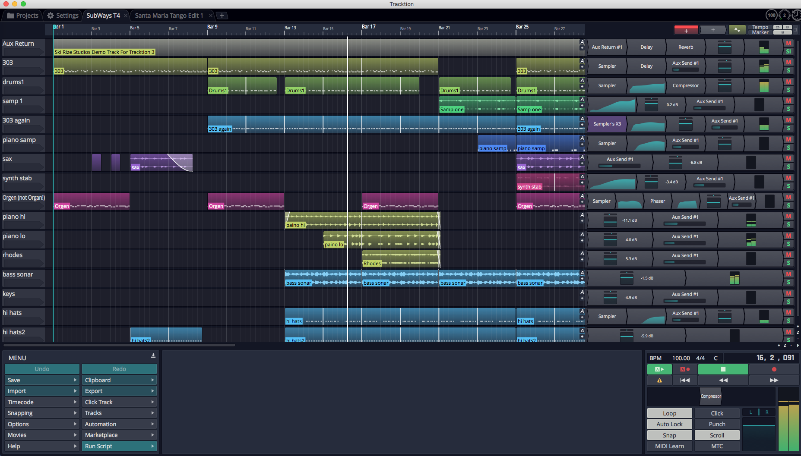

*Successful Play Back*


## About Latency

The process of mixing your tracks together, calculating digital effects,
and triggering instrument samples takes time in any DAW. It is
impossible for digital mixing to happen instantly. The amount of time
your computer needs to compute, process, mix and playback from input to
output is called 'latency.' Latency is the amount of time you allow the
computer think and is normally measured in milliseconds - from just a
few to several hundred milliseconds.

During playback, latency is detected only as a delay between hitting
play and hearing playback. This results in a barely detectible lag in
the transport functions, and doesn't cause much trouble.

Latency during overdubbing is more of an issue. If you are hearing
playback of existing tracks a bit late, then what you are recording is
not going to line up correctly because your timing reference is shifted,
either late or early. Even a few milliseconds will effect feel. At 30 or
60 milliseconds, the timing will be off. This can have an impact on the
feel of the recording or even make the timing seem completely off.

For these reasons, all DAWs include a "latency compensation" feature.
Following recording, the audio tracks are essentially shifted to
compensate for latency in the A/D process, mixing, and plugin DSP
processing.

## Managing Latency

*Audio buffer size* by default is 512 samples (11.6 ms) on macOS, 256
samples (5.8 ms) on Windows, and 1024 on Linux (21.3 ms).
On modern computers, you can usually run with the buffer size set to
256 or even lower.

**Note:** The choice of available buffer size options varies. It depends
on what what audio interface, connection type, and driver technology you
have access to.

Let's consider a latency of 11 ms. In reality, 11 ms is a very short
period of time. In the real world if you are playing a MIDI controller
into a virtual instrument, there will be an 11 ms lag between when you
play a note and when you hear the note. It's the same thing if you're
working with a virtual guitar amp or amp simulator. When you play a note
the guitar you hear the sound 11 ms later. Sound travels through air at
the rate of approximately one foot (0.34 meters) per millisecond. So
this latency is like playing with your guitar amp or keyboard monitor 11
feet (3.4 meters) away. There is a delay but you might get by. At 6 ms
delay, usually the delay is barely noticeable.

With computer recording, we alway aim to strike a balance between
noticeable latency and getting clean playback. Why not just lower it all
the way down? Because, the computer needs time to 'think' and produce
the sounds and process effects. If we get too aggressive with lowering
the buffer, the computer starts to complain in the form of pops, clicks,
dropouts, and the like. So during recording you might keep this lower,
during editing and mixing you can increase it.

**Tip:** Try 256 samples when you get started. While your songs are
simple, this should work fine on most modern systems. If you feel there
is too much delay when playing virtual instruments, try a lower buffer
value. If the audio starts to break up, try higher settings.

**Note:** When using Melodyne Essential for editing audio, you will need
to increase the buffer size to at least 1024 samples, in order to
prevent getting a warning message and to have clean playback.

## Calibrating Input Latency Compensation

If you use Waveform for any overdubbing, **this is possibly the most
important lesson in this book. Waveform requires you to run
Auto-Detect** using a loopback connection on your audio interface.

**Warning:** This test sets up up a deliberate feedback loop. Switch
your speakers off during this test.You will be connecting an output to
an input using a patch cord, so be careful.

Here are the steps:

1.  Turn off your monitor speakers!
2.  Make sure any input monitoring knobs, buttons, or mixers or off or
    turned down.
3.  Connect one output back to one of the inputs. To make it simple,
    connect the left output to input one.
4.  Turn the gain up about half way on the input.
5.  In Waveform go to *Settings > Audio Devices.*
6.  In the Channels list click on one of the Inputs


*Select an Input*


1.  In the Properties section click *Auto-Detect.*

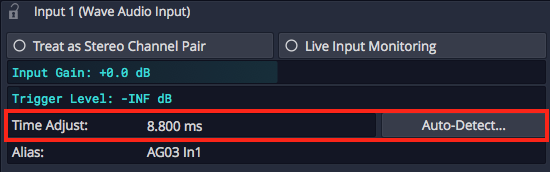

*Auto-Detect & Time Adjust Parameters*


1.  Click *Run Test.* Waveform will send a short test signal from the
    output to the input. It will calculate the delay between output and
    input.


*Recording Synch Test Dialog Box*


1.  Click *Apply* and Waveform will copy the delay value to the Time
    Adjust property.


*Applying the Auto-Detect Result to *Time Adjust**


For recordings to be aligned during overdubs, you must repeat this every
time you make a change to the *Sample rate* or *Audio buffer size.* If
you don't, your recordings will be several milliseconds out of alignment
with existing tracks.

**Note:** Instead of a loopback cable, you could connect a microphone to
the input and point it at one of your speakers to run Auto-Detect. This
will work just fine however make sure that Live Input Monitoring is off
AND that direct input monitoring on your audio interface is also off. If
you leave either on it will cause feedback potentially damaging your
speakers if not your ears!

**Tip:** You can keep a note of the *Time Adjust* values at different
settings an enter it manually for the settings you commonly use.

**Warning:** To configure Waveform for recording, you must use the
Auto-Detect feature along with a hardware loopback. If you don't then
your overdubbed tracks will not be in alignment with existing tracks.
While this is not difficult, it is essential to do this manual step
anytime you change the Audio Device Setup.

## Resetting to the Defaults

If at any point you want to reset these settings to the defaults, click
either of these two options:

Reset Input Devices
- Resets *Input gain*, *Trigger level*, *Time adjust*, and recording
    options.

Reset Output Devices
- Resets *Treat as stereo pair*, *Dithering Enabled*, *Left/Right
    Reversed* and *Alias* parameters.

## Advanced Audio Device Settings

There are additional options for Low Latency Mode and audio performance
on the Advance page of the Settings tab. Refer to [Reference: Settings > Advanced](#reference-settings--advanced).

## Moving On

Audio device setup is straightforward, apart from running the
Auto-Detect loopback test. Follow the guidelines in this chapter and you
will be ready to move on.


# Basic Navigation

This chapter is an overview of how to operate Waveform. You will also
learn how to set up Waveform for an efficient workflow, as well as how
to change the tempo of your song.

## Tabs and Menus

With Waveform open, you can see the Projects tab and the Settings tab.
Click on the tab name or icon to switch to that tab.


*Projects Tab & Settings Tab*


Notice that there are no menus along top, as with other macOS and
Windows programs. Menus are accessed by pressing the menu "hamburger"
icon on the left side of the toolbar.

Menus are located at the left side of the Controls panel if you have it
expanded. The Menus are different depending on if you are on the
Projects tab or an Edit tab.


*Menu Section in the Projects Tab*


*Menu Section in the Edit Tab*

The only useful item you will find in the normal menu location is the
command to close Waveform.

## Controls Panel / Toolbar

When working on a song or recording the Controls panel at the bottom
contains the menu, Properties and the Master section. The controls panel
can optionally be collapsed to a compact toolbar. To switch between the
full Controls panel and the Compact toolbar press F11.


*Opening the Menu Section from the Compact Toolbar*

You can access the menu panel from the compact toolbar by pressing the
"hamburger" icon. The menu will open in a pop-up with all the normal
features.

## Pop-up Help


*Example of a Pop-up Help Message*

Pop-up help is helpful for the first few minutes, but you may not wish
to use it after you are more familiar with the program. If you are using
the alternative Waveform key-mappings, you can see available pop-up help
by pointing at an item on screen and pressing F1.


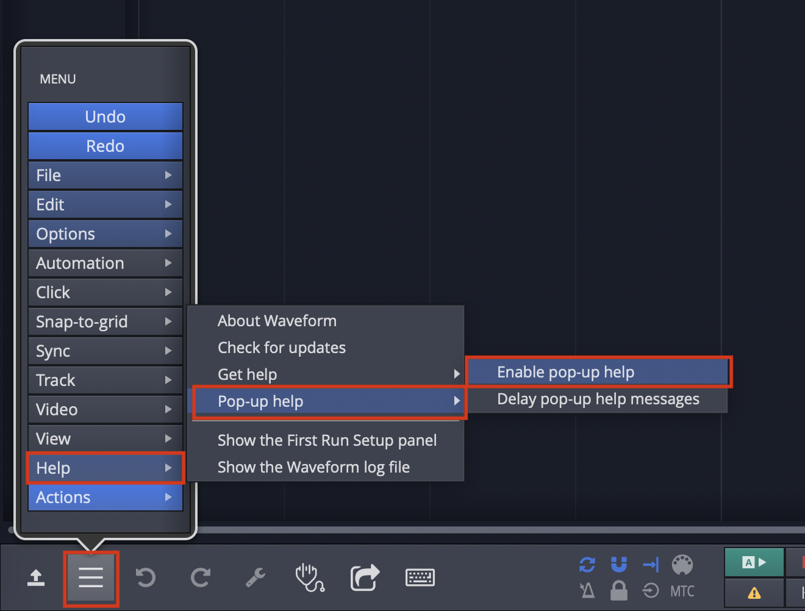

*Disabling Pop-up Help*

Disable pop-up help from the Menu section using *Help > Pop-up help*.
De-select *Enable pop-up help*.

## Roll-over Help

In addition to pop-up help, Waveform also offers roll-over help.
Rollover help messages appear in the upper right for controls and
objects. The messages appear automatically as you roll over items on the
screen.


*Example of Rollover Help*

**Tip:** If you find any help messages wrong or unclear, please a
message and screenshot to support@tracktion.com

## Creating a Project

The very first step to produce a song in Waveform is to create a
project. To do so:


*The *New Project* button on the Projects tab*

1.  Go to the Projects tab
2.  Click *New Project* and the New Project dialog box appears
3.  Fill in the *Name*
4.  Select the *Location*
5.  Click *Create Project*


*The New Project Dialog Box*

Click *Create Project* it will open to the Edit where you can compose,
record, and mix. Click back to the Project tab and you will see the
contents of the project in a list to the right with the title *All items
in project: projectname*.

For now, the most important entry in the "All Items" list follows the
word "edit"; that file is called an Edit. In our example, the Edit name
is "SummerSong100 Edit 1."


*All Items List*

**Note:** Creating a project creates a folder, that in turn contains
sub-folders that contain the project media, a Project file (`.Waveform`)
and an Edit file (`songname.tractionedit`). The folder, Project, and
Edit all use the name you provided in the New Project dialog box.


*Project Folder on Disk*

## Opening the Edit

An Edit is the workspace in Waveform where you record, edit, and mix
your songs. Double-click the Edit in the All Items list; and it opens to
a new tab. This type of tab carries the name of the Edit and is called
an 'Edit tab.'

**Edits and Revision Control:** In Waveform you can have as many Edits
per Project as you want. This gives you a great system for revision
control. At key milestones in your workflow, go back to the Project tab
click *Create a Copy.* This copies the Edit to a new file. Rename the
copy appropriately and resume work using the new Edit. You can return to
the previous state of the Project at any point by opening an earlier
Edit. Important note: all Edits within a project use the same underlying
source files. Creating a copy of the Edit does not in anyway make new
copies of the underlying files.

## The Edit Tab

The Edit tab is where most of the action occurs while working in
Waveform. What other DAWs call a "project" or "song", Waveform calls an
Edit. In a way, this is similar to the terminology used in many video
editing programs. You have a collection of media that you organize into
an Edit. In concept, you can organize the same media into other Edits.
In music production, having multiple edits gives you revision control
and flexibility to have multiple mixes all contained within the project.

## Basic Navigation

What you need to know to navigate an Edit:

Start and Stop Playback
- The obvious way to play and stop is to use the Play/Stop button
    located on the transport in the Master Section. Alternatively, press
    the Spacebar to toggle between start and stop.


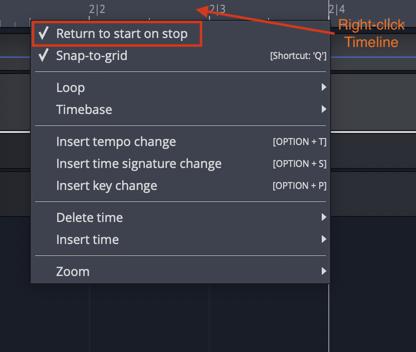

*Return to Start on Stop*

**Tip:** By default, the cursor will jump back to the start position
when you stop playback. If you would like the cursor to instead remain
at the stop position, there is a setting for that in the menu *Options
> Return to start on stop*. Disable that and the cursor will pause at
the point you hit stop. The same setting is also available when you
right-click the Timeline.

## Zooming In and Out

Here are some basic ways to control zooming:

-   Use the Up and Down keys to zoom in and out
-   Use the zoom controls in the lower right corner
-   On the timeline just above the cursor, grab and drag up or down

**Tip:** There are a full set of zoom actions that can be assigned to
keyboard shortcuts. These are also available from the Zoom menu by
right-clicking the Timeline.


*Zoom Actions on Timeline Context Menu*

You can also use the quick zoom tool:

-   Hold Cmd + Opt / Ctrl + Alt and drag to draw an area. The pointer
    changes to a magnifying glass. When you release, the view zooms in
    to your selection.
-   To step back from that zoom level, once again hold Cmd + Opt /
    Ctrl + Alt and click in the arrangement.
-   Waveform remembers the zoom levels, so you can zoom in repeatedly.
    Then, press Cmd + Opt / Ctrl + Alt click to zoom back out.

## Positioning the Cursor

The cursor position is used as the playback start time, and is also used
to reference many of Waveform's editing functions. In other DAWs it is
called a playhead, now time, or playback cursor. In Waveform it's simply
the 'cursor.'

There are numerous ways to position the cursor, including:

-   On the timeline just above the cursor, grab and drag it left or
    right
-   Click the timeline and the cursor will jump to that spot
-   Click in the background of the track area
-   Click within the body of clips
-   Use the left and right arrow keys to move the cursor backward and
    forward

**Note:** If you don't want the cursor to be positioned when clicking on
the background or the body of clips, de-select the option "Clicking the
background locates the cursor" in Settings > General > Editing


*Drag to Position Cursor Setting*

**Tip:** You can change the way clicking on the Timeline works by
selecting *Options > Timeline drag action > Drag to position
transport.* With this set, when you click in the timeline, the cursor
jumps to that position. If you drag in the timeline, the cursor follows
as well.

**Note:** In this mode, to drag zoom, you need to hold down Opt / Alt.
Since you can still zoom in and out with the mouse wheel or the up and
down arrow keys, this mode is a great way to get around in Waveform.

## Changing the Tempo

Tempo in Waveform is managed using the Tempo track at the top of the
screen. You can hide or show the Tempo track using the *Eye* panel
selector at the upper right F9.


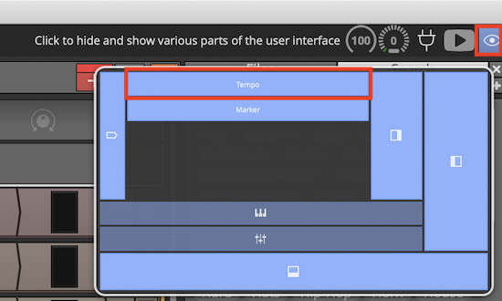

*Show or Hide the Tempo Track with the *Eye* Panel Selector F9*

The Tempo is represented as a line in the Tempo track. This line is
called the "Tempo Curve." For a fixed tempo tune it will appear as a
line set to a beats-per-minute (BPM) value.


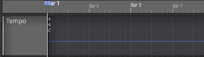

*Fixed BPM Tempo Curve*

For tunes with tempo changes it might appear with step ups or step downs
in tempo, or even gradual tempo changes represented as curves (thus the
name Tempo Curve). In other software this is often called a "tempo map."


*Varying BPM Tempo Curve*

To change the tempo of your Edit:


*Changing Tempo: *A*, Click BPM Readout. *B*, Adjust BPM property.*

1.  Click the tempo BMP readout in the Master section. The Properties
    section will show the Tempo properties
2.  Adjust the *BPM* parameter to the desired tempo. Either click and
    type it in, or drag the slider.
3.  Alternatively, open the tempo track and drag the tempo curve line up
    and down.

**Note:** Setting the tempo this way changes the tempo only for the
segment of the tempo curve that is under the current cursor position.

**Video Clip:** To learn how to use the tempo track to map tempo changes
to an existing recording, Check out my video on [Creating a Tempo
Map](https://youtu.be/leqRsEZRUJI)

## Changing Tempo at a Specific Bar

To change the tempo at a specific bar, use the action *Insert tempo
change at cursor* (Opt + T / Alt + T). Here are the steps:


*Right-click Timeline: *Insert tempo change at cursor**

1.  Position the cursor where you want the tempo change to occur
2.  Right-click on the timeline, and select *Insert tempo change at
    cursor*
3.  In the Properties section, adjust the *BPM* parameter to the new
    tempo.
4.  To see the results of the tempo change, open the tempo track to see
    the step up or down on the Tempo Curve

**Note:** The Tempo Curve can also be adjusted with more detail in the
Tempo track in much the same way as automation. Click to add points
(nodes) to the curve and drag them to shape your tempo changes along
with an adjustable *Curvature*.

Removing Tempo Changes
- Click on any tempo point, to select it. In Properties, click *Delete
    > Delete this tempo setting.*

Removing all Tempo Changes
- Click on the Tempo curve line. In Properties, click *Delete points
    from curve > Delete all points from the curve.*

## Offsetting and Scaling the Tempo Curve


*Displace Curve and Scale Curve Controls*

Displace Tempo Curve
- Click anywhere on the Tempo Curve. In Properties, drag left or right
    over `Displace Curve` to move the entire tempo curve up or down.

Scale Curve
- Select the Tempo Curve, then drag left or right over *Scale Curve*
    to reduce or emphasize the amount of tempo variation across the
    entire Edit.

## Moving On

This chapter was a basic introduction to the operation of Waveform. You
can now operate the transport; you can open the demo files; you can
create a new blank project; and you can adjust the playback volume and
tempo.

That is enough to start exploring Waveform. Stay tuned, there is a lot
more to come!


# Getting Help

This chapter is a summary of the various ways to get help when working
with Waveform.

## Pop-up Help

The first source of help is pop-up help. While useful at times, you can
also turn off pop-up help with *Options > Help > Turn off pop-up
help*. Press F1 to view pop-up help for the item under the pointer.
Refer to [Pop-up Help](pop-up-help) for an illustrated guide to pop-up
help.

## Roll-over Help

Roll-over messages appear in the upper right for items under the
pointer. These messages give you a description of the object under the
mouse pointer.

## Quick Start Guide

Starting with T7, Waveform includes a Quick Start PDF file. Access this
brief printable guide from the Help menu.

## Keyboard Shortcut List

Studying the keyboard shortcut list, is a great way to get more familiar
with Waveform. Navigate to the Settings tab, Keyboard Shortcuts page.
Here you will see all the assignable actions grouped by category.


*View as HTML Button*

For a searchable list click *View as HTML* to load the current list in
your web browser. From here you can search it with Cmd + F / Ctrl + F or
print it out.


*HTML View of Keyboard Shortcuts Assignments*

## Tracktion Videos

The [Waveform videos page](http://www.tracktion.com/support/videos) has
a nice selection of training videos. A series of Tracktion T7 Update
Explained is available from [Groove 3, Inc](http://goo.gl/GKbdlM) along
with other Waveform videos. Groove 3 is a deep resource for all things
music production.

Also checkout [this YouTube channel](http://goo.gl/hywdxh) for various
free videos demonstrating Waveform features.

The user's manual you are reading "Guide to Waveform" includes links to
videos many of which are only available here. Check out \[Appendix
A\]{appendix-a} for a complete list of videos lined from within this
book.

## Tracktion Forums

The long term official [forum for Waveform
Software](http://goo.gl/YaygV6) is hosted at [KVR](kvraudio.com). This
the most active Waveform forum that exists. Here you can interact with
the other users, TSC staff, and developers.

There is also a growing private [Tracktion Users
Group](https://www.facebook.com/groups/Tracktion/) on FaceBook. If you
use FaceBook it's a great idea to request to be added to the group. The
TSC team are also members of that group.

Also check out the [Waveform Software official Facebook
page](http://goo.gl/Hv3Xjr) for updates, news about Waveform, promo
offers, and profiles of Waveform artists - "Tracktioneers."

## Tracktion Support

In large part, your success with getting issues resolved, requesting
features, and reporting bugs, depends on following the recommended
guidelines, when filling out the request form.

[Waveform Request Form](https://tracktion.zendesk.com/hc/en-us/requests/new)


*Waveform Request Form*

Request Form Checklist:

-   Use "FR:" in the title for feature request
-   Use "BR:" Bug Report in the title for bug reports
-   Include the Waveform version number (from the Waveform About box)
-   Include your operating system and version
-   Note your system specs like processor type and the amount of RAM
-   List the steps to recreate the bug
-   Attach the log file (*Help > Show the Tracktion log file*)
-   Attach or link to screenshot or screen video
-   Report one issue at a time

Follow these same guidelines when posting bugs and feature requests to
the [KVR Waveform Software forum](http://goo.gl/YaygV6).

## Moving On

Those are the key ways to get help when learning and using Waveform.
Next let's get into more detail on using Waveform!


# The Edit Tab

In this chapter you will learn the layout of the Edit tab. The Edit tab
is where most of the action occurs during recording, editing, and
producing your song. This chapter is important, as you will learn the
terminology for the Waveform interface and objects used throughout the
rest of this book.

**Note:** The keyboard shortcuts used in the chapter are based on the
alternative key mappings under *Settings > Keyboard Shortcuts > Reset
to Defaults > Use alternative Waveform key-mappings.* We've already
mentioned this several times and this might not be the last! If you want
to follow along with the keyboard shortcuts used in this book, make sure
to load the alternative key-mappings.

## The Parts of a Waveform Edit

The Edit tab is made up of four main parts: The Browser, the
Arrangement, the Mixer, and the Controls panel.


*Parts of the Edit Tab: A, Browser. B, Arrangement. C, Controls panel*

## The Browser

The Waveform Browser resides along the left side of the Edit. You can
open or close it by clicking its icon or by pressing B. The Browser
includes a collection of tabs, giving you quick access to media,
plugins, messages, and markers.

**Tip:** Starting with T7 and higher , you can move the Browser to the
top or right side of the Edit, by dragging its icon to the appropriate
edge of the screen.


*Browser Open/Close Icon, A. Browser Tabs, B.*

Here is a short description of each Browser tab:

Files
- The Files tab gives you quick access to the audio files used in the
    project, as well as the project folder structure. It also gives you
    quick access to common locations and drives on your system. Most
    import however, is the ability to bookmark folders for quick access.
    Using bookmarks is the easiest way to access a loops library. Audio
    files and loops can be easily auditioned from the Files tab as well.

Presets
- Plugin, instrument, rack, and track presets are all searchable from
    the Presets tab. The tag field at the top gives you a quick way to
    filter by tags. Drag any presets you find to the arrangement.
    Right-click to rename a preset or update the tags.

Tracks
- Use the Tracks tab to filter tracks in the arrangement by tag.
    First, you need to tag them by selecting one or more tracks and
    setting tags in Properties.

Search
- The unified Search tab, allows you to search for loops, presets, or
    plugins in one single interface. The tag field dynamically updates
    to show the relevant tags for filtering.

Notifications
- Use this for a history of Waveform notifications. There are many
    notifications that happen related to the Waveform Marketplace
    purchases and plug-in installation. Clear individual notifications
    by clicking the 'X' on the message. You can jump right to the plugin
    referenced in the message by clicking the arrow icon. Press *Clear
    All* to clear the list of notifications.

Markers
- Use the Markers tab to add bars & beats or timecode markers to the
    Marker track. Navigate to any marker by simply clicking on the
    marker name. You can also quickly delete the selected marker, change
    its name or marker type in Properties.

Clipboard
- Use the Clipboard tab to see what is currently in the clipboard. Put
    selected items from an edit or project on the clipboard by pressing
    Cmd + C / Ctrl + C. Then, drag clipboard contents to the arrangement
    from the Browser Clipboard tab. The clipboard can contain clips,
    plugins, or racks. It is particularly useful when copying items from
    other projects on the Projects tab.

For much more about the Browser check out [The Browser](the-browser).

**Tip:** Resize the Browser by dragging the right edge left or right.
This is particularly helpful when working with the Search tab, which has
numerous search columns that might be hidden.

## The Arrangement

The Arrangement is made up of the Timeline, Track Headers & Inputs,
Tracks, and the Mixer.


*Parts of the Arrangement: A, The Timeline. B, Track Headers & Inputs. C, Tracks. D, The Mixer*
Timeline. B, Track Headers & Inputs. C, Tracks. D, The

## Timeline

The Timeline acts as a ruler, measuring the time of the edit. While it
is commonly set to show the bars and beats of your song, it can also
show seconds and milliseconds or seconds and frames with a simple
right-click selection.

The Timeline is related to several other onscreen features:

In-marker & Out-marker
- The range between between the In-marker and the Out-marker defines
    what is called the "marked region" in Waveform. In other DAWs this
    is called often called the "loop" or "cycle." The marked region
    defines looped playback, loop recording, and many of Waveform's
    editing options. The keyboard shortcuts are I to position the
    In-marker, and O to position the Out-marker.


*In-marker & Out-marker*

Tempo Track
- The Tempo track appears below the timeline, when open. Here you
    define the the tempo and tempo changes. Open and close the Tempo
    track using F9.


*Tempo Track*

Marker Track
- There are actually two marker tracks that can be opened below the
    Timeline. One is for bars & beats markers, such as song sections.
    The other is for absolute time in terms of hours:minutes:seconds and
    milliseconds. Cycle through the options with F10.


*Marker Track*

The Clip Object
- Above the right side of the Timeline you find the Clip object. Some
    Waveform users call the *Clip object* a "clip dragger" or "clip
    maker." All of the terms are descriptive of how it works. Drag it to
    a track to create an empty clip of any of the four types - MIDI
    clip, Audio clip, Edit clip, or Step clip.


*Clip Object and Plugin Object*

The Plugin Object
- Drag the plugin object to the mixer section of any track to insert
    an audio effect plugin or virtual instrument. When you drop the
    Plugin object, you get a menu of all available plugins and
    instruments. You can control the organization of the menu from the
    Settings tab Plugins page. Refer to [Using
    Plugins](using-plugins) for much more about inserting and using
    plugins.

Show/Hide Buttons
- Several areas of the Edit tab can be opened for use or closed to
    declutter the screen. Here are the buttons to control those filled
    by the corresponding keyboard shortcuts.


*Show Hide Buttons. A, Show/Hide the Tempo track. B, Show/Hide the Inputs. C, Show/Hide the Mixer, D, Show/Hide the Controls Panel, E, Show/Hide the Marker Track*
track. B, Show/Hide the Inputs. C, Show/Hide the Mixer, D, Show/Hide the

-   Show/Hide Tempo Track (F9)
-   Show/Hide Marker Track (F10)
-   Show/Hide Inputs Section (Shift + F12)
-   Show/Hide Mixer Section (M)
-   Show/Hide Controls Panel (F11)

## The Track Section

Tracks appears as parallel lanes that contain and organize clips of
audio and MIDI. Signal flow follows from left to right from Inputs, to
Clips for recording, to the Mixer and any plugins it uses, then on to
the Master Section. There is really only one kind of track in Waveform.
Tracks can hold any kind of clip: Audio clips, MIDI clips, Step clips,
or Edit clips. To create a new Track simply press T.

Track Headers
- The leftmost column of the Arrangement forms a list of track
    headers. Select a track by clicking directly on the track name
    within the header. Additional track properties including the Name
    became available in Properties. To rename a Track, simple edit the
    *name* property. Tracks can be reordered by grabbing any track from
    the header and dragging it to a new location.


*Track Headers*

Inputs
- Inputs appear as right facing rectangular arrows. Click on an input
    for a menu of options that includes a selection of available inputs.
    Use the menu to set up a track for recording. Additional input
    options are available in Properties. You can even drag an input to
    another track to continue recording.


*Inputs*

**Tip:** Resize tracks using the zoom tools in the lower right corner of
the arrangement.

## Clips

You can drag in audio files and loops to build your Edit, or record them
directly. The same goes for MIDI clips. Step clips are a unique in-line
step sequencer. Step clips are variation on MIDI Clips. While Edit clips
allow you embed an entirely different Edit into your song as single
clip. Selection an of the kinds of clips to access more properties and
actions in Properties.

Audio Clips
- Audio clips are created during recording or can be dragged in from
    the Browser or desktop. Audio clips are one of the key elements of a
    Waveform arrangement. Waveform gives you a rich set of tools to work
    with Audio clips to split them, combine them, reverse them, or
    change the pitch, timing, or speed. You can also edit Audio clips
    with Melodyne to adjust the intonation of recorded notes. T7 gives
    you Clip Layer Effects for even more options to manipulate audio
    clips. See [Clip Layer Effects](clip-layer-effects) to learn
    about this new type of audio processing.


*Audio Clip*

MIDI Clips
- MIDI clips are the Waveform container for MIDI performance data. The
    clips have many of the same editing features as Audio clips. Expand
    MIDI clips vertically to see the full in-line piano roll MIDI
    editor. The MIDI editor comes with a full set of tools for editing,
    entering, and modifying MIDI notes.


*MIDI Clip*

Step Clips
- Step clips are a unique type of inline step sequencer that gives you
    amazing flexibility to enter MIDI notes on a grid. Step clips are
    ideal for programming drum beats and rhythms, they can also be used
    for baselines, synth leads or just about anything else. Some
    Waveform users program complete compositions entirely with Step
    clips.


*Step Clip*

Edit Clips
- Edit clips are another unique Waveform concept. You can embed and
    entire Edit into a clip. You can also use Edit clips to separate out
    all your drum programming to another Edit as an aid when doing
    complex drum programming. Use Edit Clips to compose songs in
    blocks - develop the verse, chorus, and bridge in separate Edits and
    bring them together in another Edit. Teachers use it when recording
    several students singing over the same underlying track. It is a
    very unique feature and uses for it are still being discovered!


*Edit Clip*

Edit clips behave in the arrangement just like Audio Clips. How can you
tell the difference? They have an additional tab in the Properties panel
to manage the link to the underlying Edit.


*Edit Clip Properties*

## The Mixer

Waveform's default Mixer view is one of it's unique, defining features.
For each track, signal flows from left to right - Input to Track, Track
to Mixer, Mixer to Master. The Mixer is where you arrange plugins to
create whatever channel strip you need for the track. If you have MIDI
clips on the track then insert virtual instrument as a sound source. If
you need to EQ a vocal, drop in an EQ.

The Volume & Pan and Level Meter plugins are installed by default,
however you can remove, reorder, or even add more instances of them. You
will find the following things on every track by default:


*Mixer Default Setup: Volume & Pan Plugin, Level Meter Plugin, Solo Button, Mute Button*

Volume & Pan Plugin
- This acts as like the channel fader and pan controls on a
    conventional mixer. When you click either element, a larger version
    pops up allowing you to easily adjust level or panning. When
    selected, the full set of properties appear in Properties.

Level Meter Plugin
- The level meter shows the level of audio on the track. You can add
    additional instances or put the meter anywhere in the track using
    drag and drop. You can change the meter response between Peak, RMS,
    and Sum & difference from the right-click menu or from Properties.

Mute
- The *Mute* button mutes and un-mutes the track. You can also mute by
    selecting a plugin and then right-click. The keyboard shortcut for
    mute is Shift + M.

Solo
- The *Solo* button silences all other tracks so you can hear one
    track at a time. *Settings > General Behavior > Solo Behavior*
    allows you to customize exactly how *Solo* works. Choose from
    *Cumulative* or *Exclusive* modes. From the right-click menu you can
    choose *Solo Isolate* which allows the track to continue to play if
    another track is soloed. This is particularly useful if a track is
    configured as an effects bus.

**Tip:** Right-click on either *Mute* or *Solo* to access a menu. From
here you can reset all the solo and mute states for all tracks.


*Mute/Solo Right-Click Menu*

Note that starting with Waveform version 8, there is also an alternative
"traditional" mixer view available, that displays the mixer channels
vertically as seen on a real-world, hardware mixer. To use this mixer
view instead, click on the *show/hide mixer panel* button in the upper
right corner of the Waveform interface.Further details of the mixer
panel will be included in a future review of the user's manual.

## The Controls Panel

Making up roughly the lower third of the Edit tab, the Controls panel is
made up of three main parts: The Menu section, the Properties section,
and the Master section.


*Sections of the Controls Panel: A, Menu section. B, Properties section, C, Master section*

## The Menu Section

A full set of menus related to the Edit are available in the Menu
Section. Of particular importance are the Export, Click Track, Snapping,
and Options menus. In this manual, we make numerous references to the
Menu section using a path syntax separated by "greater-than" symbols.
For example, "to set a one bar count-in choose *Click Track >
Pre-record count-in length > Use a 1 bar count-in.*


*Menu Section of the Controls Panel*

## Properties Section

What is shown in Properties depends on what object you have selected.
Each track, input, clip, plugin, rack, and automation point has its own
set of properties. Click to select any object and Properties will
automatically switch to show the values and actions that are relevant to
whatever you have selected. This is a key concept when using Waveform,
and is central to its design.


*Properties Section of the Controls Panel*

## Master Section

The Master section contains cursor position information, the Transport,
Master plugins, Master volume control, and a set of global control
buttons.


*The Master Section*

Cursor Position Info
- At the top of the Master section, you will notice three key pieces
    of information about the current cursor position: The tempo, the
    time signature, and the location counter.

-   Click the tempo display to see tempo properties.
-   Click the time signature for time signature properties.
-   Click and edit any of part of the location counter to move the
    cursor to that location.

You can also drag any of the components of the location up and down to
move the cursor. The location counter format will change to match what
you have set for the Timeline.

The Transport
- The Transport is made up of a set of eight buttons that include all
    the usual suspects: *Play/Stop, Record, RTZ, Rewind,* and *Fast
    Forward.* In addition, there are buttons for *Automation Read,
    Automation Write,* and *Panic.* The *Panic* button restarts
    Waveform's audio engine. All of these can be assigned to keyboard
    shortcuts for fast access.

Master Plugins Area
- The Master section also contains a plugin area to insert final
    processing like compression and limiting. With no plugins installed,
    it will display *(Drop Master Plugins Here)*. Drag plugins from the
    Browser or the Plugin object here or right-click to add them.

Master Section Buttons
- The Master section includes eight buttons to access commonly used
    global on/off functions. More on these buttons in a moment.

Master Level
- The Master level provides the final volume adjustment for the
    entire mix. The corresponding pan control provides control of the
    balance between the left and right signals. For most applications
    the Pan control will remain centered.

Master Meter
- The Master meter shows the final output level. Right-click the meter
    to set the meter mode or reset any overload indicators.

## Master Section Buttons

The Master section buttons include some of the most used functions in
Waveform. This is a description of what these buttons are for along with
the shortcut used to toggle the button.


*The Master Section Buttons*

Loop
- *Loop* (L) turns looping between the In-marker and Out-marker on and
    off. This is for both playback and loop recording.

Click
- *Click* (C) turns the metronome click on and off.

Auto Lock
- *Auto Lock* is short for "Automation Lock." As the name implies,
    this button locks automation to clips. When on, as you move clips
    around the automation curves follows along.

Punch
- With *Punch* (P) tuned on, Waveform will only record when the cursor
    is between the In-marker and the Out-marker.

Snap
- *Snap* (Q) button turns snap-to-grid on and off.

Scroll
- With *Scroll* (S) turned on, Waveform pans the screen to keep the
    cursor on screen during playback and recording.

MIDI Learn
- Click *MIDI Learn* to enter MIDI Learn mode. In this mode you can
    easily assign external knobs and faders to on-screen controls.

MTC
- With *MTC* enabled, Waveform will chase sync to incoming MIDI Time
    Code. Unless you are still syncing to tape or hardware sequencers,
    leave *MTC* off.

## Moving On

That was a broad overview of sections, controls, and buttons on the Edit
tab. Next, we start to break all this down so you can have fun making
music with Waveform.


# The Browser

The Waveform Browser provides quick access to files, loops, plugins, and
presets. It allows previewing loops, filtering of your Tracks by tags,
and bookmarks to you favorite folders. When you have located media files
and plugins in the Browser, you add them to the Edit using drag and
drop. The Browser also has tabs for notifications and the clipboard. In
this chapter you will learn about each of the tabs.

**Tip:** Remember, you can open and close the Browser (B) with the
Browser icon. You can also resize the Browser tab by dragging the right
edge right or left.

## Browser Files Tab

The Browser Files tab allows you to find audio files on your system to
include in your project. You can also preview audio files and set
bookmarks. After you export mix downs of your song, you can easily find
them in the Files tab as well.

Browser Files Tab Controls
- Here are controls at the top of the files tab.


*Browser Files Tab Controls*

Browser Files Tab Menu
- In use, the Files tab shows a list of files. Click the Files menu
    button to choose what to list. The menu is divided into sections.
    These aren't labeled in the software, but the graphic here shows
    what each section does.


*Browser Files Menu*

Creating Bookmarks
- To create a bookmark to a favorite file location, navigate in the
    Files tab to any drive and folder on your system. When you locate a
    frequently used folder, open the Files tab menu and select *Bookmark
    current folder.*

**Tip:** Using bookmarks is a great way to access your loop library if
you already have it organized by folders. This is often a more direct
way to get to certain loopset than searching in the Search tab.

Removing Bookmarks
- To remove a bookmark, navigate to that folder, click the Files menu
    icon, and select *Delete bookmark for current folder.* Notice that
    the delete option will only be available when the current folder has
    been bookmarked.

**Tip:** A quick way to located exported mixes of your song is to use
the Browser Files tab. From the Files menu, select *Project folder >
Exported.* By default all your exported files go into this subfolder of
the parent project folder. To get to the resulting file directly on your
system, right click any file and select *Open the folder containing this
file...*


*Tip. Quickly Locate Exported Mixes in *Project folder > Exported**

Browser Files Info
- Information about the selected file shows in the Files tab footer.
    This includes the sample rate, bit depth, stereo or mono, length,
    number of beats, BPM, and time signature. The info varies depending
    on what meta data is included with the file.


*Browser Files Tab Footer*

Auditioning Files
- Click any audio file in the files list and use the *Play/Stop*
    button along with the *Audition level* to preview it. By default,
    audio files start to play immediately when you select them. You can
    turn that off by deselecting *Auto-Play.* With *Loop* enabled, files
    play continuously until you press stop or select a different one.
    You can also see a thumbnail of the waveform along with a moving
    playhead line during the audition.

## Browser Presets Tab

The Presets tab allows you to search for presets for plugins, tracks,
Step clips, and Plugin racks. It also allows you to filter the results
using the tag field. The Presets have a preview feature, so you can
audition presets before dragging them to your song. Tags allow you to
categorize and organize presets to your liking.

## Saving Presets

For the Presets tab to be useful, you need to save presets. Here is a
quick summary for the most common types.


*Preset Line in Properties Section*

Plugins
- For instrument or effects plugins, select the plugin in the mixer,
    then click *Save* in the *Preset* line in Properties. This will load
    the Preset Details dialog box where you can add a name, description,
    and tags. After you enter the information, click *OK* to save the
    preset.

Plugin Racks
- To create a preset for a Plugin rack, open the window for it
    (usually by double-clicking) then select *Save* from the *Preset*
    line. This opens the Preset Details dialog box to complete the
    process.

Step Clips
- Select the Step clip by clicking on its header. In Properties, click
    *Create Preset.* You can choose to include or exclude patterns.
    Choosing either opens the Preset Details dialog box to complete the
    process.


*Step Clip Create Preset*

**Tip:** If you exclude patterns, a Step clip will use the default *Step
Length* and *Number of Steps.* We suggest always choosing *Include
patterns.* If you want to create a blank template, simply clear all the
notes, before saving.

Tracks
- To save track presets, right-click on the Track header then click
    *Save Preset*. You will then choose between saving the *Whole track*
    or part of the track - *Track inputs*, *Track outputs*, *Track
    plugins*. We recommend using *Whole track* however you might want to
    use *Track plugins* for a convenient way to save a channel strip
    configuration for quick recall.


*Track Header Right-click, Save Preset*

## Using Presets

Click the tags to filter presets and search for them by name using the
Search field. Once you find a preset to work with, drag it to the
appropriate section of the arrangement. Here are some other important
features.


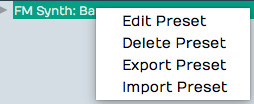

*Preset Right-click Menu*

Renaming a Preset
- Right-click any preset in the list and select *Edit Preset.* This
    opens the *Preset Details* dialog box. Here you can update the name,
    description, and tags.


**Preset Details* Dialog Box*

Deleting a Preset
- Right-click a preset and select *Delete Preset* to remove it
    permanently.

Export a Preset
- To export a preset to share with another Waveform user or transfer
    to another computer, right-click the preset and select *Export
    Preset.* The resulting file contains a description of the preset and
    has the `.trkpreset` file extension.

Importing a Preset
- The easiest way to import a preset file is to drag it from your
    system and drop it on the Waveform browser. You can also load a
    preset by right-clicking an existing preset and selecting *Import
    Preset.*

## Applying Presets

To use a preset, drag it to the appropriate object in the arrangement:
Track, clip, or the mixer. There are other ways to work with presets, as
follows:

The Apply Button
- To quickly audition Track or effects plugins, turn on *Apply* in the
    Presets tab footer. Next, select a track to use to try out the
    presets and start playback. Click on any preset you want to try for
    that track and it will be instantly applied. Select various presets
    to quickly audition. When you disable *Apply*, use *Undo* (Cmd + Z /
    Ctrl + Z) to remove any plugins applied this way.


*Browser Preset Tab *Apply* Button*

Using Part of Preset
- Rack and Track presets are made up of several components (e.g.
    plugins, instruments, mixer plugin setups). Click the triangle to
    the left of this type of preset to expand the view to show all the
    components. Now you can drag any of those components to your
    arrangement.


*Expanded View Showing Preset Components*

Auditioning Instrument Presets
- Select the instrument preset you want to audition. Make sure
    *Preview* is enabled at the bottom of the Presets tab. Click
    *Inputs* and enable the MIDI controller or keyboard to use to
    audition the sound. Play notes on a keyboard to audition the sound.
    You can also audition Instrument presets, by selecting a track that
    contains MIDI clips and playing it while *Apply* is enabled.


*Selecting Input for Instrument Preview*

## Tracks Tab

The Tracks tab works in conjunction with track tagging. Once tracks are
tagged, you can filter which tracks to view from the Tracks tab by
enabling *Show Only Tagged Tracks* and then clicking on the tags for the
tracks to view. All tracks that do not include the tags are hidden.

The most common scenario is to tag tracks of a similar kind like
"drums", "guitars", or "vocals." Then you can filter by those types.

Tagging Tracks
- To add tags, select one or more tracks in the arrangement, and type
    the tags into the *Tag* field in Properties. You can enter as many
    tags as you like separated by commas.


*Tagging Tracks*

**Note:** Tags are case sensitive, so "GTR" is a different tag than
"gtr."

Filtering by Tags
- To filter the view of track by tags, enable *Show Only Tagged
    Tracks* at the bottom of the Tracks tab. Click a tag to show only
    tracks that include that tag. You can click several tags to show
    additional tracks. If no tags are selected, then all tracks are
    shown. If you turn off *Show Only Tagged Tracks*, then all tracks
    are shown.


*Show Only Tagged Tracks*

Removing Tags
- You can remove a tag from a single track by editing the *Tag*
    property in Properties for that track. You can remove a tag from all
    tracks by right-clicking the tag in the tag field of the Tracks tab
    and selecting *Remove Tag.* A dialog box will appear to confirm the
    deletion. Click *OK* and the tag will be removed from all tracks.

## Search Tab

The Search tab allows searching by keyword and filtering by tags for
loops, presets, and plugins. This unified search also gives you all the
same preview functions offered in the Presets tab for auditioning loops.

Searching
- To search for a file, simply start typing into the *Search* box. The
    results will immediately appear in the results list. Searching and
    the results list include the Name, Tags, Category, and Manufacturer
    organized into columns. You can sort by any column by clicking on
    its header. You can rearrange the columns by dragging them. Search
    terms are not case sensitive.


*Search Results List*

**Tip:** If you can't see all the search list columns, expand the width
of the Browser by dragging the right edge.

What to Search For?
- You can further refine searches by selecting which type of things to
    include. Click the search loop icon and select from *Loops*,
    *Presets*, and *Plugins*. Notice that the tag field will adjust to
    include only the appropriate tags for the types of items enabled.


*Browser, Search Tab Filters*

Tag Field
- To filter by tags, click any combination of tags. The logic for the
    selection is "and." What I mean is this. If you select both "Drums"
    and "Mallets" tags, the results list will only show items tagged
    with both Drums and Mallets.


*Browser Search Tab, Tag Field*

Setting Tags
- You can set or change the tags for one or more items in the results
    list with a right-click. The exact process is a bit different
    between loops, presets, and plugins. For Plugins and Presets, you
    right-click and select *Set Tags* A single line field opens for
    editing where you and type in or edit the tags. Separate the tags
    with commas.


*Browser, Search Results List Right-click *Set Tags**

For loops, the same right-click and *Set Tags* opens the larger *Tag*
dialog box. From there you can see available tags, type in new ones, or
edit the existing ones.

Edit Preset Name
- Right-click to open the Preset Details dialog box which presents
    *Name*, *Description*, and *Tags* fields that you can edit and save.

Audition
- Select a loop in your search results and press the *Play/Stop*
    button along with the *Audition level* to preview it. By default,
    loops play immediately when you select them. You can turn that off
    by deselecting *Auto-Play.* With *Loop* enabled, files play
    continuously until you press stop or select a different one. The
    preview also features a nice waveform thumbnail to give you a visual
    reference to the loop content.


*Audition with Thumbnail Preview for Loops*

Using Search Results
- Anything you find and want to use, drag from the search results to
    the arrangement. Track loops to tracks, drag plugins to the mixer or
    Audio clips. Drag instrument presets to the mixer. Drag track
    presets to tracks.

Indexing Your Loop Library
- If you want Waveform to be able to search for loops, you need to
    index your loop library. Do that from *Settings > Loop Database >
    Scan for Loops*. You will see options on that page to enter paths to
    your loops.

**Note:** If you don't want to use Waveform to search your loop library,
then you don't need to have it scan and index your files. You can simply
create bookmarks to your loop library folders on the Files tab.

## Notifications Tab

Waveform shows notifications when new plugins are added, certain
background processes complete, and for confirmation of purchases through
the Waveform marketplace. These might appear briefly in the operating
system but the Notifications tab keeps the history of these messages.
Scroll through the list using the mouse wheel or the scroll bar along
the right side. Here are a few things you can do with the notifications
that appear in the list:


*Browser, Notifications Tab*

Show the Installed Plugin
- Click the arrow on the message to jump directly to that plugin on
    the Search tab.

Removing a Notification
- Each notification has an "X" in the upper right corner to remove it
    from the list.

Clearing All Notifications
- Click *Clear All* at the bottom of the Notifications tab to clear
    all notifications

## Markers Tab

Use the Markers tab to add Bars & Beats or Timecode markers to the
Marker track. You can also use it navigate to any marker by
double-clicking on the marker name. You can also quickly delete the
selected marker or change its name in Properties.


*Browser, Markers Tab*

We have complete coverage of Markers and the Markers tab in [Using Markers](using-markers).

## Clipboard Tab

The Clipboard tab shows the most recent item copied or cut. Copies at
typically done using Cmd + C / Ctrl + C while cuts are done using Cmd +
X / Ctrl + X. There are also on screen buttons for copy and cut
depending on the object and context.

To use the last item copied or cut you typically use Cmd + V / Ctrl + V.
Alternatively you can go to the clipboard tab and drag items onto the
arrangement. It is particularly useful when you want to copy elements
from other projects on the Projects tab, then drag or paste them into a
different Edit. You can also copy and paste between Edits.


*Browser, Clipboard tab*

Here are few things to know about the clipboard:

Adding Items to the Clipboard
- The best way is to use the keyboard shortcut to copy a selection of
    clips (Cmd + C / Ctrl + C). The shortcut for "cut" will also work
    (Cmd + X / Ctrl + X). These commands are also usually available from
    right-click menus.

Dragging Clipboard Items to the Arrangement
- When you drag items from the clip board you get all or nothing.
    However before dragging, you can remove the items you don't want by
    right-clicking and selecting *Remove item from clipboard.*


*Removing an Item from the Clipboard*

Clearing the Clipboard
- To remove all items from the clipboard. Right-click any item and
    select *Clear clipboard.*

## Moving On

Reading about all the features of the Browser should give you more
insight into the capabilities of Waveform. It will make even more sense
after you get familiar with the core workflows of recording, editing,
and mixing.


# Using Markers

In this chapter, You will learn about using markers in Waveform. There
are four different kinds of markers:

In-marker and Out-marker
- Together these define the "marked region", that is the region for
    looped playback and loop recording.


*In-marker and Out-marker*

Bars & Beats markers (B&B Markers)
- Bars & Beats markers can be used to identify song sections, give you
    a visual guide to the song, and provide quick navigation to
    different parts of your song. They are arranged as clips on the
    Marker track. Bars & Beats markers appear with a musical note icon
    on the Marker track. They also appear as narrow pointers on the
    Timeline when the Marker track is closed.


*Bars & Beats Markers on the Marker Track*


*Bars & Beats Markers on the Timeline (with Marker track closed)*

Timecode Markers (TC Markers)
- Timecode markers mark a specific time offset into the Edit, and are
    not dependent on tempo changes. They can can aid with navigation,
    especially when working with video. TC markers appear as clips with
    a clock icon on the Marker track. They appear as rounded pointers on
    the Timeline if the Marker track is closed.


*Timecode Marker on the Marker Track*


*Timecode Marker on the Timeline (with Marker track closed)*

**Note:** In Waveform, the term 'marked region' means the range of an
edit that occurs between the In-marker and the Out-marker.

Wave File Markers
- You can add yellow arrows directly to Wave files that then appear on
    Audio clips. These are the least useful type of markers. More about
    them near the end of this chapter.


*Wave File Markers*

## In-marker & Out-marker

Position the In-marker and Out-marker by dragging the I and O flags
along the Timeline. The In-marker and Out-marker together define the
range over which playback will loop when the *Loop* button in engaged in
the Master section. They also define what is called the "marked region"
used for numerous editing actions.


*The In-marker & Out-marker*

Pressing I will locate the In-marker to the cursor position. Pressing O
locates the the Out-marker to the cursor position.

You can alternatively "draw" in the range between the In-marker and
Out-marker. Double-click on the Timeline and start dragging right.
Double-click positions the In-marker at the starting point. As you drag
right, the Out-marker comes along to set the out point when you lift the
mouse button.

**Tip:** To set the marked region over a selection of clips and press A.
This also works for Marker clips making it a great way to set the
In-marker and Out-marker over a song section.

## Navigate Using the In-marker & Out-marker

You can quickly navigate to the In-marker or Out-marker using the square
bracket keys. Press `[` to locate the cursor to the In-marker; Press `]`
to locate the cursor to the Out-marker.

## Zooming to the In-marker/Out-marker

When you have a marked region set between the In-marker and Out-marker
you can quickly zoom in to that region. To do that, right-click the
Timeline and select *Zoom to show the marked region* or simply to press
F7.


*Right-click the Timeline, Zoom to In-marker/Out-marker*

## Looping Playback Over the Marked Region

To continuously repeat playback over a section of your tune, set the
In-marker and Out-marker to define the loop range. Turn on looped
playback by engaging the *Loop* button (L). Playback will repeat that
section over and over until you stop playback.


*Enabling Loop Playback*

**Note:** When *Loop* is enabled, playback will only play within the
marked region. If the cursor is located earlier than the In-marker or
after the Out-marker when you press *Play*, it will jump to the
In-marker and play from there.

## Auto Punch and the Marked Region

To use Auto Punch, first set the In-marker and Out-marker over the range
where you want to punch in. Enable the *Punch* button (P) in the Master
section. Make sure *Loop* is turned off. Now enable a track for
recording, position the cursor before the In-marker and press *Record*
on the Transport. Even though the track is armed for recording, no
recording will happen until the cursor gets to the In-marker.


*Enabling Auto Punch Recording*

**Tip:** Auto punch recording means that recording is only allowed
between the In-marker and Out-marker. Also, punch recording only works
when *Loop* is off.

## The Marker Track


*Marker Track*

Let's take a closer look at the Marker track. You can open and close the
Marker track with the Marker track show/hide button.


*Marker Track Show/Hide Button*

The Marker track can contain either Bars & Beats markers or Timecode
markers. If you don't like to see the types mixed together on the same
track, there is an additional split mode that shows each type on
separate lanes.


*Marker Track Split Mode*

To access that mode, select the Marker track by clicking the header.
Then in Properties, de-select *Use a single track for all types of
marker.* In this mode, the Marker track has two lanes. The top lane
shows Timecode Markers and the bottom lane shows Bars & Beats Markers.


*Marker Track Properties Setup for Split Mode*

**Note:** F10 is my assignment for the keyboard action *Toggle the
marker view mode*. Pressing F10 cycles through the three marker track
states - hidden, normal, and split mode.

**Tip:** You can click on any blank space in the Marker track to
instantly position the cursor.

## Adding Markers

Here are the various ways to add markers to the Marker track:

Drag the Clip Object
- Drag the Clip object to the Marker track and choose which type of
    Marker to create. This creates a Marker clip you can drag and
    resize. It has left and right trim handles to adjust the length. You
    can also drag a marker by its header and move it around. If the
    Marker track is in split mode, the type of Marker (B&B or TC) is
    determined by which lane you drop the Clip object on.


*Adding a Marker by Dragging the Clip Object*

Press Return
- The Return key (Enter on PCs) has several functions related to
    Marker navigation during playback. At the most basic level, pressing
    Return adds a new Marker at the cursor position. The type of Marker
    clip matches the most recently added Marker. If a Marker clip is
    selected, it adds one of that type. Markers added with Return, use
    the next available sequential Marker number.

Right-click the Marker Track Header
- Right-click the Marker track header and choose which type of marker
    to add at the cursor position.


*Add a Marker from the Marker Track Right-click Menu*

Marker Track Properties Buttons
- Click the Marker track header to select it, then look in Properties.
    There you will find the buttons *New Bars & Beats Marker* and *New
    Absolute TC Marker.*


*Add a Marker from Marker Track Properties*

Browser Markers Tab *Add* Button
- You can add either kind of Marker Clip using the selections on the
    Browser, Markers tab.


*Add a Marker from the Browser, Markers Tab*

## Marker Clip Properties


*Marker Clip Properties*

Marker clips behave like other clips in several ways. You can adjust the
length using the trim handles, you can split them, drag them, duplicate
them, or nudge them. They also contain several properties, described
below:

Number
- Marker numbers are issued sequentially as you add Marker clips. You
    can edit the *Number* property if you want. If you change *Number*
    to one that is already in use, then the other clip will be assigned
    the next available number. Marker numbers can be used for quick
    navigation during playback.

**Tip:** If you feel compelled to renumber all your Markers to get them
into a nice sequential order, you might want to skip some numbers, in
order to make it easier to insert new Markers. For example, if you have
a lot of markers in the song, you could re-number them by 5s.

Type
- *Type* allows you choose which type of Marker clip you want: *Bars &
    Beats* or *Absolute.* Bars & Beats markers adjust to the tempo
    changes in the song. Timecode markers are fixed to a specific time
    offset into the Edit and are not affected by tempo changes.

**Note:** Timecode markers are also called "absolute markers", "TC
markers", or "absolute timecode markers" within Waveform. All those
terms refer to the same thing. For this book, I usually call them
Timecode markers.

Name
- The *Name* property sets the name shown on the Marker clip. By
    default it will be "New Marker." Most users rename it based on song
    section. For example: Intro, Verse, Chorus, Bridge, or Outro.

Start
- The *Start* property shows the bar, beat and tick start time for B&B
    markers. For Timecode markers it shows
    Hours/Minutes/Seconds/Milliseconds. For either type, you can edit
    *Start* directly to move the marker to a different location.

Length
- Similarly, *Length* shows B&B marker length in Bars/Beats/Ticks
    format. For Timecode markers, it shows length as
    Hours/Minutes/Seconds/Milliseconds. Edit the *Length* property and
    the Marker clip length will change to match.

End
- *End* values are in the same format as the *Start* property. Edit it
    to change the ending time. When you change the *End* value, *Length*
    gets adjusted to match. *Start* always remains the same. If you edit
    *End* to fall before *Start*, it will be set to match the *Start*
    time. In that case, *Length* gets set to zero.

Colour
- Choose from one of the nice colors. This sets all selected Marker
    clips to the color you choose.

**Tip:** You can change a Marker clip from Bars & Beats to Timecode
using nudge. Press F10 until the Marker track split mode is showing.
Select the marker clip to convert and press Shift-up or Shift-down to
nudge the clip to the other lane.

## Navigating by Markers

Once you have Markers set up, you can quickly navigate using the Marker
number and the Return key. Just type in a Marker number like '5' or '11'
and hit Return ('Enter' on PCs). As you type the number you will see it
appear in green in the upper right of the Waveform window. When you see
the number, you have about two seconds hit Return before the number
disappears.


*Marker Number As It Appears Momentarily*

If you enter a number that doesn't have a matching Marker, then Waveform
will insert a marker with that number at the cursor. Also, if you just
press Return, a Marker clips is inserted at the cursor position.

Undo (Cmd + Z / Ctrl + Z) removes a marker if you didn't intend to
insert it.

**Tip:** The Number + Return approach to navigation works during
playback but also works when Waveform is idle. If it doesn't seem to be
working when playback is idle, click the header of the Marker track or
select any marker and try again.

## The Browser Markers Tab

Use the Browser Markers tab to add Bars & Beats or Timecode markers to
the Marker track. You can also use it navigate to any marker by
double-clicking on the marker name in the list. You can also quickly
delete the selected marker or change its name in Properties.


*Browser, Markers Tab*

Select marker clips
- Single-click a marker in the list to select it.

Navigate to a marker clip
- Double-click on a marker in the list to jump to that position. This
    works during playback too.

Rename a marker
- Click a marker to select it. Then, edit the Name property in
    Properties.

Add a Marker
- Click *Add* at the bottom of the Markers tab. Select from the two
    types: *Absolute timecode marker* and *Bars & Beats Marker*.


*Adding a Marker from the Markers Tab*

Delete a Marker
- Select a marker in the list and click *Delete* or just press Delete
    on your keyboard. Undo (Cmd + Z / Ctrl + Z) restores a deleted
    marker.

Change a Marker from one Type to the Other
- Select the Marker and edit the Type property in Properties. Or drag
    it from the TC Marker track to the B & B Marker track or vice-versa.


*Absolute Timecode Marker Track - *Marker - TC**

## Renumbering Markers

It is sometimes too easy to get your marker numbers out of order, but
there is an easy trick to renumber them: Open the Markers tab in the
Browser. Select all of the markers and edit the *Number* property. For
example if it shows "1" with all the markers selected change it to "2."
The markers instantly renumber starting from "2." If you really want
them numbered starting from one, simply do it again, changing the
*Number* property back to one.

## Adjust Markers (Wave File Markers)

There is another type of marker in Waveform, also called "markers." They
appear to mark spots in a clip, but actually are stored in the
underlying Wave files. You work with these markers from the *Adjust
Markers* actions in Audio clip properties. You also add and remove them
by dragging the marker object in Audio clip properties *View Source
Info.*


*Wave File Markers in View Source Info*


*Adjust Markers Options in Audio Clip Properties*

## Moving On

Markers can be extremely useful in the context of recording and editing.
Not only do they keep your project organized, they also provide easy
navigation into important locations within the Edit.


# Selecting and Snapping

In this chapter, we start working with clips. The examples focus on
Audio Clips and MIDI Clips. Keep in mind that most of these techniques
also apply to Step clips, Edit clips, and markers.

First, you'll learn how to select clips and groups of clips. Then, you
will learn about the snap-to-grid functions. Snap-to-grid makes it easy
to align clips to the bars and beats of your song. Let's get started
with selecting clips.

## Selecting a Clip

To select a clip, simply click on the clip. The clip is highlighted and
its properties appear in Properties.


*A Selected Clip*

## Auditioning a Clip

To audition a clip, double-click and you will hear it play back,
starting at the spot where you have double-clicked. Click within the
clip to jump to a new spot as playback continues. Click anywhere outside
the clip and the auditioning will stop. Moving pointers above and below
the clip indicate the playback position.


*Audio Clip Being Auditioned*

Auditioning essentially solos the clip; everything else within the Edit
is muted in this mode.

## Selecting Multiple Clips

To select more than one clip, hold down Cmd / Ctrl then click on each
clip that you want to add to the selection.


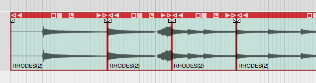

*Multiple Clips Selection*

Once you have multiple clips selected, you can perform operations on
them as a group, such as moving them by dragging, duplicating, or
deleting them. We'll cover more about clip editing operations in
[Basic Audio Editing](basic-audio-editing). To clear a multiple
selection, simply press the Esc key.

Another way to make a multiple selection is to use the lasso tool.
Here's how that works:


*Multiple Selection with Lasso*

1.  Hold down Opt / Alt until you see a **plus** cursor.
2.  Now as you drag, the cursor draws a yellow box.
3.  Anything the yellow box touches gets selected.

**Tip:** You can further customize a multiple selection by holding down
Cmd / Ctrl then click any clip you want to de-select.

## Shift Selecting Clips

Waveform also supports Shift-select. This is a quick way to select a
contiguous range of clips. Here's how:

1.  Select the first clip.
2.  Hold down Shift and select the last clip. This will select the first
    clip, the last clip, and all the clips in between.

Shift-select works for clips on a single track, and even across multiple
tracks.

**Tip:** Shift-select also works for many other kinds of Waveform
objects including Browser lists and tracks.

## Deselecting Clips

You can always press Esc to deselect everything.

**Tip:** Pressing Esc also works to clear selections of other objects in
Waveform like plugins and tracks.

## Using Snap-to-Grid

Snap-to-grid makes aligning clips and notes to musical time accurate and
efficient. Working with this powerful feature is crucial to using
Waveform for editing audio and MIDI.

## Enable/Disable Snap-to-Grid

To toggle snap-to-grid on or off, click on the *Snap* button (Q) in the
Master section. When snap-to-grid is enabled the *Snap* button appears
highlighted.


*Snap Button Enable in the Master Section*

Pressing Q also toggles *Snap* on and off. You can also control the
snapping state from the menu section - *Snapping > Enable snapping.*

**Tip:** Remember the keyboard shortcut Q is short for quantize.
Snap-to-grid is a form of quantizing. If you don't like that shortcut,
you can always remap it to another key.

## About Snap Resolution

The snap resolution is dependent on the zoom level. If you're zoomed way
out, the snap resolution might be one bar. The more you zoom in, the
snap resolution gets finer and finer.


*Hover Over Timeline to See Snap Resolution*

**Tip:** You can always see what your current snap resolution is by
hovering the mouse pointer over the Timeline. A tooltip appears showing,
*Snap resolution bar*, *Snap resolution beat*, or *Half beat* for
example.

## Snapping Clips to the Grid

As you drag a clip, it snaps to the grid increments. If you want to see
exactly where it's snapping, look at the *Start* parameter in
Properties. Snap-to-grid makes it easy to align a clip to a bar or beat
of the music.


*Clip Properties *Start**

**Note:** Snap-to-grid is an alignment of the beginning of a clip to a
grid line. Notice that snapping also applies to editing functions like
trimming.

## Snapping the Cursor to the Grid

Snapping may affect how the cursor is positioned depending on another
setting. Turn on *Snapping > Snap cursor movement* and the cursor
position will snap to the grid. Remember that the snap resolution is
determined by the zoom level.


*caption*

To test this, zoom out so that the snap resolution is "Beat." Now move
the cursor around and it will obviously snap to the nearest beat.

**Tip:** To get clear indication of exactly where the cursor is, look at
the time display in the Master section.

## Snapping Clips to Other Clips

Another snap behavior is to *Snap clips to neighbors.* With *Snap clips
to neighbors* off, clips snap to the grid normally. However, with
*Snapping > Snap clips to neighbors* turned on, clips snap to other
clips. It seems as if they are magnetically attracted to each other.
This is useful for any editing where you want to arrange clips
end-to-end, for example when editing voiceover tracks.


*Snap Clips to Neighbours Option*

**Tip:** A problem with *Snap clips to neighbors* is that you need to
have snapping enabled for it work. To snap clips to other clips with
with snap-to-grid disabled, just hold down Opt / Alt as you drag. This
is really the best way to arrange clips end to end!

## Overriding Snap-to-Grid

Temporarily override snap-to-grid by holding down Cmd / Ctrl. Using this
modifier, you can freely position clips without first turning off
*Snap*.

## Nudging Clips

To move clips using the keyboard, select a clip then press *Shift +
Right Arrow* or *Shift + Left Arrow.* The nudge action moves the clip by
one grid increment. You can also move clips track to track using nudge.
To nudge clips track to track, use *Shift + Up Arrow* and *Shift + Down
Arrow.*

You can use nudging when moving large selections of clips over, to add a
song section or make room for an intro.

**Note:** Nudging works the same whether snapping is on or off. The
nudge move is by the grid increment.

## Nudging Notes

Snapping is useful when working with Audio clips, but even more so when
working with MIDI notes. We cover MIDI editing in [MIDI editing](midi-editing) However, here is a preview while we are on the topic of
nudging.


*The Waveform MIDI Editor*

Double-click on the header of a MIDI clip. It goes into the large view
so you can see the MIDI editor. MIDI notes work much like clips, in that
they respect the snap resolution. You can drag a note to snap by the
current grid increment: bar, for example. You can nudge notes forward or
backward in time by the grid increment as well. To do so, hold Shift
while pressing the Left Arrow or Right Arrow.

**Tip:** Remember the keyboard shortcut Q to toggle *Snap* on and off.

## Moving On

Now that you've learned how to get around in Waveform, it's time to
start having fun manipulating audio. We'll jump into that in the next
chapter.


# Audio Clips and Editing Audio

In this chapter, you are going to learn how to work with Audio clips.
and how to work with the integrated editing handles that are part of
each Audio clip.

## Parts of an Audio Clip

Notice that an Audio clip has several parts. It has a header that
includes trim and slip handles. It has a body that contains the waveform
thumbnail and fade handles.


*Main Parts of and Audio Clip*

Header
- Move Audio clips by dragging from the header. The header includes
    the trim handles (hollow), slip handles (solid), and other tools.


*Audio Clip Header*

Body
- The Audio clip body features the waveform thumbnail, fade handles,
    and the clip name.


*Audio Clip Body*

Plugins
- Audio clips can host plugins directly, so you might see one or more
    plugins right on the clip body. Learn more about that in [Clip Effects](clip-effects).


*Audio Clip Effects*

Properties
- Like most other object in Waveform, Audio Clips have lots of
    additional properties and controls in Properties.


*Audio Clip Properties*

**Note:** If you accidentally move or edit an Audio clip, you can always
press *Undo* (Cmd + Z / Ctrl + Z) at the top of the Menu section.

## Moving Clips

As you move the mouse pointer over the Audio clip header, it changes to
a grabbing hand. Use that to drag the clip forward or backward in time.
If *Snap* is on, the beginning of the clip will snap by grid increments.


*Move Audio Clips by Dragging from the Header*

**Note:** As we discussed previously, the grid resolution depends on the
zoom level.

You can also drag Audio clips from track to track. With snap enabled,
track-to-track drags will usually stay in sync. However, with snap
turned off, it is easy move the clip slightly off time. To prevent that,
hold down Shift as you drag track to track. The Shift key, constrains
the timing of track to track drag moves.

**Tip:** Another way to move a clip track-to-track without changing the
timing is to use nudge. Select the clip the hold down Shift and press Up
Arrow or Down Arrow to nudge it to another track.

## Deleting Clips

The easiest way to delete a clip is to selected it and press Delete or
Backspace. The cut (Cmd + X / Ctrl + X) keyboard action does the same
thing. If you need yet another way to delete, locate and click the
convenient *Delete* button in Properties.


*Audio Clip Properties *Delete* button*

**Tip:** As you work with clips sometimes you just want clear the
selection. The fastest way is to just hit Esc.

## Audio Clip Handles

Each Audio clip header includes six handles that you use for trimming,
slipping, stretching. These are represented as four arrows and two
boxes.

Trimming
- Hollow left and right arrows on both of the upper corners of the
    clip are trim handles. Grab a trim handle and drag left or right to
    trim the start or end of the the clip. Notice that trimming this way
    directly changes the *Start* and *End* values in Properties. With
    *Snap* turned on, trimming snaps to the grid. To trim freely, hold
    down Cmd / Ctrl as you drag or turn *Snap* off.


*Audio Clip Trim Handles*

Slip Editing
- Slip editing means moving the waveform within the clip without
    altering its *Start*, *Length*, or *End* values. Drag the solid box
    shaped handle left or right to slip edit. You can override
    snap-to-grid during slip editing by holding down Cmd / Ctrl.


*Audio Clip Slip Handle*

Reframing
- The hollow box shaped handle allows reframing the clip. Drag it left
    or right and the clip moves but the waveform doesn't. It essentially
    allows you to reframe the audio without affecting its timing.

Slip Trimming
- The solid left and right arrow handles are for slip trimming. Try
    dragging the left solid arrow. Notice that it moves the clip *Start*
    while keeping the *End* planted. Now try the right solid arrow.
    Moving that one, moves the *End* while keeping the the *Start*
    planted. Although this operation seems similar to trimming, the
    difference is that the underlying waveform slips relative to the end
    that is not moving.

**Tip:** With *Snap* on, hold down Cmd / Ctrl as you drag to temporarily
override snapping for most editing operations.

**Video Clip:** [Basic Audio
Editing](https://w-edstrom.wistia.com/medias/qr0fax85zn)

## Splitting a Clip

Splitting Audio clips, is essential for audio editing. Here is the
quickest way:

1.  Select the clip
2.  Position the cursor where you want to make the split
3.  Press slash (/)


*Audio Clip, Right after Split*

**Tip:** If you want to make numerous splits, you can keep holding down
the left mouse button as you drag the cursor and press slash (/) - never
lifting the mouse button.

Audio Clip Properties also has *Split Clips* actions. Look to the far
right of in Properties and find the *Split Clips* button. You will find
options to slip at the cursor along with options to split at the
in-marker or out-marker. Keep in mind that these actions will only
affect selected clips.


*Audio Clip Properties, Split Clips Actions*

## Duplicating Clips

To duplicate one or more clips, select the clip and press D. That will
copy the clip and paste it right after the original clip. Duplicate
works like copy and paste, all in one action.

**Tip:** If you want to use a different key for the duplicate action,
you can change it in *Settings tab > Keyboard Shortcuts > Editing
Functions: Duplicate*.

## Fade-in/Fade-out

In the upper corners of the Audio clip body, notice the fade handles.
Each is shaped like a tiny box with a diagonally line through it. Grab a
fade handle and pull it inward. This action draws a fade-in or fade-out.


*Audio Clip Fades*

**Video Clip:** [Fade-in/Fade-out
Demo](http://vimeo.com/user356034/fades)

By default, you will get a linear fade, but there are other fade types
available in Properties for the clip. For more control, directly edit
the *Fade In* and *Fade Out* numerical values in Properties.


*Audio Clip, Fade Properties*

## Pitch Fade

Right click on the fade handle, and you can select between a volume fade
and pitch fade. Pitch fade gives you a very cool tape stop effect or
tape run-up effect. The fade graphic is shaded darker than for volume
fades.


*Right-click Fade Handle, Pitch Fade Speed Up*

Here is a video tutorial demonstrating pitch fade:

[Pitch Fade Video
Tutorial](https://w-edstrom.wistia.com/medias/o2ff37pknl)

## Crossfades

A crossfade is fading out one Audio Clip while fading in another. Some
controls in Waveform are labeled "X-Fade" when referring to crossfade.
Here are the steps to create a crossfade:

1.  Drag a clip so that it it overlaps another one somewhat.
2.  Press X on the keyboard.


*Crossfaded Audio Clips*

That's it: a crossfade. It's a fade-out that overlaps the fade-in of the
next clip. You can adjust the fade shapes using the buttons in
Properties, just like any other fade.


*Fade-in/Fade-out Shape Buttons*

**Note:** Keep in mind that the fade shape buttons only operate on the
selected clip. You will need to select the clip on the appropriate side
of the crossfade for the fade shape buttons to work.

## Drag Crossfade

The Settings tab, General Behaviour page has a setting labeled *Default
Drag X-Fade*. It has two possible settings: *On by default* or *Off by
default*. When set to *On by Default*, the simple act of dragging a clip
so that it overlaps another clip will create a crossfade. Other DAWs
call this "auto-crossfade."


*Settings Tab, General page, Drag Crossfade Default*

**Note:** In Waveform, *Drag-X Fade* is actually a property of each
Audio clip. When you change *Default Drag X-Fade* it will only take
effect for new clips you create or add to the Edit.

## Edge Fades

When editing, sometimes you need to apply short fades to both edges of
an Audio Clip to avoid popping. This is especially true if you split a
clip in the middle of a note. The solution is add as short fade-in and
fade-out to the clip. Waveform calls those "edge fades."


**Apply Edge Fade**

The good news is that you can instantly add edge fades by clicking
*Apply Edge Fade* in Properties. This applies 7 ms fades to the start
and end of all selected clips.

## Copy and Paste

Typical cut, copy, and paste commands also work with with Audio clips:

-   Cut (Cmd + X / Ctrl + X)
-   Copy (Cmd + C / Ctrl + C)
-   Paste (Cmd + V / Ctrl + V)

## Clip Gain, Mute, & Pan

Adjusting the gain of an Audio clip is great tool for mixing. Simply
split out one phrase, or even one note and tweak the gain level.
Waveform has not only clip gain but also clip mute and pan - all
available in Properties. When working with stereo Audio clips, *Pan*
works as a balance control.


*Audio Clip Gain, Mute, Pan, & Active Channels*

Gain
- Drag the slider left or right to adjust the Gain value.
    Alternatively, click the slider and type in a value directly. The
    gain change is reflected right away in the height of the waveform
    thumbnail on the clip.

Mute
- Click the *Mute* icon to silence the clip. The waveform thumbnail
    will dim to gray.

Pan (Mono Clips)
- Drag the *Pan* slider left or right to adjust the stereo placement
    of the clip. You can also click and type in values directly. Full
    left is -1.00, centered is 0, and full right is 1.00.

Pan (Stereo Clips)
- With stereo Audio clips, *Pan* acts as a balance control. What that
    means is that as you slide it more right the left side gets quieter.
    Slide it left and the right side gets quieter. At the extreme left
    and right positions the opposite side is silent. The really cool
    thing about this is that the waveform thumbnail updates dynamically
    show to show the effect.

Active Channels (Stereo Clips)
- For stereo clips you can turn off either the left or right channels
    using the *Active Channels* buttons in Properties. When you click
    *Left*, for example, it toggles the left side off. But it's not just
    muting the left side, it switches the clip to a mono version of the
    right side material. The great thing is that the waveform thumbnail
    updates to show this instantly.

## Reversing Audio Clips

Another cool thing you can do is reverse a clip so the audio plays
backwards. Simply click the *Reverse* button in Properties. The waveform
thumbnail reverses and the sound will be backwards on playback.


*Reversing an Audio Clip*

## Merging Clips to One Clip

Following editing, you may want to combine several clips back into to a
single clip. To do so, select all the clips using shift select or lasso
selection. Then choose *Render Clips > Merge the selected clips* in
Properties.


**Render Clips > Merge the selected clips**

In a few moments, Waveform combines them into a single contiguous clip.
There are many ways to merge, render, and export that we will touch on
later.


*Merge Clips, Before and After*

Here is video demo of merging clips:

[Merge Selected Clips Video
Demo](https://w-edstrom.wistia.com/medias/5h6bn8h3vg)

## Deleting a Section of Audio Removing Space

You can easily delete a section of audio from one or more clips and
remove the space between clips. While it's not entirely obvious how to
do this, it is easy if you follow these steps:

1.  Set the in-marker and out-marker over the section you want to
    delete.
2.  Select all the clips on all tracks (Cmd + A / Ctrl + A)
3.  In Properties, choose *Delete > Delete marked region of selected
    clips, and move up any selected clips* (Cmd + J / Ctrl + J).


*Delete a Section Removing the Space*

## Edit with Melodyne

Beginning with Tracktion version 6, Waveform has included the incredible
Celemony Melodyne ARA technology, for pitch and time manipulation. A
Melodyne Essential license is included and you will have received
information on how to install it, along with your Waveform order.

Here is how to invoke Melodyne on an Audio clip:

1.  Select an Audio clip.


*Change *Stretch* Property to *Melodyne**

1.  In Properties change the *Stretch* property to *Melodyne*. The word
    Melodyne appears at the center of the clip.


*Audio Clip with Melodyne Invoked*

1.  Click the word "Melodyne" at the center of the clip to open the
    Melodyne UI.


*The Melodyne UI*

1.  Edit pitch and time by manipulating the note "blobs" in the Melodyne
    UI. Note that the transport and loop is synchronized between
    Waveform and Melodyne as you edit.

**Tip:** To learn all about Melodyne click *Help > Manual* within the
Melodyne UI. Skip the section on Loading, Transferring and Saving, as
those operations are handled automatically by ARA.

Here is how to remove Melodyne from a clip:

1.  Select an Audio clip that is using Melodyne.
2.  In Properties change the *Stretch* property to *No Time-Stretching*
    or *Elastic Pro*. Melodyne is removed from the clip.

**Video Clip:** Here is a video clip that explains [how to invoke
Melodyne in Waveform](https://youtu.be/N3T8G-qF4zQ).

## Moving On

Those are the simple but powerful tools in for editing Audio clips in
Waveform. We didn't even cover time stretching, Warp Time. But, these
are the fundamentals. Let's move on to looping Audio clips in the next
chapter.


# Working With Loops

In this chapter we introduce the looping capabilities of Waveform. You
can drag in files from your loop library as Audio clips, repeat them
with the Duplicate (D) action, or switch any Audio clip into looping
mode and roll out repetitions over as many bars as you want. This makes
it easy, for example, to extend a short loop into a beat to play over
the full length of a song. Loops have a special tab in Properties. which
we will explore in this chapter as well.

## Getting Loops Into Waveform

There are four ways to copy loops into an Edit.

1.  Use the Browser Files tab and navigate to wherever you have audio
    files and loops on your system. Drag loops you find there to tracks
    in the Edit. As you drag in loops they appear as an outline until
    you drop them.
2.  Use the Browser Search tab and search for loops and then drag them
    into your Edit. The Browser also gives you the ability to preview
    loops to help you select the right one for the song.
3.  Simply drag them from you computer desktop drop them onto tracks .
4.  From the menu section, select *Import > Import an audio or MIDI
    file*. Navigate to a file on your system and click open. The *Select
    a file to import* dialog box even includes a basic file audition
    function with *Auto-play*.

## Setting the Edit Tempo

If you know the tempo of the loop, you might want to set the tempo of
your Edit to that tempo before dragging the loop in. That will give you
the most natural results.


*Changing the Tempo*

Here is how to change the tempo:

1.  Click on the BPM setting in the Master section. Properties will show
    the *BPM* value.
2.  Click on the *BPM* value and type in the new tempo.

## Dragging Loops to a Track

As you drag a file to to a track, you'll see an outline of the Audio
clip before you drop it. Position the beginning of the clip right where
you want it on the track, then just drop it.If it's not in the right
place, grab the Audio clip from the header and drag it into place.

After dropping a loop, notice that the cursor jumps to the end of the
loop. This is to position the cursor to drop in the next one, as you
build up a track.

**Tip:** If you don't like having the cursor jump to the end when
dropping in loops, hold down Opt / Alt as you drag. This prevents the
cursor from jumping to the end.

If *Snap* is on, loops you drag in will snap to the grid.

## Dragging in Multiple Clips from the Browser

To drag in several clips at once, make a multiple selection in the
Browser and drag the selected loops to a track. They will be arranged on
the track end-to-end.

**Tip:** To drop a selection of clips to parallel tracks, hold down Cmd
/ Ctrl as you drag and Waveform asks if you want to put them on one
track or separate tracks. This is great when working with multitrack
drum loops. It even creates additional tracks if there aren't enough
available.


*Dragging Loops to Separate Tracks*

## Looping the Loop

Audio clips have an L icon on the header. Click the L to toggle looping
mode for that clip. Once the clip is in looping mode it will immediately
appear to be twice as long. Enabling looping gives you one repeat right
away.


*Audio Clip Loop Mode*

To repeat the clip, drag the right trim handle and roll out as many
repeats as you want. You will see a white repeat divider at the start of
each repetition. The underlying audio wave file is not duplicated, it is
just being replayed over and over. All other editing operations work the
same as any other loop.

To stop looping, click the L icon gain to toggle looping off. That
returns the clip to a single cycle.

There is another way to activate clip looping. Select the clip then
click *Loop this Clip* in Properties. From there you can select the
number of times to loop. This is an alternative to dragging the right
trim handle to roll out repetitions.


**Loop this Clip* in Properties*

The nice thing about looping is it doesn't take up any additional space
in the project. You can loop just about any clip. You could take a four
bar drum loop and separate out one or two bars of the main groove then
loop it. That can give you the starting point for a song. Roll it out
across the entire song, and you've got something more inspiring than a
simple click track to play against.

## Duplicating Clips

Another way to repeat a clip is to duplicate it. To do so, select a clip
and press D. Duplicate is the equivalent of copy followed by paste. The
duplicate clip is placed immediately after the selected clip.


*Duplicating a Clip*

This is the best approach if you plan to edit the audio in a unique way
for that section of the song.

## Loop Properties

Notice that Properties has a second tab labeled *Loop Properties.* This
tab appears whenever you select an Audio clip. These properties are
related to the underlying wave file. Tweaks to these properties affect
how the Audio clip will respond to tempo, pitch, and time stretching.
Here is a description of the most essential properties on the Loop
Properties tab:


*Loop Properties Tab in Properties*

Auto-Pitch
- With *Auto-Pitch* enabled, Waveform will change the pitch of the
    clip appropriately to match key change events in the Tempo track.
    This only works if you have a *Root Note* set for the file; more on
    that in a moment.

Auto-Tempo
- With *Auto-Tempo* ticked, the Audio clip will be automatically
    stretched to match the song tempo and tempo changes in the Tempo
    track. For *Auto-Tempo* to work, you need to make sure you have the
    *Root Tempo* set for the file and *Stretch* set to an appropriate
    algorithm.

Warp Time
- With *Warp Time* enabled the waveform view to the right becomes a
    Warp Time editor. You can add warp points and do fine timing
    adjustments. This powerful feature is covered in detail in [Warp Time](warp-time).

Time Signature
- Edit *Time Signature* values to set the time signature of the file.

Root Tempo
- *Root Tempo* is the original tempo of the loop file. Waveform uses
    this to know how much to stretch the file to sync it to the Edit
    tempo. If *Root Tempo* is not recorded along with the loop file, you
    can set it here. Files created within Waveform will automatically
    have the *Root Tempo* set to match the Edit tempo.

Beats
- The *Beats* parameter is the number of beats in the file. Using
    *Beats* and *Root Tempo* Waveform calculates the length of the loop
    file in musical terms.

Pitch Offset
- If you just want to pitch the file up or down, enter an offset value
    for *Pitch Offset*.

Stretch
- *Stretch* sets time stretching algorithm used for this loop file.
    Usually you will want to use Elastique (Monophonic) for lead vocals
    and solo instruments. Use Elastique Pro for everything else.
    Melodyne is typical selected used for pitch correction.

Waveform View
- The waveform view allow you to play the file. You can also adjust
    the in and out loop points by dragging the purple lines inward.
    There is a convenient level control here as well. This view is
    replaced by the zoomable Warp Time editor when *Warp Time* is
    enabled.

Loop Start/End
- This button contains a few quick tools to set the start and end loop
    points of the underlying wave files to match the current Audio clip
    start and end points.

Beat Points
- *Beat Points* are a type of marker that shows where the transients
    are to assist with time stretching. This concept is very similar to
    how acidized files work. With the latest Elastique Pro stretching
    algorithms manually manipulating the beat points is not necessary.

Add to Library
- If you create an Audio clip loop and might want to reuse it in other
    projects, click *Add to Library* then give it a name and tags.

**Note:** When you use *Add to Library*, the loop file will be saved to
the *User Loops Path* folder as designated on the Loop Database page of
the Settings tab.

**Tip:** If you want more control when adding loops to your library, try
*Export > Render to a File*. If you choose, *Only Render Selected
Clips* you get much more control over its properties and where to put
the resulting file.

## Moving On

There's a lot more you can do with clip looping, loop files, and loop
libraries in Waveform, but those are the fundamentals.


# Keyboard Shortcuts

In this chapter you will learn how to customize the keyboard shortcuts
in Waveform. In [Introduction](introduction) we covered how to change the
default keyboard mapping. In short, go to the Settings tab and select
the Keyboard Shortcuts page. Then near the bottom of the page click
*Reset to Defaults*, and choose *Use alternative Waveform key-mappings*.

**Note:** The alternative Waveform key-mapping is used for all examples
in this book.

## Keyboard Shortcuts Page

The Keyboard Shortcuts page on the Settings tab shows all of the
key-mappings. You can easily change those to your liking or match them
to a DAW you are already comfortable with.


*Keyboard Shortcuts Page on the Settings Tab*

Waveform allows you to have more than one shortcut tied to a single
action. This is really helpful if you want to have a way to do something
on your laptop, but then take advantage of the extended keypad when
you're working on a desktop computer.

## Setting a Keyboard Shortcut


*Map Record to the Asterisk on the Keypad*

Let's take a look at an example. To start recording you click the
*Record* button in the transport or press keyboard shortcut R. When
working on a computer that has a full size keyboard, you may prefer to
start recording by hitting the asterisk (\*) key on the keypad. To do
so:


*Setting a Keyboard Shortcut*

1.  To the far right of each action there's a plus icon. To create or
    add a keyboard shortcut to an action, click the corresponding plus
    icon. The *New Key-mapping* dialogue box opens up.
2.  Type the key or key combination that you want to trigger this
    action. The key or key combination will be identified in the
    dialogue box and it will also show you if there's a conflict with an
    existing mapping. For our example, press asterisk (\*) and then
    click OK.

Now, both R and the keypad asterisk (*) are assigned to the Record
action. Back in the Edit test this by turning \*Record* on and off using
either R or asterisk (\*).

**Note:** Keyboard mappings are global. Any changes you make will be
active for all your Edits.

## Changing a Keyboard Shortcut

To change an existing shortcut, click directly on the key-mapping at the
far right of the action. Choose between *Change this key-mapping* and
*Remove this key-mapping*. If you choose the *Remove* option, the
key-mapping disappears. If you choose the *Change* option the *New
key-mapping* dialog appears and you can enter a new assignment.


*Click to Change or Remove a Key-mapping*

## Saving Keyboard Shortcuts to a File

Once you have your keyboard shortcuts set up the way you want, you can
save the entire key-mapping to a file, a very good idea. If you run
Waveform on a different computer, you can simply import the file, and
will then have all your familiar assignments ready to go.


**Save Key-Mappings* Button*

To save your shortcuts setup, click *Save Key-Mappings* and Waveform
presents a dialogue box requesting a file name and path. You can store
the key-mapping file anywhere you like. Waveform key-mapping files have
the `.Tracktionkeys` extension.


**Save Key-Mappings Dialog* Box*

**Tip:** You could create a 'settings' folder under your main Waveform
folder to hold such files, naming the key-mapping files with a version
number at the end. This gives you the ability to easily roll back to a
previous version if you ever change your mind about a new keyboard
layout.

## Loading Keyboard Shortcuts from a File

If you're working on a new installation or move to a new computer you
can load your custom key-mapping file. Go to the Keyboard Shortcuts page
on the Settings tab and click *Load Key-Mappings*. Find your exported
key-mapping file then click *Open*. All your key-mappings are restored.


**Load Key-Mappings* Button*

## Printing a List of Keyboard Shortcuts

If you want to print a list of all your current keyboard shortcuts,
click *View as HTML* at the bottom of the Keyboard Shortcuts page. This
loads a nicely formatted, searchable view of all the current
key-mappings into your browser. From there you can search it or print it
using normal web browser features.


**View as HTML* Button*


*HTML View of the Keyboard Shortcuts List*

## Moving On

At this point you should have a good handle on how to customize the
keyboard shortcuts in Waveform. Since T6, Waveform offers powerful macro
scripting you can use to further customize keyboard shortcuts. For more
about that, see [Macros](macros).


# Recording Audio

Now it's time to learn how to record your own instrument or vocal tracks
into Waveform. First, you will learn how to configure track inputs for
recording. Next, you will learn how to use Waveform's built-in metronome
to provide a reference click, in order to to keep your recordings in
time.

## Configure the Input

We covered audio device setup back in [Audio Device
Setup](audio-device-setup). Refer back that chapter if you have any questions
about setting up your audio interface.

As a reminder, before recording with Waveform you need to use the
*Auto-Detect* feature to establish proper recording sync between
playback tracks and newly recorded tracks. This essential step,
calibrates the timing offset so that system latency doesn't throw off
the timing of your overdubs. Re-run *Auto-Detect* test anytime you
change your interface hardware or buffer setting. The [Auto-Detect
procedure] is explained in detail in Chapter 4.

**Warning:** To configure Waveform for recording you must use the
Auto-Detect feature along with a hardware loopback. If you don't then
your overdubbed tracks will not be in sync with existing tracks. While
this is not difficult, it is essential to do this manual step anytime
you change the Audio Device Setup.

## The Input Object

At the far left of every track, you will find the input section. Each
track has an input object that looks like a rectangular arrow pointing
right.


*Track Input Object*

**Tip:** If you don't see the input objects, click the *Show/Hide
Inputs* (Shift + F12) button at the top right corner of the Edit tab.


*Show/Hide Inputs Button*

Click on an input object to see a menu of options. From the menu, select
which hardware input to use for recording to this track. You can set it
to *No input* or select any input from your audio interface. In this
case it's set to *Input 1.*


*Input Menu*

When you select an input, the input object shows the input name, a
real-time input meter, and the record arm "R" button. Also, a full set
of input properties appears in Properties.


*Input Controls & Properties*

## Customizing Input Names Globally

If you are happy with the default input names that's great, however, you
can customize them with friendlier names using the *Alias* property.

To change your hardware input alias names globally, go the Settings tab,
Audio Devices page. Select an input in the *Channels* list and edit the
*Alias* name in Properties.

## Customizing Input Names for an Edit

There is another way to rename inputs, but only for the current Edit. In
the Edit, select an input and notice the *Alias* name in the Properties
section. Change this to customize the input name for that particular
song. As an example, you could use this to indicate the microphone used
in the session.


*Customized Input Names Using the Alias Property*

## About MIDI Inputs

Notice that on the input menu, you can choose MIDI interface inputs.
There's really no difference between an audio and a MIDI track. A track
can contain Audio clips or MIDI clips. You just need to set the input
appropriately and insert the correct kind of plugins.


*MIDI Devices on the Inputs Menu*

In essence a track behaves like an audio track if you set an audio
input; it works like a MIDI track if you set a MIDI input and insert a
virtual instrument plugin.

## Setting Up Inputs for Multi-track Recording

It's very convenient to assign all inputs to consecutive tracks using
*Assign all inputs to consecutive tracks* from the inputs menu. It does
exactly what the name says, allowing you to quickly set up for
multi-track recording. This is great if you're setting up to record a
live performance through a digital mixer with a lot of inputs.


**Assign All Inputs* from the Input Menu*

## Number of Inputs

This feature is something uniquely Waveform. You can set up more than
one input on a single track, up to four inputs assigned to a track.


*Assign up to Four Inputs to One Track!*

Now, if you record with more than one input armed, you will get a
separate clip for each. This results in stack of audio clips.

A good use of this feature is to have several recording chains
configured and ready to go, when auditioning microphones and preamps.
Simply arm the input you want to try and away you go. It makes it super
efficient to switch to a different mic/preamp combination by simply
arming the desired input.

## Enable a Track for Recording

To enable (arm) a track for recording, click the *R* symbol on the input
object. The R illuminates to indicate that the track has been armed for
recording.


*Input Armed for Recording*

Test the input signal. If you're using a microphone or a guitar, play a
note or have the singer sing something. You should see the meter moving
on the input while testing. If not, check your input level on the
hardware and make sure phantom power is on if necessary for the mic.

**Tip:** Once recording has started you can still click *R* to enable
and disable recording on the fly. This allows you to do manual punch-in
and punch-out style recording. Here is a video that explains [Punch
In/Out on the Fly.](https://w-edstrom.wistia.com/medias/wgjyszl1i6)

## Hit Record

With the input setup done, recording is a matter of clicking *Record*
(R) on the Transport. While recording, Waveform draws the waveform on
the track. To stop recording press Spacebar.

Recording always starts at the cursor position. There are several ways
and options to stop recording which will be explained in a bit.

## Enable Recording for All Inputs at Once

If you are doing multitrack recording with many inputs you can arm all
the tracks at once from the input menu using the option *Enable/Disable
all devices for recording* (Cmd + R / Ctrl + R). You can even use this
on the fly during recording to start and stop recording without stopping
the transport.

## Input Meters

Click on an input to select it. Notice the large meter along the bottom
edge of the Properties section. This gives you a good reference for
setting up the input level.


*Large Input Meter at the Bottom of Properties*

**Tip:** As a rule of thumb, you want to set input level to hover around
the middle of the range shown on this meter. The input level is adjusted
using the gain controls on your audio interface or preamp.

If you're doing multi-track recording and you want to see large meters
for all the tracks at once, press F12. Waveform will go into "big
meters" mode. This superimposes a very large meter onto each track.


*Big Meters Mode*

**Note:** The big meters obscure your view of clips on the tracks, so
you will want to toggle it off (F12) when not recording.

## Dragging the Input Object Track to Track

Here's a unique aspect of the input objects. You can drag the input
object from track to track. For example, say you recorded something on
track one, and now you want to record something else using the same
microphone onto track two. Simply, grab the input object and drag it
from track one to track two. The set up is done instantly.


*Dragging and Input to other Track*

**Note:** Dragging the input track to track is a really useful function
in Waveform. Once you start using this feature you will miss it when you
record with any other DAW!

## Renaming a Track

To rename a track, click directly on the track name, then edit the
*Name* property in the Properties section. A really quick way to do this
is to click *Name*, press Tab, and start typing. As soon as you tab off
the *Name* property or click elsewhere in Waveform, the new track name
will be set.

## Recording Steps in Review

Here is a review of all the steps needed to test your recording setup:

1.  Arm the track or tracks for recording by clicking 'R' on the track
    input.
2.  Make sure *Loop* is turned off in the Master section.

**Note:** Waveform supports loop recording but we'll get into that in a
later chapter.

1.  Make sure the cursor is rewound to beginning by clicking
    *Return-to-zero* (Home) in the Master section.
2.  Verify that *Click* (C) is turned off (for now) in the Master
    section.
3.  Click *Record* (R) in the Master section. Play something into the
    input using your instrument or your voice depending on the kind of
    input selected.

**Note:** As you record, you'll see the meters and you'll also see the
waveform start to draw on the Audio clip.

1.  Press Spacebar to stop recording.
2.  To hear what you recorded, click rewind then press Spacebar to play.
    You should be able to hear what you just recorded.

**Tip:** If your recorded take just isn't really going well, you can
press *Abort* or *Abort & Restart* on the transport. These options only
appear during recording.


**Abort* and *Abort & Restart* During Recording*

## Working with the Click

While recording, it's often very helpful to have an audible timing
reference. Waveform has a built-in metronome that offers a steady click
for just this purpose.

## Enabling the Click Track

To enable the metronome click, turn on *Click* (C) in the Master
section. That turns it on but the setup is in the *Click Track* Menu.
Here are explanations for the options:


*Click Settings*

Enable Click
- Another way to enable or disable click is to open the *Click Track*
    menu and select *Turn on click track* or *Turn off click track*.
    That does the very same thing as pressing C or clicking the *Click*
    button in the Master section.

Click Volume
- Adjust the volume of the click using the *Click Track > Volume
    slider*. There are also *Low volume* (-14dB) , *Medium volume*
    (-4.4dB), and *Full volume* (0dB) presets available.

**Note:** Curiously, *Full volume* is not actually full. The Volume
slider goes to +3db. That's three more than *Full volume* if you are
keeping score.

Count-in
- While recording, you can have the click start a bit before the
    cursor position. This gives you time to get into the groove before
    performing. Enable the count-in from *Click Track > Pre-record
    count-in length*. Select from *none*, *one bar*, *two bar*, or *two
    beats* for the count-in length.

With count-in enabled, you will hear the click during recording. If the
cursor is at the beginning of the Edit, you will hear the count-in then
the cursor will start moving. If the cursor is not at the start, it will
actually jump back by the count-in length and play from there.


*Count-in Options*

Click During Playback
- If you want to hear the click during playback, make sure to leave
    *Click Track > Only click during recording* disabled.

Emphasize Bars
- To clearly hear the downbeat of each bar, enable *Click Track > Use
    loud clicks to emphasize bars*. With that enabled, Waveform uses a
    different sound for the first beat of each bar.

Click Sound
- To change what sounds are used for the click, select *Click Track >
    Change Click Settings*. This opens the *Click Track Settings* dialog
    box. From here, you can change the samples used to make the click
    sound. Just select the audio files for the normal and emphasized
    beats. If you leave the *File* properties blank, you will get the
    default sounds.


*Configuring the Click Sound*

Not too many people still do this, but it's possible to use an external
MIDI sound module for your click sound. If you are inclined to do that,
you can set the MIDI note numbers in the *Click Track Settings* dialog
box.

Click Output Device
- If you want to redirect your click so it's not coming through your
    main speakers, look at the click output device options (*Click Track
    > Output device for click*). Normally and by default this is set to
    *Default audio output*. You can pick any audio output on your system
    or even any MIDI output. If you select a MIDI output, it should be a
    sound module of some sort. When using MIDI for the click, you can
    set the click sound note numbers as explained in the previous
    section.

Using a click is an essential reference tool for studio recording, so it
is great to have a synchronized click built-in and ready to go.

## Listening on Headphones While Recording

Ideally, you will monitor what you're recording through headphones, and
set up the level and mix on your audio interface outside of Waveform.
Most audio interfaces give you the ability to mix your live input with
the playback from previous tracks. You use the mixer on the audio
interface to balance the live input sound with the sound being played
back by Waveform.


*Audio Interface Mix Knob*

Simple audio interfaces have a mix knob that allows you to mix between
the inputs (your mic) and playback (previously recorded tracks). For
example, when recording a vocal leave the mix knob just about in the
middle. Half of what you hear is the live input off your mic, the other
half is what's being played back from Waveform.

Some audio interfaces do not have a specific knob on the front panel to
control the mixer level, and instead have an application that you run
alongside Waveform that features a virtual mixer. These applications
allow you to set up the monitor mix in your headphones separately from
what's happening in the recording software.

## Live Input Monitoring

There are situations where you need to use live input monitoring through
Waveform, rather than through your interface. The two main use cases for
that that are when playing through virtual instruments, or virtual
guitar amps while recording. We will cover the details later in the
book, but here are a few points for those curious about such things.

Step 1. Disable Hardware Monitoring
- To try live monitoring through Waveform, first set up a track and
    arm it for recording. Now, play something into the input using a
    mic, guitar, or other instrument. At this point you shouldn't really
    hear anything through Waveform to your headphones or speakers.

Step 2. Enable Live Input Monitor
- Now make sure the input is selected and look for the *Live Input
    Monitoring* option in Properties. Click to enable it. You should
    hear the input going through Waveform and back out to your speakers
    (or headphones).

The downside is latency. You might possibly notice a delay between when
you play a note and when you hear it. It's a time lag between you sing
and when you hear it in your headphones. At high buffer settings it will
sound like an annoying delay slap or echo. At lower buffer settings it
might sound like a hollowness if you are singing with headphones on.
When playing an instrument, you might not hear any problem at all.

To really hear the effect of latency, try turning the buffer size up to
1024 or even more. Then as you play you'll hear a noticeable delay
between when you sing, speak or play a note and when you hear it.

**Note:** Latency delay is more of a problem for singers than it is for
somebody playing guitar or another instrument. The sound of your voice
is coupled through your skull right into your ear with zero latency.
When combined with your voice slightly delayed through the interface and
software the result might seem hollow or "phasey." This won't be
recorded, but might throw you off during recording.

Why then would you ever use live input monitoring? You need it for
guitar amp simulators and for virtual instruments. For normal vocal and
instrument recording, it may be preferable to use your audio interface
to provide zero latency monitoring.

## If at First You Don't Succeed

With a track armed, hit *Record* and record away. Press *Record* a
second time (or Spacebar) to stop recording. If you don't like what
you've recorded select the Audio clip and press Delete or Backspace.
Rewind and try again! You can alternatively press *Undo* (Cmd + Z /
Ctrl + Z) to undo the last recording take.


*Recording in Process*

## Abort Record and Delete the Take

If you are impatient to delete a failed recording take, then you will
love this feature: *Abort recording and delete the take.* With a single
keystroke you cancel the take, throw it out, rewind to the beginning,
and get set to try again. The *Abort* button on the transport does the
same thing.


*Abort Buttons on the Transport During Recording*

There is a variation on this feature: *Abort recording, delete take, and
restart*. That does the same thing, but then drops right back into
recording. This action appears on the transport during recording as the
button \* \*.

## Recording a Stereo Signal

If you are recording a pair of microphones or a stereo source like a
keyboard, you can treat two adjacent inputs as a stereo pair. This is
done in the Settings tab, Audio Devices page. Click on an input then
enable *Treat as Stereo Pair* in Properties.

Now instead of two inputs, you have one stereo input. This will appear
over in the Edit when you select inputs for a track. The pairs are
always created with the odd numbered input on the left and the even
numbered input on the right.


*Treat as Stereo Pair*

When you record from a stereo input, you'll wind up with a stereo clip
showing both the left and the right waveforms.


## Retrospective Record

You know how there are times where you wish you were recording because a
practice take was so amazing? Or maybe a singer sings a pickup just
before the downbeat. Waveform's "Retrospective Record" feature actually
keeps a recording buffer running for any track that has an input set up.

To enable this feature, from the Menu choose *Option > Retrospective*
record and select the buffer size. We find that the 30-second buffer is
usually enough to safe-guard against chopped off picks or endings. For
live shows or recording speeches, set it to 10 minutes.


*Enabling Retrospective Record*

To recover lost audio, simply click the retrospective record icon in the
upper right corner of the Waveform window. The buffered audio will be
added as Audio clips to the appropriate tracks. If you click the icon
while the transport is still running, the audio will be synched to the
timeline. If you click the icon with the transport stopped, the audio
will be placed at the cursor. In that case you will need to manually
align the clip to the track.


*Click Retrospective Record Icon*

Retrospective record doesn't consume much CPU and is a great safeguard
against losing important audio or a killer take.

## Safe-Record Mode

When recording shows, doing long recordings, or if you ever need to
leave your computer unattended while it's recording, consider enabling
Safe-Record (*Options > Safe-Record mode*).


*Safe Record Mode*

In safe-record mode, you starting recording in the normal way. However,
as soon as recording starts, Waveform shows a the Safe Record modal
dialog box. You can't do anything in Waveform including stop the
recording without entering the four key shortcut.

Here is how to get out of safe-record mode:

OS X: Shift + Opt + Cmd + R Windows: Shift + Alt + Ctrl + R


*How to Exit Safe Recording*

Those are the defaults, but you can change those to any other crazy key
combination you want.

## Moving On

That was a lot of information about recording audio in Waveform. In the
next chapter we will continue on with overdub recording.


# Recording Overdubs

In this chapter we walk through an example of recording a simple song.
In the previous chapter, we explained how to use the *Click* feature to
hear a metronome tempo reference while recording. In this chapter we
will use a drum loop instead. Later you will learn the steps to overdub
guitars and bass, in order to create a simple tune.

**Tip:** For overdub recording, you typically do all the recording
wearing headphones with your main speakers off. This prevents bleed from
one track to the next for cleaner mixing later on.

Here are the tracks we will have by the end of the chapter:

-   Track 1: Drum Loop
-   Track 2: Acoustic Guitar
-   Track 3: Acoustic Guitar - Double
-   Track 4: Bass

## Set up the Drum Loop

1.  First, set the desired tempo. Click on the tempo (e.g. 77 bpm) in
    the Master section. Then click on the *BPM* value in Properties and
    type in the tempo.


*Click BPM to Edit Tempo*

1.  Drag in a loop from the Browser, for example a two bar loop. This
    will create an Audio clip. The example shown uses Track 1 for the
    loop, which has been renamed to "DrumLoop."


*Start With a 2-Bar Drum Loop*

**Tip:** If the loop doesn't align to the bars correctly, hold Opt / Alt
and drag the right trim arrow until it does.

1.  Click the L icon on the Audio clip to convert it to looping mode.
    Now drag the right trim handle to roll out as many copies of the
    loop as you want.


*Roll Out Repeats of the Drum Loop*

## Get Ready to Record

1.  Set up the input. In this example, the drum loop is on the first
    track, and the second track is used for recording the acoustic
    guitar rhythm part. We have selected *Input 1* where the mic is
    connected.


*Configure the Input*

1.  We won't use loop recording, so make sure the *Loop* button is
    turned off in the Transport section.
2.  Turn off *Click* because we are using the drum loop track for the
    timing reference.
3.  Let's use a two bar count-in. To set that up, select *Click Track >
    Prerecord count-in length > Use 2-bar count-in*.

## Record the Rhythm Guitar Part

1.  Use your audio interface mix knob or app to balance the level of the
    guitar mic with the level of the drum loop track. On the guitar mic
    input, make sure *Live Input Monitoring* is turned off.
2.  Next, arm the track for recording by clicking the R icon on the
    input. When you try this you will see the metering on the input
    moving if you play a chord.
3.  Test the input level by playing at the loudest level you plan to use
    for the track. Adjust the level using the gain control on the audio
    interface.
4.  Verify that the cursor is at the beginning of the edit. If not,
    press Home.
5.  Press *Record* (R) on the Transport to start recording. Now record a
    take of your song. At the end hit Spacebar to stop recording.


*Recording the Guitar Part*

**Tip:** If recording doesn't go as planned, delete the Audio clip and
try again. We went over several ways to do this in Chapter 15.

**Note:** If you hear some kind of weird phasing as you play your
instrument, then it probably means you have *Live Input Monitoring*
enabled while also monitoring through your audio interface. Disable
*Live Input Monitoring*.

## Doubling the Rhythm Guitar

1.  Following recording the initial rhythm guitar part, rewind and play
    it back. Use the Volume & Pan plugins in the mixer section to
    balance the signal with the drum loop.
2.  To double the rhythm guitar, drag the Input object to the the next
    track. Now track 3 is immediately ready to go for recording an
    overdub.

**Tip:** You might want to lower the original track 3 to 6 dB using the
Volume & Pan plugin to better balance the recorded track with your live
mic.

1.  Rewind then click *Record* in the Transport.


*Recording the Second Guitar Part*

1.  After recording, play back and balance the new recording with the
    original guitar track. To get a wide stereo effect from the doubled
    part, pan the tracks to opposite sides using the *Pan* slider from
    the Volume & Pan plugin.


*Panning Guitar Parts Left and Right*

## Overdub a Bassline

You can record the bass by connecting it directly to the audio
interface; no amp, no mic.

**High Impedance Inputs**. Identify which input on your interface
supports a direct 1/4" high impedance input. This is often indicated by
the guitar, gtr, or hi-z. Sometime you need to engage a switch or button
for the high impedance mode. Your bass or electric guitar will sound
better if you have the hi-z mode enabled.

1.  Connect your bass to the interface using a normal 1/4" to 1/4"
    guitar cord.


*Engage High Impedance Mode on Your Audio Interface*

1.  From this point, recording works exactly the same as with a mic.
    Select the correct input and adjust the input level. Make sure the
    bass has a good level but is not activating the clip LED on the
    interface using the gain knob on the audio interface.
2.  Arm the input for recording if it's not already. Adjust the levels
    of the existing tracks so that you can hear the the tracks. At the
    same time, you want to hear what you are playing on the bass.
3.  Rewind and hit *Record*. If if the take doesn't go well, stop, press
    *Undo* and try again.


*Overedubbed Bass Line*

**Tip:** If you get a good take but think you can do better, don't
delete the clip. You can drag the input to another track and try again.
Just mute the original track or clip so that you don't hear it while
recording the next take. The first take might wind up being the best
take!

## Rename Tracks

As you record overdubs, it's good idea to stay organized. One key is to
name the tracks appropriately. Click directly on the track name then
edit the *Name* property.


*Renaming a Track*

**Tip:** It can get annoying when renaming several tracks. You keep
mousing between the track and the Properties section. To avoid all the
extra mouse mileage, click the track name then press Tab. Tab puts the
focus directly on the *Name* property ready for typing.

## Adding Additional Tracks

If you get to this point and you do not have enough tracks in your
project, you can easily add tracks. There are several ways to do that.

1.  **Press T.** Select any existing track and press T. That creates a
    new track directly below the selected one.
2.  **Right-click**. Right-click in any blank space or on any track and
    select *Create new track*.
3.  **Track Menu**. Another way is to select *Tracks > Create a new
    track.* using the Tracks menu. Or, select *Tracks > Create several
    new tracks* to add up to sixteen new tracks in one go.


*Create Tracks from the Tracks Menu*

**Tip:** Like most things in Waveform, you can undo creating tracks
using the *Undo* button (Cmd + Z / Ctrl + Z). To remove a track from
your project, select it and hit Delete or Backspace.

## Rearranging Tracks

To rearrange the tracks, drag the track from the track name area and
drop it in the new position. As you drag the track, a glowing bar will
appear between tracks showing you the target for your drop. When that
bar is in the right spot, let go of the drag and the track will be
repositioned.

## Adjust the Mix

At this point you can adjust the levels of all the recorded track or
continue to record and overdub vocals, keyboards, or other instruments.
As you add more tracks, you will need to reduce the level of each to
avoid overloading the master level.


*Adjust the Mix*

**Tip:** If you temporarily overload the master meter, you can reset the
overload indicators using the backslash key ( \\ ).

## Moving on

That was a walk-through of overdubbing. At this point, you should be
getting familiar with basic recording in Waveform and have a handle on
how to work with tracks in Waveform.


# Clean-up Editing

After you have some basic tracks recored, you can use the Waveform
editing tools to clean up the clips and fix small problems with the
takes. We covered Audio clip editing in [Audio Clips and Editing Audio](audio-clips-and-editing-audio). In
this chapter we will show you a few practical examples of how to use
them.

**Note:** Sometimes it is easier to make timing edits if you move the
part you're working on near the drum part. That way you can see the
timing of your notes compared to the timing of the essential rhythmic
elements of the song.

## Trimming

The trim handles are a great way to clean up the beginning and ending of
recording takes. Trim the beginning to keep the track silent until the
part actually comes in. Then trim the end to silence any extra noise
that happens after the song is done.


*Trimming an Audio Clip*

To use the trim handle just grab and drag. If you leave *Snap* on,
trimming will snap to the grid. With *Snap* turned off, you can trim
freely.

**Tip:** You can temporarily override snapping by holding Cmd / Ctrl
while trimming.

You can also trim multiple Audio clips at the same time. Just select
several clips using Opt-drag / Alt-drag and then adjust the lengths
using the trim handles on any of the select clips.

## Correcting Small Timing Problems


*Bass Note Timing is Early*

Look at this example baseline compared to the drum loop. One of the bass
notes is early. Ideally, you would re-record this part. If that's not an
option you can easily correct small issues like this. The strategy is to
separate the out-of-time note to its own Audio clip, them move it
slightly.

1.  Turn off *Snap*.
2.  Select the Audio clip you want to fix.
3.  Position the cursor just at the beginning of the note that needs
    fixing and press slash ( / ) to split the clip.


*Split the Beginning of the Note*

4.  Position the cursor just after the note and press slash ( / ) again.
    The bad note is now separated to its own Audio clip.


*Split After the Note*

5.  Click to select the single note. Trim the clip to shorten it a bit.


*Trim the Clip*

6.  Zoom in enough so you can see the alignment between the note and the
    drums. Grab the note and slide it to line up with the correct drum
    hit.


*Drag the Clip to the Correct Time*

7.  Complete the edit by trimming and crossfading into the other notes.


*The Completed Correction*

**Splitting & Selecting**. Right after you split a clip, you'll notice
that the two resulting clips are both selected. If you trim, slip or
move a clip the action will apply to all selected clips. That might not
be what you want. To select a single clip, just click one of the clips.
At any time, you may hit Escape to de-select everything.

## Correcting Timing by Slip Editing

Another way to correct timing is with slip editing. With this approach
you "slip" the waveform within the Audio clip rather than moving the
clip. The key to this approach is to put the initial split exactly where
you want to the note to start.

1.  Turn *Snap* off
2.  Zoom in enough to see where the note should start and select the
    clip to fix.
3.  Position the cursor at the exact spot you wish the note had started
    and press slash ( / ) to split the clip.


*Split the Clip Where the Note Should Start*

3.  If the note was early, trim back the previous clip to get rid of the
    extra bit.


*Trim Back the Extra Bit From the Previous Clip*

4.  Position the cursor at the end of the note and press slash to split
    it again. The bad note will will have a separate Audio clip.


*Split After the Note*

5.  Select only the note you want to adjust. Grab and drag the slip
    handle (solid box). The waveform will slip within the window of the
    Audio clip. Align the waveform so it starts just after the leading
    edge of the clip.


*Drag the Slip Edit Handle to Adjust Timing Within the Clip*

6.  Clean up the edges with trimming and crossfading.


*The Completed Edit*

**Note:** If you have automatic crossfade turned on then as you move one
clip to overlap another, a crossfade will be created automatically. See
[Audio Clips and Editing Audio](audio-clips-and-editing-audio) for more about crossfades.

## Fade-outs

You can also adjust the fade-outs at the end of takes simply by using
the fade handle and dragging it to the left for each track
appropriately.


*Adjusting Fade-outs*

Remember, you can adjust the shape of the fade-out by selecting one of
the four preset shapes in the Properties section.


*Fade-out Shapes in Properties*

## Stretch an Ending Note

If a note at the ending isn't held out long enough, you can apply a time
stretch quite easily. Re-recording the take would be preferable, but if
that's not an option, here's how you can do a quick time stretch to
lengthen an ending note.

1.  First, separate out the note that you want to stretch using split as
    in the other examples.
2.  Hold Opt /Alt and drag the right trim handle to extend the note to
    the desired length.


*Hold Opt / Alt While Trimming to Stretch a Clip*

3.  Audition the playback to make sure that it sounds clean. The more
    you stretch it the more chance you have to degrade the audio
    quality, but you might be surprised at how well this really works.

**Note:** Besides just simply cleaning up the takes, you can do detailed
editing on Audio clips to completely change the timing or even the
arrangement. While writing songs, you can use these tools to compose
bass lines that tightly lock in with the drums. You can do this by
adjusting the timing, removing notes, or shortening notes; It all
depends on the nature of your music production. When writing a song, you
can use these tools to try many different ideas.

## Fixing Clicks at the Edit Points

When you do this type of editing, you might occasionally hear a click at
the beginning or ending of a clip. This occurs when you split across a
waveform that's actually got some energy present. You can easily correct
those by putting a very tiny fade at the beginning of the clip.


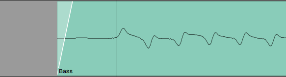

*Example of and Edge Fade*

You could zoom way in and add tiny fades to the beginning and ending of
each clip. The easier way is to select the clip and click *Apply Edge
Fade* in Properties. This instantly puts 7 ms fades at the beginning and
ending of all selected clips.


**Apply Edge Fade* in Properties*

## Rendering to a Single Audio Clip


*Chopped Up Audio Clip Following Editing*

If clean-up editing leaves your track looking like a shredded mess, you
can quickly render all the clips back to a singled clip. To do so:

1.  Select all the clips you want to combine to one clip. One way to do
    that is to click the first clip, hold down Shift, then click on the
    last one.


*Selected Clips before Rendering*

1.  In Properties select *Render Clips > Merge the selected clips*. In
    Waveform 6, merging is a single command, which is a great
    enhancement to the workflow.


**Render Clips > Merge the selected clips**


*Audio Clip After Rendering*

## Moving On

Those are some of the basic techniques you can use to clean up your
recorded tracks. Use these techniques to trim clips, apply fade-outs,
make minor timing adjustments, and then render all the changes to a
single clip.


# Warp Time

Warp Time is an audio editing option that was introduced in T6. Rather
than needing to split out notes to move them, as discussed in the
previous chapter, you can drag Warp points to bend and stretch audio
into time. Apart from simply correcting timing problems, you an apply it
creatively to compositions and loops to alter the feel of recorded
audio.

The implementation is actually very simple. You can get up and running
with Warp Time very quickly.

**Tip:** Since T7, Warp time is also available as one of the Clip Layer
Layer effects, as described in [Clip Layer Effects](clip-layer-effects)

## Warp Time Mode

Here is how to switch into the Warp Time mode:

1.  Select an audio clip
2.  In Properties, go to the Loop Properties tab
3.  Enable the *Warp Time* option


*Enable Warp Time Mode*

The waveform view on the Loop Properties tab switches to the zoomable
Warp Time editor.

## The Warp Time Editor


*Warp Time Editor on the Loop Properties Tab*

The Warp Time Editor is working on the underlying audio in the clip so
there might be much more audio shown than you see on the Audio clip.
This will usually be the case if you have trimmed the Audio clip before
hand.

**Tip:** If you want the Warp Time editor view to exactly match the
waveform on the selected Audio clip, render the clip using *Render Clip
> Flatten the selected clip*. This will create a new underlying file.
After that, what you see and hear in the Warp Time editor will match
what you see and hear in the Audio clip.

Zooming In & Out
- To zoom the waveform, use the mouse scroll wheel. On many laptops
    you can use a two finger up/down gesture in place of a scroll wheel.
    On Mac laptops you can also use a two finger left or right gesture
    to slide the waveform left and right.

Warp Points
- Click on the timeline to add a Warp point. When you drag a Warp
    point left or right, time is stretched or compressed between that
    point and next surrounding Warp points.

**Tip:** You can add a Warp point and drag in a single action. Just
click on the timeline, hold and start dragging. The waveform will
stretch until you stop dragging.


*Warp Point*

**Removing Warp Points:**
Shift-click any existing Warp Point to remove it. Right-click any existing Warp point for options to rename it or remove all Warp points.


*Warp Point Right Click Menu*

## Working with Warp Points

By default, the Warp Time editor will always have starting and ending
Warp points. If you add a Warp point and move it, the audio will be
stretched between the beginning and ending of the wave.


*Before Warping*


*Dragging a Warp Point to the Left*


*Dragging a Warp Point to the Right*

To correct audio timing over a constrained area, you can think about a
three point technique. You typically want to add Warp points just before
the beginning of notes or percussive hits. That would be just before a
transient. If you do that then stretching occurs over the note not in
the middle of it.

With the three point technique, you insert Warp points before and after
the note you want to alter to lock down the timing. Then add a Warp
point right at the transient you want to change and drag it into to
time.

## Warp Points and Snapping

As you drag Warp points, you will notice they snap to the grid. The snap
grid for Warp points is based on the zoom level of the Warp Time editor,
not the zoom level of the Edit.

To override snapping when adjusting Warp points, hold down Cmd / Ctrl as
you drag the points.

## Limitations of Warp Time editing

Warp Time editing works best for single track parts. If you use it on
multitrack drum parts, you will find it seriously affects the phase
alignment of multi-miked drum kits. This is the same for other
instruments that are recorded with multiple mics.

You can use Warp Time on stereo tracks. If you have two mono tracks,
first render them to a stereo track before using Warp Time.

## Time Stretch Algorithm

By default Warp Time uses Elastique Pro but you can switch it use any of
the other modes as well. There is little benefit in selecting other
modes, since Waveform does the actual stretching offline.


*Stretch Property Options*

Most of the time, Elastique Pro will give you the best results. If you
have specialized needs, you can experiment with the other Elastique
options under the spanner icon.


*Elastique Options*

**Note:** If the *Stretch* property is set to "Melodyne" or "No
Time-Stretching," Waveform still uses the Elastique Pro algorithm for
Warp Time.

## Moving On

Here is a video demo of Warp Time that you might find interesting:

[Warp Time Video Demo](https://w-edstrom.wistia.com/medias/8klw4ees4u)

Warp Time, the standard editing tools, and Melodyne give you amazing
potential to manipulate the timing of your Audio clips.


# Loop Recording

Loop recording is a really cool way to quickly record multiple takes of
a part onto a single track. Following loop recording, you can easily
pick the best take and make it active, so that it is the one you hear
during playback.

Loop recording also sets you up to use the track comping tools that are
built into Waveform. Comping allows you to go phrase by phrase through
the different takes and choose the best parts and create a composite
best take. We cover comping in detail in [Comping](comping).

## Getting into Loop Recording Mode

Getting into loop recording in Waveform is simple - enable *Loop* (L) in
the Transport. Now when you click *Record*, recording will only occur
between the In-marker and Out-marker. The transport will "loop" between
the In-marker and Out-marker allowing you to automatically record take
after take, until you hit *Stop*.


*Turn on __Loop__ for loop recording mode*

## Loop Recording Step-by-Step

1.  Set the In-marker and the Out-marker over the range that you would
    like to do the loop recording. To set the In-marker, position the
    cursor and press I. To set the Out-marker, position the cursor at
    the end of the loop and press O.


*Set the In-marker & Out-marker*

**Note:** The *Click* count-in works for loop recording. If you want a
running start for each take, set *Click Track > Pre-record count-in
length* to one or two bars.

2.  Configure the input and check your levels just like we did for
    standard recording.


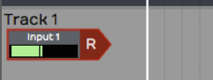

*Configure the Input for Recording*

3.  Click *Record* (R) on the transport to start recording.

While recording when the cursor hits the Out-marker, Waveform will
automatically loop back for the next take. You can do as many takes as
you like.

## Selecting the Best Take

After loop recording, you will have a number of takes stacked within the
Audio clip. The very last take you recorded is what you will hear during
playback. That is called the "active take." To select a different take
for the active take, click the plus (+) sign in the lower right corner
of the clip. You will see a list of all takes there. Pick the one you
want to promote to the active take. You can audition all the takes and
make your favorite one the active take.


*Choosing the Active Take*

**Tip:** With your takes recorded this way, it is perfectly set up for
comping, which we will cover in the [next chapter].

## Unpacking Takes to Tracks

If you want to work with your loop recorded takes as separate audio
tracks, it is easy to unpack the takes to tracks. To do so, click the
plus (+) sign and then select *Unpack to new tracks.*


*Unpack Takes to Tracks*

That instantly coverts an Audio clip full of takes to a series of tracks
containing separate Audio clips. Now you can use normal audio editing to
move them around, chop them up, or arrange them into a song.

## Moving on

The secret to loop recording is to set the In-marker and Out-marker over
the section you want to record, make sure *Loop* is turned on, and then
record like you normally would. Loop recording also sets you up for
comping, which is covered in the next chapter.


# Comping

In this chapter, we're going to go over the cool comping features in
Waveform. Comping is an editing technique where you select the best
phrases from numerous takes to build a composite or "comp." The idea is
to create the best possible take. Engineers have been doing this for
years, but Traction makes it much easier than the traditional methods.

Comping typically starts with takes recorded in *Loop* mode, covered in
[Loop Recording](loop-recording).

Loop recording used to be a prerequisite for doing comping. Starting
with T6, Waveform also allows you to build composites from any
collection of tracks, using the new *Comp Groups* feature. More on that
later in the chapter.

## Copy Your Edit

Before you start comping, it is a good to create a copy of the Edit.
This is so you can return to the raw takes, in the event you later wish
to do the composite a different way.

**Note:** We are assuming that you have already recorded using the
technique in the previous chapter. If not, go back to [Loop Recording](loop-recording) and get some takes recorded!

1.  When you finish loop recording, make sure to save the Edit with
    *Save > Save edit* (Cmd + S / ctrl + S).
2.  Go to the Projects tab and select the correct Edit. In the Controls
    panel, click *Create a Copy*.
3.  It is recommended to keep your Edits organized by adding a revision
    number. Do so by clicking on each Edit, then editing the *Name*
    property.
4.  On the original Edit, add a comment that says, "This version is
    before comping" or similar.
5.  Close the tab for the original Edit and open the new copied version.

Strategically creating copies of your Edits and naming them in a logical
way, works like a revision control system. You can always roll back if
something goes wrong, or if you just change your mind.

## Comping Takes

Now that everything is setup, it's time to get to the creative, part of
the process.

1.  Select the Audio clip that contains the takes you want to comp.


*Takes Follow Loop Recording*

1.  Click on the plus (+) icon in the lower right corner of the clip and
    select *Show takes.* That expands the clip to show all of the
    individual takes. If you play back over this section of the Edit,
    you will hear the very last take you did during loop recording.


*Takes in the Expanded View*

3.  To build a composite take, click and drag a range over a phrase from
    any take. That phrase is instantly promoted to the active take. This
    drag-to-select action is called "swiping."


*Swipe a Phrase to Add it to the Active Take*

**Tip:** While comping, sometimes it's helpful to have the cursor return
where you started playback whenever you stop playback. Do so by enabling
*Options > Return cursor to start position when play stops*. This makes
it easier to audition phrase by phrase without needing to constantly
reposition the cursor.

4.  Continue swiping and auditioning to build up the composite. If you
    want to switch a selected phrase to a different take, just click
    another take. The selection instantly moves to that take.


*Building the Composite Take*

5.  If the swipe selection doesn't fully enclose a phrase, adjust either
    edge of the selection by simply dragging the edge to trim it.


*Trim the Edges of a Selection*

**Note:** While comping sometimes you'll use a little bit from every
take. Other times you'll predominantly use one take and just fix a
couple of bad phrases.

Once you have finished, click the plus (+) icon and select *Hide takes*.
At that point, you're finished comping!


*Hide Takes*

**Tip:** After comping, it is a great time to create another copy of the
Edit and add a note that this was saved after comping. This gives you
the option to roll back if you ever want to make some changes.

## Flatten Comp

If you feel compelled to remove the underlying takes from the Edit,
click the plus (+) icon on the clip and select *Flatten current comp*.
This gives you the option to delete the source files. Keep in mind that
this operation is permanent.


*Flatten Current Comp*

**Tip:** Don't flatten the comp without first saving a copy of the Edit.
Also, we do not recommend selecting the option to delete the source
files as this will remove them for your other saved Edits.

## Setting up a Comp Group

T6 introduced *Comp Groups*, a feature that allows you to use swipe
comping with any group of tracks. This works similarly to the techniques
described above for comping takes. The difference is that you first add
the tracks involved to a Comp Group.

**Select Tracks to Comp**

Select all the tracks you want use to build the composite. These are typically recorded as various takes of a lead vocal or solo instrument. However you can use any collection of tracks you want.


*Select the Tracks to Comp*

**Create a Comp Group**

In Properties, open the *Comp Group* menu and select *Add group.* This opens the *Comp Group Name* dialog box. The name will default to *Comp Group 1* which is fine. You can change it to something more descriptive if you want. Click *OK*.


*Creating a Comp Group*

**Add a Track to a Comp Group**

 Any tracks pre-selected at the time you created *Comp Group 1* are automatically added as you create the Comp Group. To add another track to *Comp Group 1*, select the track, open the *Comp Group* menu and select *Comp Group 1*.


*Adding Another Track to *Comp Group 1**

**Removing a Track from a Comp Group**
To take a track out of a comp group, first, select the track. In the *Comp Group* menu, select *None*.

## Comping Tracks Using a Comp Group

With some tracks added to a Comp Group, it is easy to start comping.

1.  Select one of the tracks then in the *Comp Group* menu select *Show
    Editor > Edit track comps*. This puts the tracks in to comp mode.


*Enable Comp Mode*

2.  Now you can start swiping to select phrases from any of the tracks.
    On playback only the selected phrases are played back.


*Swiping Phrases to Create a Composite*

3.  You can adjust the window of your selection by dragging either edge
    of range. This works very similarly to comping takes which we
    covered earlier in the chapter.

**Tip:** If you want to have good control over the silent parts of a
comp, it helps to add a blank track to the Comp Group. For the parts you
want to silence, simply swipe over that range on the blank track.

## Comp Group Editor

Here are few more things to know about the Comp Group Editor.

**Show Track Comps**
- When you enable comp group editing using *Show Editor > Edit track
comps,* another option, *Show track comps* is also turned on. This
enables the color coding of the swipe selections on the tracks. You
can turn this on separately if you want. This way you can see the
comp selections but leave *Edit comp groups* turned off so you don't
accidentally change them.


*Show Track Comps*

**Render Comp**
- When you have the composite complete, you can render the result to
    single track. The *Comp Group* menu gives you two options for this.
    *Render and replace comp group* replaces the all the comp group
    tracks with the resulting track. *Render comp group to a new track*
    leaves the existing tracks in place and adds a new track with the
    composite.


*Rendering a Comp to a New Track*

**Add, Rename, Remove**
- These options on the *Comp Group* menu give you all the features
    need to manage your comp groups.


*Comp Group Management Features*

One interesting thing about comp groups is that you can have as many of
them active in the Edit as you want. There are many uses beside typical
comping, for example you could comp silence with tom tracks instead of
gating. Comping is also a fast way to mash up two beats or two different
songs.

## Moving On

The comping features in Waveform are very easy to use. As you are
learning Waveform, make sure to explore these powerful features.


# Using an Amp Simulator Plugin

In this chapter, you will learn how to use an amp simulator plugin while
recording direct with an electric guitar in Waveform. Out of the box,
Waveform doesn't include an amp simulator plugin. However, most of the
third party amp simulator plugins will work. If you don't have any of
these, there is a great sounding free amp sim plugin from Voxengo called
Boogex, used as an example for this chapter. You can download it from
[Voxengo.com](http://www.voxengo.com/product/boogex/).


*Free Boogex Amp Simulator from Voxengo*

## Setting Up the Track

Here is the setup:

1.  Connect your guitar to the high impedance input on your audio
    interface as described in [Audio Device Setup](audio-device-setup). If your interface
    doesn't have a guitar input then use a suitable preamp.


*Connect Your Guitar to your Interface*

2.  Create a new track, select the input, and arm it for recording.


*Select the Input and Arm It*

3.  Make sure that direct monitoring of your signal though the audio
    interface is turned all the way down or disabled. To make this work
    you need to monitor 100% of your guitar signal through Waveform.


*Turn off Any Input Monitoring on Your Interface*

4.  Select the input and turn on *Live Input Monitoring*. At this point
    you should be able to hear your dry unprocessed guitar signal.


*Enable *Live Input Monitoring**

5.  Open the Browser and go to the Search tab, and type in a few
    characters of the name of your amp simulator plugin. Drag the plugin
    to the mixer section.


*Drag the Amp Sim Plugin to the Mixer*

6.  If the UI window for the plugin didn't open, double click it. If you
    have *Live Input Monitoring* enabled you should hear sound through
    the plugin when you play. Select a preset and it should sound like
    you are playing through a guitar amp, maybe even amps, effects,
    cabinets, whatever your plugin simulates.

**Tip:** To bypass the plugin just click on the plugin to select it and
press F. You can also enable or disable it using the *Enabled* control
in Properties. The shortcut F will enable or disable any selected
plugins.


*Amp Sim Plugin Shown Disabled*

## Recording with the Amp Sim

At this point, recording works the same as before.

1.  Record-enable the track, make sure the cursor is at the beginning.
2.  Click *Record* in the Transport. If you want to do loop recording
    then have *Loop* on and then you can record several takes in a quick
    succession.
3.  Once you have actually recorded the part, you can still tweak the
    sound.


*Recording with the Amp Sim*

A big advantage of recording this way is the ability to tweak the sound
after the fact. You can also record using an endless variety of guitar
rigs that you don't own. Plus, you can do this without disturbing the
neighbors!

An important but subtle advantage is when you go to edit your guitar
tracks. Edits that occur before the amp and distortion sounds more
natural and are way less apparent when you edit a fully processed guitar
part.

## Guitar & Impedance

Guitars connect to your audio interface through a quarter-inch,
unbalanced connection. This is a high impedance connection. It might not
be super important to understand what that means electrically. You will
get a better tone and feel if connect to a proper high impedance input.
It's just the nature of guitar pickups. Going into a standard input
loads them down and you lose articulation and punch. On most audio
interfaces, the first one or two channels of the interface have guitar
inputs. Many times there is a switch or button to enable high impedance
on those channels, meaning that it will accept high impedance pickup
like a guitar or bass. So while your guitar might actually work through
a normal low impedance input, it is going to give you better picking
dynamics and tone if you go through the high impedance input and have
the high impedance mode engaged.

## Managing Latency

When working with guitar amp simulators, latency can be a factor. If you
have the *Audio buffer size* set too high, you get a big delay between
when you play and when you hear a note. If you set it too low the you
might get pops and clicks if the computer doesn't have adequate CPU
power to handle the low latency you have chosen. The challenge is to
find a good setting the feels responsive, but still has perfect sound
quality.

Latency is determined by *Audio Buffer Size* parameter. Here is how to
set that:

1.  Navigate to the Settings tab, Audio Devices page.
2.  Locate the *Audio buffer size* setting. The value shows a number of
    samples followed by a calculated latency delay.
3. Enter an *Audio Buffer Size* value. Values around 256 or lower tend to work pretty well depending on what else is going on in the Edit.


## Speed of Sound Through Air

Here is some background on the impact of the buffer size. In this
example, a buffer setting of 256 samples offers 5.8 ms of latency.

What this means is that when you play a note on your guitar, you are
going to hear the sound about 5.8 ms later. Now the speed sound through
air is about 1 ms per foot (1ms per .3 meters). A 5 ms delay would be
similar to playing your guitar amp if it were 5.8 feet (1.8 meters) away
from your ears. You would need to add in the actual distance from your
monitor speakers as well. If your speakers are two or three feet away,
it might be like having your amplifier nine feet away. Most guitar
players can deal with latency delay in that range. It's similar to the
distance you would be standing from your guitar amp on stage. If it
starts getting much longer than that, then you are going to hear a
noticeable lag and that will affect the feel and potential impact your
playing.

As another example, if you have your *Audio buffer size* set to 1024
samples, that gives you 23 ms of delay, That is going to give you the
feeling of playing with your amplifier 23 feet (7 meters) from your
ears. That is going to be really hard to work with.

Why not just set the buffer size as low as it will possibly go? That
could affect the performance of the computer. If you set the buffer size
too low, especially if you have a lot of other plugins and other virtual
instruments going, the playback might halt or it might not sound clean.

**Note:** It's always a balancing act between setting the buffer size as
low as possible to get the latency down while keeping it high enough to
have clean, solid playback. When mixing, you can increase latency to
approximately 1024, mostly because that is required for Melodyne ARA.

## Dialing in the Guitar Tone

You can dial in your ideal guitar tone using the controls on the amp
simulator. Flip through the presets or start with a preset and tweak the
controls until you get what you like. Keep in mind, one of the powerful
things about recording guitar this way is you don't really have to
commit to the sound at this point. Just dial in something that's
inspiring so that you can get a good performance. You can always come
back and tweak the amp settings later.

## Using a Tuner Plugin

If you are recording direct with a guitar or bass, you might want to add
a tuner plugin before the amp sim. Waveform does not include a native
tuner, but if you have a tuner plug-in, you can just drop it into the
effects section of the mixer for the track. That will give you a quick
and easy way to tune up.

**Tip:** If you don't have a tuner plugin, consider downloading one as
part the the MFreeEffectsBundle from [Melda
Production](http://www.meldaproduction.com/plugins/product.php?id=MFreeEffectsBundle).


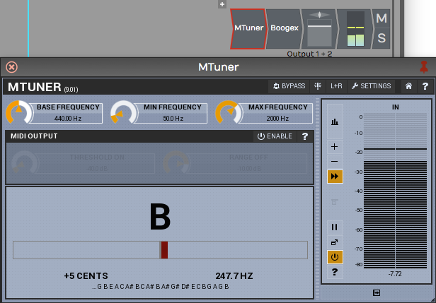

*Tuning with the MTuner Plugin*

Assuming you have a tuner plugin available, here is how to get it going:

1.  Open the Browser, go to the Search tab. Make sure *Plugins* is
    selected from the search options drop down menu. Type in a few
    characters of the name of your tuner plugin. The plug-in will show
    up in the search list.
2.  Drag the tuner and drop it in the plug-ins area of the track.
    Normally, as soon as you drop it, the user interface window will pop
    open. If not double click the plugin to open the UI.
3.  Play a note on your guitar. If the tuner does not respond make sure
    to arm the track for recording and enable *Live Input Monitoring.*
    This is necessary for the signal to flow through the track to the
    mixer section and to the tuner plugin.

**Tip:** To keep the plugin open, click the pin icon in the upper right
corner.

When you are finished with tuning, click the red X in the upper left
corner of the tuner to hide its user interface.

**Note:** In earlier versions of Waveform, *Live Input Monitoring* was
called "End to end monitoring." It has been renamed to reduce confusion
about this feature.

## Moving On

You can always record in the traditional way by miking your guitar
amplifier. It's also interesting to split your guitar signal and record
the direct signal along with your miked guitar amp. That way you can
blend the sound of the amp sim with the real amp when mixing.


# MIDI Setup

We're going to move on to MIDI recording and editing in this and the
next few chapters. The first step is to set up a MIDI keyboard so that
you can play notes into Waveform. If you don't have a MIDI keyboard, you
can enter notes manually into the MIDI editor, or you can use the
computer keyboard as a virtual MIDI device.

The setup is quite simple. We are using a USB external keyboard
controller, but the setup works much the same for other types of
controllers.

## MIDI Drivers

Before you dive in here, you might need drivers for your controller.
Check the manufacturer's website for drivers for the controller model
and your operating system. With Waveform closed, download and install
the drivers. Once you've done that, the rest is easy.

## Set Up the MIDI Inputs

Go to the Settings tab, MIDI devices page. You will see a list of all
available MIDI inputs and outputs that are connected to your system. In
this example I have four of them. To enable the MIDI inputs and outputs,
click to toggle between *Enabled* and *Disabled* next to each entry.


*Click to Enable/Disable MIDI Inputs and Outputs*

**Tip:** If you don't see your devices listed, make sure the controller
is connected and has power. If that checks out, then make sure the
latest drivers are installed. At any time you can click *Refresh*.
*Refresh* initiates a scan for connected MIDI devices.

## Naming MIDI Inputs/Outputs

From the Settings tab, MIDI Devices page, click on a MIDI input or
output in the MIDI devices list. Notice that in Properties, there is an
*Alias* value. Edit that to give your MIDI input or output a friendly
name. I often make this match the name of the controller that is
connected.

**Tip:** You can customize *Alias* for a specific Edit, by selecting the
input in the Edit tab and changing it in Properties. Changing *Alias* on
the Edit tab takes precedence over the *Alias* property in the Settings
tab.

## Disabling Unused MIDI Inputs

Your audio interface might also include MIDI in and out hardware
connections. Those allow connecting legacy controllers that don't
support USB. If you don't plan to use the hardware MIDI in and out
connections, you can leave them disabled. In this example we have
disabled.


*Disable Unused MIDI I/O*

This hides those from the selection list when setting up a track.

## Configuring the Track

Back in your Edit, choose a blank track or create a new one.

1.  Click on an input and select the MIDI input that matches the
    controller you just configured.


*Select the MIDI Input Device*

1.  Play some notes on your keyboard. You will see the meter registering
    the MIDI activity on that track.


*Input Meter Activity*

1.  With the input selected look in Properties. Turn on *Enable Input
    Monitoring* if it isn't already on.


*Enable MIDI Input Monitoring*

With this done, MIDI events come into the track from your keyboard and
the pass through to the virtual instrument that we're going to setup
next.

## Insert a Synth Plugin

To hear what you play, you will need to insert a virtual instrument. Use
the *Browser Search* tab to locate a synth plugin. In this example we
are using the Waveform FM Synth.


*Search for a Synth Plugin*

1.  Insert your synth plugin ahead of the *Volume & Pan* plugin. By
    ahead, we mean ahead in the signal path. So in this example, we have
    dropped *FM Synth* to the left of *Volume & Pan*.


**FM Synth* Installed in the Mixer*

1.  Play some notes on your keyboard and at this point you should hear
    synth notes.

**Note:** There is no difference between a MIDI track and an audio track
in Waveform. To configure a MIDI track, just set a MIDI input and insert
a virtual instrument plugin as a sound generating source. Then, as you
record your performance, you'll create a MIDI clip instead of an audio
clip like we did in the previous examples.

## Using a Virtual Keyboard

If you don't have a physical MIDI keyboard, you can use your computer
qwerty keyboard to play notes. Here is how to set it up:

1.  Go to the Settings tab, MIDI Devices page
2.  Click *Create New Virtual MIDI Input*


*Create New Virtual MIDI Input*

1.  Enter a name such as 'Qwerty Piano' into the *Virtual MIDI device*
    dialog box


*Name the Virtual MIDI Device*

1.  Back in your Edit create a track
2.  Choose *Qwerty Piano* as the input


*Select the Virtual Device as the Input*

1.  Notice the piano keyboard along the bottom of the screen. To play
    the keyboard first click on any key with the mouse then use keys
    A,S,D,F,G,H,J,K,L as white keys. Use W, E,T,Y,U,O,P as black keys.
    This virtual keyboard lets you play notes in the range from C4 to
    E5.

**Tip:** Click the 'lock' icon in the upper left corner Properties. This
locks the Waveform keyboard to the Virtual MIDI Piano feature. Also,
when attempting to record, it helps to start recording using a keyboard
shortcut. If you click record, the qwerty piano loses focus until you
click a key on the virtual keyboard.


*Lock the Input Properties While Playing the Virtual*

**Note:** When you are finished using the virtual keyboard, unlock
Properties by clicking on the lock icon again. It will stay stuck on the
virtual keyboard until you do that.

## Moving On

In the next chapter, you'll learn how to record a MIDI performance onto
the track!


# MIDI Recording

In this chapter you'll learn how to record a MIDI performance from your
controller. Your controller could be a keyboard or any other sort of
instrument that you can use to generate MIDI note data. We covered how
to set up a MIDI controller in the previous chapter.

In this chapter, we'll go further and cover the details of how to record
your MIDI performance. You will also learn about the various MIDI
recording modes. The MIDI implementation in Waveform is fairly
comprehensive while also being quite easy to use. Let's get started.

## Setting up a Track

There isn't a special type of MIDI track in Waveform. Any track can be
used for audio, MIDI, or Step Clips. To record MIDI, pick any unused
track or create a new track. On the track, set up the input by selecting
your MIDI controller. Play a few notes on your MIDI controller to see if
you have MIDI activity.


*A Track Set Up for MIDI Recording*

To hear any sound, you'll need to insert a virtual instrument. Do so by
dragging the plugin object to the mixer section, or search for the synth
plugin in the Search tab on the Browser. When you find it, drag it over
to the mixer section of your track. We usually recommend dropping it to
the left of the *Volume & Pan* plugin. As soon as you drop it, the user
interface will open up for the instrument plugin. Choose a suitable
preset for the part.

We covered all of this in the previous chapter. If when you play notes
on your controller you don't hear anything, go back to [MIDI Setup](midi-setup) and make sure the MIDI input is set up correctly.

## Recording a MIDI Performance

Recording MIDI is very much like recording audio:

1.  Enable the track for recording by clicking the red R on the track
    input


*Enable Recording*

1.  In the Transport, click the red *Record* button to start recording.
    You can also do this using the keyboard shortcut R.


*Start Recording*

1.  Record your MIDI performance


*MIDI Recording in Process*

1.  To stop, either press R again or just hit the space bar.

**Tip:** To record your MIDI performance with a metronome click,
configure and enable *Click* using the procedure outlined in [MIDI
Editing](midi-editing).

## Playing Back a MIDI Performance

If everything went according to plan, you'll have created a MIDI clip.
Notice, the MIDI notes on the clip. If you zoom the track vertically,
the MIDI clip will, at one point, flip to the MIDI editor mode. In this
mode, you can edit MIDI notes, which we cover in [MIDI
Editing](midi-editing).


*MIDI Clip Following Recording*

Position the cursor before the newly recorded MIDI clip, the press the
spacebar again to playback. You should be able to hear the exact
performance.

**Tip:** If you don't like what you recorded, simply select the MIDI
clip and press backspace to delete it.

## Piano Roll View

As I mentioned above, as you expand the track vertically, you'll notice
that at a certain point MIDI clips will switch to edit mode. The
Waveform MIDI editor is what is commonly called a piano roll view (PRV).
In this view, you can clearly see the notes along with a vertical piano
graphic located along the left.


*Track Expanded to the MIDI Editor*

**Note:** The PRV in Waveform allows you to see the timing of notes as
they relate to the timeline, and the pitch of notes as they relate to a
piano keyboard. The graphic length of a note represents how long that
note is held in musical time.

The MIDI editor PRV includes everything you need to edit MIDI data. You
can add notes, delete notes, copy notes, and duplicate them. You can
also work with velocity and other controller values. We'll get into the
details later when we go deeper into [MIDI editing].

## MIDI Record Modes - The *Action* Property

Select a MIDI input and look in Properties at the item labeled *Action*.
The drop down menu for *Action* gives you a variety of record modes.


*MIDI Record Modes*

## Merge Mode

By default, *Action* is set to *Merge newly recorded MIDI into any
existing clips*. If you rewind and record in some more notes, you will
find that they're merged into the MIDI clip that you created in the
first pass. It doesn't replace notes that you recorded before; it just
adds new notes and and merges them with the original MIDI clip.

If you mess up an otherwise good performance in merge mode, undo the new
notes by pressing Cmd + Z / Ctrl + Z.

**Tip:** Merge mode can be very helpful if you're building up a part
pass by pass, particularly when layering a drum part and adding
additional drum hits in each pass.

## Replace Mode

If you wanted to replace what you played previously, change *Action* in
Properties for the input to *Replace existing clips with newly recorded
MIDI clips*. Now when you start to record, the new recording will create
an entirely new MIDI clip and it will gradually overwrite what you had
before. It doesn't exactly erase the original clip. If any portion of
the clip is still visible, you can trim the edges of it and expose the
original data. Of course, *Undo* will get you back to where you started
from if things don't go well.

**Note:** You can envision replace mode as being similar to tape
recording. As you record something new onto tape, you are erasing the
section you are recording over.

## Overlay Mode

In overlay mode, as you record you'll get a new MIDI clip stacked on top
of the original clip. After you have recorded this way, you'll hear the
output from both clips mixed together.

During playback, you will hear the overlapping MIDI clips merged
together.

## MIDI Input Quantize

To find MIDI Input Quantize, click on the input and locate the
*Quantize* property. The drop down menu for *Quantize* offers a wide
variety of beat subdivisions.

Notice how this works; you are selecting a subdivision of the beat (not
the bar). For example, if you want to quantize your input to the nearest
eighth note, you don't select *1/8 beat* from this list, you select *1/2
beat*, because an eighth note is half of a quarter note (when working in
4/4 time).


*Input Quantize Options*

As you record, you're going to hear the notes however you play them, but
on playback all of your notes will be snapped to the value you set in
*Quantize*.

Note that the results of quantizing can sound somewhat unnatural,
because this approach quantizes both the note start and the note ending.
Notes get stretched out and tend to sound mechanical. In general, input
quantize is more useful for drum programming than playing something like
a piano part.

**Note:** Input quantizing does not happen in real time. You hear the
result during playback.

There are other ways (Apply Groove) to quantize after the fact. We'll be
getting into that in [Quantizing MIDI Notes](quantizing-midi-notes).

## Moving On

That's an introduction to MIDI recording. You learned the essential
options to set up a MIDI input. You learned about the MIDI record modes.
We also took a quick look at input quantizing. Next up, loop recording
with MIDI!


# MIDI Loop Recording

In this chapter you'll learn about loop recording and MIDI. Loop
recording in merge mode can be useful for layering up a drum part, or
building a chord over a couple of passes through the loop.

Waveform also supports MIDI loop recording to layers, which gives you
the capability to build a composite MIDI performance in the same way you
can do with audio.

## Loop Recording in Merge Mode

In the last chapter you learned about MIDI merge mode. Here are the
steps again:

1.  To put your track into MIDI merge mode, click on the track input,
    then in Properties set *Action* to *Merge newly recorded MIDI into
    any existing clip*.


*MIDI Merge Mode*

1.  To prepare for loop recording, set the In-marker and the Out-marker
    over the area you want to loop.


*Set the In-marker & Out-marker*

1.  Toggle the *Loop* button to until it's enabled.


*Enable *Loop**

1.  As Waveform cycles through the loop, you'll immediately hear the
    results of what you played in previous passes. Keep adding passes
    until you're happy with the part.
2.  To stop recording, either click *Record* again or hit Spacebar.


*MIDI Clip After Recording*

Following loop recording, you'll have a single MIDI clip containing the
part you built up over successive recording passes.

This technique is particularly useful for programming drum parts,
especially if drumming is not your main skill. For example, on the first
pass play in the high hat. Then, on the second pass add the kick and
snare. Finally, strategically add a crash on the downbeat.

## Recording to Prepare for MIDI Comping

Comping is usually associated with audio recording and editing. With
comping, you record multiple takes of a part then use simple editing
tools to select the best phases from the various takes.

To prepare to comp with a MIDI recording, leave everything set up the
same way as for merge mode, but change the *Action* parameter to
*Overlay new clips containing newly recorded MIDI*.


*Enable Overlay Mode*

Set the In-marker and Out-marker and turn *Loop* on. Hit *Record* and
record a performance during each cycle through the loop.

When you hit *Stop* you'll have separate takes in the MIDI clip for each
loop pass, just like in audio loop recording.

## Comping MIDI Takes

To see the takes, click the plus icon in the lower right corner of the
MIDI clip; You'll see a list of all your takes. From here, you can
choose the best take from the list and that will make it active.


*Takes Following Loop Recording*

You can also expand the view to show all the takes below the track.
Click the plus icon and select, *Show takes*.


*View following *Show takes**

Not only does this show the takes, but it puts you in comping mode.
Swipe over the phrases you want to keep and build a composite from the
best parts of each take.


*Comping the Takes*

## Flattening the Composite to a Single Clip

Once you have the composite assembled, you can convert it to a single
MIDI clip. Click the plus icon and select *Flatten current comp*. You
will need to press *Delete* on the *Delete Unused Takes* dialog box to
proceed.


*Flattening the MIDI Composite*

**Note:** When you select *Flatten current comp* Waveform asks if you
want to delete the unused takes. If you want to flatten the takes to a
single MIDI clip, you need to accept this. Note that you can use *Undo*
following this action.


*Delete Clips Warning Message*

## Moving On

Loop recording and comping are really powerful tools for MIDI
composition, just as they are when working with audio. Next up, learn
how to edit MIDI clips and MIDI notes.


# MIDI Editing

In this chapter you will learn MIDI editing. There are two aspects to
MIDI editing. You can, of course, edit individual MIDI notes, but you
can also edit the MIDI clip. Editing a MIDI clip is similar to editing
an Audio clip, but with a few key differences. We will go over both
approaches in this chapter.

Many of the tools for working with clips work much like they do with
Audio clips. Each MIDI clip header has several drag handles. Let's take
a look at how they work.

## Trimming MIDI Clips

To trim a MIDI clip, drag one of the trim handles left or right. The
trim handles are the hollow arrows at the left and right of the MIDI
clip header.


*Trim MIDI Clips by Dragging a Trim Handle*

**Note:** One difference between Audio clips and MIDI clips is that the
MIDI clips don't have fade handles.

## Moving MIDI Clips

To move a MIDI clip forward or backward in time, drag from the header
area. Don't drag starting from any of the icons, but instead drag from
the blank space in the header area.


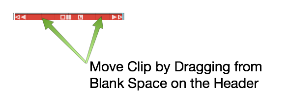

*Moving a MIDI Clip*

## Moving a MIDI Clip Track-to-Track

To move a MIDI clip track-to-track, grab the header area and drag it up
or down. To move track-to-track without affecting the timing, hold down
Shift as you drag.

## Slip Editing MIDI Clips

The three solid color handles are used for slip editing: left arrow,
right arrow, and the box. The essential tool for slip editing is the
solid box in the center of the header. Grab the solid box and drag, in
order to slip edit the notes within the frame of the window.


*MIDI Clip Slip Handles*

Use the left solid arrow to slip the notes later in time, while leaving
the ending of the clip anchored. The right solid arrow works the
opposite way. You can slip the end of the clip, while leaving the
beginning of the clip anchored.

## Reframing a MIDI Clip

The hollow box tool in the center of a MIDI clip allows you to reframe
the entire window of the clip, leaving the notes in their original
place. This is done by dragging the hollow box left or right.

## Splitting a MIDI Clip

To split a MIDI clip, select it then position the cursor at the time you
want to make the split. Press the slash key (/). This is the exact same
workflow you use for splitting Audio clips.


*Split MIDI Clips Using the Slash Key*

You can also split using the *Split Clips* actions at the right side of
Properties. The various actions give you more control over splitting.


*Split Actions Button in Properties*

**Note:** As you split MIDI clips, any notes that are sustained across
the split area are separated into two notes.

You can even split a mixture of Audio clips and MIDI clips across
multiple tracks, by selecting a combination of them at once.

## The MIDI Note Editor

As you increase the vertical size of a track holding MIDI clips, you'll
see that there's a point at where it switches to the inline MIDI note
editor. This gives you a comprehensive view of the notes contained
within the MIDI clip. This type of view is commonly called a piano roll
view (PRV).


*The MIDI Note Editor*

Another way to see the MIDI note editor is to double-click on the MIDI
clip header to toggle track height.

**Note:** Clip header double-click behavior is dependent on a global
setting. Go to the Settings tab, General behavior page and find the
*Track Resizing* property. You can choose a number of options, based on
how you would like that resizing to occur when you double-click. This
setting also holds for audio tracks.

## Setting the Number of Octaves & Note Height

You can adjust how many octaves you see on the MIDI editor in the
*Options* menu. By default *Options > Default MIDI editor vertical
scale* is set to *2 octaves*, a reasonable starting point. If you want
you can set this to show more or fewer octaves.


*Default MIDI Editor Vertical Scale Setting*

To fine tune the vertical size of MIDI notes, drag the arrows above and
below the piano graphic.


*Use Arrows to Adjust Vertical Size*

## Mouse Wheel Options for MIDI Editing

You can use your mouse wheel to scroll vertically within the MIDI
editor. During mixing you may prefer to disable this function, in order
to prevent scrolling within the MIDI clips unintentionally.


*Mouse Wheel MIDI Scrolling Setting*

You may find it's generally helpful to have MIDI scrolling on during
MIDI editing. You'll find this setting in the menu under *Options >
Mouse wheel action > Mouse wheel scrolls MIDI grid.*

## Basic MIDI Editing - Pitch

Next, let's look at the tools for editing the actual MIDI notes. In
general, editing works by selecting notes and then doing an action.


*Select a Note and Drag Up or Down to Change Pitch*

The most basic edit? Click a note to select it. Drag it up or down to
change the pitch.

## Per Note Automation

As you start to drag MIDI notes around, you will immediately see the
per-note controller editing area appear above or below selected notes.


*Drawing Per Note Automation*

If you don't see the per-note automation editing area, you can turn it
on and off in Properties.


*Turn Per Note Automation Editing On or Off*

To begin, select any single note. The automation editing area will
appear for the full length of the note. By default you will be editing
Volume (controller 7). Select the pencil tool and draw in the desired
automation curve by click-dragging over the editing area.

**Note:** You need to select the pencil tool to draw in the per-note
automation.

The curve will appear as steps based on the current snap resolution. The
snap resolution is set by the zoom level; To draw in a more detailed
curve, zoom in more.


*Selecting the Controller Type for Per Note Automation*

You can select any other control by clicking the *Type* button on the
MIDI editor toolbar. This type of editing gives you detailed control
over performance details and articulations.

**Note:** Not all virtual instruments respond to this type of data.

## Nudging Notes

Nudging works much like it does for Audio clips and MIDI clips. You hold
down Shift and use the arrow keys. Shift-up and Shift-down change the
pitch. Shift-left and Shift-right change the timing.

Nudging is particularly helpful when changing the pitch, since there
there's no chance of altering the timing of the note.

**Tip:** Cmd + Z / Ctrl + Z works as undo for most editing operations.

## Note Length

You can trim the length of a note by grabbing the right edge and
dragging it left or right.


*Trimming a MIDI Note*

## Snapping During Note Editing

Many of these editing operations will snap to the grid as long as you
have *Snap* enabled. To edit freely, disable *Snap*. The keyboard
shortcut Q enables or disables snapping.


*Note Editing Will Snap if *Snap* is On*

## Copying and Duplicating Notes

To copy a note, hold down Cmd / Ctrl and drag the note to create a copy.
Another way to do this is with the *Duplicate* keyboard shortcut. First
select the note that you would like to copy, make sure the cursor is
where you'd like the copy placed and then hit the keyboard shortcut D.


*Copying a Note*

## Adjusting Pitch and Velocity in Properties

Another way to adjust pitch and velocity is to select the note and then
edit the values directly in Properties. Both *Pitch* and *Velocity* can
easily be edited this way.


*Adjust Pitch and Velocity in Properties*

## Note Start, Length, & End

You can also make very precise adjustments to the *Length*, *Start
Time*, and *End Time* by editing the values directly in Properties for
the selected note.


*Start, Length, & End Settings in Properties*

## The Pencil Tool

The pencil tool is used to draw in notes. Simply select the pencil tool
and then start painting in notes where you'd like them to appear on the
piano roll.


*Draw in New Notes with the Pencil Tool*

## The Eraser Tool

Use the eraser tool to swipe over any series of notes that you would
like to erase.


*The Eraser Tool*

## The Line Tool

There's also a line tool. We usually recommend using this for drawing in
controllers, but it is also possible to use it for notes as well. Draw a
line to create a stepped series of notes.


*Draw a Series of Notes with the Line Tool*

## Note Colors

The color selection along the top edge of the MIDI editor allows you to
select set a note color. Select a group of notes, click on a color and
then it will change those notes to that color. It doesn't affect
playback, but it gives you a way to visually organize a sequence. For
example, when programming drums you could make snares, hi-hats, and kick
drum all different colors.


*Note Colors*

## Selecting Multiple Notes

Selecting multiple notes is easy. Use the arrow tool and drag a
selection around any group of notes that you'd like to select together.


*Note Multiple Selection*

You can also add or remove notes from a multiple selection by holding
down Shift (or Cmd / Ctrl) then clicking additional notes you'd like to
toggle in and out of the selection.

To select an entire row of notes that are the same pitch, hold down Cmd
/ Ctrl and click on the PRV keyboard key corresponding to that row of
notes; doing so selects the full row of notes.


*Selecting a Row of Notes with Cmd / Ctrl*

Once you have a multiple selection, move all the notes in time or by
pitch by dragging with the arrow tool. Alternatively, you can change
values in Properties that will apply to all notes in the selection.
Nudge also works on well on a multiple selection of notes (Shift plus
the arrow keys).

## Editing the Note Velocity

To quickly change the velocity of a note, select the note and then
select a value from the *Velocity* drop down menu. This gives you a
variety of preset values at popular levels.


*Quickly Set Note Velocity*

If you choose *Other*, from the velocity drop down, you can type in
whatever value you want from 0 to 127.


*You'll See this if you Select *Other**

**Tip:** Here's another trick way to adjust velocity. Select a note then
hold Shift as you drag up and down over the note. Notice the *Velocity*
value changing in Properties as you drag.

## Step Entry Mode

When the *Step* button is toggled on, the MIDI clip goes into step entry
mode. In this mode, any notes you play to the track will be entered at
the cursor position. Then, the cursor will advance to the next step
based on the Snap grid resolution. You can adjust that based on the
level of zoom.


*Step Entry Mode*

## Hearing Notes While Editing

You have the option to trigger notes that are being moved so you can
hear the pitch. You can enable or disable this using the speaker icon at
the far right at the top of the MIDI editor tool bar.


*Enable Speaker Button to Trigger Notes During Editing*

## The Velocity Editor

You can edit MIDI note velocity from the velocity area below the PRV.
Click the *Velocity* button at the left of the MIDI editor toolbar to
expose the velocity editor. For the selected note, grab the stalk which
represents the velocity and drag it up or down. You will notice the
*Velocity* parameter moving in Properties for that note as you drag.


*The Velocity Editor*

You can also edit multiple velocities together by first selecting
several velocities. Say we want to edit the velocity of all the C4s.
Hold down Cmd / Ctrl and select all the C4s, then, just grab one of them
and they will all adjust together.

## Editing other Controller Data

You can use a view similar to the velocity editor with any kind of
controller. Click the *Control* button and then click *Type* to choose
which controller to edit.


*Editing Other Controller Data*

Example editing aftertouch: In the MIDI editor click *Control > Type >
Channel Pressure*. Now the channel pressure data will appear in the same
way velocity appears.

## Moving On

Those are the fundamentals of MIDI editing. We're going to get into
quantizing MIDI notes in the next chapter.


# Quantizing MIDI Notes

The idea of quantizing is to correct the timing your MIDI performances.
At a basic level, quantizing snaps each note to the nearest correct note
on a virtual grid defined by the bars and beats of your song. Waveform
gives you tools to define that grid in musical increments like quarter
note, eighth note, but it does so using divisions of a beat.

Waveform takes quantizing further with groove templates. Groove
templates allow you to quantize in a way that's not perfectly aligned to
straight timing. An important use of this is to introduce musical swing
to the timing. You have all the tools needed to impart the desired feel
into your performance.

## How to Quantize

Within a MIDI clip, select all the notes you want to quantize. If you
want to quantize all of them, you can use select all (Cmd + A / Ctrl +
A). The quantize actions are available by clicking *Quantize* in
Properties.


*MIDI Quantize Actions*

There are four different quantize actions available, as shown above. The
most common option is the first one - *Quantize note start times*. To
complete the action, you pick which beat division to use.

The beat division selection can be a little confusing. Musical divisions
in Waveform are represented as fractions of one beat. For example, if
you want to quantize to eighth notes and you're in 4/4 time, then you
select *To nearest 1/2.* One half of one beat would be an eighth note.
If you want to quantize to sixteenth notes, then select *To nearest 1/4
beat* from this menu.


*MIDI Notes Before Quantizing*


*MIDI Notes After Quantizing Note Starts to Nearest 1/2 Beat*

You'll will notice right away that quantizing perfectly tightens up up
the performance. It will snap the notes to the nearest increment of the
division that you selected.

**Note:** If you're playing was so far off that it actually snaps it to
the wrong note, then you might need to do some MIDI editing to clean
that up!

**Tip:** Some styles of music are based on perfectly quantized timing
while other styles aren't. To get a more natural feel but also fix
timing errors, you can always edit timing note-by-note manually with
*Snap* turned off. Groove quantizing also gives you other options for
"quantizing with feel". More on that later.

## Quantizing Note Lengths

If you choose the option to quantize the note lengths you'll see that
the notes become the full length of that particular note value.


*Note Lengths Quantized to 1/2 beat*

With something like a piano part, this can lead to a choppy, unnatural
feel. You could try quantizing the note lengths to 1/4 beat (sixteenth
note) if the playing is that inconsistent.

In most cases, it's not really important to quantize the note lengths.
It can be useful for things like quantizing the note lengths on drum
parts, because it helps play out the full attack and decay of a drum
hit.

## Quantizing with Groove

Next let's look at how to quantize with groove. This feature can be as
simple a choosing a preset, or as complex as finely programming a groove
template. Groove can be applied to both MIDI clips and Step clips, which
we will cover in the next chapter.

First lets look at the basics:

Select the notes to quantize and click *Apply Groove* in Properties.


*Apply Groove in Properties*

You will then get a large menu of groove presets. These are custom
templates that allow you to apply fine adjustments to the timing.


*Apply Groove Presets in Options*

The most common scenario is to apply swing: Delaying the eighth notes
that follow the four primary beats in a bar. To locate the groove
templates for standard swing, look at those starting with *Swing 1/2.*
Swing 1/2 as in half beat. In normal musical terms, that's eighth note
swing. To apply a nice groovy swing, try *Swing 1/2 60%*.


*Groove Presets for Swing*

**Note:** In 4/4 music, eighth note timing is counted 1 & 2 & 3 & 4 &.
In swing timing, the "&" beats are delayed. The swing presets in
Waveform let you pick how much delay as a percentage from subtle (10%)
to dramatic (90%).


*Before Applying Groove*


*After Applying Groove - *Swing 1/2 60*%*

After you apply swing, you'll see it lays back all of the "and" notes to
be a little late; groovy! Waveform will also adjust the note lengths
appropriately as shown above.

## Defining Groove Templates

To take groove to the next level, you can build grooves to your own
definition using the Groove Template Editor. At the bottom of the *Apply
Groove* menu, you'll find *Edit groove templates*. This is also
available in the Menu section under *Snapping > Edit Groove Templates*.


**Snapping > Edit groove templates**

Select this to open the groove template editor. Click on any of the
presets to see how the logic works.


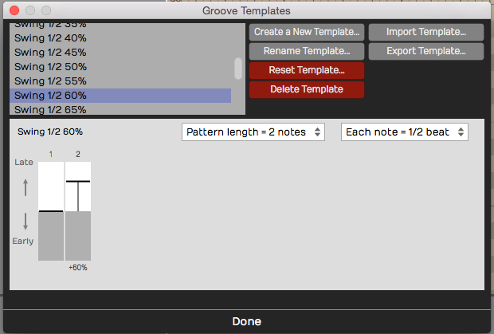

*Groove Template Editor*

In the image above, we have selected the *Swing 1/4 60*% template we
used for the examples in this chapter. A groove template consists of a
pattern length, note subdivision, and the timing for each note. For each
step of the pattern, you choose the amount that that note falls 'early'
or 'late' relative to perfect timing.


**Swing 1/2 60*% Template Example*

The example in the figure shown above is the setup for a basic swing
beat, with each 'and' eighth-note delayed. You can adjust the intensity
of the swing feel by how much delay you put on the eighth notes.

## Complex Groove Templates

Since you can create groove templates with as many steps as you want,
you can dial in exactly the feel you want. For example if you want to
vary the swing within the bar of music, you could create a template with
eight notes with each swing element slightly different.


*Groove Template with Variable Swing*

Alternatively, you can create a groove that pushes the timing over two
bars, which will give excitement and tension like the FastSlow2 preset.


*FastSlow2 Groove Template*

**Tip:** It can also be useful to create a 'No Groove' template to help
you remove the effect of groove. This is particularly useful when
applying groove templates to Step clips; more on that in the next
chapter!


*Creating a 'No Groove' Template*

## Managing Groove Templates

Waveform gives you all the tools you need to create new groove
templates, rename them, and import and export them. Exported templates
have the `.trkgroove` file extension. This allows you to share them with
other Waveform users or installations.


*Create, Rename, Import, or Export Groove Templates*

While editing a groove template, you may reset it. This removes the
late/early timing for the pattern, but doesn't change the length or note
division settings.


*Resetting a Groove Template*

Any groove template that you don't need, you can delete using *Delete
Template*.


*Deleting a Groove Template*

## Moving On

You should now have a pretty good understanding of MIDI, MIDI recording,
MIDI editing, and even quantizing with MIDI. But there is one more
thing: Step clips. And that is up next!


# Step Clips

On the surface, a Step clip is a simple MIDI step sequencer, allowing
you to turn notes on and off with a simple click. That is correct but
Step clips go much deeper.

In this chapter, you'll learn all about Step clips and how to use them
to create drumbeats, synth lines, or bass lines.

This tutorial is an excellent introduction to working with Step clips:

[Video: Explaining Step Clips](https://youtu.be/pB1GfjwHAgQ)

## Step Clips Overview

Step clips act like a special type of MIDI clip. However, the notes are
represented on a grid where each column is a 'step' indicating a musical
increment. By default, there are 16 steps similar to common drum
machines and step sequencers. That means in 4/4 timing, there are four
steps per beat. You can change this to other values, but this is usually
a good starting point.

Here is a breakdown of the key concepts you need to work with Step
clips:


*Parts of a Step Clip*

Step Clip
- Step clips are similar to MIDI clips. You can add, delete, and copy
    them. They are always in loop mode so you can drag the right trim
    handle to roll out repetitions. Step clips need a synth plugin in
    order to make sound, just like MIDI clips.

Header
- Click the Step clip header to select it. With the clip selected, you
    have access to a wide variety of settings in Actions or Properties.
    Drag the Step clip by the header to move it forward or backward in
    time, or track-to-track. Right-click the Step clip header for a
    context menu of the most used options.

Footer
- Click the Step clip footer for access to a drop down menu and
    additional options in Actions or Properties. These options are
    related to working with variations and patterns sections.

Variation
- A variation is a table of rows and columns (steps). It looks like a
    mini spreadsheet - click a cell to trigger a note at that step.
    Click and active cell again to turn it off. A Step clip can hold any
    number of variations.

Step
- A variation is defined by how many steps it has, and what each step
    represents musically. By default a new variation has 16 steps with a
    step length of 1/4 beat. A step is one column of the grid that makes
    up a variation.

Row
- Each row is assigned to a single MIDI note. Rows are defined for the
    entire Step clip. Row assignments are the same for all variations
    within the clip. It is possible to assign rows within one Step clip
    to different MIDI channels or virtual instruments. More on that
    later.

Note
- A note is the cell formed at the intersection of steps and rows. You
    program by clicking notes to toggle them on or off.

Section
- By default, a Step clip has a single pattern section which holds one
    variation. You can create longer Step clips by adding more pattern
    sections. Each pattern section is assigned a variation.

Variation Number
- Variations are numbered within each Step clip. The variation number
    appears on the footer for each pattern section.


*A Step Clip with Four Pattern Sections*

**Tip:** You can think about Step clips as follows: Step clips are a
sequence of pattern sections. Each pattern section is assigned to a
variation. You can assign the same variation to more than one pattern
section if you so desire.

**Note:** Variations can exist in a Step clip that are not assigned to
any pattern section.

## Inserting a Step Clip Into the Edit

There are several ways to insert a Step clip onto a track:

Insert Using the Clip Object
- Like all the other kinds of clips, you can drag the Clip object to a
    track and then choose *Insert Step Clip* from the menu.


*Insert by Dragging the Clip Object*

Insert with Right-click Menu
- Right-click at the point on a track where you want to put it and
    choose Insert Step Clip from the context menu.

Insert from the Track Header
- Another way is to select the track where you'd like the Step clip to
    go, position the cursor where you'd like it to start, then
    right-click on the track header and select "Insert Step Clip".


*Right-click Track Header*

Insert from Track Actions
- Select a track by clicking on the track name. In Actions, click
    "Insert New Clip > Insert New Step Clip."


*Insert from Track Actions*

Inserting a Step Clip Preset
- Since you can save Step clip setups as presets, a great way to get a
    starting point is to drag in a preset. You can find any existing
    Step clip presets in the Browser Presets tab. Filter or search by
    "Step clip".


*Use a Step Clip Preset from the Browser*

Waveform includes a wide variety of Step clip presets to get you
started.

## Programming a Drum Beat with a Step Clip

Once you insert a new Step clip, notice that the rows are pre-assigned
to General MIDI drum notes. This makes it really fast to get started
programming beats.

**Tip:** Use one of the Waveform drum instruments - Micro Drum Sampler,
Drum Sampler, or Multi Sampler. Add the instrument first and load a
preset drum kit. Next, insert a blank Step clip. The row names will
match the pad names of the preset!


*Default Step Clip*

Here are the basic steps to programming a drum beat using a Step clip:

1.  Insert a drum instrument onto a track and select a preset.
2.  Insert a Step clip on the track.
3.  Set Loop in and Loop out over the Step clip and turn *Loop* on.
4.  Start playback, and turn notes on and off by clicking on the
    individual note cells.


*Programming a Step Clip*

As you toggle notes you will hear the result. You are are now
programming a variation!

**Video Clip:** This video overview is a great way to get a better
understanding of how all this works. While the video was created using
Tracktion version 6, the workflow is almost identical in Waveform
version 8.

[Step Clips Overview](https://w-edstrom.wistia.com/medias/pjf2cdmm4t)

## Step Clip Actions & Properties

A Step clip has a header that is similar to that of MIDI clips and Audio
clips. Click the header to reveal all the actions and settings in
Actions. The following things are the most important when working with
Step clips:


*Click the Header for Step Clip Actions*

Name
- Give your Step clip a descriptive *Name*. This will be particularly
    helpful when you go to save a Step clip as a preset. The Step clip
    name is used as the basis for presets.

Color
- Use the color selection to give your Step clip a unique color.

Clear All Variations
- *Clear All Variations* clears all the notes from all variations for
    this Step clip.

**Warning:** *Clear All Variations* clears all variations whether you
can see them or not. Fortunately, you can click *Undo* (Cmd + Z / Ctrl +
Z) if you change your mind right after zeroing out all your variations!

Delete All Unused Variations
- With Step clips, you can string together a series of pattern
    sections - each one assigned to a variation. *Delete All Unused
    Variations* remove any variation that is not in use.

Add Row
- *Add Row* inserts a row as you might expect. You can also insert a
    row using the context menu for the Step clip header or Step clip row
    header.

Render Clip
- Use any of the *Render Clip* options to convert a Step clip to an
    Audio clip.

**Note** In the *Render* dialogue box, make sure you have *Pass Through
Plugins* selected. If you don't, the resulting audio clip will be
silent.

Standard Clip Operations
- Step clip properties also includes *Select Clip*, *Set Edit Tempo*,
    *Split Clips*, and *Move Clip*. These are standard operations shared
    by all the other kinds of clips.

Convert to MIDI Clip
- *Convert to MIDI Clip* is an important feature of Step clips. This
    will convert any selected Step clips to a MIDI clip. This allows you
    to continue editing in the MIDI editor, using the piano roll view.

Create Preset
- *Create Preset* gives you tools to create presets from Step clips.
    Presets are searchable from the Browser.

Delete
- *Delete* allows you to delete the selected Step clip. Alternatively,
    just select the Step clip, press Delete, Backspace, or Cmd + X /
    Ctrl + X. Any of these will delete a clip.

**Tip** Just like any other clip, Step clips can be copied (Cmd + C /
Ctrl + C), pasted (Cmd + V / Ctrl + V), or duplicated (D).

Step Clip Header Context Menu
- Right-click the Step clip header and the most essential actions are
    available from the context menu.


*Step-click Context Menu (Right-click)*

## The Step Clip Footer

When you click on the Step clip footer, you select the pattern section
and its variation. The active variation number is indicated on the
footer. Click the footer to see the most important actions in a popup
context menu.


*Section Footer Context Menu*

If you have more than one pattern section in a Step clip, you select a
specific section by clicking its footer. Right-click a footer (or click
the footer if the clip's already selected) to pop up the context menu.
All of the actions also appear in Actions and Properties.


*Step Clip Footer Shows Variation & Pattern Section Options*

**Note:** The pattern section and variation numbers are shown in the
title line of Properties when a footer is selected. For example,
"Section 1 (Pattern 8)."

## Variation Options


*Variation Options in Actions*

Use (Set Active Pattern)
- "Use" sets which variation to use for this pattern section. You can
    also set this from the footer context menu.

Name
- Give your clip a meaningful name if you want.

Step Length
- By default, step length is one-quarter beat. This means each beat is
    divided into four steps. This creates a 16 step sequencer. If you
    change this to some other value, it will change it for this
    variation but not for the entire Step clip.

Number of Steps
- *Number of Steps* is the number of steps in the variation. By
    default, this is 16. With a step length of one-quarter beat and the
    *Number of Steps* set to 16, each beat in 4/4 timing is divided into
    four steps. This is the most common setup for a step sequencer. This
    also gives you one bar of music.

Select a Common Setup
- "Select a common setup" gives you preset combinations of *Step
    Length* and *Number of Steps* to create one or two bar variations.


**Select a Common Setup* in Actions*

## Step Clip Variation Actions


*Variation Actions*

Clear All Steps
- *Clear All Steps* clears all steps of any notes that have been
    turned on. This is a simple way to erase the variation and start
    over with some new programming.

Randomize Each Step
- Randomly turns on and off notes at each step of the variation. This
    might give you some quick creative inspiration.

New Variation
- Duplicates what you have to a new variation. The variation number is
    automatically assigned.

New Blank Variation
- Creates a new blank variation and makes it active. The variation
    number is automatically assigned.

**Video Clip:** [Step Clips *Randomize Each
Step*](https://w-edstrom.wistia.com/medias/ztgsqpw2y5)

**Note:** You can also randomize a row of notes. We'll get to that
shortly.

Apply Common Groove
- *Apply Common Groove* is usually used to impart a swing feel. Here
    you selected a template. The most common settings are for basic
    swing. This setting applies groove to all rows in the Step clip.
    There is a way to apply groove to separate rows - we'll cover that a
    bit later.

Apply Common Groove Amount
- With groove amount set to minimum the groove template selected in
    the previous option has no effect. Increase it for more and more
    impact.

## Step Clip Pattern Section Actions

These options are available from the Actions for Step clip footers. Some
are available directly from the footer context menu as well.


*Step Clip Section Actions*

Add Pattern Section Here
- Puts in a new pattern section along with a copy of the variation and
    pushes any existing pattern sections to the right.

Add Pattern Section at End
- Creates a new pattern section at the end along with a copy of the
    variation.

**Tip:** Keep in mind that you choose which variation to sue for each
pattern section. Click the footer and select a variation.


*Choosing a Variation for a Pattern Section*

Remove this Pattern Section
- Select a pattern section by clicking its footer. Choose "Remove the
    pattern section" from the menu or Actions. This doesn't remove any
    variations; they're still there and can be assigned to other pattern
    sections.

## Step Clip Row Properties

Each row of a Step clip has a name, and a variety of actions you can use
to manipulate the notes on that row across all the pattern sections.
Individual rows can be set to separate MIDI channels or even routed to
different virtual instruments using the "Set Destination" option. We'll
be covering that shortly.


*Step Clip Row Properties*

Here are the things you can do with Step clip rows:

Assign a Note Value
- If you know the MIDI note value, then you can set it with the *Note*
    property. Alternatively, drag the yellow arrow along the virtual
    keyboard at the bottom of Properties and set it to the desired note
    there. As you drag the arrow, you'll hear the notes play.

Velocity
- *Velocity* sets maximum MIDI velocity for the row. Using the Step
    clip V/G editor (more on that shortly), you can set each note to a
    percentage of this value. The default *Velocity* value is 96.

MIDI Channel
- *MIDI Channel* sets the output MIDI channel number. If you're
    playing into a multi-timbral virtual instrument, then this would set
    which instrument is being played from this Step clip row.

Note On Every
- The *Note On Every* parameter is followed by a series of buttons.
    Those buttons complete the sentence "Note on every (blank) steps."
    For example, click *2* to mean "Note on every 2 steps."

Groove
- Earlier, I explained how you can set the groove for an entire Step
    clip and choosing *Apply Common Groove*. You can set the groove for
    an individual row using *Groove*. Also, if groove has been applied
    to the Step clip, that groove setting will show up here. In reality,
    groove is set at the row level. When you apply common groove it sets
    all rows to the same groove template.

**Note:** Typically groove is used to apply swing. Chose "Basic 8th
Swing" or "Basic 16th Swing" to get started.

**Video Clip:** [Step Clip
Groove](https://w-edstrom.wistia.com/medias/ad5zrq9oux)

Name
- *Name* is the Step clip row name. As you hover the mouse pointer
    over a Step clip, row names appear along the left. If you want to
    set a unique name for a channel, then select the channel and update
    *Name* in Actions or Properties. These are often set to drum sounds
    like "Kick" or "Snare". You can also right-click any row now and
    choose "Rename row".

## Step Clip Row Actions

These actions are available from Actions or Properties when a Step clip
row is selected. Key actions are also available from the row header
context menu.


*Step Clip Row Actions*

Insert Row
- Select a row and click *Insert Row*. This inserts a new row right
    after whichever channel you started from. Rows are always numbered
    from the top down, so if you insert a row all of the following rows
    get renumbered.

Clear Row
- *Clear Row* simply erases any notes that have been programmed in to
    that channel.

Randomized Row
- *Randomize Row* randomly selects an on or off state for each step
    that row. This applies to variations across all the pattern
    sections.

Shift Notes
- The left and right arrow buttons following *Shift Notes* do exactly
    that - hey shift the series of notes in each step one increment left
    or one increment right per click.

Set Destination
- *Set Destination* opens up one of the coolest hidden features of
    Step clips. It allows you to choose which, of many, virtual
    instruments you assign that particular row. For example, you could
    have your bass drum being played by EZdrummer while your high hat is
    played by Drum Sampler. Then, you can set up a hand clap being
    played by some other virtual instrument.

**Note:** For this feature to function, Waveform automatically wraps the
virtual instruments in a plugin rack. For the most part, Waveform
handles the details automatically when you apply *Set Destination*.

**Video Clip:** [Route Step Clips to Different Synths
Video](https://w-edstrom.wistia.com/medias/vncjr2ilh9)

## Deleting a Row

Select any row in your Step clip, click *Delete Row* to remove that
entire row. All the following row numbers are then re-sequenced to keep
them in numerical order.


*Delete Row in Properties*

**Tip:** When programming Step clips, there's really no reason to have
all eight default rows taking up space on your screen if you are not
using that many. Use *Delete Row* to simplify your Step clips. It's easy
to add another row at any time using *Insert Row*.

## Velocity Gate Editor

Take your Step clip programming to the next level using the Velocity
Gate editor. When you click *V/G* in the upper left corner of any Step
clip, the V/G view appears below the patterns. This give you a quick
graphical view of the velocity per note for the selected row.


*Step Clip Velocity Gate Editor*

Here is how to use it:

1.  Click *V/G* at the upper corner of the Step clip to toggle the V/G
    view. If you don't see it, expand the vertical height of the track a
    bit until it appears.
2.  Select one the rows in your Step clip by clicking its name. The V/G
    editor shows the velocity of each note in a bar graph format. Click
    or drag within one of the velocity bars to adjust its percentage.


*Adjusting a Velocity Bar in the V/G Editor*

**Note:** The V/G setting is a percentage of the velocity value set in
Actions or Properties for the row. By default it starts at 100%. If you
want the notes to hit harder, then increase the row *Velocity* and
adjust the V/G percentage to taste.

1.  To adjust the velocity for a series of notes, hold down Shift and
    drag across the bars. This allows you to paint in velocities for an
    entire sequence of notes. This is really useful for rows with lots
    of notes like high-hats or snares.


*Adjusting a Series of Velocities with Shift Drag*

1.  You can also gate the length of notes by dragging the right side of
    any velocity bar to narrow it. This gives you freedom to get gated,
    glitchy notes if you want, or just to tighten up the hits.


*Adjusting Note Gating in the V/G Editor*

**Video Clip:** [Step Clip
Velocity/Gate](https://w-edstrom.wistia.com/medias/mz2dg3v98s)

## Looping Step Clips

Step clips are always in loop mode. Grab right trim handle at any time
to loop it over part or all over you song. By contrast, MIDI Clips and
Audio clips have a loop mode that allows you to roll out repetitions by
dragging the right trim handle.


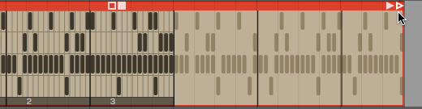

*Looping a Step Clip*

If your Step clip loops only the last pattern section, enable *Repeat
Whole Sequence* in Actions or Properties.


*Enable *Repeat Whole Sequence**

## Render a Step Clip to MIDI

When you get to a point where you want to do more detailed ending on
your Step clip sequence, convert it to a MIDI clip and use the MIDI
editor. To do this, right-click the Step clip header and choose *Convert
to MIDI clip*. A MIDI clip is created, replacing the Step clip.


*Convert a Step Clip to a MIDI Clip*

## Step Clip Presets

Waveform includes the ability to save presets of your Step clips. This
is very useful for creating a library of sequences for use in future
productions. You may want to create presets and use them as templates,
holding your preferred starting points for Step clip channel assignments
and names.


*Always use *Create Preset > Include patterns**

To save a preset, select the Step clip by clicking the header. Then
click *Create Preset > Include patterns* in Actions. You can name and
tag your preset. To find it later choose Load Preset. Alternatively use
the Browser Presets tab and filter by *Step Clips*.


*Preset Details Dialog Box for a Step Clip*

**Tip:** I suggest you always use *Create Preset > Include patterns.*
*Create Preset > Exclude Patterns* is also available, but that will
always have the default 16 step blank pattern since the save function
doesn't include any patterns. If you use this option, you may be
disappointed to see that presets don't appear to save correctly. If you
want a blank preset, clear all the notes, then save it using *Create
Preset > Include patterns*.

## Moving On

Step clips are incredibly powerful and a fun way to work with MIDI data
and virtual instruments. They are also unique to Waveform. Use this tool
as a secret weapon for creating cool and expressive beats!

**Video Clips:** Check out this tutorial series to learn more about Step
clips:

[Step Clips Overview](https://w-edstrom.wistia.com/medias/pjf2cdmm4t)

[Step Clips
Velocity/Gate](https://w-edstrom.wistia.com/medias/mz2dg3v98s)

[Step Clips Randomize Each
Step](https://w-edstrom.wistia.com/medias/ztgsqpw2y5)

[Step Clips Groove](https://w-edstrom.wistia.com/medias/mz2dg3v98s)

[Step Clips Route Channels to Different
Synths](https://w-edstrom.wistia.com/medias/vncjr2ilh9)


# Using Plugins

In this chapter, we will show you how to apply effects plugins using the
In-line mixer or the separate mixer window.

**Note:** Scanning plugins and setting up a favorites plugin list are
done on the Settings tab, Plugins page. Check the reference section
[Reference: Settings > Plugins](reference-settings--plugins) to learn more about that.

## The In-line Mixer

The In-line mixer section resides along the right side of the Edit, and
completes the left-to-right signal flow on each track. You can open and
close the Mixer using the open/close icon at the upper right, or also
using keyboard shortcut M.


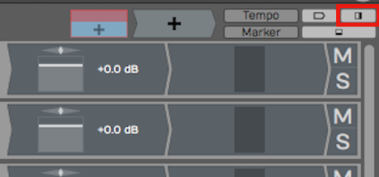

*Button to Open Close the In-line mixer (M)*

Whenever you create a new track, it will automatically have a *Volume &
Pan* plugin and a *Level Meter* plugin inserted. These behave just like
any other plugin. You can change the order, remove them, or even add
additional instances of them on the same track.


*Default Plugins *Volume & Pan* and *Level Meter**

For example, you might want a level meter before and after a compressor.
Of course, you can add other plugins, both built-in and third party to
the Mixer section.


*Level Meter Before and After a 3rd Party Compressor*

**Tip:** Each Mixer channel is stereo. If the track contains mono clips,
you will still typically want to choose stereo versions of plugins for
the Mixer, as mono plugins will only effect the left side of the signal.

## Adjusting the Size of the In-line Mixer Section

Try moving the mouse pointer from the arrangement slowly to the Mixer
section. As your pointer crosses over from the arrangement to the Mixer,
notice the vertical highlight line.


*Resizing the Mixer*

Drag the highlight line to the left to expand the Mixer section. If you
drag it right, then you can make the Mixer section smaller. All of the
plugins on the Mixer are dynamically resized.

**Tip:** If you accidentally delete, change, or move a plugin, or simply
change your mind, click *Undo* on the Menu (Ctrl + Z / Cmd + Z) to
restore it.

## Working with Plugins

You can fully customize the mixer for each track by inserting a chain of
plugins. This is one of the most compelling features of Waveform, as
there is no need to switch between a horizontal track view and a
vertical console view.

Here are the essentials for working with plugins in the Mixer:

Inserting Plugins
- To insert additional Waveform plugins or third-party plugins, drag
    the Plugin Object to a track and then select the plugin that you
    would like from the list.


*Drag the Plugin Object to Insert a Plugin*

For third-party plugins, the UI window will pop up. Apart from the core
built-in plugins, each has its own graphical user interface.

Right-click to Insert
- Right-click on any existing plugin and select *Add new plugin.* This
    pulls up the plugin selector menu and you may pick any plugin to
    add. It will be added to the left of plugin you started from.

**Note:** If you don't see some of your plugins, review the previous
chapter that details how to scan your system for all available plugins.

Plugin Properties
- To select a plugin, click on it. When selected, Properties shows a
    wide variety of settings and actions related to that plugin. Most of
    the built-in plugins have the entire user interface in Properties.


*Select a Plugin to See its Properties*

Duplicating Plugins
- To duplicate a plugin, select it and press D. This gives you a new
    instance of the plugin to drag to a different position or to another
    track.


*Duplicate Plugins by Pressing D*

Deleting Plugins
- To delete a plugin, simply select the plugin and hit Delete or
    Backspace. You may alternatively click the red *Delete Plugin*
    button in Properties.

Moving Plugins
- To move a plugin from one track to another track, simply grab the
    plugin and drag it wherever you would like to put it, even to a
    different track. As you drag, a red insert illumination will appear
    showing where the plugin will be after you drop it.


*Moving a Plugin*

Copying Plugins
- To copy a plugin, hold down Opt / Alt and drag it to where you want
    the copy. Alternatively, press D to duplicated it then drag the
    duplicate to the target location.

Bypassing a Plugin
- To bypass a plugin, select the plugin then turn off *Enabled* in
    Properties. Or, simply select the plugin and press the keyboard
    shortcut F. A bypassed plugin appears with a red X through it on the
    Mixer.


*A Bypassed Plugin*

**Tip:** You can bypass several plugins at once, by first selecting them
and then pressing F.

## Assigning a Quick Control Parameter

You can assign a quick control parameter to any instance of a plugin.
This allows you immediate access to tweak one parameter without mousing
back to Properties or opening the UI for the plugin. For example, I
often set the mix control for delay plugins as quick control.


*Delay Mix Set as a Quick Control Parameter*

To set up a quick control parameter, right-click the plugin and choose
*Select quick control parameter.* Next, choose which parameter to use.


*Right-click to Set the Quick Control Parameter*

Waveform Delay has only two parameters, but many third-party have many
more to to choose from.

## Third-Party Plugins

Third-party plugins are inserted in the same way as built-in plugins.
One difference is that the UI (user interface) does not appear in
Properties. Each plugin has its own UI window.


*Sonimus SonEQ, an Example 3rd Party Plugin*

To open the UI for a third-party plugin, double-click the plugin in the
Mixer.

**Note:** You can change to a single-click to open plugin windows the
Settings Tab, Plugins page. The parameter is *Opening Plugin Windows.*


*Setting to Open Plugins with a Single-click*

## Searching for Plugins

The Waveform Browser includes a Search tab. This allows you to search
for plugins. When you find one you want to use, drag it to your Edit.
Here are the steps:

1.  Open the Browser and click the Search tab
2.  Type in a few characters of the name of the plugin
3.  From the search results, drag the plugin from the Browser to the
    Mixer.


*Searching for Plugins Using the Browser, Search tab*

The search uses an index that includes plugin names, tags, and
manufacturer. We covered how to set tags in the previous chapter.

**Tip:** It often helps to disable the options for *Loops* and *Presets*
when searching for a specific plugin. This gives you more targeted
results.


*Limiting Search Filters to Plugins*

## Using Master Plugins

To apply processing to the full stereo mix, add plugins to the Master
section. The drop target says *Drop Master Plugins Here.*


*Master Section Plugins Area*

Typically, you may put a bus compressor, a limiter, and maybe an EQ on
the master. Another great option is Waveform's own Final Mix plugin,
which combines all of those functions in to one package expressly
designed for use on a full mix.


*Master Mix inserted in the Master Section*

**Tip:** You can right click the *Drop Master Plugins Here* area then
choose *Add new plugin* to open the plugin selector menu. You may find
this a bit faster than dragging the plugin object down there!


*Right-click to *Add new plugin**


# Built-in Effects Plugins

The Waveform built-in effects are really quite simple. They act as
plugins that you can combine to build up more complex effects chains in
the mixer, or within plugin racks. While we won't touch on every single
effect here, we will go over the essential ones. Let's get started.

## Waveform Effects

Drag the plugin object to the mixer and select *Waveform Plugins.*
You'll see the list of built-in effects.


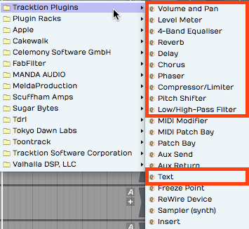

*Built-in Plugin Effects in Waveform*

In this chapter, we will go into more detail about the plugins
hightailed in the image above. The other effects provide specialized
functions, or are not typical audio effects. We'll get into some of
those in later chapters.

## Volume & Pan Plugin

Whenever you create a track, you will see a *Volume & Pan* plugin at the
right in the mixer section. This gives you basic level and pan controls
like you'd expect to find on any mixer channel. Since the Waveform mixer
is made up of plugins, the *Volume & Pan* plugin can be moved before
other plugins or deleted entirely. You can even add another *Volume &
Pan* and use it as a trim control for gain staging.

Adjusting Volume
- To control volume, click and drag the volume slider up and down. A
    large volume slider appears as drag giving you nice readable dB
    markings for fine level adjustment. The numeric value for *Volume*
    setting appears in Properties.


*Volume & Pan Plugin, Adjusting Volume*

Adjusting Panning
- The pan adjustment works similarly. Click the panner graphic then
    drag left or right to adjust left to right stereo positioning.


*Volume & Pan Plugin, Adjusting Panning*

Resetting Controls
- To reset either *Volume* or *Pan* to their default position, hold
    down Opt / Alt as you click the control.

Properties
- With a *Volume & Pan* plugin selected its values and actions appear
    in Properties.


**Volume & Pan* Plugin Properties*

The *Volume* slider is repeated in Properties along with buttons for
*Reset* and *Mute*. *Pan* is repeated in Properties along with a *Centre
Panning* button that resets panning.

Pan Law
- Properties also holds a setting for *Pan Law*. By default this is
    set to *Linear* but you can change it to other popular formats. For
    example, many DAWs use a -3 dB pan law so that as you pan to the
    center it lowers the volume slightly to make it easier to keep a
    track in balance as you adjusting panning.

**Tip:** To apply a velocity offset to notes going into a virtual
instruments, insert a *Volume & Pan* plugin before it and enable *Apply
to MIDI velocities*. Adjust the fader to offset MIDI velocity to
increase or reduce the velocity. This is a quick way make your MIDI
drums hit harder - much easier than going back to editing the MIDI data.
This only works if you insert *Volume & Pan* ahead (to the left) of the
virtual instrument.

## Level Meter

The *Level Meter* plugin is also at the right end of the mixer for every
track by default. *Level Meter* is stereo and shows what the left and
right levels are doing.


*Level Meter Plugin*

When you select a *Level Meter*, Properties displays a large horizontal
version of the meter, that also includes dB markings.


*Large Meter in Properties*

The meter indicates signal overload with a red indicator at the top of
the meter. You can reset the meter by clicking the red overload
indicator.

**Tip:** To clear all overload indicators in the Edit, right-click any
level meter and choose *Reset all overload indicators* ( Backslash ).

By default the *Level Meter* is set to peak mode. This is typical of the
metering in most DAWs. You may change the meter mode in Properties or
from the right-click menu. Here is an explanation of each of the modes:


*Meter Modes for the *Level Meter* Plugin*

Peak Mode
- Peak mode shows the digital peak. This is the normal mode for
    Waveform and most other DAWs. From a technical point of view, you
    want to keep this out of the red to prevent ugly digital clipping.

RMS Mode
- To get a sense of the overall perceived volume your signal, try RMS
    mode; it emulates the response of legacy VU meters and gives you a
    better indication of how loud one track is perceived, compared to
    others.

Sum & Difference Mode
- *Sum & difference* is a specialized mode that gives you a visual
    representation of both the level and the stereo spread. The left
    part of the meter shows the level of sum of left plus right. This
    represents the combined level of the stereo signal.

The right side of the meter shows the difference between left and right.
The more difference you see the wider the stereo spread between the two
channels. This gives you a visual indication of stereo spread. If both
channels are playing exactly the same thing, then left minus right will
cancel to zero and the right side of the meter will show no activity: a
mono signal.

**Tip:** The level meter will also indicate MIDI activity if you enable
*Show MIDI activity* in Properties. This can be a very useful diagnostic
if you ever wonder why a virtual instrument is not triggering.


*Level Meter, *Show MIDI activity**

## The 4-Band Equalizer

The *4-band Equalizer* has a graphical interface that shows up in
Properties. You'll immediately notice that there are four bands, which
correspond to four movable nodes on the frequency response plot. The
high band and the low band are shelving filters, the middle two bands
are peaking filters.


*The 4-Band Equalizer*

To adjust the gain of any of the bands, grab the node directly in the
middle by the small square and drag up or down. To set the frequency of
any band, drag the node left or right. To adjust the width (or Q) of the
filter drag within the perimeter of the node clockwise to make the band
narrower or counterclockwise to make it broader.

On the shelving bands, drag clockwise to make the slope increase or drag
counterclockwise to make the slope shallower. As you adjust these values
you'll see the actual numeric values over to the right for *Frequency*,
*Gain*, and *Q*.

Just under the frequency plot, notice the *Reset* button. Click *Reset*
to return all four bands back to their default values giving you a flat
frequency response plot.

Also, the notice the controls for saving and loading presets. Using
these you can create a library of common presets to use in your mixing
projects. The *4-band Equalizer* is very simple and the graphic
adjustment makes it very quick to sweep through the frequencies to
quickly locate your cuts and boosts.

## Reverb

Waveform's *Reverb* plugin doesn't have a fancy user interface; You get
just a few simple sliders. It is however a very effective, low-CPU tool
to add some depth to a track, and may be all you need to get a nice
variety of reverb sounds.


*Traction *Reverb**

**Tip:** You may find it speeds up mixing to assign *Wet Mix* (Wet
Level) as the quick control parameter when using *Reverb.* Mixing with a
little reverb on a track gives you another dimension to mix with, in
addition to level and panning. More reverb pushes the track further
back, less reverb sounds closer. Combine that with left and right
placement from panning for more spacious mixes.


*Reverb, Wet Level as the Quick Control Parameter*

## Delay

The Waveform *Delay* is an extremely simplified mono delay effect, with
delay times up to one second. You control *Length* with a slider,
allowing you to enter delay times between zero and 1000 milliseconds.
You can also adjust the *Feedback* amount with the *Feedback* slider,
from no feedback all the way up to 0 dB (which is essentially full
feedback). The *Amount* parameter is a mix control, and allows you to
set the percentage of the effected signal to pass through. {style="width: 258px"}

The *Delay* plugins also has a *Tempo* parameter. It is not really a
host sync, but rather just helps you calculate delay times based on
musical divisions of the beat at the current tempo.


*Waveform Delay *Tempo* Selection*

For example, if you want to get an eighth note delay, click *Tempo* and
select *Set delay length to 1/2 beat* and it calculates that delay time
and sets the value int *Length*. It is a one time calculation; If you
change the Edit tempo, then you need to set it again.

## Chorus

The *Chorus* plugin gives you the classic chorusing effect. It works as
a type of doubling effect but it provides a shimmery, smooth quality. It
can be used on just about any source, but is common on guitars, pads,
electric pianos, bass, and vocals.


*The *Chorus* Plugin Parameters*

To get the classic chorus effect, the plugin modulates the delay time;
the delay time is gradually changing, getting longer and shorter. The
amount of variation is controlled by the *Depth* parameter. The *Speed*
slider controls the quickness of modulation to get results from warbling
to smooth. The *Width* slider adjusts how far apart the dry signal and
the wet signal are panned to give you a wide stereo effect or a narrow
doubling. Finally, *Amount* controls the overall mix of the original
signal with the chorus effect.

## The Phaser

Phase shifter pedals became popular in the late '60's and during the
'70's. It gives you an intense swirling impression you will instantly
recognize. While a phaser is most commonly used as a guitar effect, it
is also frequently used on synths or any track that needs some movement.


*The *Phaser* Plugin*

The *Speed* parameter controls the speed of the LFO that modulates the
phase shifting effect. *Depth* controls the number of octaves the phase
shift will sweep through. *Feedback* lets you adjust resonance which
makes the phasing more or less intense. The *Tempo* parameter allows you
to set the *Speed* of the LFO to a musically useful division of a beat
based the current tempo.

**Tip:** As you work with effects you can easily change the order of
effects on any track by grabbing the plugin and dragging it left or
right. As you drag, a red drop target will glow in the spot where the
effect will be inserted when you drop it.

## The Compressor/Limiter

Waveform's *Compressor/Limiter* is a very basic compressor, that
includes most of the common parameters you expect to find in a
compressor: *Threshold*, *Ratio*, *Attack*, *Release*, and make-up gain
(*Output*).


*The *Compressor/Limiter* Plugin*

As the signal goes above the *Threshold*, the compressor reduces the
output signal by the amount set by *Ratio.* So, if you set *Ratio* to
4:1, *Attack* sets how long it takes for the 4:1 ratio to fully kick in.
*Release* is the amount of time it takes for the compressor to recover
after the signal goes back below the threshold.

You can set *Threshold* and the *Ratio* by dragging the appropriate
nodes on the frequency response transfer plot.

*Compressor/Limiter* functions as a limiter when you set the *Ratio* to
the maximum of 20:1. When used as a limiter you also want to set a very
fast attack time. In this mode it really clamps down on transients.


*Compressor/Limiter Configured as a Limiter*

**Note:** The built-in *Compressor/Limiter* lacks metering, but you can
insert a *Level Meter* before and after the compressor and look at the
difference between the two meters get an idea of gain reduction.

## Pitch Shifter

The *Pitch Shifter* plugin uses DSP processing to change the pitch of
the signal in real time. For audio tracks, this uses the *Elastique Pro*
algorithm, or whichever algorithm you select in the *Type* parameter.


*The Waveform Pitch Shifter Plugin*

*Pitch Shifter* is set in semi-tones; if you want to go up an octave,
set *Pitch* to 12. If you want to go down one octave set it to -12. To
reset back to the original pitch, select *Pitch* and type in zero.


**Pitch Shifter, Set Pitch**

**Tip:** You nay find it's usually a lot easier to control the *Pitch*
value by typing in the digits than it is to use the slider.

**Note:** If you insert *Pitch Shifter* ahead of a MIDI instrument, it
works on the MIDI data stream to transpose notes up or down by the value
you set in the *Pitch* parameter.

## The Low/High-Pass Filter

You may use this plugin frequently because of its simplicity. Drag the
*Low/High-Pass Filter* to any track; in Properties choose if you want it
to be *Low-pass* or *High-pass.*


*High/Low-Pass Filter Properties*

Once you've made that selection, drag the *Frequency* slider or type in
the frequency. For example, if you want to just create a common rumble
filter to apply to a vocal, Choose *High-pass* and set *Frequency* to
100 Hz.

**Tip:** A quick way to create a low-fi effect on any track is to insert
two of these filters, one set to *High-pass* and one set to *Low-pass*.
For example, set the high-pass frequency to about 300 and set the
low-pass frequency to about 3,000. That will give you a nice starting
point for a low-fi sound.

## Text Plugin

The text plugin is a convenient tool to keep your Edit organized as you
record, edit, and mix. Drag *Text* it to a track, give it a *Name* and
then type in a *Description*.


*Text Plugin Example*

You can type in as much text as you'd like describing how the recording
was made, the kind of microphones used, the artist name, and really
anything you'd like to make a note of. *Text* plugin *Name* appears
right in the mixer on the thumbnail. While *Text* doesn't do anything to
your audio path it can help you remember what you were doing when you
come back to a project later on.

**Tip:** You can enable or disable several plugins at once by simply
selecting all of them and using the keyboard shortcut F.

## Saving Presets

Most of the built-in plugins allow you to load, save, and delete
presets. Once you have your favorite presets saved, you can search for
presets on the Presets tab or the Search tab of the Browser.


*Load, Save, or Delete Presets*

As you create presets you can also add tags to make it quick to filter
to exactly what you are looking for; Vocal EQ, Guitar Focus, Bass Boost
for example.

## Moving On

Now we've touched on most of the built-in plugins in Waveform. The
built-in effects, along with third-party plugins give you tremendous
creative potential when composing or mixing.


# Effects Bus Tracks

In this chapter, you'll learn how to set up an effects bus track in
Waveform. A *bus track* is configured to be shared by multiple tracks
within your Edit. Sometimes this is called a master effects bus. This is
an extremely common production technique that originated when recording
was done using large mixing consoles. When mixing with a console,
effects like reverb and delay are created using outboard hardware. In
the early days, studios only had a limited number of reverbs and
chambers to use. The solution was to use a common bus for the effect and
then send the desired amount of each track over to the effect bus.

It works the same way in Waveform. You dedicate a track to the effect
and then use a special *Aux Send* plugin to send part of the signal from
your instrument, vocal, or drum tracks to over to the effects bus track.

## Create the Bus Track

To get started create a new track. The fastest way is select any track
and hit T. That creates a new blank track right after the one that you
started with. You can drag the new track anywhere you'd like.

Next, click on the track name, and rename the track by editing *Name* in
Properties. In this example you can use a reverb effect and name it
"Master Reverb."


*New, Blank Track*

## Adding the Effect Plugin

The next step is to insert an effect plugin on the bus track. In this
example we're using Waveform *Reverb*.


*Insert the Reverb Plugin*

Check that the *Dry Mix* fader is turned all the way down. You want only
the wet signal to go through *Reverb*. You can tweak the other
parameters later, after you get some sound going through it.


*Set the Mix to 100% Wet*

**Tip:** If the plugin you're using has a mix control, make sure it's
turned to the 100 % wet position. The critical thing here is you don't
want any dry signal being mixed back in through a different, parallel
path.

## Aux Return Plugin

So this seems like a pretty ordinary track. How do you make this track
behave like a bus? You do so by inserting the *Aux Return* plugin, one
of the built-in plugins in Waveform. It pairs up with the *Aux Send*
plugin for just this purpose.

Insert the Waveform *Aux Return* plugin to the left of *Reverb.*


*Insert the *Aux Return* Plugin*

Notice that it is labeled *Aux Return #1* in Properties. Also, you can
see it is automatically assigned to the next available bus: in this case
\*Bus #1.


*Automatic Bus Assignment for *Aux Return**

It's optional but you can type in something descriptive for the *Bus
Name* property. In this case *Verb 1*.


*Adding a Descriptive *Bus Name**

The descriptive name appears right on the plugin thumbnail in the mixer,
making things much clearer. This will help even more when you have
several effects buses configured.


*How the *Bus Name* Appears in the Mixer*

## Adding Aux Sends to the Channels

Now that your effects bus track is set up, all you need to do is insert
an *Aux Send* plugin on each track where you would like to apply this
effect.


*Insert *Aux Send* on a Track*

This is important. Insert *Aux Send* after the *Volume & Pan* plugin.
This way as you adjust the track volume, you're also adjusting the
amount sent to the bus track proportionally. Even if you lower the
volume all the way down, you won't hear a ghosting of the effects bus
from that track playing in your mix.

**Note:** On a conventional mixing console, this position is called
"post fader." Hardware consoles will have a special switch or maybe even
a special knob that allows you to send post fader. In Waveform you do
this in a very direct way: rearrange the order of the fader so that it
comes before the *Aux Send* plugin.

## Adjusting the Send Level

Now that it's all set up, as you play back, adjust the send level by
clicking on the *Aux Send* plugin, and adjusting the *Send level* slider
that pops up.


*Adjust the *Aux Send* Level*

Alternatively, you can just click on the *Aux Send* plugin and adjust
*Send* in the Properties section. The more you turn it up the more
effect you'll get. As you turn it down, you get less and less of the
effect.

## Assigning the Aux Bus

You can create as many effects bus tracks as you need for your mix. You
might want a reverb for drums, a different reverb for vocals, a delay
for vocals, and other delay for guitars. The steps to set up the
additional buses are the same as outlined above. You just need to make
sure your *Aux Sends* and *Aux Returns* are assigned to the correct bus
numbers.


*Setup with Three Bus Effects Tracks*

When we set up Verb 1, we used *Bus #1.* For DLY1 WE HAVE used *Bus #2*
and gave it a unique name.


*Assigning Buses to the *Aux Returns**

As you insert the *Aux Send* plugin onto each track, select which effect
you want to use by choosing the correct bus.


*Selecting the Effects Bus for Aux Send*

**Tip:** Feel free to assign more than one *Aux Send* to the same track.

Your effects tracks aren't limited to a single plugin. You can create an
entire effects chain, for exampling combining compression, EQ, reverb,
or delay on a single bus track.

## Solo Isolate

There's a special solo mode that you will likely to want to use on bus
tracks, called *Solo isolate*. To do so, right-click the *Solo* button
on one of your bus tracks and choose the option *Solo isolate*.


*Enable Solo Isolate on Your Effects Tracks*

Notice how that the *Solo* button changes from "S" to "SI." With *Solo
isolate* enabled, if you solo any track, this track will also be soloed.
This is useful because when you solo a track, you usually want to hear
it along with its send effects. If you don't use *Solo isolate* on your
bus tracks, the effects get muted when you solo a track.

**Tip:** Waveform includes a track tagging feature that allows you to
quickly view any tracks that share a tag. You can tag all of the effects
buses with the tag "FX.", which makes it really easy to pull up a view
of all of your effects bus tracks using the Tracks tab in the Browser.
Take organization one step further by giving your bus tracks a specific
color.

## Effects Bus Track Presets

If you commonly use a similar set of send effects, you can create some
presets for your bus tracks, and then recall them for your next project.
To do so, right-click the track name and select *Save preset > whole
track*.


*Saving an Effects Track Preset*

In the *Preset Details* dialogue box, put in an appropriate name for
your preset such as "Master Reverb." In the tags area, the tag *Track*
will automatically be entered. You can also add another tag such as
*Effects Bus*.


*Preset Details Dialog Box*

Remember to separate tags with a comma. Click *OK*, then the next time
you want to create a very similar effects bus track, go to the Presets
tab in the Browser and filter by *Effects Bus*. Drag the preset onto any
track to instantly configure your favorite master effects set up.

## Moving On

In a full mix, you may have four or more effects buses configured at
once, such as two reverbs and two delays: drum reverb, vocal reverb,
stereo delay, and a mono slap back delay.

One key is to group the bus tracks together and to put them at the top
of the Edit. You can also make them a unique color, tag, and label them
appropriately.

Once you get a hang of the set up, using effects bus tracks in Waveform
is very straight forward.


# Clip Effects

In Chapters 29 through 31 we covered using effects plugins in a variety
of ways. Now, we want to show you how to apply plugins to individual
Audio clips. Let's get started.

## Inserting Plugins on Clips

To insert a plugin on an Audio clip, drag the plugin from the Browser or
the plugin object, and drop it onto the Audio clip. You'll notice that
the plugin thumbnail appears in the lower right corner of the clip. You
can add as many plugins as you'd like to create a chain of effects, all
operating on that one clip.


*Plugins Using Clip Effects*

**Note:** Clip effects work with Audio clips, but not MIDI clips or Step
clips.

The rest of the operation is pretty much the same as using plugins in
the mixer. Select a plugin and hit F to enable or disable it. You can
also enable or disable the effect with the *Enabled* button in
Properties.

For third-party plugins, clicking or double clicking on the plugin opens
its user interface.

**Tip:** How plugins open, depends on a setting in the Settings tab
Plugins page: *Opening Plugin Windows.* It can be set to either
*Single-click on a plugin to open its GUI window* or *Double-click on a
plugin to open its GUI window.*

## Removing Clip Plugins

To remove a plugin, simply click on the plugin and press Delete or
Backspace. You can also select multiple plugins by holding down Cmd /
Ctrl to select multiples, and then press Delete to remove them.

## Creative Uses

One of the reasons to use clip effects is if you want to put an effect
on just part of a track, even a single word or a single phrase. Without
using clip effects, you'd need to move a piece of the clip to another
track to apply a different type of an effect. This is really useful for
something like an echo throw where you're applying an echo effect to a
single word, or if you want to process one phrase of a vocal line with a
lo-fi effect. Just separate the phrase or word to its own cli, then
apply the effect only to that short clip.

## Echo Throw Example

An echo throw is taking one word, usually the last word of a phrase and
then applying an echo to it. Here are the steps:

1.  First, separate the final word of the phrase from the rest of the
    phrase. To do that position the cursor where you'd like to make the
    split and hit the slash (/) key.
2.  Now that clip is separated into its own clip, drag in the *Delay*
    plugin.
3.  Dial in the *Delay* parameter so it echoes out in a musically useful
    way, maybe using eighth notes or quarter notes. Add a little bit of
    *Feedback* so you get some echoes that die out over time.
4.  Playback and tweak the *Delay* parameters until you get the echo
    throw effect that you like.

## Moving On

The same technique is great for lo-fi effects as well. Apply a high pass
and a low pass filter in order to cut the highs and the lows, or even
apply chorusing to a few words in a vocal line. Clip effects are super
easy to use in Waveform, and they unlock all kinds of creative options!


# Folder Tracks

With the Folder Tracks feature, you collect a group of tracks into a
folder, allowing to you work with them together as unit. The obvious
advantage is to collapse the view so that related tracks, like your drum
tracks, can be viewed as a single entity.

Folder Tracks also give you a convenient way to apply volume automation,
so that you can do a fade across a number of tracks at the same time.
Folder Tracks allow you to solo every track that is contained within it
with a single click. You can also do basic editing across the included.
Let's take a closer look.

## Creating a Folder Track

To create a Folder Track, right-click the track name for any existing
track and select *Create a new Folder Track*. The Folder Track appears
below the original track.


*New Empty Folder Track*

Alternatively, right click on the background of the Track section and
choose *Create a new Folder Track*.

Either of these methods will create a new empty Folder Track. There are
easy ways to create a Folder Track containing existing tracks, which we
will cover that shortly.

## Working with Folder Tracks

Putting Tracks into a Folder Track
- To put a track into a Folder Track, simply grab the track by the
    track name, drag it, and drop it on the folder. Just before you drop
    it, the Folder Track will glow, usually with a red color, indicating
    it's ready to receive your track.


*Folder Track after Dropping in One Track*

If you already have some tracks in the folder you can drag it over the
folder and then downward; You'll notice a red glowing insertion point,
where you can put your track between other tracks to get the order you
would like.

Naming a Folder Track
- Naming a Folder Track works exactly like any other track. Click on
    the header part of the track where the name is, and then edit *Name*
    in Properties. By default, it will have a name similar to *Folder 1*
    or *Folder 2*.


*Naming a Folder Track*

**Tip:** One of the most common uses of Folder Tracks is to organize all
of your drum parts into a single folder. In this case, you might want to
name it 'Drums' or 'Drums Folder.'

Reorder Tracks within a Folder Track
- To reorder the tracks within your Folder Track, grab any track and
    drag it to the correct position. The red insertion line shows the
    target, so you know exactly where the track is going to go. When you
    drag a track directly onto the Folder Track and drop it, that track
    goes to the topmost position.


*Reordering Tracks within a Folder*

Collapsing and Expanding a Folder Track
- Click the small triangle to the left of the Folder Track name to
    expand or collapse the folder. When the folder is collapsed it
    doesn't affect playback. All the tracks that are contained within
    the folder still play and respond as normal.


*Expand/Collapse a Folder by Clicking the Triangle*

Soloing/Muting a Folder Track
- Folder Tracks have *Solo* and *Mute* buttons, just like any other
    track. However, they operate on all of the tracks that are contained
    in the folder. So if you have a Folder Track set up for your drums
    and you click *Solo*, you will solo all of your drum tracks.
    Likewise, *Mute* mutes all the tracks with in the folder


*Folder Track Solo*

**Note:** When you solo a Folder Track, the tracks contained in it are
soloed with a blinking *Solo* button. This indicates that the track is
being soloed by the Folder Track and not directly. If you click the
blinking *Solo* it will change to the standard solo state with a steady
indicator.

The *Solo* and *Mute* functions are really good reasons to set up Folder
Tracks for the different instrument types. You can set up Folder Tracks
for drums, for guitars, for keyboards, and another for vocals.

## The Folder Track VCA

VCA stands for "voltage controlled amplifier." For those of you with
experience with analog gear, that name relates to a similar feature on
automated mixing consoles. In essence, the VCA on the Folder Track
remotely controls the level of all the included tracks proportionally.
This gives you level control for the everything in the folder.


*Folder Track VCA*

Keep in mind that no audio passes through the Folder Track itself. The
VCA acts as a remote control, proportionally controlling the volume of
all of the individual *Volume & Pan* plugins of the tracks contained
within the Folder Track. It's a very convenient way to add high-level
mixing to your groups of instruments, without going through the
complexity of adding numerous additional bus.

**Note:** You can't insert plugins on Folder Tracks, since no audio
actually passes through the track. To do so you would need to create a
Submix Track, which we'll cover in the next chapter. \# Creating a
Folder Track with Existing Tracks

With multi-track drums, you often have 10 tracks or more that you need
to put into a Folder Track. Rather than drag each track individually,
there is a quick way to pack all of them into a Folder Track at once:


*Create a Folder Track Contain Existing Tracks*

1.  Select the first track by clicking on the track name. Hold down
    Shift and click on the last track. All of the drum tracks will then
    be highlighted.
2.  Next, right-click on the track name for any of the tracks and choose
    the option *Create new folder track containing*. This instantly
    creates a Folder Track containing all of your drum tracks.
3.  Finally, select on the Folder Track and give it a descriptive name
    in Properties.

**Tip:** This isn't limited to drum tracks. *Create new folder track
containing* is a great way to create Folder Tracks for any related
selection of instruments or vocals.

## Editing With Folder Tracks

Folder Tracks get even cooler when you discover the editing
possibilities. Here is a rundown of what's possible:

Splitting Contained Clips
- To split clips across all of the contained tracks by simply
    selecting the Folder Track clip, position the cursor, then press
    Slash.


*Split All Clips Within a Folder Track*

Rearranging
- After splitting the Folder Track clip, you can rearrange everything
    within the folder by dragging the Folder Track clips to any order.
    You can use this rearrange a song or just swap verse 1 and verse 2.
    If you put all your tracks in to a Folder Track you can use this for
    block arranging of the song.


*Rearranging Clips within a Folder Track*

Trimming
- The beginnings and the endings of the Folder Track clips have trim
    handles. Drag to trim all the included clips.


*Trimming Using the Folder Track Clip*

Deleting
- In addition to moving and splitting clips, you can delete entire
    sections of the contained tracks by separating out a section,
    selecting it, and pressing Delete or Backspace.

## Automating a Fade within a Folder Track

You can automate the VCA fader to create fade-outs or fade-ins on Folder
Tracks. We'll get into more detail about automation in a later chapter,
but here is a step by step recipe for creating fade-outs:

1.  Grab the little "A" icon. That is the automation icon for the track.
    Drag it and drop it on the VCA fader. A red line appears on the
    Folder Track. That is the automation curve for the VCA fader.


*Activate Automation for the VCA*

1.  Double-click on automation curve add points. Add two points: one
    before and one after the section you would like to fade.


*Add Automation Points to the VCA Curve*

1.  Drag the last point all the way down to the bottom of the clip to
    draw in your fade-out.
2.  Between the two points you added, notice an additional point was
    automatically added. This is a curvature point. Drag the curvature
    point to adjust the shape of the fade.


*Customizing the Fade with *Curvature**

You can further adjust the speed of the fade by dragging all these
points until it sounds like what you want. The automation points snap to
the current snap increment. Turn *Snap* off for finer adjustment.

This technique is really a time-saver because you don't have to go in
and edit each individual clip in order to do a fade-out.

## Moving On

Folder Tracks are a powerful feature in Waveform. You may have seen this
concept in other digital audio workstations. Once you get the hang of
how it works in Waveform, you will be amazed at the creative things you
can do with Folder Tracks.


# Submix Tracks

In professional mixing, it is common to submix drums to a stereo bus to
add compression, EQ, and limiting before mixing it with other other
tracks. Actually, it is common to submix other things like vocals,
guitars, or instruments. Starting with T6, awe added a Submix Tracks
feature that resembles Folder Tracks but with a twist: you can process a
submix with plugins.

Like earlier versions, you still have the option to use any track as a
submix. This still works and has certain advantages. We will show you
how to configure that later in the chapter.

## Creating a Submix Track

Creating a Submix Track in Waveform is super easy:

1.  First, select all the tracks you want to include.


*Creating a Submix Track*

1.  Right-click any of the tracks and choose *Create submix track
    containing*. The same action is also available in Properties as
    *Create Submix Containing.*


*A Submix Track*

The result looks very similar to a Folder Track. It differs in that the
audio actually passes through the Submix Track. You can use the *Volume
& Pan* plug and add any additional plugins you want.

## Working with Submix Tracks

Adding Tracks
- To add a track to a Submix, just drag and drop it on the Submix
    folder. You also drag tracks up or down within the Submix Track to
    re-order them. This works exactly like it does for Folder Tracks.

Removing Tracks
- To remove a track from a Submix, simple grab it by the track name
    and drag it back out.

**Tip:** When dragging tracks, grab them by the track name.

Open/Close a Submix
- A Submix works just a like Track Folder in that you can open and
    close it with triangular control at the far left of the header.

Adding Effects
- You can add any built-in or third-party effect you want (accept for
    the Waveform *Freeze Point*) to Submix Tracks. Just drag them to the
    mixer like any other track.

Muting
- *Mute* works like you would expect, muting everything within the
    Submix Track.

Soloing
- soloing works a little differently than you might expect. When you
    click Solo on the Submix, it mutes all other tracks, including the
    ones contained within the Submix Track.

## Creating an Old School Submix Track

In older versions of Waveform, The way to setup a submix was to use a
track. We will review how this is done, since you may encounter older
Projects that used this method.

1.  Create a track in the normal way.


*Creating an Old School Submix Track*

1.  Name the track appropriately. In this example, we have named it
    *Drums Submix*.
2.  Select all the tracks you want to route to the submix.
3.  In Properties, click *Track Destination.* Select your the *Drums
    Submix* track. This effectively routes the output of each selected
    track through to the drum submix track.


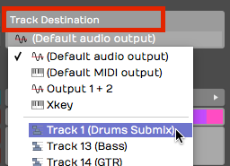

*Set the Track Destination on the Source Tracks*

Now, you can use the *Volume & Pan* control on your *Drum Submix* track
to control the volume of all the tracks that you have just routed to it.
You can also add any plugins you want to the new Submix Track. In this
example, we have inserted a tape simulator and a third party bus
compressor.


*Submix Using Third Party Plugins*

Of course, you can use any processing that you like. That depends
largely on which kind of tracks and the style of music.


# Automation

This chapter is an introduction to the automation features in Waveform.
Automation allows you to program changes to many of the parameters that
exist within a track. You can easily program changes to volume, pan, and
plugin parameters. You can program automation using external hardware,
like controllers that have knobs and faders. Alternatively, you can
program automation by adding points and changing the shape of the
graphic automation curve that appears as a line on or below the track.

Waveform has excellent features designed to keep all of your automation
nicely organized. For example, you can add Automation Tracks that nest
under your track. You can also open them when you're working on
automation changes and edits, and then close them when you move onto
other parts of your project.

In this chapter, we're going to focus on *Volume & Pan* automation and
then offer an example of how to extend automation to parameters within
other plugins.

## Activating Automation on a Track

The keys to automation are the A icon and the 'plus' icon that reside at
the far right of each track.


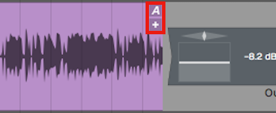

*The A and Plus Automation Icons*

The first step is to click the plus sign, to add an Automation Track.
You'll instantly see the Automation Track appear below your original
track. The Automation Track will have minus, A, and plus icons.


*Track with One Automation Track*

The minus icon will remove the Automation Track, the A icon allows you
to set up the track, and the plus icon will add yet another Automation
Track below this one.

## Choosing What to Automate

For this example, we're going to automate volume on the track. To do
that, click the A icon. Then select the menu item, *Automatable
parameters for this track > Volume & Pan Plugin > Volume*.


*Select the Parameter to Automate*

You'll see an automation line appear. The line is labelled with the name
of the parameter, and the value of the parameter is listed over on the
right. This line is the "automation curve." There's no literal curve to
it yet, because it's just a line. As you will see shortly, it's easy to
draw curves, steps, and ramps.


*The Automation Curve Line*

Click the curve to select it, then check out its Properties. You can
change the *Name* or choose from several actions. Those make more sense
once you have some automation points on the curve.


*Automation Curve Properties*

**Tip:** A fast way to set the automation parameter for the track is to
grab the A icon and just drop it on the thing you would like to
automate. Then choose the parameter from the list. So, to automate
panning, drag the A and drop it on the *Volume & Pan* plugin and then
choose *Pan* from the list. This also works for third party plugins.

## Adding Points to the Automation Curve

To give your Automation Curve some shape, you need to add some points on
it. Add points with either double-click or Opt-click / Alt-click. Here
is how to work with the automation points:

Creating a Ramp
- To draw a ramp add two points and the drag one of them up or down.
    This adjust the steepness of the ramp. Drag the points left or right
    to adjust the start and ending of the ramp.


*Drawing an Automation Ramp*

Shaping with Curvature
- To shape the line segment between points you can use the *Curvature*
    the point. A Curvature point is automatically inserted midway
    between two automation points. Adjust Curvature by dragging
    diagonally.


*Adjusting a Curvature Point*

**Tip:** The automation point can also be adjusted in Properties using
the *Value* parameter slider. You will also find a slider for
*Curvature* in Properties.


*Value* and *Curvature* Properties*

Drawing an Automation Step
- Insert two points that define the position of the step. Hold down
    Cmd / Ctrl and drag the line segment between the points up or down.
    You'll see that the line segment moves separately from the overall
    automation curve. This makes it really easy to draw in a step shape
    on your automation. If you don't hold down Cmd / Ctrl, then the
    entire automation curve moves.


*Hold Cmd / Ctrl to Draw a Step*

## Automating Fade-ins and Fade-outs

To program a fade shape with automation, add a point where you'd like
the fade to start, then add another point where you'd like the fade to
end. Drag the second point all the way down until the value reads zero.
Adjust the speed of the fade by dragging point down to the left for a
quicker fade or up to the right for a more gradual fade. Dragging the
Curvature point to adjust the shape of the fade ramp. Of course, you
always have the option to adjust that parameters directly in Properties.

As we discussed in a Chapter 33, if you program an automation curve for
a track folder, you can apply a fade across all the tracks together.

## Converting a Clip Fade-in or Fade-out to Automation

As you've already learned you can easily apply fade-ins or fade-outs to
Audio Clips with the fade handles on the upper left and right corners of
the clip. If, for some reason, you'd like more control over the fade
shape you can convert a clip level fade to and an automation curve.


*Clip Fade*

To convert a clip fade to automation, first select the clip and then
click *Copy Fade To Automation > Transfer Fade-in to Automation,
Transfer Fade-out to Automation* in Properties.


*Copy Fade to Automation*

That will redraw the automation curve in the shape of the fade and
remove the clip fade from the clip. Now you can apply additional points
and shaping using the automation tools.


*Result of Copy Fade to Automation*

## Reading Automation

Once you've drawn automation like this, Waveform performs the automation
dynamically during playback, as long as you have *Automation Read*
enabled on the Transport.


*Automation Read Enabled*

As you playback, watch the controls changing in real time as the cursor
moves through the Edit. If you go back about three decades that feature
would cost you about a million bucks!

## Automation Curve Properties

The automation curve has several of its own properties. Click on the
curve to selected it and look at Properties. Here is a rundown of the
controls:


*Automation Curve Properties*

Curve
- The *Curve* property is the name that appears above the automation
    curve. This is here for reference only. You can't change it
    directly. It is made up of the track name, the plugin name, and the
    parameter.

Displace Curve
- *Displace Curve* allows you to drag left or right which offsets the
    curve up or down. It basically takes the entire programmed curve and
    set of points, and moves them down if you drag left or up if you
    drag right. This is very useful to make minor mix changes after the
    automation is already programmed.

Scale Curve
- Think of *Scale Curve* to function like an intensity control. As you
    drag to the left, it proportionately lowers all of the points on the
    curve, squashing the shape of the curve. Dragging to the right
    expands the curve, scaling it upward.

Only Displace/Scale the Marked Region
- This parameter works along with *Displace Curve* and *Scale Curve*.
    When enabled, any scaling or displacing, only occurs between the
    In-marker and the Out-marker.

Simplify
- If your automation curve becomes very complex with lots and lots of
    points, you use *Simplify* to thin out the points. You can usually
    choose *Simplify the entire curve* and then pick from *Light*,
    *Medium*, and *Strong*. The *Light* option does the least thinning
    where *Strong* thins the most. This is particularly useful if you
    recorded automation from a hardware controller that added hundreds
    of points.


*Automation Curve Simplify*

You also have the option to *Simplify only in marked region.* You can
use this if you want to simply just simplify a section that was recorded
from hardware, leaving the rest of the curve unchanged.

Delete Points from Curve
- This set of options allows you to completely reset the automation
    curve. If you delete all points from the curve, you've basically
    taken it back to a flat line. Sometimes this results in the
    automation value being set very low, so you might need to drag the
    curve line back to a good starting position.

You can also *Delete points within the marked region* which means you'll
delete all the points between the In-marker and the Out-marker. You can
do the same thing and "close the gap," means to take out the time within
the marked region.

Copy the Marked Region to the Clipboard
- Set the In-marker and the Out-marker over a region of automation and
    click *Copy Marked Region to the Clipboard* to copy that region of
    the curve. Then, position the cursor to the destination and select
    *Paste From Clipboard > Paste Curves at Cursor Position* and that
    pastes the automation. This makes it fast to create repeating
    patterns of automation.

This is also useful if you've created a very specific effect using
automation and want to reproduce that effect in a later part of the
song.

*Paste from Clipboard* has two options. Most of the time I would use
*Paste curves at cursor position*. You can alternatively do that with
Cmd + V / Ctrl + V.

Alternatively, choose *Paste curves to fit between the in/out markers*.
That allows targeting the destination only within the merged region.
Normally you paste at the cursor position.

**Tip:** You don't need to manually copy automation when moving or
duplicating clips on a track. Enable *Auto Lock* in the Master section
and the automation follows along as you move or duplicate clips.

## How to Find Out What Automation is Active for a Track

It's pretty easy to program a lot of automation, but sometimes you don't
have all of the automation curves visible. To see which ones are
available click the A icon and select *Active Parameter Curves for This
Track*. This shows all automation curves for the track and you can
choose which one to make visible.


*Active Parameters for a Track*

This is particularly helpful if you don't have each parameter on a
separate Automation track.

## Remap on Tempo Change

Each plugin has a *Remap on Tempo Change* setting in Properties. With
that enabled, as you change the tempo of the song, the automation will
track the tempo changes. That means it will get smaller if you speed up
the tempo or it will get longer in order to match the clips in your
Edit. This is a great feature but is not enabled by default; You need to
turn it on for each plugin.


*Remap on Tempo Change*

**Tip:** We suggest you turn *Remap on Tempo Change* on as a global
option for all new Edits. To do so, enable *Timecode > Default
remapping options > Remap plugin automation* from the Menu section.


*Make Remap the Default*

**Note:** Remap Plugin Automation is not set as the default or turned on
by default, to maintain compatibility with older projects. This setting
and the new default option were new for T6.

## Writing Automation on the Fly

During playback, you can adjust a parameter in real time and have
Waveform record it as automation. You can do this with a MIDI
controller, or simply by manipulating plugin controls on-screen during
playback. All you need to do is setup your automation track and enable
*Automation Write* mode.


**Automation Write* Enabled*

To go into write mode, enable the *Automation Write* button on the
Transport. Now, during playback, Waveform will record any dynamic
changes you make to the parameter.


*Automation from Write Mode*

**Note:** You don't need to be in Record mode to record automation
changes. All you need is to have automation write turned on during
playback.

**Tip:** When you've written automation this way, it's often a good idea
to use *Simplify* to thin out the automation points. You may find you
get good results with the *Medium* option.


*Automation with Medium Simplification*

## Automation Lock

Notice in the Master section, there is an *Auto Lock* button. By default
that button is not engaged. If you move a clip around on a track, the
automation will not follow it to the new position.


*Automation Lock Engaged*

With *Auto Lock* engaged, automation will follow as you drag the clip to
a different place in time. It's a great feature, assuming that's what
you want to do.

## Moving On

There is a lot more you can do with automation, because you can automate
almost any parameter. You can automate sends to effects. You can even
automate your Master plugins. Simply create a separate track then drag
the A icon from that track over to the Master section plugins to
automate them.


# Mixing Down

In this chapter we're going to go over the steps required to mix down
your Edit to a WAV file or MP3 file.

## Master Section Processing

Before you mix down, you might want to add some Master effects, so that
the entire stereo mix is processed. Master plugins often include a
compressor and a limiter to give the final mix a professional sound.

We won't get into the details about exactly what you'd apply there,
although the included Waveform *Master Mix* plugin is a nice choice.
It's a multi-band compressor, EQ, and limiter all in one.


*Waveform Master Mix*

Make sure that the metering for the Master section is not going into the
red before you export the mix. Exactly how you process the mix depends
on what you plan to do with the file after it's mixed down.


*Waveform Master Section*

If you're having professional mastering done, then you probably don't
want to put any plugins on there. However, if you are immediately going
to upload to your website or SoundCloud, you will want to put some
mastering effects on to make your mix into a finished product.

## Exporting to a WAV File

Here are the steps to export your song as a WAV file:

1.  Set the In-marker exactly at the beginning of the song. This defines
    the start of the export. Adjust the position of the In-marker to
    skip any extra bars or count-in at the beginning of the Edit.


*Set the In-marker Just Before the Song Start*

2.  Set the Out-marker right after the end of the song. This allows you
    to control the exact length of the exported file. We recommend
    leaving a couple of extra milliseconds after the final fade.


*Set the Out-marker Just After the Song Ending*

3.  Select *Export > Render to a file* from the Menu section. The
    *Render* dialog box appears.


*Export Render Dialog Box*

The above example shows the most common settings for exporting a WAV
file. You can customize the file location and name if you want. Also,
make sure to select *Only Render Marked Region* so that the In-marker
and Out-markers are used to define the export region.

4.  Click *Render* and the export will begin. Waveform starts processing
    in the background as you adjust the settings. Much of the time
    export is already done as soon as you click *Render*!

## Locating the Exported File

Unless you change the file path, the file saves to the project folder.
You can find the file either on the Projects tab or from the Browser.

Locating the Export on the Projects Tab
- Click the Projects tab and look at the *Exported Audio/MIDI* list at
    the right. Unless you have changed the filename, your exported file
    will be there with the word "Export", and an export number appended.


*The Exported File on the Project Page Files List*

To locate the file in Finder or File Explorer on your computer, select
the exported file and look at Properties. In Properties, click the *...*
button to the right of *File* and choose *Open the folder containing
this file.* That opens the folder on your system, giving you direct
access to the file.

Locating the Export in the Browser
- Open the Browser and go to the Files tab. Click the folder icon and
    select *Project folder*.


*Locate the Project folder from the Browser*

Double-click the folder named *Exported* and you will see your file. To
located it in Finder or File Explorer, right-click and choose *Open the
folder containing this file*.


**Exported* Folder in the Browser*

## Exporting to an MP3 File

The steps to create an MP3 file are almost identical. Follow the same
steps above except when you get to the *Render* dialog box select MP3
for *Format*. That selection gives you a few extra options for
Rendering.

Add ID3/Vorbis Info
- With MP3 exports you can select this option to add metadata to the
    file.


*Add ID3/Vorbis Info*

To enter the metadata, click *Edit* to the right of the option. That
gives you the *ID3/Vorbis Info* dialog box. Fill in any information you
want to include in your MP3 and click *OK*.


*ID3/Vorbis Info Dialog Box*

This information is not required. So, if you don't care to include the
information, leave the *Add ID3/Vorbis Info* deselected.

Quality
- You can choose from common MP3 quality settings. VBR stands for
    "Variable Bit Rate" and helps optimize the file size in exchange for
    a bit more complicated decoding. CBR stand for "Constant Bit-rate"
    and gives you slightly larger files that are encoded consistently.


*MP3 Export *Quality* Options*

With today's fast internet speeds, including for mobile users, we
recommend choosing the maximum 320 KB/s CBR. Those will give you good
sounding MP3 files to upload to various sites or use in your own player.

## Additional Render Properties

The *Render* dialog box has numerous settings. Often you can skip
looking at all of this stuff and just hit *Render* and you will get an
output file. However, it is a helpful to know what the other properties
do:

File Name and Location
- The first line is the file name and the location of the output file.
    You can edit that to name the file with the song name. You can also
    update the destination folder location on you system. By default it
    will be export to an "Exported" folder location in the project
    folder.

Format
- While exporting to WAV and MP3 files are the most common choices,
    Waveform supports several other file types:


*Export File Format Options*

Stereo
- For music it is most common to export to stereo files. If you
    deselect *Stereo* the file is exported as mono. You can use mono
    exports for voiceover files, fore example.


*Export Stereo/Mono Selection*

Remove Silence at Start/End
- This does, as it says. If there is excess silence before the song or
    if there is a long silence at the end, Waveform will take that out.


*File Export Options*

Dithering Enabled
- If you don't know anything about dithering, then leave this enabled
    and move on. If you do know about dithering, then you can turn this
    off and add a third-party dither plugin in the Master section,
    configuring it to dither as you please.

Only render the marked region.
- Whenever Waveform indicates "marked region", it means the range
    between the In-marker and the Out-marker. When enabled, the exported
    file only includes the audio between the In-marker and the
    Out-marker.

Render Each Track to a Separate File
- If someone else is going to mix your song in a different digital
    audio workstation, then you might want to export every single track
    in a fashion that can be imported into another system. If that's the
    case, turn this option on and you'll wind up with a whole collection
    of files: one for each track of your project. For a normal stereo
    export, leave this turned off.

Render at 1X Play-Speed
- If you are using the Insert plugin to mix through some external
    hardware effect, turn this option on when exporting your mix.
    Normally, you leave this option turned off. When enabled the Edit
    will render in real time, meaning, it will mix it down in exactly
    the same amount of time it would take to play back once. Some feel
    you will get the best sound quality rendering at 1X and for that
    reason, some Waveform users enable 1X rendering for the final master
    exports.

Normalize
- Normalize adjusts the overall gain of the file so that the highest
    peak fills up the available bit depth. Most of the time you will
    leave this turned off.


*More File Export Options*

Adjust Level Based on RMS
- Adjusting the level based on RMS is a way to set the output to match
    a perceived volume level. Modern broadcast standards require your
    files not to exceed standards based on the country and use.

Render Automatically
- With this feature, in the background, as soon as you open the
    *Render* dialog box, it starts mixing down. It even shows you the
    progress on the lower waveform display. If you don't make any
    changes to the settings, as soon as you hit *Render* it's done
    instantly. Waveform already created the file in the background. It's
    sort of like working ahead. If you do make changes, it will start
    re-rendering right away. If you have a slower computer you can turn
    *Render Automatically* off.

Add to Library
- Add to library means you will add what you are mixing down to your
    loop library, so that you can search for it and use it in another
    project. It's a useful feature if you are mixing a lot of things to
    add to your library to build it up.

## Moving On

We have gone all the way from installing the program, to recording,
editing, adding virtual instruments, to using guitar amp sims, mixing,
and mixing down. There's still a lot more that you can learn and explore
about Waveform and your own music. Have fun, and make a lot of music.


# Macros

Waveform includes not only programmable shortcuts, but also a full macro
programming environment. You can develop keyboard shortcuts that combine
actions in new ways to streamline your workflow. If the standard
keyboard shortcuts don't meet your needs, you can create custom macros
and assign keyboard shortcuts to them.

While you might think of macros as keyboard macros, you don't have to
assign them to keyboard shortcuts. You can always launch them from the
*Run Script* button in the Menu section. This approach can be useful
because you don't have to remember the shortcut to macros you only use
occasionally.

## Script Editor

To open the Script Editor, go to the Settings tab, and select the
Keyboard Shortcuts page. Enable *Show Script Editor* at the bottom right
of the Keyboard Shortcuts page. The Script Editor will open.


*The Script Editor*

You can resize the height of the Script Editor by dragging the line that
separates it from the keyboard shortcuts list. The Script Editor is a
basic text editor that you use to enter and edit macro scripts.

**Tip:** With the Script Editor open, try clicking on some of the
existing keyboard shortcuts. The Script Editor will show you the
underlying code, you can use this to get familiar with the syntax of the
actions triggered by each shortcut.

## Creating a Macro

To create a new macro, click *Add a new macro* on the Script Editor.
This adds a new macro named "Untitled Macro" to the bottom of the
keyboard shortcuts list under the Macros section.


*Adding a New Macro*

As soon as the new macro is created, the name defaults to *Untitled
Macro* and is selected. Start typing to give it a suitable name.

In the body of the macro, you can type in a list of actions to create
the script. The easiest way is to build your macros using the
right-click menu; more on that in a bit! Actions are separated by
semicolons.

## Deleting a Macro

While you can't delete the built-in keyboard shortcuts, you can delete
any custom macros you create. To do so, select the macro to delete in
the keyboard shortcuts list, and click *Delete macro* in the Script
Editor.

## Programming a Macro

The simplest macro is made up of a single action. You can pick any
available action by right-clicking the Script Editor and navigating
through the three collections of actions. When you find an action you
want to use, select it and the appropriate code will be inserted into
the script.


*Selecting Actions from the Script Editor Right-click Menu*

-   *Actions > Standard Shortcuts* includes all the built-in keyboard
    shortcuts shown on the Keyboard Shortcuts page.
-   *Actions > Basic Actions* includes available actions that are not
    necessarily available as pre-assigned shortcuts.
-   *Actions > Advanced actions* includes actions that allow you
    manipulate selected objects and even display messages on the screen.
    Advanced actions are provided as tools for more advanced script
    programming.

## Running a Macro

There are several ways to run a macro:

1.  Assign it to a keyboard shortcut. Keyboard shortcuts are assigned to
    macros in the very same way as the built-in shortcuts. Find the
    macro in the list and click the "+" to the far right and enter the
    desired key combination.
2.  Click *Run Script > User Macros* from the Menu section of the Edit
    tab. All your custom macros appear there automatically. Select the
    one you want to run.


*Running Macros using *Run Script > User Macros**

1.  Add macros to the Custom Menu. At the bottom of the Keyboard
    Shortcuts page, click to enable *Show Script Tree Editor*. Then drag
    your macros (or any built-in actions) to the tree editor. Arrange it
    using drag and drop, add groups, and rename groups. Access the
    Custom Menu from the menu in the Edit: *Run Script > Custom Menu*.


*The Script Tree Editor*

## Javascript Programming

Beyond creating simple step-by-step lists of actions, you can take macro
programming to the next level using the power of Javascript. The Script
Editor allows you to program loops and conditions using Javascript
syntax. It even provides color coding for the elements of the script.


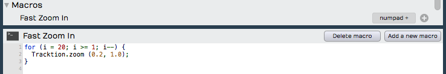

*Javascript Macro Example*

**Note:** Waveform actions are exposed as methods using 'dot' notation.
By that, we mean that they start with the word Waveform, then a dot,
then the method. Following the method you can provide one or more
parameter in parenthesis.


*Macro Actions 'dot' Notation Syntax*

## Hover Tooltip

If you hover over an action in the script editor for a second or two,
you will see a tooltip bubble explaining what parameters the action
takes. If the action returns values, you will see the syntax of that.
These tooltips give you key information when programming macros.
Waveform's developers use this to give you meaningful clues about how
each of the actions work.


*Hover Over an Action for a Tooltip*

In the above example, the the tooltip shows that the zoom action takes
two double precision numeric parameters. The first is the x-proportion
(the amount of vertical zoom), and the second is the y-proportion (the
amount of horizontal zoom).

## RTZ Macro Example

By default Waveform doesn't have a true return-to-zero (RTZ) keyboard
shortcut. The built-in command stops first if it encounters the In-mark
so you need, to hit it twice to really get back to zero. However, you
can create a macro that performs does the action twice, always returning
the cursor to the start of the Edit.


*True Return-to-Zero Macro Example*

For example, you couldassign the RTZ macro to the Home key.

## Merge Clips Macro Example

Another feature that you may use often is *Merge Clips*. Normally you
use this by selecting a few clips on a track that you want to combine to
a single clip. Then you select *Render Clips > Merge the Selected
Clips* from Properties. If you do this frequently, you could do it with
a single keyboard shortcut, for example assigning it to Cmd + G / Ctrl +
G.


*Merge Clips Macro Assigned*

## Importing and Exporting Macros

Macros are actually just simple text. You can easily copy and paste the
text directly in and out of the script editor. In addition, Waveform has
dedicated buttons to import and export macro scripts as XML files with a
`.Waveformscript` extension.


*Script Input and Export Buttons*

## TSC Code Samples

Waveform's engineers have supplied code samples of several macro scripts
to get you started:


```js
// Rename Clips From Track
var tracks = Waveform.getSelectedEditElements ('track');

for (var i = 0; i &lt; tracks.length; ++i)
{
   var track = tracks[i];
   var trackName = Waveform.getName (track);
   var clips = Waveform.getClipsFromTracks (track);

   for (var c = 0; c &lt; clips.length; ++c)
   {
      var clipName = trackName + &quot; &quot; + (c + 1);
      Waveform.setName (clips[c], clipName);
   }
}
```


```js
// Reset Tracks Solo/Mute
var tracks = Waveform.getEditElements ('track');
Waveform.setSolo (tracks, false);
Waveform.setSoloIsolate (tracks, false);
Waveform.setMute (tracks, false);
```


```js
//Next Active Automation Parameter
var track = Waveform.getTrackFromSelectedObject();
Waveform.changeActiveAutomationParameter (track, 1);
```


```js
// Insert Plugin with Preset
var track = Waveform.getTrackFromSelectedObject();
var plugin = Waveform.insertPlugin (track, &quot;Massive&quot;, 0, &quot;AudioUnit&quot;);
var preset = Waveform.getPresetFromLibrary (&quot;Massive All Souls&quot;);
Waveform.setPluginPreset (plugin, preset);
```


```js
// Jump to tab 2
var index = Waveform.getWindowTabIndex();
var delta = 2 - index;
Waveform.changeWindowTabIndex (delta);
```


```js
// Rename Selected Tracks
var tracks = Waveform.getSelectedEditElements ('track');
Waveform.setName (tracks[0], 'Kick');
Waveform.setName (tracks[1], 'Snare');
Waveform.setName (tracks[2], 'Hats');
// etc.
```


```js
// Save Selected Plugins as Preset
var plugins = Waveform.getSelectedEditElements ('plugin');
Waveform.saveObjectsAsPreset (plugins);
```

## My Code Samples


```js
/* Park the In-Marker & Out-Markers
Parks the In-marker and Out-marker at Zero then Restores Cursor Position. I wrote this macro to help a KVR forum member find a quick way to hide the In-marker and Out-marker.
*/
var SavePosition = Waveform.getPosition ('cursor');
Waveform.moveTransportToStart();
Waveform.moveTransportToStart();
Waveform.markIn();
Waveform.markOut();
Waveform.setPosition ('cursor', SavePosition);
```


```js
 /* Search Plugins
 Opens the Browser to the Search tab, enables the Plugin searching while disabling searching for Presets and Loops.
 */
 Waveform.showSidePanel ('search'); // Opens Browser to the Search tab
 Waveform.enableSearchLibrary ('plugin', true);
 Waveform.enableSearchLibrary ('preset', false);
 Waveform.enableSearchLibrary ('loop', false);
 Waveform.setSearchPanelText ('');  // loads blank text so you can start typing the search term right away
```


```js
// Rename selected clips to 'Drums'
var clips = Waveform.getSelectedEditElements ('clip');
for (var i = 0; i &lt; clips.length; ++i)
    Waveform.setName (clips[i], 'Drums');
```


```js
// Rename selected tracks to 'Drums'
var tracks = Waveform.getSelectedEditElements ('track');
for (var i = 0; i &lt; tracks.length; ++i)
    Waveform.setName (tracks[i], 'Drums');
```

## Moving On

These are fairly simple examples. Waveform users are only just starting
to explore the powerful capabilities of macro programming in Waveform.


# New in Waveform Version 8

Waveform version 8 has many new and exciting features, that both enhance
the workflow and open up new creative potential. New features include:

-   New vertical mixer panel that can be viewed in its own tab
-   New MIDI editor panel that can be undocked
-   Enhanced MIDI editing for easy note entry, CC adjustments and
    converting notes to chords
-   New MIDI musicality generator tools for creating melodies, chords,
    bass lines and arpeggios
-   The Master Mix and FM Synth plugins are now integrated directly into
    the application
-   Improved crash recovery, complete with disabling of problematic
    plugins, enabling you to recover work
-   Newly optimized user interface
-   Improved MIDI note expression editing and MPE generation
-   New track and clip colour options for more consistent coloring
-   New key commands, including:
    -   create triad chord: command + 3
    -   create 7th chord: command + 7
    -   invert chord up: + command + T
    -   invert chord down: command + shift + T
    -   fit notes: command + F
    -   transpose up octave: command + O
    -   transpose down octave: command + shift+O
    -   merge notes: command + M
    -   split notes: command + /
    -   legato notes: shift + L

The above new features will each be explained further, in greater
detail, in an upcoming revision of this beta user's manual.

## Tracktion 7 New Features

In addition, the previous version of Waveform, called Tracktion 7 or T7
for short, also included several

## New Interface Look

Tracktion T7 used a new look with bolder clip colors and a choice of a
light or dark background. Its UI featured a modern design, new text
style, and subtle shading.
There are two new options in the Settings tab, General Behaviour page:


*Use Light Color Scheme & Low Detail Options*

Use Low-Contrast Interface
- Enable *Use Light Colour Scheme* for a bright and clean look for the
    background, timeline, and controls.


*The New Light Colour Scheme*

Use Low-Detail Interface
- Enable *Use Low-Detail Interface* to eliminated gradient effects on
    clips and other interface objects.

**Note:** Apart from these two options, the color scheme can't be
changed. The color editor feature has been retired. The good news is
that you won't waste time tweaking the colors so you can spend more time
recording!

## Compact Toolbar

To save space while recording, T7 offered an alternative to the
traditional Controls Panel. The compact Toolbar does most everything the
standard Controls Panel does while taking up a fraction of the screen
space. Not only that, you can switch back and forth between the Toolbar
and Controls Panel easily.


*The New Compact Toolbar*

To open the full Controls Panel from the Toolbar, click the open icon at
the far left.


*Click the Open Icon*

To shrink the Controls Panel down to the compact Toolbar, click the
close icon at the top right of the Menu Section.


*Click the Close Icon*

The left side of the Toolbar includes icons to open and close the Menu
and Properties sections along with dedicated Undo and Redo buttons.
Also, all of the buttons from the Master section appear as icons on the
Toolbar.


*The Toolbar Icons*

**Tip:** Hover your mouse pointer over any icon on the Toolbar and look
at the rollover help in the upper right corner of the Waveform window to
see what it does.

## Working with Properties in Compact Mode

In Tracktion, you often need access to Properties. With the compact
Toolbar, the pop-out Properties panel closes every time you select a
different object: clip, track, automation curve, or plugin.


*Properties Lock Push-pin*

To keep Properties open you can lock it using the push-pin icon at the
upper right. With it pinned, Properties will only close when you click
its icon on the Toolbar. You can always leave it pinned all the time,
and open and close Properties manually.

**Tip:** There is a macro action in the script editor to enable the
Properties lock push-pin under *Basic Actions > Editing > Lock
properties panel*.

```js
// Lock Properties Panel
Tracktion.lockPropertiesPanel();
```

## Keyboard Shortcut to Toggle the Toolbar

If you want to easily switch back and forth between the Toolbar and the
standard Controls Panel, T7 offered a new macro action to do so. Here is
how to set it up:

1.  Go to the Settings tab, Keyboard Shortcuts page.
2.  Open the Script Editor at the bottom of the page.
3.  Click *Add a new macro*.
4.  Fill in a name such as "Toggle Controls Panel Size."
5.  Right-click the editor and navigate to *Basic Actions > Zooming >
    Toggle between full and minimal controls panel*.


*Selecting the Toolbar Toggle Action*

1.  That's all there is to the macro. Now, assign it to a keyboard
    shortcut, such as *F11*.


*The Completed Toggle Controls Panel Size Macro*

**Note:** In the alternative key-mapping used in this book, *F11* is
assigned to *Show/Hide Controls Panel*. You may find that toggling
between the Toolbar and the Controls Panel is a much better use of *F11*
and wish to change this on all your Tracktion installations.

## Browser Position

If you ever wished the Browser were over on the right instead of being
stuck on the left, you are in luck. You can move it! Not only that, you
can move it to the top of the screen if you want. There are two ways to
set the Browser position left, right, or top.

Drag the Browser
- With the Browser open, drag the Browser open/close button to the top
    edge, right edge, or left edge of the screen and drop it.


*Drag Open/Close Move the Browser Right, Left, or Top*

From the Settings Tab
- Alternatively, you can configure Browser position as global
    preference. Go to the *Settings tab, General Behaviour* page. Locate
    the *Side Panel Position* option and choose from *Left*, *Right*, or
    *Top*.


*Settings Tab, General Behaviour - Side Panel Position Setting*

## Multiple Browser Panes

With T7 it became possible to have multiple views into the Browser at
the same time. To add a Browser pane, click the tiny *+* icon at the top
right.


*Click the Plus to Add a Browser Pane*

When you have multiple panes, each pane has a drop-down menu at the top
to choose the Browser view: Files, Tracks, Search, Notification,
Markers, or Clipboard.


*Choosing the View*

You can open as many Browser panes as you want. You may want to have one
pane showing your Files and another set to Search by plugins.


*My Setup With Two Pains*

The above image above shows the Browser at the top.

To close a Browser pane, click the small *X* in the upper right.


*Click *X* to Close a Browser Pane*

## Synchronized Previews

If you have multiple Browser views open and focused on loop files, you
can audition the loops against your song synced to the Edit tempo.


*Multiple Browser Preview*

Since Waveform allows multiple Browser panes, you can start previews for
several loops at the same time. The Browser preview options have been
updated with this in mind. Click the preview options button to open the
selections.


*Browser Preview Options*

Play All
- This is a new option to start the preview of all selected loops
    across all open Browser panes.

Stop All
- This stops all preview playback in all Browser panes.

Re-trigger on play
- Whenever you start playing back a new loop, all Browser panes that
    have loops playing will re-start from the beginning. You will want
    to enable *Re-trigger on play* for each open Browser pane for synced
    auditioning.

Auto-play
- With *Auto-Play* enabled, each time you click a loop or select a new
    loop in a Browser, preview playback will start.

Loop
- With *Loop* on, preview playback will keep repeating until you stop
    it. With *Loop* disable, the preview plays a single time then stops.

**Tip:** Enabling *Re-trigger on play* is essential to have multiple
Browser panes preview in-sync.

When you find a set of loops that work well together using multiple
Browser panes, you probably want to drag them to your Edit. You can do
this in a single operation by dragging one loop while holding Shift. The
Shift modifier causes all the loops to be included in the drag. Next,
drop the all the loops and you are presented with a list of options.
Select how you would like the clips to be added to the Edit.


*Multiple Clip Shift-drag Options*

**Video Clip:** This [video tutorial](https://youtu.be/KEVGBgm9U28)
demonstrates this feature but was created before the Options menu was
implemented.

## Zoom Tool

Tracktion T7 offered a new fast and efficient new way to zoom in and
out. Hold down Shift-Opt / Shift-Alt and drag a selection over the
arrangement. As you drag, a magnifier loop icon appears. When you let
go, you are zoomed in on that area of the screen.


*Dragging a Selection with the Zoom Tool*

The zoom tool is multilevel. Zoom in several times then again hold
Shift-Opt / Shift-Alt and click to zoom back out. Each click steps you
back one zoom level.

**Tip:** There are also new keyboard macro actions that you can assign
to the keyboard to undo and redo the action of the zoom tool. The
actions are found at *Basic Actions > Zooming > undo mouse
select+zoom* and *Basic Actions > Zooming > redo mouse select+zoom*
from the Script Editor.


*Zoom Tool Undo/Redo Macro Actions*

```js
// Undo Zoom
Tracktion.undoSelectZoom();
```


```js
// Redo Zoom
Tracktion.redoSelectZoom();
```


## Project Tab - Three Column View

Starting with T7, the Projects tab added a three column view. These
columns represent the Edit list, assets pool, and exported files. You
can choose which columns to have on-screen using the *View Options*
selector at the top right.


*Project Tab View Options Selector *

If you prefer the long single list from earlier version of Tracktion,
choose *View as single list* from the *View Options* selector.


*Selecting the Classic Single List View*


*Project Tab Two Column View*

## Project Tab - Edit Previews

Starting with T7. the Project tab Edit list now includes a playable
thumbnail preview of the mix of each Edit. Waveform renders this preview
in the background during idle time, when an Edit is open, and then
updates it periodically. You don't need to do anything at all. Click the
thumbnail to play the preview and drag the play cursor around to hear
different parts of the song.


*Edit Preview Thumbnail*

The *Share* button to the right of the preview thumbnail gives you two
ways to share the Edit.


*Preview Share Button Options*

*Share as archive of this edit* takes you directly to the *Create
Archive* dialog box. From here you can export the Edit as a project
bundled with with all necessary assets to load back in to Tracktion on
another computer.


*Create Archive Dialog Box*

The other option on the *Share* button is *Share a preview of this
edit*. This simply locates the preview audio file on your file system.
From here you can do what you want with it. It's in the Ogg Vorbis
format.


*Share Preview Option*

**Note:** Don't drag, move, or erase the preview file. You need to leave
it in this location for the preview to work on the Project page. If you
want to use it somewhere else, copy it first.

## Project Tab - Get Demo Songs

The Menu at the lower left of the Project tab includes a new button:
*Get Demo Songs*. Click that for a quick way to download some Waveform
demo Projects. For a full description of this feature refer to [Installing the Demo Projects](installing-the-demo-projects).

## Drag to Set In-marker & Out-marker

Users of other DAWs are used to dragging along the timeline to draw in
the loop range. With Waveform, the loop range is defined by the
In-marker and Out-marker. In the past you always needed to set both
separately. Starting with T7, there is now a fast way to "draw" in the
range between the In-marker and Out-marker.


*Double-click Drag to Set In/Out Markers*

Double-click on the Timeline and start dragging right. The double-click
positions the In-marker at the starting point. As you drag right, the
Out-marker drags along and is set when you lift the mouse button.

**Video Clip:** Here is a [video tutorial](https://youtu.be/zaPg04Iype4)
demonstrating how to drag to set the In-marker and Out-marker.

## Auto Show Panels

With the Browser, Mixer, or Controls Panel hidden, move the mouse
pointer to the appropriate edge of the window, and the panel will slide
open. When you move your pointer off the panel, it will be hidden away
again.

Give it a try and notice the animation of the new UI as the panels slide
in and out. There is nothing to configure. The auto show feature is
available anytime you have a panel hidden.

**Note:** The auto show feature also works for the new compact Toolbar.

**Tip:** To turn off the auto show panels action, deselect
*Automatically hide and show panels* in the Settings tab, General
Behaviour page.


*Turning off Auto Show Panels*

## Visual Plugin Selector

With T7, The Plugin object shows a new right-click option to open the
Visual Plugin Selector. Once open, you can drag a plugin thumbnail to
the mixer in the normal way. See [Visual Plugin
Selector](visual-plugin-selector) for a complete explanation of this feature.

## Group Clips

With Group Clips, you can combine clips on a track into a single grouped
clip without rendering. The advantage of this is that you can ungroup at
anytime for access to the individual clips.

To create a Group Clip, select the clips you want to group on a track.
It doesn't have to be a contiguous selection, but the clips do need to
reside on the same track.

{style="width: 298px"})

Next, click *Create Group Clip* in Properties.


*Click Create *Group Clip* in Properties*

Notice that the resulting clip has a "Group" label and icon on the lower
left which indicates the number of clips it contains. It also has a
simplified header.


*A Group Clip*

To ungroup the clip back to the original state, select it and click
*Ungroup* in Properties.


*Click Ungroup in Properties*

If you like, you can create a macro and assign *Group Clips* and
*Ungroup* to keyboard shortcuts. In the Script Editor, locate the
actions under *Basic Actions > Editing > Group selected clips* and
*Basic Actions > Editing > Ungroup selected clips*.

Here is the code:


```js
// Group Clips Macro
Tracktion.groupSelectedClips();
```


```js
// Ungroup Clips Macro
Tracktion.ungroupSelectedClips();
```


Group Clips can be useful when working with beats created from sliced up
audio. You can treat the Group Clip as a single single clip making move
and duplicate operations straightforward. At any point you can ungroup
it to modify the various parts.

## Linked Clips

You can also easily create linked copies of clips that reference the
same underlying audio file or MIDI data. Changes to the original clip
then are reflected to any of the linked copies. This works for Audio
clips, MIDI clips and Step clips.

To create a linked clip, drag the *Linked Clip* handle from the clip
header. As you drag, you are dragging a copy referenced back to the
source clip.


*Linked Clip Handle*

In the following image, we have dragged over a linked copy of an audio
file. Notice that the lower left of each clip shows a "link" icon
indicating that this is a linked clip.


*Linked Audio Clips*

To test the link, we have reversed the audio on the first clip. Since
this changes the underlying file, the second clip is also reversed.


*Reversed Linked Audio Clips*

Non-destructive edits like splits and fades don't affect the linked
copy. However, anything that affects the underlying file will. For other
examples of this type of edit, select and audio clip then in Properties
open *View Source Info > Edit Audio File > Basic Editing Operations*.


*Basic Audio Editing Operations*

From this dialog you can perform several kinds of edits to the
underlying file. These operations will affect all linked copies as well
as the original.

Linked clips might be even more useful for MIDI clips. Any changes made
to one of the linked clips are reflected to all the copies. This can be
useful when creating a beat that is used many places in a song. If you
update one linked copy, they all get revised.


*Linked MIDI Clips on Separate Tracks*

While you could so something similar with looped clips, looped clips are
a series of continuous repeats on a single track. Linked clips appear as
separate clips and can even be placed on separate tracks.


*Linked Step Clips Green Handle*

Step clips can also be copied using the *Linked Clips* handle.

**Tip:** It's a bit more difficult to identify linked Step Clips because
they don't have clip names along with the link icon. You can identify
linked Step Clips because the *Linked Clip* handle in the header turns
green whenever there are linked copies present. This holds true for
linked Audio clips and MIDI clips as well.

## Automation Patterns

T7 lets you quickly create repeated automation patterns between the
In-marker and the Out-marker using a new feature located in Properties.

1.  To get started, create an automation curve for a parameter you would
    like to modulate. In this example we are using a simple volume
    curve.
2.  Then, set the In-marker and Out-marker over the range to which you
    want to apply the pattern.


*Volume Automation Between In-marker and Out-marker*

1.  Select the automation curve, then in Properties click *Create
    Pattern Between the Marked Region*.


**Create Pattern Between the Marked Region**

1.  Next, choose from the various pattern shape options. For this
    example we chose *Triangle*.


*Select the Pattern Shape*

1.  Choose a note division for the pattern or number of repeats. In
    typical Waveform fashion, we chose *1/2 beat* in order to repeat the
    pattern every 1/8th note.


*Select Beat Division or Repetitions*

Here is the resulting automation.


*Repeating Triangle Automation*

1.  Adjust the curve using the *Displace Curve* and *Scale Curve* drag
    controls or by editing the automation points in the usual way.


*Displace and Scale Curve Controls*

Here are examples of the other automation pattern shapes:


*Sine Wave*


*Square Wave*


*Ramp Up*


*Ramp Down*

## Automation Ramps

As a companion to automation patterns, Waveform allows you to ramp
patterns up or down in a very simple and effective way. This works in
conjunction with patterns to allow you to increase or decrease the
intensity of a pattern over time. The two *Ramp* options work as
modifiers to the existing *Displace* and *Scale tools*.

Automation Ramps are best explained with an example:

1.  Set the In-marker and Out-marker over a segment of automation you
    would like to ramp in.


*Selected Region of an Automation Pattern*

1.  Click on the automation curve to select it.
2.  In Properties, click *Ramp from the start of Marked Region* to
    enable the ramp behavior.


*Enable *Ramp from the start of Marked Region**

1.  In Properties, manipulate the *Displace Curve* and *Scale Curve*
    sliders. Notice how these affect the left side of the curve allowing
    you to fade in the automation pattern.


*Taper the Curve using *Displace Curve* and *Scale Curve* Sliders*

The companion *Ramp from the end of the Marked Region* allows you to
taper automation down.


**Ramp from the end of the Marked Region**

These new features are easy to miss at first glance, but they provide
tremendous creative potential when programming automation.

**Tip:** The automation ramp features are also available when working
the *Volume & Pan* Clip Layer effect which is explained in [Clip Layer Effects](clip-layer-effects).

**Video Clip:** Here is a [video clip](https://youtu.be/koDUoO3XD-0)
that demonstrates the automation ramp modifiers.

## Plugin Sidechains

In previous version of Tracktion, you needed to configure a Plugin Rack
to use a sidechain input on plugins that support a sidechain. Since T7
this has been greatly simplified.

Plugins that support a sidechain input will now have a side chain
assignment list at the upper left in the plugin header. Simply pick
which track you want to route to the sidechain.


*Selecting a Sidechain Input*

In the above example, we have routed the kick track to the sidechain
input of a gate on the bass track. It's a common trick to lock the bass
to the kick.

**Video Clip:** Here is a [video tutorial](https://youtu.be/PEan2nhPCOA)
demonstrating how to use the new plugin sidechain feature.

## First Run Setup Progress

When you run Waveform for the first time, you will see the *First Run
Setup Progress* panel over on the left. As you click each item, it takes
you directly to the page and feature on the Setup tab needed to complete
the task. The tasks are designed to streamline setup and get new users
configured and running quickly.


*First Run Setup Progress Panel*

If you close the panel and wonder how to get it back. Navigate to *Help
> Show First Run Setup*.


*Turning First Run Setup On*

## Scroll Behaviour

Starting with T7 scroll behaviour options are consolidated on the
Options menu into a new submenu: *Scroll Behaviour.*


*Options > Scroll Behaviour*

The Scroll Behaviour menu features the new default option *Scroll with
playback*. Here is a rundown of what each options does:

Scroll with playback (default)
- During playback the cursor stays on screen. As the cursor goes past
    the right edge, the tracks page over keeping the cursor in view.

Scroll smoothly
- During playback, when the cursor arrives at a fixed position near
    the center of the screen, the tracks scroll under the cursor. This
    is a matter of personal preference.

Keep cursor on screen
- During playback the cursor will stay on the screen. Even while
    editing or manually panning, the cursor always stays on screen. As
    you pan over right the cursor stays at the left edge of the screen.

No options selected
- During playback the cursor will move past the right edge of the
    screen and then move out of site.

**Tip:** For most users we suggest leaving *Scroll with playback*
enabled and the other two options off.

## Track LFOs

Starting with T7, Waveform offers a way to modulate plugin parameters
without drawing in automation curves. This is done using *Track LFOs.*
Track LFOs can be assigned to one or more plugin parameters. Track LFOs
can also be beat synced to the Edit. [Track LFOs](track-lfos) has a
full explanation of Track LFOs.

## Clip Layer Effects

Clip Layer effects are an interesting way to apply common audio
manipulations using layers. Clip Layer effects are accessed from the
*FX* icon that appears on the header of Audio clips. Learn all about
this powerful new feature in [Clip Layer
Effects](clip-layer-effects).

## Updated Plugin Racks

Plugin racks will be covered in more detail in a future revision of this
user's manual. In the meantime, check out this video series at Groove 3
called [Tracktion Plugin Racks Explained](https://www.groove3.com/Tracktion-Software-training-video-tutorials/Tracktion-Plugin-Racks-Explained).
The series covers all the essentials of creating effects chains as well
as using racks to route multi-output virtual instruments to different


*New Collapsable Panels *

We covered that in the Groove 3 series [Tracktion T7 Update
Explained](https://www.groove3.com/Tracktion-Software-training-video-tutorials/Tracktion-T7-Update-Explained?itemid=10016).

Those two resources should get you well on your way to understanding how
to use racks in your projects.


## Moving on

This chapter was a summary of new feature that were incorporated in the
T7 release of Waveform. There were hundreds of other changes and tweaks,
and most of those have been incorporated in to the text of this user's
manual as well. The following chapters go into full detail on the major
new additions.


# Visual Plugin Selector

Waveform's Plugin object has useful option when working with plugins:
Right-click it to open the Visual Plugin selector. This chapter walks
through a full explanation on how to use the Visual Plugin selector.

## Using the Visual Plugin Selector

To open the window into the Visual Plugin selector, right-click on the
Plugin object. You will see all your plugins represented by thumbnail
images along with the name.


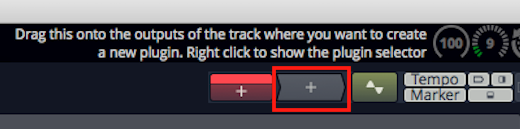

*Right-click to Open the Visual Plugin Selector*

**Note:** If all you see are a lot of question marks, then read on; we
will explain how to scan your plugins to capture thumbnails in a bit.


*Visual Plugin Selector*

From here you can scroll through all your plugins. When you find one you
want to use, drag it and the window will close but continue dragging.
Now drop it on a track in the normal way.

The Visual Plugin selector window offers just few controls to make
finding the right plugin more simple.


*Visual Plugin Selector Controls*

1.  After opening the Visual Plugin selector, start typing in search
    characters to filter the list.
2.  Adjust the size of the thumbnail images using the slider at the
    right.
3.  If you decide not to pick a plugin, click the *X* at the upper left
    or press *ESC* to close the window.
4.  As you drag a plugin, the window will close and you'll be dragging a
    transparent image of the plugin which you can drop wherever you want
    to use it.


*Dragging a Plugin*

## Determining Plugin Technology

As you over the mouse pointer over a thumbnail, an icon will appear in
the upper left corner. This indicates which interface technology is used
by that plugin: AU, VST, or VST3. This helps you pick from plugin
thumbnails that otherwise look the same.


*Audio Units Icon*


*VST Icon*


*VST3 Icon*

These are the same icons are used in the Browser Search tab to
differentiate the plugin technology.

## Customizing the Thumbnail Image

Open any plugin in Waveform and notice the new camera icon in the upper
right corner. Click that camera to take a snapshot of the plugin window
and update the thumbnail image. If you want more interesting thumbnails,
use this to capture the plugin in action with the meters moving or with
an interesting EQ curve.


*Customize a Plugin Thumbnail*

## Scanning to Capture Thumbnails

When you first start using Waveform, the Visual Plugin selector
thumbnails appear as blank question marks. When you open a plugin for
the first time, Waveform grabs the thumbnail image. Over time, the
thumbnails will begin to fill in.

If you are you want all of them populated with images right away, you
can! Locate the *Scan for plugin thumbnails* options on the *Settings
tab, Plugins page*.


*Capture Thumbnails Options*

There are three options: You can *scan all plugins*, *scan for new
plugins* (those without thumbnails), or *scan from a selection* in the
list of installed plugins. When you first start with a new Waveform
installation you probably want to use *Scan for all plugins*.


*Thumbnail Scan Progress*

## Opening Visual Plugin Selector with a Shortcut

There is a new macro action to open the Visual Plugin selector. To use
it create a new macro then right-click on the script editor on the
Settings tab, Keyboard Shortcuts page. Navigate to *Advanced Actions >
Plugins > Show or hide the plugin selector page*.


*Action to Open the Selector*

That adds the necessary code to the macro.


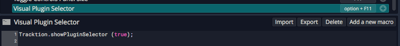

*The Completed Macro*

Assign a keyboard combination that makes sense. In this example, we have
used Option + F11 / Alt + F11.


# Track LFOs

Track LFOs allow you to quickly provide movement to any automatable
plugin parameter. In this chapter, we will show you how to use the Track
LFO feature.

## Inserting a Track LFO

Assign a track LFO to a track by dragging the LFO Creator object to the
mixer section of any track. You either drag it to the top of the track
then assign it to a parameter later, or drag it directly to any plugin
and choose the parameter to modulate right away.


*Track LFO Creator Object*

You can assign as many LFOs to a track as you want. The LFO objects
appear above the plugins for the track. The shape of the LFO is
indicated on the object and you can choose from several colors in
Properties.


*Track LFOs on a Track*

## Track LFO Properties

To control how a track LFO behaves and looks, select the LFO then adjust
the parameters in Properties. Properties also lists what parameters are
being modulated.


*Track LFO Properties*

To choose and LFO shape, select the LFO then click *Wave* in Properties
and choose one of the five shapes: Sine, Triangle, Saw Up, Saw Down, or
Square. The shape will be represented in Properties and on the thumbnail
image on the LFO object.


*Track LFO Shapes*

With the shape selected you can choose how to control the modulation
speed by clicking Sync and then choosing *Time* or *Beat*. If you choose
time adjust the speed by dragging the *Frequency* slider left or right,
or double click *Frequency* and type in a value in Hz.


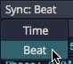

*Track LFO Sync Options*

If you choose Beat, then the Beat divisions menu appears. Click it and
select one of the musical divisions.


*Beat Sync Musical Divisions*

In addition to the speed you can adjust the *Intensity*, *Phase*, and
*Offset* using additional parameters. Also of the are useful but I find
find *Intensity* to be the most essential.


*Time Sync Properties*

## Other Properties

Properties for track LFOs contain several other useful controls. Here is
an explanation of what these do:

Enabled
- *Enabled* turns the LFO on or off. If you want to suspend the
    operation of the LFO without deleting it, turn *Enabled* off.

Remap on Tempo Change
- If you choose Beat synced frequency the value is calculated at the
    time of the selection. If you want to recalculate the value anytime
    tempo changes, then leave *Remap on Tempo Change* enabled. Normally
    you will want to leave this on.

Highlight Controlled Plugins
- With *Highlight Controlled Plugins* enabled it does exactly that. It
    draws a unique color outline around any plugin that has a parameter
    tied to the LFO.

Color
- Select one of the nine colors to use for the track LFO object. This
    is useful if you have several of them on the same track.

**Tip:** The LFO is also used for the highlight color if you have
*Highlight Controlled Plugins* enabled.

Learn
- Click *Learn* then move any plugin parameter and it will be added to
    a temporary list. The click the check symbol to confirm the
    assignments. This is a great way to assign numerous parameters to
    the same LPO.


*Confirm Learn Assignments*

## Removing LFO Assignments

When you select a track LFO, all assigned parameters are shown in the
list at the right side of Properties. To remove any assignment, click
the "X" at the right of the assignment in the list.


*Track LFO Assignment List*

**Tip:** To remove a track LFO entirely, simply select it then click
*Delete LFO* in Properties.

## Video Tutorial

We have published this [video tutorial](https://youtu.be/9UVEAJAvFZ0)
explaining Track LFOs. It shows a few examples of using them with a
virtual instrument.

## Moving On

Track LFOs are a great way to add movement to effects or virtual
instruments. They can also be used to add subtle dynamic panning or
aggressive tremolo. The best part is that the are super simple to use.


# Clip Layer Effects

Clip Layer effects were introduced with T7. They offer quick offline
rendering of many common audio processes but arranged as layers. You can
add or remove layers at will and the effects are rendered in quickly.
You can even rearrange the layers. Effects are applied from the top down
through the layers.

You may find Clip Layer effects to be most useful for things like
applying clip based volume automation, conversion to mono, and
normalizing. However, those are just a few example of Clip Layer effects
capabilities.


*Example Clip Layers*

To use Clip Layer effects, click on new FX icon in the header for any
Audio clip.


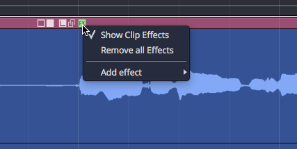

*Audio Clip Header FX Menu*

From there, select from any of effects. More details on each of these
options follows.


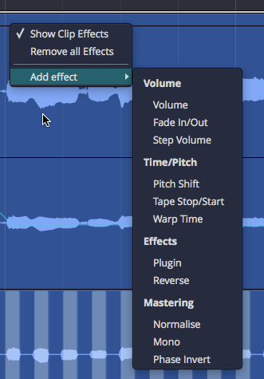

*FX Menu Add Effect Options*

The Clip Layer will appear. As you hover your mouse over it, a set of
controls appears to the right. The following diagram illustrates the
available options.


*Clip Layer Controls Diagram*

## Volume - Volume

Adding a volume layer is the Waveform way to do clip based volume
automation. You may find yourself using this instead of track automation
when it comes to automating volume.


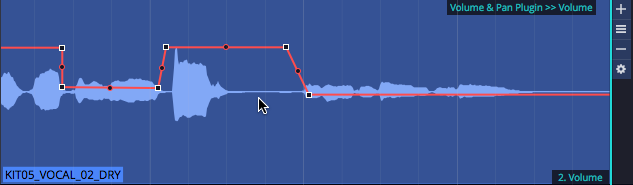

*Volume Clip Layer*

When you click the "gear" icon for a volume layer, you will see the
*Volume & Pan* control values in Properties.


*Volume Clip Layer Properties*

While somewhat useful, you are probably more interested in working with
the volume automation curve itself. To do so, click on the volume curve
(which initially shows up as a line) and then you have access to the
Properties for the that.

**Tip:** See [Automation](automation) for more on editing the
automation curve. Everything about editing automation curves for tracks
applies to volume Clip Layers as well.

## Volume - Fade

Fade-ins and fade-outs are also available as layers. After creating the
fade layer, drag the left or right fade handles to create the fade in or
fade out.


*Fade In/Out*

**Tip:** Right click a fade handle to set the fade shape.

## Volume - Step

Add a step volume layer to rhythmically gate the clip.


*Step Volume Layer*

With the step Clip Layer in place, click the gear icon at the right of
the layer and then work with all the Properties to set the step size and
divisions. You can then click on the steps to turn them on or for
unlimited synced gating options.


*Step Volume Properties*

## Time/Pitch - Pitch Shift

Add a pitch shift Clip Layer to get access to an automation curve for
pitch. Add points and automate like any other effect to apply anything
from simple pitch offsets to dramatic pitch sweeps.


*Pitch Shift Layer*

When you select the pitch curve on the clip, Properties gives you access
to the normal range of controls for automation curves.


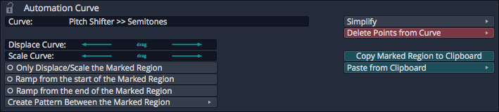

*Pitch Curve Properties*

## Time/Pitch - Tape Stop/Start (Pitch Fade)

You probably already know that you can right-click the fade handles on
any Audio clip to apply pitch fades. Now you can do the same thing as a
Clip Layer effect.


*Tape Stop/Start Layer*

Right-click the fade handle to choose the shape for the curve.


*Tape Stop/Start Fade Options*

## Time/Pitch - Warp Time

Before Clip Layers, you had to go to Properties and then to the click
the Loop Properties tab... then click *Warp Time* to get going. While
that still works, it's much easier with the clip layers feature; Just
add a warp time Clip Layer.

The header area of the Clip Layer will appears shaded. Click anywhere in
the shaded area to add a warp marker.


*Warp Time Clip Layer - Click to Add Marker*

Drag a warp points to time stetch audio between warp markers.


*Drag to Warp*

If you want to remove a warp marker, right-click and remove it or all
markers.


*Right-click to Remove Warp Markers*

You may find this implementation of Warp Time much more convenient,
especially if you want to align transients to things happening on other
tracks in the Edit. With the old way, you couldn't really see timing in
relation to the rest of the Edit.

## Effects - Plugin Layer

A plugin Clip Layer allows you to add any plugin including 3rd-party
effects to a layer.


*Plugin Layer*

You will be prompted to select a plugin as you add the layer. The name
of the plugin appears on the Clip Layer at the lower right when the
layer is selected.

Here are the key things to know when working with the plugin Clip
Layers:

1.  Click the gear icon at the right to open the plugin UI. When you
    tweak parameters, a few second later the change is rendered in.

**Note:** Because of the way rendering works, it is a bit hard to
audition changes to plugin parameters. You may find plugin Clip Layers
are best for applying known presets. If you want to do a lot of real
time tweaking, then you will probably be better off to use a Clip effect
or normal track plugin.

1.  Click the A at the top right to show automation curves. Any exposed
    automation parameter can be selected which makes its curves visible.
    Use all your standard automation editing tools to draw in
    appropriate automation.

## Effects - Reverse Clip Layer

Using the reverse Clip Layer is really easy. Add the layer and the audio
within the clip will now play backwards.


*Reverse Layer*

## Mastering - Normalise Layer

Normalise adjusts the gain of audio so that it use all of the available
the bit depth. The concept is analogous to "zoom-to-fit" in image
editing software.

To use it, first add Normalize layer.


*Normalise Layer*

Then adjust the *Normalize* value to keep peaks where you want. In
voiceover work, many customers request the audio to be normalized to
-3db.


*Normalise Property*

## Mastering - Mono Layer

To convert to mono, the mono Clip Layer is a greta feature. It is much
more convenient to use this than other approaches in Waveform.

First add a mono Clip Layer:


*Mono Layer*

The choose one of options for determine how to render to mono from
stereo:


*Mono Options*

**Note:** Most of the time you will probably select *Average of all
Channels*. This mixes the left and right channels to to create a mono
version.

## Mastering - Phase Invert Layer

The phase invert Clip layer is pretty straightforward. It flips the
polarity of the wave.


*Phase Invert Layer*

## Moving On

We think you will enjoy exploring and working with Clip Layers. It is
really only from experimenting with this approach that you will
understand how it works. There are likely many new editing workflows
that have yet to be discovered, that leverage the power of Clip Layers.


# MIDI Effects

Waveform offers several MIDI effects. These effects don't have any sound
of their own. They modify the MIDI data coming from the MIDI clips on a
track or from your MIDI controller hardware. As such you need to insert
these before a virtual instrument to have any effect.

## Waveform Effects

**MIDI Arpeggiator** (Pro edition)
- The MIDI Arpeggiator allows you arpeggiate MIDI notes from chord on
    your track or from your MIDI controller. It has a wide range of
    creative controls. Learn more about it from the following videos.

[MIDI Arpeggiator Tutorial Video](https://youtu.be/GKbKwc5bT88)

[MIDI Arpeggiator Soloing Technique](https://youtu.be/Osve5gfWQlg)

**MIDI Chord Companion** (Pro edition)
- Chord companion allows you to layout MIDI Chords so that you can
    play them from a single note on your keyboard or pad controller. In
    addition it includes arpeggiator and note repeat features. Learn the
    basics from this video tutorial

[MIDI Chord Companion Tutorial Video](https://youtu.be/hJ-zvvK7Sk8)

**MIDI Chord Player**
- Allows you to play one note to harmonize full chords. It has key
    switches that allow you to choose various types of chord extensions.

[MIDI Chord Player Video Tutorial](https://youtu.be/FEvS2vy7wl0)

**MIDI Modifier** (Pro edition)
- MIDI modifier is a transposer for MIDI data. Use the controls to
    shift the pitch of MIDI notes up or down by fixed intervals.

**MIDI Note Repeater** (Pro edition)
- Note Repeater allows imparting rhythm patterns and echos to MIDI
    notes. It shares much of its function and design with the MIDI
    Arpeggiator.

## Waveform Utilities

**MIDI Filter** (Pro edition)
- MIDI Filter allows notes to pass through only within the range
    defined. To see the range and create a zone, drag the arrows from
    the left and right sides of the on-screen keyboard. Use two or more
    of these within a Plugin rack to create zones that play different
    virtual instruments. For example play bass on the left side of your
    controller and piano on the right

[Video Explaining the MIDI Filter](https://youtu.be/RsxbP4Gys3U)

**MIDI Monitor**
- Shows the stream of MIDI data to debug your setup or better
    understand the output from your controller or keyboard. This plugin
    does not alter the data so you won't hear any effect when it is
    active

**MIDI Patch Bay**
- Allows mapping from one MIDI channel to another. Any of the 16
    channels can be remapped to any other channel. In addition you can
    selectively block channels from passing any MIDI data through the
    plugin.

**Rewire Device**
- Use this to use any Rewire compatible DAW as a plugin within
    Waveform.

# Clip Launcher

## Playback

[Video explaining clip launcher playback](https://youtu.be/19Wd7HAWzlA)

New in Waveform 13 (Pro and Launcher expansion) is the clip launcher.
This allows triggering clips to play and stop rather than having their
start/end times predefined on the arrange timeline.

The clip launcher can be found in the mixer panel which can be bought
into view with the M key. You can then enable the clip launcher with the
grid button. The mixer and arrange panels can also be toggled between
using the tab key.

Clips can be dragged into slots in the same ways as the arranger, i.e.
from the Finder/Windows Explorer or one of the browsers. You can also
copy/paste and drag clips between the clip launcher and arranger.

The clip sizes can be toggled between standard and larger row views with
the mixer view button.

By default audio thumbnails only appear in the larger row view but you
can also make these appear on standard row heights from the Settings >
Appearance page.


*Clip Launcher Playback*

## Playing and stopping clips

Once you have a clip in a slot, you can trigger it by pressing its play
button. This will also start play back in the arranger.

If the project is already playing, the clip will be triggered but won't
start playing until the next launch quantization point. By default this
is set to 1 bar but can be changed from the master track.

An already playing clip can be re-triggered which will start it from the
beginning.

You can stop a clip by pressing the track's stop button below the slots,
this is also quantised.

The clip launcher supports all types of clips so you can play back MIDI,
step and Edit clips as well as audio. Just make sure you add instruments
to the relevant tracks for MIDI and Step Clips.

## Scenes

A row of slots across multiple tracks is called a scene. You can trigger
all clips in a scene with the scene buttons on the master track. They'll
all be triggered to start at the same time.


*Clip Launcher Scenes*

If you have content in multiple scenes, triggering clips in another
scene will stop the playing clip. With this, you can move through
sections of your song keeping everything in sync.

Launching clips also plays back the arranger transport. To keep launched
clips in sync with the arranger, changing the transport position whilst
playing back is now delayed until an appropriate time.

This time is also determined by the global quantisation. Shorter
quantisation times will cause quicker jumps but your bar positions may
become out of sync.

If you have clips on the arranger tracks, you can play these by using
the "back to arranger" buttons. Launching a clip will disable the
arranger track's clips again.

## Clip/Slot Properties

Clips in the launcher have most of the same properties as arranger
clips. You can't however adjust their start, or lengths if they're
looping, as this is determined by when and how long they are launched
for.

Changing the offset property will determine what position in the
launched clip playback starts from.

You can adjust the loop start/end points using the actions panel, loop
properties window or the properties panel.

By default, clips follow the global quantisation but this can be
overridden so a clip has its own launch quantisation.


*Clip Properties*


Slots have a "has stop/rec button" property. Disabling this means that
when a scene is launched, if a track is already playing a clip but
doesn't have a clip in the newly launched scene and that slot doesn't
have a stop button, the already playing clip in that track will
continue. This can be useful if you have a longer clip or a loop that
repeats through a whole song.

## Recording

[Video explaining recording to the clip launcher](https://youtu.be/sQ3Epfh1zFY)


*Clip Launcher Recording*

Recording into empty slots works in much the same way as playback. First
however, you need to assign an input to a track and arm it. This can be
done in the arranger or mixer panels. The stop buttons will change to
record buttons to indicate they are armed.

Now to record to a slot, simply press its record button. It will be
quantised the same way as triggering playback and you'll also hear any
count-in you have set globally. Once the clip appears you can play the
input to record it. You'll see a preview of the content as you play.

Once you're done, you can either press the track's stop button to stop
recording or the recording clip's play button to have it launched.
Recorded clips will be quantised so they play back in time with the
song.

Recording to a new scene in a track will stop the previous one so you
can use this to create multiple takes or versions across different
scenes.

## Performance Recording

[Video explaining capturing a clip launcher performance to the arranger](https://youtu.be/IVMlTjLriuY)


*Clip Launcher Performance Recording*

The clip launcher can be used in a live setting to create rich
performances. Sometimes though, you want to capture this live
performance in a way that enables you to edit it later. This is called
performance recording. To record a performance, simply enable the global
record button. Launched clips will now be copied to the arranger as they
play.

When you stop the launched clip, the recording arranger clip also stops.
This newly added clip won't be active at the moment as playback is still
in the launcher. Press the "play arranger" button to hear the newly
recorded clip.

This will sound the same as if you launched the clip as you did
previously. The clip's start/end/offset and loop boundaries are all
maintained.

Multiple tracks can be recorded at the same time and launching different
clips or scenes will also be reflected.

These arrange clips can then be fine tuned or the session can be
rendered out.

## Sequencing (Follow Actions)

[Video explaining clip launcher sequencing and follow actions](https://youtu.be/JYDDkxRHXtM)

In the above section we've seen how to manually trigger slots and scenes
but it's also possible to automate this with Follow Actions. These
enable you to specify which clips to launch and when allowing for
algorithmic sequence creation.

The follow actions can be found in either the properties panel under the
"Slot" tab.... or in the actions side panel once you have a clip
selected.


*Clip Follow Actions*

The first property determines if the action should be performed after a
duration of beats or a number of loops have been played. If the clip
isn't looping, this second option will just trigger at the clip's end.

## Global Actions

The row below shows the action to be performed and clicking on the
button shows the actions menu. At the top there is ***Stop***, ***Return
to arrangement***, and ***Play again***. These enable you automatically
stop a clip, play back the arranger track or start the clip from the
beginning.

Next there is a list of clip navigation in various scopes.

## Track Scope

The "track" scope means all launcher clips on the track are considered
for the action.

Then there is the choice of the previous or next slot, the first or last
slots in the track, any random slot in the track, any random slot in the
track other than the currently playing slot or round-robin (which is the
same as next except it will loop round to the first slot once it reaches
the end).

The follow actions for multiple clips can be set at the same time by
selecting them all.

If the action results in a slot that has no clip being selected, the
currently playing clip will just stop. In the image above, after the
last clip is played, playback on that track will stop. To loop back
round to the first clip, select round-robin.

## Other Scopes

The other scopes reduce the number of possible clips to choose from. A
group is any number of consecutive clips in the track. For example,
there are three groups in the above image.

Changing the action to "Group: Round-robin" for all these clips will
mean starting playback in any of them will loop round the clips in that
group. For example, playing the last clip in the first group will play
the first clip in the first group next and so on.

You can see now how the other group scopes work. ***"Previous/next
groups"*** pick clips in adjacent groups and ***"Other group"***
randomly selects from a different group to the currently playing one.

By grouping together related clips, for example, variations of a chorus
bar, you can use the scene triggers to move through sections of a song.

## Action Probabilities


*Clip Follow Action Probabilities*

In the above image you can see two actions have been added to the clip.
The slider next to each action is the "weight" or probability that each
action will be performed.

An action can be added using the ***"Add action"*** button. Changing the
slider will change the probability that action will be triggered. All
the probabilities for actions will always add up to 100% so changing
one's probability will also change the others. If you want to remove an
action, press the ***"delete"*** trash can button.

By using different actions with different probabilities you can set up
interesting musical progressions. For example, a random walk can be
configured by setting the last three clips to have a 70% chance of
performing the ***"round-robin"*** action and a 30% chance of the
***"previous"*** action. If the first clip is played subsequent clips
are likely to play but sometimes play moves backwards a scene.

These clip changes can be recorded to the arranger using the global
record button as explained above. This enables you to replay the clips
without worrying about the randomness.

## External Controllers

[Video explaining using the clip launcher with external controllers](https://youtu.be/hW3aw1sACdc)

External controllers can be used to control the launching of clips in
much the same way the arranger section.

## Configuration


*Controller MIDI Settings*

First, go to the ***\"MIDI Devices\"*** settings page and if your device
is not shown, press the ***\"Refresh Devices\"*** button. Once visible,
ensure all the input and output devices are set to ***\"Enabled\"***
from the list.


*Control Surface Settings*

Next go to the ***\"Control Surfaces\"*** settings page and select your
device. Ensure the correct ***\"Input Device\"*** and ***\"Output
Device\"*** are selected from the control surface properties.

Here you can also select the highlight colour to indicate the controlled
clips in the launcher panel. Select a colour and enable the ***\"Colour
Clip Slot Selection\"*** option to enable this.

## Playback and Recording


*Control Surface Buttons*

Control surfaces vary by model but most have buttons to launch clips,
launch scenes and navigate around the session.

Pressing an empty button on a track will stop playing clips on that
track.

If the track is armed for recording, pressing the button corresponding
to an empty slot will start recording in to that slot.

Most controllers can also be used as MIDI input devices. Pressing the
***\"Note\"*** button at the top will change the device to MIDI input
mode. The cells can then be used to record MIDI notes in to the
recording slot. Pressing the ***\"Custom\"*** button can change the
layout to a drum grid.

## Mixer Control

Some devices have a ***\"Mixer Mode\"*** which, when enabled lets you
adjust track and plugin parameters in your session. Please refer to your
hardware device user manual for specific capabilities.


---
# Reference: Settings > Appearance

Appearance: Set the language and overall look of Waveform. Tweak the
look of tracks, clips and notes to your preferences.


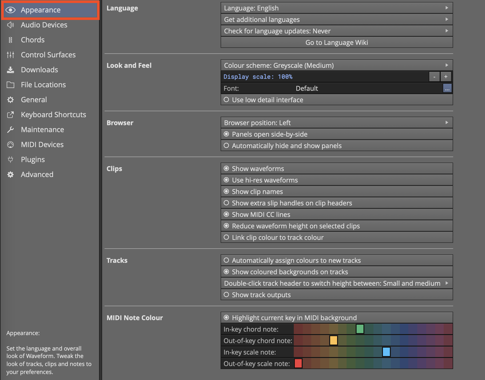

*Settings > Appearance Page*

This video is a walkthrough of all the features in this chapter.

[Video: Explaining Appearance Settings](https://youtu.be/n9nwCpbyOI4)

## Controls and Parameters by Section

## Language

**Language: >English** Waveform UI text is in English by default.
Several other languages are available which have been translated by
users. Add other languages using the next option.

**Get additional languages** Click this to add another language choice
to the preceding option. The translations are maintained and improved
through a user supported wiki which is linked from this section.

**Check for language updates:>**(Choices: Never, At startup, Now)

Chose when to check for updates to language translation. If changes
become available then you have the option to download and install.

## Look and Feel

**Colour scheme:>** Choices: Default, Grayscale (Dark), Grayscale
(Medium), Grayscale (Light), Light, Deep Ocean, T7 Low Contrast, T7

There are several preset schemes. Pick a color pallet that matches or
you preference or mood. A popular favorite is Greyscale (Medium).
(Default: Default)

**Display scale:>** Allows you to scale up or down the entire interface
in 25% increments. Scale it up when working on a small laptop screen.
Scale it down when working on an extra large monitor to big screen TV.
(Default:100%)

**Font:** Usually it is best to leave this set at Default. If you want
to try other fonts you can do that here.

**Use low detail interface** \*Simplifies interface graphics which might
make it feel more responsive. (Default: disabled)

## Browser

**Browser position:>** Choices: Left, Right, Top

Choose where to open the Browser panel when working in the Edit tab.
(Default: Left)

**Tip:** Within an Edit you can move the Browser location by dragging
its representation within the "eye" panel show/hide selector in the
upper right.

**Panels open side-by-side** With this enabled you can open two or more
side-by-side Browser panels. With this deselected Browser panels are
stacked. I prefer to keep this setting enabled. (Default: enabled)

**Automatically hide and show panels**With this enabled you can close
the Browse and Controls panel for more screen space. When your mouse
pointer approaches the edge of the window, the panel will open
automatically. (Default: disabled)

**Tip:** I prefer to keep this setting deselected and use keyboard
shortcuts to open and close the panels. F11 for the Controls panel and B
for the Browser.

## Clips

**Show waveforms** Audio clips show a graphic thumbnail representation
of the waveform. This is typical of most any DAW. You will probably want
to leave this enabled. If, for some reason you prefer not to see
waveforms on clips, you can disable this option. (Default: enabled)

**Use hi-res waveforms** This provides clearer more detailed waveform
images on audio clips. It might slow performance of older computers
slightly but typically you will want to leave this enabled. (Default:
enabled)

**Show clip names** When enabled clip names appear in the lower left
corner. Disable this setting to hide clip names.

**Show extra slip handles on clip headers** When enabled, clip headers
have extra handles that allow slipping the waveform from the edges (left
and right solid triangles) or a using sliding frame (center open box).
These are useful for some workflows. (Default: disabled)

**Show MIDI CC lines** When working with MIDI data you might not want to
see CC (continuous controller) lines to simplify editing. If you want to
hide CC lines, disable this setting. The CC lines only show on MIDI
clips that are not open enough to be in edit mode. (Default: enabled)

**Reduce waveform height on selected clips** When you select an Audio
clip, the header appears and the waveform image height is reduced
slightly. This slight animation gives visual feedback that a selection
has been made. If you don't like this effect you can disable it with
this setting. (Default: enabled)

**Link clip colour to track colour** When this enabled, clips on a track
will inherit the track color. When disabled clip colors are independent
of the track color. (Default: enabled)

## Tracks

**Automatically assign colours to new tracks** With this enabled, as you
add tracks they will assigned colors in this order: red, orange, yellow,
light green, green, light blue, blue, magenta, pink. Track colors will
repeat through this assignment of nine colors. You will notice that
there are 18 colors available. Automatic assignment of colors uses every
other available color. If you don't use track colors or prefer to
assignment to your own liking, then disable this option. (Default:
enabled)

**Show coloured backgrounds on track** With this enabled the background
of tracks are slightly tinted with the track color.

**Double-click track header to switch height between:>** Choices: Small
and medium, Small and large, Small, medium, and large

Double-click a track header to switch track height according to this
option. (Default: Small and medium)

**Show track outputs** A speaker icon appears to the right of the Mute
and Solo buttons on each track. Click this to set the hardware output or
virtual output for the track. Even with the turned off, the output
assignment appears under the plugs section as long as the track height
is expanded. The point of the option is to allow access to the track
output assignment even then tracks are set to narrow heights. I usually
leave this turned off.

## MIDI Note Colour

**Highlight current key in MIDI background** Normally the background for
the piano roll in the MIDI editor is shaded like a piano. This makes the
white rows representing the key of C and grey shading for black not rows
which are out-of-key at all times. With this option selected, white rows
are based on the key signature assigned in the Tempo track. The shading
will shift whenever the key signature is changed. This allows you to use
the background shading as a guide for MIDI editing to stay in-key.
(Default: enabled)

**In-key chord note:** When used along with the chord track, notes
appearing in this color are both in the key and scale and the chord.
(Default: Green)

**Out-of-key chord note:** When used along with the chord track, notes
appearing in this color are in the chord but not naturally in the key
and scale. (Default: Yellow)

**In-key scale note:** Notes appearing in this color are part of the key
and scale as defined at that point. If they are also part of the Chord
they will use the Chord note color. Using the Chord track is not
required however to get In-key scale notes. (Default: Light Blue)

**Out-of-key scale note:** Notes appearing are not part of the key and
scale as defined at that point. If you see this color when using the
Chord track, it means the note is not part of the chord or scale.
(Default: Red)

**Tip:** To use the chord and scale note colors, set MIDI notes to the
multicolor option the MIDI editor

**Tip:** Change the key and scale at any point on the timeline use
*Insert Pitch Change* Opt + P / Alt + P.


# Reference: Settings > General

The Settings > General is the key settings page for customising
Waveform to match the way you like to work.


*Settings > General*

## Controls and Parameters on the Page by Section

## Profile

**Username**
- The name you want to use when working in Waveform

**Export User Settings**
- Creates a copy of the Waveform.settings file that holds user options
    along with patterns and progressions. Use this as a backup or to
    load into other computers

**Import User Settings**
- Use this to load a .settings file created by Export User Settings.

## Startup

**Upon launch reload edits**
- When enabled, Waveform will reload the same Edit tabs that were open
    during your last session.

**Upon launch:>** (Choices: Go to the Projects tab, Go to the Settings tab, Go to the last viewed tab, Go to the Welcome tab:
- Choose which tab to see right after starting Waveform.

## Browser

**Search tab order** (Plugins, loops, Presets)
- The search tab in the browser allows you search for plugins, loops
    and presets. This option allows you set the order of the search
    results. For example, if you like to see Plugins first, set Plugins
    to number 1 on this list.

## Editing

**Default auto crossfade mode**
- When you drag an Audio clip to overlap another clip Waveform will
    create fade one clip to the other. Auto crossfade is a property of
    clips so simply enabling this will not make it happen for existing
    clips. With this enabled, new clips will have auto crossfade set on.

**Default comping crossfade length: 20 ms**
- Sets the crossfade time for the swipe comping features.

**Default marker type:>** (Choices: Bars & Beats, Absolute timecode, Automatic)
- When inserting a new marker this allows you to choose which type is
    preferred.

**Enable separate edit cursor** (Default = Disabled)
- When enabled you will see a second cursor that always follows mouse
    movements. Editing, zooming, and pasting will use this instead of
    the playback cursor. This allows an efficient workflow since you
    don't need to always move the playback cursor following simple
    edits.

**Paste at edit cursor**
- Copy/Paste operations for clips typically paste following the source
    clip. With this enabled you have better control over the paste
    position.

**Number of undo levels: 30**
- You can undo using Cmd + Z / Ctrl Z or the undo buttons in the menu.
    This option allows you to set how many levels of undo are available.
    The default is 30 but you can increase that if you want.

**Tempo change remapping:>** \* Remap audio clips \* Remap auto-tempo
audio clips \* Remap MIDI clips \* Remap plugin automation

Remapping stretches clips lengths based on tempo changes and also allows
them to move in order to stay in-sync with the timebase. These options
give you control over what aspects of clips and automation are allowed
to remap.

## Features

**Video playback:>** (Choices: Standard player, Xjadeo player)
- Xjadeo player is a Pro edition feature and gives more control over
    video playback. This allows you to decide whether or not to use
    Xjadeo.

Typically the Standard player is preferred for macOS users while Xjadeo
is preferred for Windows. If you need support for a codec that does is
not working with the standard player, then try switching to Xjadeo.

## Meters

**Meter response:>** (Choices: Slow decay, Quick decay, Instant decay)
- Set how quickly level meters release after responding to transients.
    The default works well but you can tune the response to your liking.
    (Default: Quick decay)

**Peak hold:>** (Choices: 2 seconds, 10 seconds, Until cleared)
- Level meters keep the peak level illuminated for a while after
    hitting peaks. This setting allows you to control how long the peak
    level is held.

**Tip:** In the "Until cleared" mode, meters will hold the highest peak
indefinitely. In that case, use the keyboard shortcut "Clear all meter
peaks" to reset the meters.

## MIDI

**Automatically show MIDI editor toolbar**
- When enabled, the toolbar is automatically shown in the inline MIDI
    editor. When off, the MIDI toolbar will be hidden. You can toggle
    this feature with a keyboard shortcut (By default Opt + Cmd + T /
    Alt + Ctrl + T). This only affects the inline MIDI editor. The
    toolbar is always visible in the MIDI editor panel.

**MIDI toolbar position:>** (Choices: Left side of track, Left side of MIDI clips)
- Typically this works best when set to "Left side of MIDI clips" but
    some users prefer to have it at the left side of the track.

**Default MIDI editor vertical scale:>** (Choices: 2 octaves, 4 octaves, 6 octaves, Full scale)
- This sets the starting point for the range for MIDI clips. You can
    always adjust this by dragging the arrows at the top or bottom of
    the piano roll keyboard.

**Double-click MIDI clip header:>** \* Expands for in-line editing \*
Opens the MIDI editor \* Opens the MIDI editor (in-line editing
disabled)

This gives you control over where to do MIDI editing. The most common
setting is "Opens the MIDI editor". You can always adjust track height
to expand for in-line editing. The final option allows you avoid every
using the in-line MIDI editor.

**Set middle C to:>** (Choices: C3, C4, C5)
- This gives you control over what note to use for middle C. This is
    used by some internal features. Usually this is best left set to the
    default value. (Default = C4)

**Use incoming velocities for MIDI step entry**
- When in step mode you can play notes one by one for step entry and
    they will use the velocity value set in the MIDI editor toolbar.
    With this option enabled, it will use the velocity played on your
    controller instead of the fixed value.

## Mixing Defaults

**Default pan law:>** (Choices: Linear, -2.5 dB Center, -3.0 dB Center, -4.5 dB Center, -6.0 dB Center)
- Many famous hardware consoles attenuate when centered. The point is
    to compensate for perceived volume changes when adjusting panning.
    When the pan law is linear, you need to adjust the volume slightly
    after making panning adjustments. (Default = Linear)

**Freeze point creation:>** (Choices: Manually freeze tracks, Freeze track when a freeze point is created or copied)
- Choose what triggers track freezing. Initiate track freezing by
    inserting a Freeze Point plugin. The point of freezing a track is to
    render in effects and instruments to free CPU and reduce latency.

**Freeze point insert location:>** (Choices: Before plugins, Pre-fader, Post-fader)
- When using a macro to freeze tracks this determines where the freeze
    point should be inserted.

## Mouse

There are numerous options to customize mouse drag, click, and wheel
behavior. A good number of these options are here to retain
compatibility with legacy versions. It would be reasonable to start with
the defaults then tweak these settings to work the way you want.

**Clicking the background locates the cursor** (Default = enabled)
- When enabled, the cursor will located to the point where you click
    in the arrangement area. This includes clicking the body of clips
    and the background between clips. Clicking on clip headers selects
    the clip but does not move the cursor.

**Timeline drag:>** \* Drag to scroll view (default) \* Drag to locate
cursor

Set to "Drag to scroll view" as you drag left or right over the timeline
you are dragging the enter view of tracks left or right. Drag directly
above the cursor to essentially drag the cursor location. Click the
timeline to position the cursor to that spot.

Set to "Drag to locate cursor" and as you drag left or right over the
timeline, the cursor will follow. Clicking the timeline will also
position the cursor.

**Tracks area drag:>** \* Drag to draw marked region \* Drag to select
clips (default) \* Drag to move playhead

Set to "Drag to draw marked region" the I-beam range cursor is the
default. This is a powerful editing mode and many users will want to
choose this option. When in this mode hold Opt / Alt while dragging to
select clips.

Video Tutorial: [Drag to Draw Marked Region](https://youtu.be/zTrAn9u_B18)

Set to "Drag to select clips" you have the standard cursor and dragging
will allow marque style selection of clips. This mode makes selecting
clips work just like selecting MIDI notes for a consistent workflow.
When in this mode hold Shift + Opt / Shift + Alt to draw ranges with the
I-beam cursor.

Set to "Drag to move playhead" you have the legacy Tracktion mode.
Dragging within the tracks area simply relocates the cursor.

**Tracks area right drag:>** (Choices: Zoom horizontally, Scroll tracks)
- Drag over the tracks area while while holding the right mouse button
    to either zoom or scroll tracks(Default = Scroll tracks)

**Over tracks area:>** (Choices: Wheel scrolls vertically, Wheel scrolls horizontally)
- Choose what the mouse feel does with the pointer is over the tracks
    area. (Default = Wheel scrolls vertically)

**Allow wheel to scroll within MIDI clips (default = enabled)**
- When enabled the inline MIDI editor view will scroll up and down
    with the wheel when the pointer is over a MIDI clips showing the
    piano roll. Sometimes this is annoying when you want to just scroll
    the tracks vertically. This allows you to disable MIDI scrolling.

## Plugin Windows

**Open plugin windows by:>** (Choices: Single-clicking, Double-clicking)
- If you want to prevent accidentally opening the UI for plugins you
    can set this to require a double-click. (Default = Single-clicking)

**Plugin windows:>** (Choices: Are unpinned by default, Are pinned by default)
- Pinned plugins stay open until you click "X" at the upper left. When
    not pinned plugin windows close as soon as you click away from the
    plugin. (Default = Are unpinned by default)

**New plugins open on:>** (Choices: Active Display, Display 1, Display 2, etc.)
- If you have multiple displays you can choose a certain display where
    plugin UIs will open. (Default = Active Display)

## Saving

**Automatically backup entire project**
- Saves a back up all edits and the automatically.(Default = enabled)

When enabled, Edit files and project files will be backed up not more
than once every 15 minutes. Older backups are automatically deleted. The
older the backups are the less frequently they will be kept. You can
also manually create a backup from the File menu button that will never
be automatically deleted ("File>Backup edit and project files")

If you need and earlier Edit for some reason, select the backup from the
Projects page. Select one of the backup files then click Restore Edit.
Choose and edit and it will it back to the current project with the name
"Edit (Restored)". If you want the whole Project at a point in history,
use the "Restore Project" button and it will create a new Project and
associated Edits from the backup file.

**Note:**\* Only your Project file and Edits are backed up - not the
audio files. If you delete source audio files, this feature won't help
you.

**Enable autosave**
- Periodically saves your Edit in the background while working. In the
    event of a crash, you can restart from the last background save and
    avoid losing a lot of work. (Default = enabled)

**Generate audio preview files automatically**
- Auto preview files are audio files that appear with the edit on the
    Welcome and Projects tabs. Listen to the preview before opening an
    Edit to know what it is. (Default = Enabled)

**When closing an edit:>** (Options: Ask to save, Always save)
- Most modern program always save but if you want to confirm saving
    when you close, set this to "Ask to save." (Default = Always save)

## Track Inputs

**Allow inputs to appear on multiple tracks**
- In some case you might want to use the same MIDI device or Audio
    input on multiple tracks. If you need to do that, enable this. This
    is more of specialized situation and most users will leave this off.
    (Default = disabled)

**Default audio device follows selection**
- When you select a track the audio input will automatically follow to
    that track. Useful when using the same input to overdub to several
    different tracks. (Default = enabled)

**Default MIDI device follows selection**
- When you select a track the audio input will automatically follow to
    that track. Useful when you want to immediately start playing from
    the same keyboard when you select a tracks with different virtual
    instruments. (Default = enabled)


# Reference: Settings > Plugins

Use the Settings tab, Plugins page to scan for third-party plugins.
Manage which plugins are available to your edits. Create a list of
favorite plugins. Create plugin thumbnail images for the visual plugin
selector. Also, you can validate plugins files from this page.

**Tip:** You can drag plugin files directly to this list to add them.


*Settings > Plugins*

## Controls and Parameters

**Search**
- Type in search terms to filter the list of registered plugins. Click
    the magnifier glass icon to narrow the search by enabling or
    disabling Name, Type, Category, and Manufacturer filters.

**Plugin List**
- The plugin list shows all registered plugins in a table that
    includes Name, Image, Show, Sandbox, Format, Category, Manufacturer,
    Version, Alias, Tags, Updated, and Description. Drag the divider
    between the headers to resize the columns. Drag column headers to
    change the position of columns. Double-click within the Alias column
    and type in friendly names for any plugin. You can also drag plug
    files directly to this list from your system to register them.

## Scanning for Plugins

**Scanning for Plugins...**
- Click this button for a complete set of options to scanning plugins
    to register then with Waveform or to remove selected plugins or
    categories of plugins. Each option is described in more detail here
    next.

**Clear list**
- Completely clears the plugins list. Be careful because this wipe the
    list and cannot be undone. You can of course use the other options
    to scan plugins again.

**Remove all AudioUnit plugins**
- Clears all AudioUnit (AU) plugins from the list.

**Remove all VST plugins**
- Clears all VST plugins from the list. The includes VST2 but not VST3
    plugins to be precise.

**Remove all VST3 plugins**
- Clears all VST3 plugins from the plugins list.

**Remove all SOUL Patch plug-ins**
- Clears all SOUL Patch plugin from the plugins list.

**Remove selected plug-in from list**
- Select any plugins from the list and use this option to remove them.
    You can select multiple plugins using Cmd-click / Ctrl-click. You
    can make a multiple contiguous selection with shift-click.

**Remove any plugin whose files no longer exist**
- Clean up the list by removing plugins that are no longer installed.

**Show folder containing selected plug-in**
- Very quick way to open the folder on your system that contains the
    file for a selected plugin.

**Note:** If you have "Automatically check for newly added plugins"
enabled on this page, then Waveform will prompt to scan when it detects
that new plugins have been installed. With that set you rarely need to
manually scan for each type of plugin separately.

**Scan for new or updated AudioUnit plugins**
- After installing new AudioUnit plugins this to scan for them.

**Scan for new or updated VST plugins**
- After installing new VST2 plugins, use this to scan and add them to
    the plugins list.

**Scan for new or updated VST3 plugins**
- After installing new VST3 plugins use this to scan for them.

**Scan for new or updated SOUL Patch plugins**
- After installing new SOUL Patch plugins you can use this to scan for
    them.

**Automatically check for newly added plugins**
- With this enabled anytime you add new plugins Waveform will prompt
    you to scan for them. This applies to AU, VST2, VST3, and SOUL
    plugins. (Default = enabled)

**Plugin selector:>**
- This option allows you to choose the layout of the menu used when
    you add plugins. The recommended choice is Popup menu. Typically it
    is best to leave this set to Popup menu. Here is a breakdown of each
    option:

-   Popup menu (Recommended): The default which is the typical style of
    context menu in Waveform. Recommended.
-   Popup tree: Shows exactly the same organization but in a tree view
    where you can expand or collapse the submenus.
-   Custom popup menu: Typical context menu look but includes only what
    you have defined in the Favourite Plugin List. Use this only if you
    want fully define the plugin selector by hand.
-   Custom popup tree: Same as the previous option but using the tree
    view.
-   Tag menu: This defines the plugin selector using your defined tags
    as the menu categories. This is another way to define the plugin
    menu by hand. Interesting option but not typically the best choice.

[Video Tutorial: Plugin Selector and Favourite Plugins
List](https://youtu.be/Ctw7KfCCo84)

**Plugin sorting:>** (Options: Sort by manufacturer, Sort by category, Sort by disk location)
- The default is "Sort by manufacturer." Use this along with the Popup
    tree style Plugin selector. You can try using category or disk
    location if you want to see if those work for you.

**Show all plugins**
- This overrides any selections in the "Show" column of the plugin
    list on this page. Typically leave this disabled if you want to be
    able to hide certain plugins.

**Create plugin thumbnail images**
- This gives you a few different options to create pictures of plugin
    UIs for use in the visual plugin selector. This will cause each
    plugin to be opened briefly while Waveform snaps a bitmap image. You
    can alternatively create thumbnails by clicking on the camera icon
    on the header for any plugin when it is open for normal use.

**Enable internal plugins:** (Enable Legacy Plugins, Enable Artisan Plugins)
- This features includes two different options to show or hide things
    from the plugin selector.

-   With "Enable Legacy Plugins" enabled, you will see the FM Synth and
    Sampler from back in the day. (Default = disabled)
-   (Pro) With "Enabled Artisan Plugins" enabled, you will see the
    Artisan Plugins from AirWindows. This allows Waveform Pro users to
    hide these plugins if desired. (Default = Enabled)

**Enable plugin sandboxing**
- With sandboxing enabled, plugin run in a separate process. The idea
    is to separate plugins from the main process so that a problematic
    plugin will not cause Waveform to crash. While this is desirable
    there is some additional processing overhead when using this
    feature. For the best performance, leave this feature disabled. If
    you have plugins that you want to sandbox turn this on and enable
    sandboxing for potentially problematic plugins using the sandboxing
    column in the plugins list. (Default = disabled)

[Video: Waveform Plugin Sandboxing](https://youtu.be/xOvgJW36VJc)

**Enable ReWire hosting**
- Some DAWs and audio software allow you route audio into them in
    realtime using ReWire. If you want to use ReWire compatible software
    like a plugin in Waveform, then leave this enabled (Default =
    enabled)

**Validate with PluginVal**
- Watch the plugin sandboxing video above for more details on using
    the validation features:

-   Validate File...
-   Validate Selected

**Add or Remove Tags from Plugins**\*

Drag plugins to these buttons to add tags or remove them. Tags allow you
to access plugins.

-   Add Tag
-   Remove Tag


# Reference: Settings > Advanced

Advanced: This page includes technical options that can usually be left
at the default settings. Advanced users can tweak these settings to
optimize performance, for diagnostics, or to tailor Waveform for
specific workflows.


*Settings > Advanced*

## Controls and Parameters on the Advanced Page by Section:

## Application

Feature set:> - Best available in Tracktion account - Pro - OEM - Free

Typically, leave this at "Best available in Tracktion account." This
feature is mostly to simplify testing. Testers can select the edition
without needing to reinstall the software and use multiple accounts.

## Audio Engine

These features allow you to control various aspects when audio is
processed.

Process audio tracks when muted
- Typically leave this enabled for best responsiveness to muting and
    unmuting. Disable this to free up some CPU processing.

Run audio engine when stopped
- Typically leave this enabled. This is available for diagnostic
    purposes.

Stop all playback when application is minimized
- Typically leave this enabled. Disable if you need Waveform to
    continue playback while switching to other applications.

Stop other edits when changing tabs
- Typically leave this enabled. This avoids the confusion of having
    other Edits playing back while working on a different tab.

## Automation

Glide
- Waveform can optionally fade recorded automation curves into
    existing curves. Glide sets the period over which the fade occurs.
    With Glide set to zero, no fade will be applied. The purpose of
    Glide is to accommodate the slight mismatch in level between the end
    of your new automation and the existing curve. If disabled you might
    hear an abrupt change in level or click in this type of situation.

Simplify newly-recorded automation
- When this option is enabled, automation curves are smoothed
    essential stripping unnecessary points. Recorded automation often
    contains numerous points that are redundant or the result of an
    unsteady hand. When disabled recorded automation is not altered.

## Experimental

Enable experimental Engine processing
- The experimental engine (EE) changes the way mixing works to achieve
    much better delay compensation for plugins, racks and buses. When
    fully tested, this will be the default. Ideally leave this enabled
    unless you have problems. For more detail on this new audio engine
    watch the video here.

[Waveform New Audio Engine](https://youtu.be/_VbPXJQMUjA)

Processing Algorithm
- This tunes EE with for the best mix of throughput and stability.
    Choose "Hybrid Semaphore". The other options represent the stepping
    stones of the evolution of the new audio engine. At the time of
    writing they were retained for testing and benchmarking.

Remove bypassed plugins from playback (reduced latency)
- This can slightly reduce latency but might cause slight hesitation
    in the UI at times. Enable this to optimize low latency performance.
    For most systems you can leave this enabled.

## Low Latency Mode

Max Monitoring Latency
- This is the maximum allowed latency, when in low latency monitoring
    mode. If latency exceeds this, Waveform will shut off some plugins.
    We suggest you leave this at the default 5 ms, as it has no effect
    unless you engage low latency mode.

Low Latency Buffer Size
- This is the alternative buffer size to use when in low latency mode.
    Leave this at the default and don't worry about it. This setting has
    no effect unless you engage low latency mode.

**Tip:** If you are curious about low latency mode, click the 'i' next
to the *Max Monitoring Latency* or *Low Latency Buffer Size* parameter.
You enable low latency mode from the CPU usage window which is opened by
clicking on the icon in the upper right corner of the Waveform window
header.


*CPU Usage Meter Icon*

Internal Buffer Multiplier
- Another setting related to low latency mode. Usually just leave this
    set at 1X and forget about it.

Reset Low Latency Settings
- If you change low latency setting and want to get back to the
    defaults, click to reset.

## MIDI

Use MIDI Driver for MIDI Timing
- This is enabled by default. It is typically best to use the MIDI
    driver for timing. With this disabled, Waveform uses your computer's
    internal MIDI clock instead. If you experience jitter you can try
    disabling this setting.

Send MIDI 'all-Controllers-Off' message on stop
- This controls whether Waveform will send a reset message to MIDI
    devices when play stops. This reduces the risk of stuck notes and is
    typically preferred. Some older MIDI devices react strangely to this
    message. If you experience anomalies when playback stops, try
    disabling this option.

Warn about lost MIDI notes on MIDI inputs
- When this option is enabled, Waveform displays a warning message if
    MIDI notes are received by a MIDI device that is not connected to a
    track.

## Performance

CPU Cores to Use :This can be set from one to the number available.
Usually you leave this at the maximum cores available. The maximum is
typically the number of CPU cores in your processor. For processors that
support simultaneous multithreading (what Intel calls "Hyper-threading")
this number will be doubled. For example, if you run a four-core
processor, the maximum cores will be reported as eight. If you are
running some other software alongside Waveform that needs to share CPU
power, then you can reduce this number to leave some cores open for
other tasks. For example, you might want to keep 1 or 2 cores free are
when live streaming or screen recording while demonstrating Waveform.

Use 64-bit Maths When mixing Tracks
- Normally this setting is left on, especially if you have a modern
    fast computer. It adds track outputs together using 64-bit samples
    rather than 32-bit. This avoids a noise floor build-up from rounding
    errors. You probably won't notice much difference if it's on or off.
    If you have a very old computer with limited CPU, leave it off. By
    default it's off. I usually leave 64-bit maths turned on.

Use Realtime Priority Mode (Windows)
- Realtime priority mode can be enabled in Windows to make an
    application take precedence over all other tasks that are running on
    the machine. This can mean that there's less chance of it glitching,
    but with most modern audio drivers it's not necessary, and can even
    make things glitch more often. It's something to try turning on if
    you're having playback problems, but is best left turned off
    otherwise.(Default = disabled)

GUI Rendering Mode:> (Windows/Linux) \* Open GL renderer \* Software
renderer

Allows your computer to use GPU graphics for faster and smoother user
interface response. This option will not appear for macOS users. Default
is "Software renderer" however users with modern PCs will probably want
to try the Open GL option.

## Plugin Processing

Plugin scanning: Choices "Separate process" or "Main process" (Default = Separate process)
- Leave this set to "Separate process". This allow plugin scanning to
    proceed in the background separated from the main functions of
    Waveform. If for some reason plugin scanning has some problems, you
    can change this to "Main process" as a diagnostic.

Number of simultaneous plugin scans: Choices "1 -8 simultaneous scans.
This option only appears if you have Plugin scanning set to "Main
process" as describe above. This allows you add scans working in
parallel. You can use this as a diagnostic. As said before, the best
option is to set Plugin scanning to "Separate process" above and then
don't worry about this option. (Default = 1)

Reset plugin scanning options to defaults
- A quick way to set Plugin scanning options back to the defaults.

## Source Files

Audio clip import:> \* Ask if files should be copied into project \*
Always copy file into project \* Only copy files from external drives

When you drag audio files from the browser into the arrangement, this
setting determines whether or not not and under what conditions files
get copied to the project folder. The preferred setting is "Always copy
file into project". This allows keeps everything together in the most
reliable way and is easiest to back up.

The other options allow you to conserve disk space. "Ask if files should
be copied into the project" gives you the choice every time you import
audio. While it seems like a reasonable option, it can get annoying.

The final option, "Only copy files from external drives" is a
compromise. If you drag in audio files from a connected USB,
Thunderbolt, or network drive, the files get copied into the project.
Files that are already local to your computer are not duplicated. This
might seem like a good idea to save drive space, but if you ever move a
loop library, access to key files could be lost. In the age of huge
drives, the best option here is "Always copy file into project".

Renaming also renames its source item
- When enabled, renaming clips will cause the corresponding entry in
    the items list to be renamed. Typically leave this disabled. You
    might want to turn this on to see the item list on the project page
    show descriptive entries of takes or when authoring loop libraries.
    This change is local to the project so you don't need to worry about
    renaming files from external libraries.

Rename Mode:>\
Always rename source file
- Changing the name of an item will aways rename he source file,
    irrespective of where it is located on your system. This can be
    dangerous, because if two or more projects make use of the file, a
    simple clip rename in a one project will cause the other projects to
    lose the file. It is best to stay away from this option. Changing
    clip names could alter names in your loop libraries.

Only rename source file if it is in project folder
- Changing the name of an item will only rename the source file if I
    is located in the project folder. This is much safer but usually not
    necessary.

Never rename source file
- Renaming a clip will never rename the file that contains the source
    material. This is the best option for most users and most
    situations.

These options need more explanation because what is happening is more
internal to the operation of Waveform and not obvious. "Source item" is
different than "Source file". "Source Item" is the name that is shown in
the item list form the project. "Source file" is the file name on the
disk

In an Edit clips are linked to the actual file on disk through named
pointers. At a high level from what you see in an Edit it looks like
this: Clip -> Source item -> Source file (on disk)

Some users change these options when authoring loop libraries for
example. The best approach is to set this to "Never rename source file"
and leave it alone.


# Appendix A - Video Links

Listed below are links to helpful Waveform videos. Many are now featured
on the Waveform website and YouTube. For a complete commercial video
series on T7 new features, check out [Tracktion T7 Update
Explained](https://www.groove3.com/Tracktion-Software-training-video-tutorials/Tracktion-T7-Update-Explained)
from Groove3.com.

## [Creating a Tempo Map](https://w-edstrom.wistia.com/medias/687engp5ar)

## [Punch In/Out on the fly](https://w-edstrom.wistia.com/medias/wgjyszl1i6)

## [Tracktion Compressor Sidechain](https://w-edstrom.wistia.com/medias/hizfqs1xv2)

## [Track Tags](https://w-edstrom.wistia.com/medias/4r8idb779a)

## [Automation Improvements](https://w-edstrom.wistia.com/medias/9x42ii30ot)

## [Insert Plugin](https://w-edstrom.wistia.com/medias/qmo2umn781)

## [Creating a Submix](https://w-edstrom.wistia.com/medias/3zfyagojz4)

## [Basic Audio Editing](https://w-edstrom.wistia.com/medias/qr0fax85zn)

## [Warp Time](https://w-edstrom.wistia.com/medias/8klw4ees4u)

## [Pitch Fade](https://w-edstrom.wistia.com/medias/o2ff37pknl)

## [Comp Groups](https://w-edstrom.wistia.com/medias/tvzn6gdwci)

## [Merge Selected Clips](https://w-edstrom.wistia.com/medias/5h6bn8h3vg)

## [Step Clips Overview](https://w-edstrom.wistia.com/medias/pjf2cdmm4t)

## [Step Clips Velocity/Gate](https://w-edstrom.wistia.com/medias/mz2dg3v98s)

## [Step Clips Randomize Each Step](https://w-edstrom.wistia.com/medias/ztgsqpw2y5)

## [Step Clips Groove](https://w-edstrom.wistia.com/medias/mz2dg3v98s)

## [Step Clips Route Channels to Different Synths](https://w-edstrom.wistia.com/medias/vncjr2ilh9)

## [Drag to Set the In-marker and Out-marker](https://youtu.be/zaPg04Iype4)

## [Track LFOs Demonstration](https://youtu.be/9UVEAJAvFZ0)

## [Sync Preview with Multiple Browsers](https://youtu.be/KEVGBgm9U28)

## [How to Invoke Melodyne](https://youtu.be/N3T8G-qF4zQ)

## [Automation Patterns and Ramps](https://youtu.be/koDUoO3XD-0)


