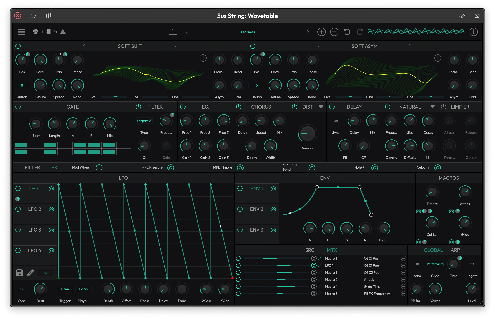

# Wavetable Synthesizer

Waveform's built-in Wavetable synthesizer is a two-oscillator wavetable instrument with deep modulation, flexible filtering, and a full effects chain. It ships with a library of factory wavetables and presets, supports user wavetable import, and includes MPE support out of the box.

*The Wavetable synthesizer interface showing both oscillators, filters, LFOs, envelopes, macros, and the global settings.*

## Oscillators

The synth has **two independent wavetable oscillators** (OSC 1 and OSC 2). Each oscillator loads a wavetable and lets you sweep through its frames to create evolving, animated timbres.

### Browsing and Loading Wavetables

The currently loaded wavetable name is displayed in the header of each oscillator panel. You have three ways to change it:

- **Click the wavetable name** to open a categorized menu of all factory wavetables. Tables are grouped by prefix (Analog, Digital, etc.), so browsing is quick.
- **Use the left/right arrows** beside the name to step through wavetables one at a time. This is great for auditioning.
- **Click the + button** to load your own .wav file as a user wavetable. If the file doesn't contain wavetable metadata, you'll be prompted to choose a table size (256, 512, 1024, or 2048 samples per frame).

You can also **drag and drop** a .wav file directly onto the wavetable display to load it.

> 💡 **Tip:** The 3D wavetable display is interactive. Drag up or down on it to scrub the **Pos** (position) parameter in real time. This is a fast way to find the sweet spot in a wavetable.

### Oscillator Controls

Each oscillator has the following controls:

**Pos** — Sweeps through the frames of the loaded wavetable. This is the primary sound-shaping control for wavetable synthesis. Automate or modulate it for movement. (Default: 0%)

**Level** — Output volume of the oscillator in dB. (Default: 0 dB)

**Pan** — Stereo position. Center is zero; negative values pan left, positive values pan right. (Default: center)

**Octave** — Coarse pitch offset in octaves, from -4 to +4. (Default: 0)

**Tune** — Pitch offset in semitones, from -12 to +12. (Default: 0)

**Fine** — Fine-tune in cents, from -100 to +100. Use this for subtle detuning between oscillators. (Default: 0)

**Phase** — Starting phase of the oscillator waveform. (Default: 0)

**Rand** — Randomizes the starting phase each time a note is triggered. At maximum, each note starts at a different phase, which can reduce the "machine gun" effect on repeated notes. (Default: 1.0)

### Unison and Stereo Spread

**Unison** — Stacks up to 8 voices per oscillator. More voices means a thicker, wider sound at the cost of CPU. (Default: 1)

**Detune** — Controls how far apart the unison voices are pitched from each other. Only active when Unison is greater than 1. (Default: 0)

**Spread** — Pans the unison voices across the stereo field. Only active when Unison is greater than 1. (Default: 0%)

> 💡 **Tip:** For classic supersaw-style sounds, set Unison to 4-8, push Detune to around 0.15, and spread to 80% or more. I find 5 voices with moderate detune hits a nice balance between richness and CPU load.

### Wave Shaping

Each oscillator includes four built-in waveshaping controls for mangling the wavetable output before it hits the filters:

**Formant** — Shifts the formant structure of the waveform, adding vocal-like resonances. (Default: 0)

**Bend** — Bends the waveform shape, creating harmonic asymmetry. (Default: 0)

**Asym** — Adds asymmetric distortion to the waveform. (Default: 0)

**Fold** — Folds the waveform back on itself, creating additional harmonics. Great for aggressive, metallic tones. (Default: 0)

## Sub Oscillator

The **Sub** oscillator adds a simple, stable tone underneath your wavetable oscillators. It's perfect for anchoring bass sounds or adding weight to pads.

**Enable** — Turns the sub oscillator on or off. (Default: Off)

**Wave** — Selects the waveform shape. Options are:
- Sine
- Triangle
- Saw
- Pulse 50%
- Pulse 25%
- Pulse 12%

(Default: Triangle)

**Octave** — Pitch offset in octaves. Set to -1 or -2 to place the sub below your main oscillators. (Default: 0)

**Level** — Output volume in dB. (Default: 0 dB)

**Pan** — Stereo position. (Default: center)

**Retrig** — When enabled, the sub oscillator restarts its phase on each new note. (Default: Off)

## Noise Generator

The **Noise** generator adds untuned noise to the signal. Use it sparingly for breathy textures, or mix it in heavily for percussive, snare-like sounds.

**Enable** — Turns the noise generator on or off. (Default: Off)

**Type** — Choose between White noise (equal energy across all frequencies) and Pink noise (more energy in the low end). (Default: White)

**Level** — Output volume in dB. (Default: 0 dB)

**Pan** — Stereo position. (Default: center)

## Filters

The Wavetable synth has **two per-voice filters** (Filter 1 and Filter 2) that can be combined in parallel or serial configurations.

### Filter Types

Each filter offers eight modes:

- **Lowpass 12** — Gentle low-pass filter with a 12 dB/octave slope
- **Lowpass 24** — Steeper low-pass filter with a 24 dB/octave slope
- **Highpass 12** — 12 dB/octave high-pass filter
- **Highpass 24** — 24 dB/octave high-pass filter
- **Bandpass 12** — 12 dB/octave band-pass filter
- **Bandpass 24** — 24 dB/octave band-pass filter
- **Notch 12** — 12 dB/octave notch (band-reject) filter
- **Notch 24** — 24 dB/octave notch filter

(Default: Lowpass 12)

### Filter Controls

**Freq** — Cutoff frequency in Hz. This is the most important filter parameter. (Default: ~523 Hz)

**Res** — Resonance. Boosts frequencies around the cutoff point. Higher values create a sharper, more pronounced peak. (Default: 0)

**Amnt** — Envelope amount. Controls how much the filter's built-in ADSR envelope affects the cutoff frequency. Positive values sweep the filter up; negative values sweep it down. When set to zero, the filter envelope controls (A, D, S, R) are disabled. (Default: 0)

**Key** — Key tracking. When turned up, the filter cutoff follows the pitch of the note you play, so higher notes have a brighter tone. (Default: 0%)

**Vel** — Velocity tracking. Higher values make the filter cutoff respond more to how hard you play. Only active when the envelope amount is non-zero. (Default: 0%)

**Retrig** — Retrigger. When mono mode and glide are active, this controls whether the filter envelope restarts on legato notes. Only visible when relevant.

### Filter Envelope (ADSR)

Each filter has its own dedicated ADSR envelope that modulates the cutoff frequency:

- **A** (Attack) — Time to reach peak. (Default: 0.01s)
- **D** (Decay) — Time to fall from peak to sustain level. (Default: 0.1s)
- **S** (Sustain) — Level held while the note is sustained. (Default: 80%)
- **R** (Release) — Time to return to zero after note-off. (Default: 0.1s)

The envelope's visual display shows the current phase of active voices in real time, so you can see exactly where each voice is in its envelope cycle.

### Filter Routing

Each filter has four source buttons labeled **1**, **2**, **N**, and **S** that control which sound sources are fed into that filter:

- **1** — Oscillator 1
- **2** — Oscillator 2
- **N** — Noise generator
- **S** — Sub oscillator

(Default: All sources routed to Filter 1)

### Filter Mix

The **Mix** panel between the two filters controls how they combine:

**Type** — Choose between:
- **Parallel** — Both filters process the signal independently, and their outputs are blended.
- **Serial** — The output of Filter 1 feeds into Filter 2.

(Default: Parallel)

**Mix** — In parallel mode, this blends the balance between Filter 1 and Filter 2. In serial mode, this control is disabled. (Default: 0.5)

> 💡 **Tip:** Serial mode is powerful for shaping complex timbres. Try setting Filter 1 to a resonant lowpass and Filter 2 to a highpass to isolate a specific frequency band.

## Amplitude Envelope (ADSR)

The main **ADSR** envelope controls the overall volume shape of every note you play. It's always active and sits in the upper-right area of the interface.

**A** (Attack) — Time for the note to reach full volume. (Default: 0.01s)

**D** (Decay) — Time to fall from peak to the sustain level. (Default: 0.1s)

**S** (Sustain) — Volume level held while you keep the note pressed. (Default: 80%)

**R** (Release) — Time for the sound to fade out after you release the note. (Default: 0.1s)

**Vel** — Velocity tracking. Controls how much your playing velocity affects the volume. At 100%, soft notes are quiet and hard notes are loud. At 0%, velocity has no effect. (Default: 100%)

**Retrig** — Retrigger control. When mono mode and glide are active, this determines whether the envelope restarts on legato notes. Only visible when relevant.

The envelope display shows a visual representation of the ADSR curve and highlights the current phase for each active voice.

## LFOs

The Wavetable synth includes **four LFOs** (LFO 1 through LFO 4) that can be used as modulation sources. Each LFO uses an MSEG (multi-segment envelope generator) for its shape, giving you far more flexibility than simple sine or triangle LFOs.

### LFO Controls

**Rate** — The speed of the LFO in Hz. Only visible when Sync is off. (Default: 10 Hz)

**Beat** — When Sync is on, sets the LFO rate to a musical note duration. (Default: 1/4 note)

**Sync** — Synchronizes the LFO rate to the host tempo. (Default: Off)

**Depth** — The intensity of the LFO's modulation. Supports bipolar values. (Default: 1.0)

**Phase** — Offsets the starting phase of the LFO. (Default: 0)

**Offset** — Shifts the LFO output vertically. (Default: 0)

**Fade** — Time for the LFO to fade in (positive values) or fade out (negative values) after a note is triggered. (Default: 0s)

**Delay** — Time before the LFO starts after a note is triggered. Useful for delayed vibrato. (Default: 0s)

**Trigger** — Determines the LFO's triggering behavior:
- **Mono** — One shared LFO for all voices
- **Poly** — Each voice gets its own independent LFO
- **Legato** — Shared LFO that doesn't reset on legato notes
- **Free** — Free-running, never resets

(Default: Poly)

**Playback** — Controls whether the LFO shape plays once (Single Shot) or continuously (Loop). (Default: Loop)

### Drawing Custom LFO Shapes

The large MSEG display shows the LFO waveform shape. You can edit it directly:

- Click and drag points to reshape the curve
- The **pencil button** toggles draw mode, which lets you paint shapes freehand
- The **draw mode selector** (Step, Half, Down, Up, Tri) changes the behavior of the draw tool
- **XGrid** and **YGrid** control the snap resolution when editing (Default: 8 for both)

### Saving and Loading LFO Shapes

Click the **disk button** to open the LFO shape file menu. From here you can:

- Browse and load factory LFO presets organized in categories (Basic, SC, Gate, Arp, Sequencer)
- Load a custom .mseg file
- Save the current shape as a .mseg file for later use

Factory LFO shapes include useful starting points like Sine, Triangle, Saw, Square, ADSR, Side Chain, Trance Gate, and various arpeggio patterns.

## Envelopes (ENV 1-3)

In addition to the main ADSR and the two filter envelopes, the synth provides **three modulation envelopes** (ENV 1, ENV 2, ENV 3). These are general-purpose ADSR envelopes that can be routed to any modulatable parameter through the modulation matrix.

Each envelope has:

- **A** (Attack) — (Default: 0.01s)
- **D** (Decay) — (Default: 0.1s)
- **S** (Sustain) — (Default: 80%)
- **R** (Release) — (Default: 0.1s)
- **Depth** — Scales the envelope's output before it reaches the modulation destination. Supports bipolar values. (Default: 1.0)
- **Retrig** — Retrigger on legato notes (only visible in mono mode with glide enabled).

> 💡 **Tip:** Use ENV 1 to modulate the wavetable position of OSC 1 for sounds that evolve over the duration of each note. Set a slow attack and decay with zero sustain for a gradual timbral sweep.

## Modulation

The Wavetable synth features a comprehensive **modulation matrix** that lets you connect any modulation source to nearly any parameter.

### Modulation Sources

The available modulation sources are:

- **LFO 1-4** — The four MSEG-based LFOs
- **ENV 1-3** — The three modulation envelopes
- **Filter Envelope 1-2** — The two filter ADSR envelopes
- **ADSR** — The main amplitude envelope
- **Macro 1-4** — Four user-assignable macro knobs
- **MPE Pressure** — Aftertouch from MPE controllers
- **MPE Timbre** — Timbre (slide) from MPE controllers
- **MPE Pitch Bend** — Per-note pitch bend from MPE controllers
- **Pitch Bend** — Standard pitch bend
- **Mod Wheel** — MIDI CC 1
- **MIDI Note Number** — The pitch of the note being played
- **MIDI Velocity** — How hard the note was played
- **CC 0-119** — Any standard MIDI CC message

### Using the Modulation Matrix

The bottom of the interface has two tabs: **SRC** and **MTX**.

The **SRC** tab shows all available modulation sources. Each source has a drag handle you can use to assign it to parameters.

The **MTX** tab shows the full modulation matrix, listing all active routings with their source, destination, and depth. This is the place to go for an overview of all your modulation assignments.

### Toolbar Modulation Sources

The toolbar row between the oscillator/filter area and the LFO area shows six commonly used modulation sources with quick-access controls: **Mod Wheel**, **MPE Pressure**, **MPE Timbre**, **MPE Pitch Bend**, **Note #**, and **Velocity**. Each one has a modulation source button and a depth slider for quickly assigning them to parameters.

## Macros

The **Macros** panel provides **four assignable macro knobs** (Macro 1 through Macro 4). Each macro is a modulation source that you can route to multiple parameters at once, giving you a single knob that controls several things simultaneously.

You can rename each macro by clicking on its label and typing a new name. This makes it easy to remember what each macro does in a given preset.

> 💡 **Tip:** Macros are great for performance. Set up a "Brightness" macro that controls filter cutoff, wavetable position, and LFO depth all at once. Then you only need to move one knob during a live performance.

## Effects

The Wavetable synth includes a built-in **effects chain** with eight effect slots. Toggle between the filter/oscillator view and the effects view using the **Filter** and **FX** buttons on the toolbar.

The effects can be **reordered by dragging** their headers left or right. The signal flows through them from left to right, so order matters.

### Gate

A rhythmic gate effect that chops the signal on and off in a pattern.

**Beat** — The tempo-synced rate of the gate pattern. (Default: 1/8 note)

**Length** — Number of active steps, from 2 to 16. (Default: 8)

**Attack** — How quickly the gate opens. (Default: 0.01s)

**Release** — How quickly the gate closes. (Default: 0.1s)

**Mix** — Wet/dry blend. (Default: 100%)

The step sequencer display shows left and right channel patterns. Click steps to toggle them on and off.

### Chorus

Adds width and movement by mixing delayed, pitch-modulated copies of the signal.

**Delay** — Base delay time in milliseconds. (Default: 1 ms)

**Speed** — Modulation rate in Hz. (Default: 3 Hz)

**Depth** — Modulation depth in milliseconds. (Default: 1 ms)

**Width** — Stereo width of the chorus effect. (Default: 0.5)

**Mix** — Wet/dry blend. (Default: 0.5)

### Distortion

The distortion slot offers **ten different modes**, selectable from the dropdown menu in the header:

**Simple** — Basic waveshaping distortion with a single Amount control. (Default mode)

**Light, Medium, Hard, Clip, Tube, Fuzz** — Six flavors of drive-based distortion, each with:
- **Drive** — Amount of distortion. (Default: 0)
- **Post Gain** — Output level after distortion. (Default: 1.0)
- **Tone** — Brightness control. (Default: 1.0)
- **Emphasis** — Pre-distortion EQ emphasis. (Default: 0.25)

**Bitcrusher** — Sample rate and bit depth reduction for lo-fi effects:
- **Rate** — Sample rate reduction. (Default: 0.5)
- **Rez** — Bit depth reduction. (Default: 0.5)
- **Hard** — Hardness of the quantization. (Default: 0.8)
- **Mix** — Wet/dry blend. (Default: 1.0)

**Fire Amp** — Amp simulation with a bright, aggressive character:
- **Gain** — Input gain. (Default: 0.5)
- **Tone** — Brightness. (Default: 0.5)
- **Output** — Output level. (Default: 0.8)
- **Mix** — Wet/dry blend. (Default: 1.0)

**Grind Amp** — Amp simulation with a heavier, grinding character:
- **Gain** — Input gain. (Default: 0.5)
- **Tone** — Brightness. (Default: 0.5)
- **Output** — Output level. (Default: 0.8)
- **Mix** — Wet/dry blend. (Default: 1.0)

### Delay

A stereo delay effect with tempo sync.

**Sync** — Enables tempo sync. When on, the delay time is set by a note duration. (Default: Off)

**Delay** — Delay time. When Sync is off, this is in seconds (0-120s). When Sync is on, this becomes a note duration selector. (Default: 1s / 1/4 note)

**FB** — Feedback in dB. Higher values create more repeats. (Default: -10 dB)

**CF** — Cross-feedback in dB. Feeds the left delay into the right and vice versa for ping-pong effects. (Default: -100 dB, essentially off)

**Mix** — Wet/dry blend. (Default: 0.5%)

### Reverb

The reverb slot offers two modes, selectable from the dropdown menu:

**Plate Reverb** — A classic plate-style reverb:
- **Size** — Room size. (Default: 0.6)
- **Decay** — How long the reverb tail lasts. (Default: 0.3)
- **Lowpass** — High frequency damping cutoff. (Default: 10000 Hz)
- **Damping** — Additional high frequency absorption. (Default: 10000 Hz)
- **Predelay** — Delay before reverb begins. (Default: 0)
- **Mix** — Wet/dry blend. (Default: 0)

**Natural Reverb** — A more realistic room-style reverb (Default mode):
- **Predelay** — Delay before reverb begins. (Default: 0)
- **Size** — Room size. (Default: 0.5)
- **Decay** — Reverb tail length. (Default: 0.2)
- **Density** — Controls the density of early reflections. (Default: 0.8)
- **Diffusion** — Smoothness of the reverb tail. (Default: 0.8)
- **Mix** — Wet/dry blend. (Default: 0.5)

### EQ

A three-band parametric equalizer for final tonal shaping.

Each band has:
- **Freq** — Center frequency in Hz. (Defaults: 100 Hz, 1500 Hz, 8000 Hz)
- **Gain** — Boost or cut in dB, from -20 to +20. (Default: 0 dB)

### Filter (FX)

A global filter effect (separate from the per-voice filters). It offers the same eight filter types as the per-voice filters plus three additional types:

- Lowpass 12, Lowpass 24, Highpass 12, Highpass 24, Bandpass 12, Bandpass 24, Notch 12, Notch 24
- **Low shelf** — Boosts or cuts below the cutoff
- **High shelf** — Boosts or cuts above the cutoff
- **Peak** — Boosts or cuts a narrow band around the cutoff

**Frequency** — Cutoff frequency. (Default: ~523 Hz)

**Q** — Resonance / bandwidth. (Default: 0.707)

**Gain** — Boost/cut in dB. Only active for shelf and peak types. (Default: 0 dB)

### Limiter

A dynamics limiter at the end of the effects chain to prevent clipping.

**Attack** — How quickly the limiter responds. (Default: 0 ms)

**Release** — How quickly the limiter recovers. (Default: 5 ms)

**Threshold** — Level at which limiting begins. (Default: -3 dB)

**Output** — Output gain after limiting. (Default: 0 dB)

## Arpeggiator

The built-in **Arpeggiator** takes the notes you hold and plays them back as a pattern. Toggle between the Global and Arp views using the **GLOBAL** and **ARP** tabs.

**Enable** — Turns the arpeggiator on or off. (Default: Off)

**Mode** — The arpeggio pattern:
- Up
- Down
- Cascade
- Alt 1
- Alt 2
- Random
- Chord 1 Octave
- Chord All Octaves

(Default: Up)

**Speed** — The rate of the arpeggio, synced to host tempo.

**Gate** — Note length as a percentage, from 25% to 400%. Values over 100% create overlapping notes. (Default: 100%)

**Octave** — Number of octaves to span, from 1 to 10. (Default: 1)

**Rand Pos** — Randomizes note position in the pattern. (Default: 0)

**Rand Len** — Randomizes note length. (Default: 0)

**Rand Vel** — Randomizes note velocity. (Default: 0)

**Swing** — Adds swing feel by delaying every other note. (Default: 0)

## Global Settings

The **Global** panel controls settings that affect the entire synthesizer.

**Level** — Master output volume in dB. (Default: 0 dB)

**Mono** — Switches between polyphonic and monophonic playback. (Default: Off / polyphonic)

**Glide** — Glide mode, controlling how notes transition when playing legato:
- **Off** — No glide
- **Glissando** — Steps between notes in semitones
- **Portamento** — Smooth, continuous pitch slide

(Default: Off)

**Time** — Glide time in seconds. Only active when Glide is not Off. (Default: 0.3s)

**Legato** — When enabled in mono mode with glide, new notes that overlap don't retrigger envelopes. Only active when Glide is enabled. (Default: Off)

**Voices** — Maximum number of simultaneous voices, from 2 to 40. Lower values save CPU. (Default: 40)

**PB Range** — Pitch bend range in semitones, from 0 to 48. Disabled when MPE mode is active (MPE uses its own pitch bend range). (Default: 2)

## MPE Support

The Wavetable synth fully supports **MIDI Polyphonic Expression (MPE)**. When MPE is enabled, each note can independently respond to pressure, timbre (slide), and per-note pitch bend from MPE controllers like the Roli Seaboard or Linnstrument.

MPE Pressure, MPE Timbre, and MPE Pitch Bend are all available as modulation sources in the modulation matrix.

> 📝 **Note:** When MPE mode is active, the global Pitch Bend Range control is disabled since MPE controllers manage pitch bend range independently.

## Presets

The Wavetable synth ships with a library of factory presets covering a range of sounds including basses, leads, pads, arps, and sound design. You can browse presets using the preset browser in the top bar of the plugin.

Factory presets include sounds like 808 Over, Super Saw, FM Bass, Ambient Trails, String Evolution, Vocal Chops, and many more.

To save your own presets, use the preset menu. User presets are stored in:

- **macOS:** ~/Library/Application Support/Tracktion/Wavetable/programs/
- **Windows:** %APPDATA%/Tracktion/Wavetable/programs/
- **Linux:** ~/.config/Tracktion/Wavetable/programs/

The synth also supports **undo and redo** for parameter changes, accessible from the toolbar buttons.

## ⚡ Things to Watch Out For

- **Unison voice count and CPU.** Each unison voice on each oscillator multiplies the CPU cost. If you have both oscillators set to 8 unison voices, that's 16 oscillators per note. With 40-voice polyphony, that can add up fast. I recommend keeping unison under 5 for most situations, and reducing the voice count in the Global settings if you're using heavy unison.

- **Filter envelope amount at zero.** If the filter envelope Amount knob is set to zero, the filter's ADSR controls are disabled and grayed out. If you're wondering why your filter envelope isn't doing anything, check the Amount knob first.

- **User wavetable sizes.** When importing a .wav file that doesn't contain wavetable metadata, you'll need to specify the correct table size. If the size is wrong, the wavetable frames won't line up correctly and the sound will be off. Common sizes are 2048 (most wavetables from Serum, Vital, etc.) and 256 (for simpler, single-cycle waveforms).

- **FX order matters.** The effects chain processes from left to right. Placing distortion before reverb gives a very different result than reverb before distortion. You can drag effect headers to reorder them.

- **Serial vs. parallel filter routing.** In serial mode, the Filter Mix knob is disabled because the entire output of Filter 1 passes through Filter 2. If you're expecting to blend between the two filters and nothing seems to change, check that you're in Parallel mode.

## Moving On

The Wavetable synthesizer covers a lot of ground, from thick analog-style basses to complex, evolving textures. The combination of wavetable oscillators, deep modulation, and a flexible effects chain means you can build most synthesized sounds without leaving the plugin. Start with one of the factory presets to get a feel for what's possible, then dig into the modulation matrix to make sounds your own.
