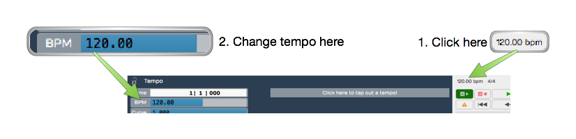
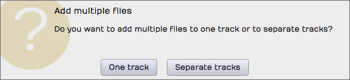
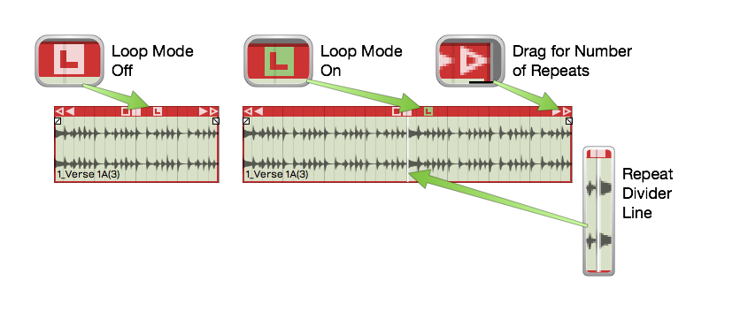
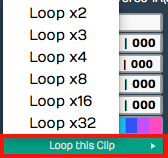
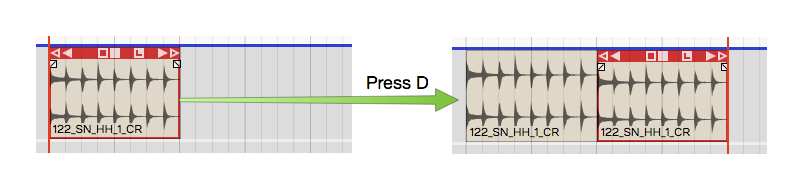
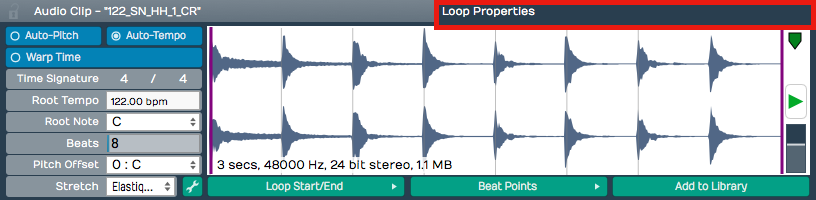

# Working With Loops

In this chapter we introduce the looping capabilities of Waveform. You
can drag in files from your loop library as Audio clips, repeat them
with the Duplicate (D) action, or switch any Audio clip into looping
mode and roll out repetitions over as many bars as you want. This makes
it easy, for example, to extend a short loop into a beat to play over
the full length of a song. An audio clip's loop settings appear in the
Actions panel and in the [Detail editor](detail-editor.md) (Clip tab),
which we will explore in this chapter as well.

## Getting Loops Into Waveform

There are four ways to copy loops into an Edit.

1.  Use the Browser Files tab and navigate to wherever you have audio
    files and loops on your system. Drag loops you find there to tracks
    in the Edit. As you drag in loops they appear as an outline until
    you drop them.
2.  Use the Browser Search tab and search for loops and then drag them
    into your Edit. The Browser also gives you the ability to preview
    loops to help you select the right one for the song.
3.  Simply drag them from you computer desktop drop them onto tracks .
4.  From the menu section, select *Import > Import an audio or MIDI
    file*. Navigate to a file on your system and click open. The *Select
    a file to import* dialog box even includes a basic file audition
    function with *Auto-play*.

> 📝 **Note:** Beyond the common formats — WAV, AIFF, FLAC, Ogg, and MP3 —
Waveform also imports `.w64`, `.caf`, `.au`, and `.voc` files. On macOS it
additionally reads Apple-format files such as `.m4a` and `.m4b`; on Windows
it reads Windows Media Audio. REX loop files (`.rx2`, `.rcy`, `.rex`) are
supported in builds that include the REX option.

## Setting the Edit Tempo

If you know the tempo of the loop, you might want to set the tempo of
your Edit to that tempo before dragging the loop in. That will give you
the most natural results.

*Changing the Tempo*

Here is how to change the tempo:

1.  Click on the BPM setting in the transport bar. The Actions panel will
    show the *BPM* value.
2.  Click on the *BPM* value and type in the new tempo.

## Dragging Loops to a Track

As you drag a file to to a track, you'll see an outline of the Audio
clip before you drop it. Position the beginning of the clip right where
you want it on the track, then just drop it.If it's not in the right
place, grab the Audio clip from the header and drag it into place.

After dropping a loop, notice that the cursor jumps to the end of the
loop. This is to position the cursor to drop in the next one, as you
build up a track.

> 💡 **Tip:** If you don't like having the cursor jump to the end when
dropping in loops, hold down Opt / Alt as you drag. This prevents the
cursor from jumping to the end.

If *Snap* is on, loops you drag in will snap to the grid.

## Dragging in Multiple Clips from the Browser

To drag in several clips at once, make a multiple selection in the
Browser and drag the selected loops to a track. They will be arranged on
the track end-to-end.

> 💡 **Tip:** To drop a selection of clips to parallel tracks, hold down Cmd
/ Ctrl as you drag and Waveform asks if you want to put them on one
track or separate tracks. This is great when working with multitrack
drum loops. It even creates additional tracks if there aren't enough
available.

*Dragging Loops to Separate Tracks*

## Looping the Loop

Audio clips have an L icon on the header. Click the L to toggle looping
mode for that clip. Once the clip is in looping mode it will immediately
appear to be twice as long. Enabling looping gives you one repeat right
away.

*Audio Clip Loop Mode*

To repeat the clip, drag the right trim handle and roll out as many
repeats as you want. You will see a white repeat divider at the start of
each repetition. The underlying audio wave file is not duplicated, it is
just being replayed over and over. All other editing operations work the
same as any other loop.

To stop looping, click the L icon gain to toggle looping off. That
returns the clip to a single cycle.

There is another way to activate clip looping. Select the clip then
click *Loop this Clip* in properties. From there you can select the
number of times to loop. This is an alternative to dragging the right
trim handle to roll out repetitions.

**Loop this Clip* in properties*

The nice thing about looping is it doesn't take up any additional space
in the project. You can loop just about any clip. You could take a four
bar drum loop and separate out one or two bars of the main groove then
loop it. That can give you the starting point for a song. Roll it out
across the entire song, and you've got something more inspiring than a
simple click track to play against.

## Duplicating Clips

Another way to repeat a clip is to duplicate it. To do so, select a clip
and press D. Duplicate is the equivalent of copy followed by paste. The
duplicate clip is placed immediately after the selected clip.

*Duplicating a Clip*

This is the best approach if you plan to edit the audio in a unique way
for that section of the song.

## Loop properties

When you select an Audio clip, its *loop properties* appear in the
Actions panel (and in the Detail editor, Clip tab). These properties are
related to the underlying wave file. Tweaks to these properties affect
how the Audio clip will respond to tempo, pitch, and time stretching.
Here is a description of the most essential loop properties:

*Loop properties in the Actions panel*

Auto-Pitch
- With *Auto-Pitch* enabled, Waveform will change the pitch of the
    clip appropriately to match key change events in the Tempo track.
    This only works if you have a *Root Note* set for the file; more on
    that in a moment.

Auto-Tempo
- With *Auto-Tempo* ticked, the Audio clip will be automatically
    stretched to match the song tempo and tempo changes in the Tempo
    track. For *Auto-Tempo* to work, you need to make sure you have the
    *Root Tempo* set for the file and *Stretch* set to an appropriate
    algorithm.

Warp Time
- With *Warp Time* enabled the waveform view to the right becomes a
    Warp Time editor. You can add warp points and do fine timing
    adjustments. This powerful feature is covered in detail in [Warp Time](warp-time.md).

Time Signature
- Edit *Time Signature* values to set the time signature of the file.

Root Tempo
- *Root Tempo* is the original tempo of the loop file. Waveform uses
    this to know how much to stretch the file to sync it to the Edit
    tempo. If *Root Tempo* is not recorded along with the loop file, you
    can set it here. Files created within Waveform will automatically
    have the *Root Tempo* set to match the Edit tempo.

Beats
- The *Beats* parameter is the number of beats in the file. Using
    *Beats* and *Root Tempo* Waveform calculates the length of the loop
    file in musical terms.

Pitch Offset
- If you just want to pitch the file up or down, enter an offset value
    for *Pitch Offset*.

Stretch
- *Stretch* sets time stretching algorithm used for this loop file.
    Usually you will want to use Elastique (Monophonic) for lead vocals
    and solo instruments. Use Elastique Pro for everything else.
    Melodyne is typical selected used for pitch correction.

Waveform View
- The waveform view, found in the Detail editor (Clip tab), lets you
    play the file. You can also adjust the in and out loop points by
    dragging the purple lines inward. There is a convenient level
    control here as well. This view is replaced by the zoomable Warp
    Time editor when *Warp Time* is enabled.

Loop Start/End
- This button contains a few quick tools to set the start and end loop
    points of the underlying wave files to match the current Audio clip
    start and end points.

Beat Points
- *Beat Points* are a type of marker that shows where the transients
    are to assist with time stretching. This concept is very similar to
    how acidized files work. With the latest Elastique Pro stretching
    algorithms manually manipulating the beat points is not necessary.

Add to Library
- If you create an Audio clip loop and might want to reuse it in other
    projects, click *Add to Library* then give it a name and tags.

> 📝 **Note:** When you use *Add to Library*, the loop file will be saved to
the *User Loops Path* folder as designated on the Loop Database page of
the Settings tab.

> 💡 **Tip:** If you want more control when adding loops to your library, try
*Export > Render to a File*. If you choose, *Only Render Selected
Clips* you get much more control over its properties and where to put
the resulting file.

## Moving On

There's a lot more you can do with clip looping, loop files, and loop
libraries in Waveform, but those are the fundamentals.

